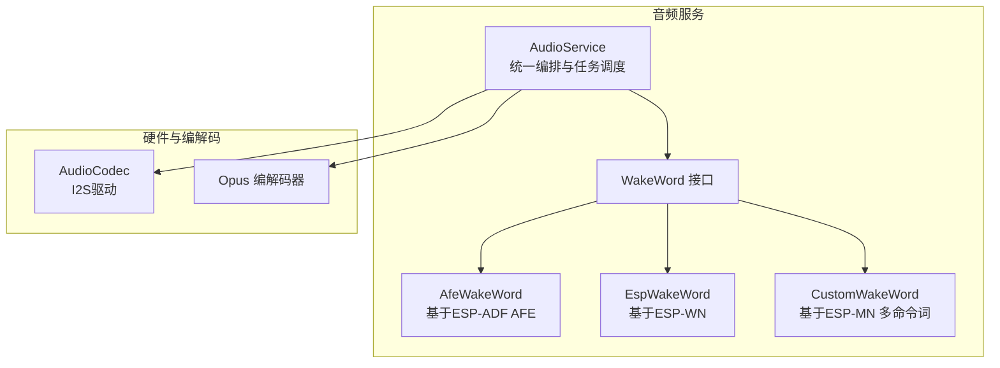
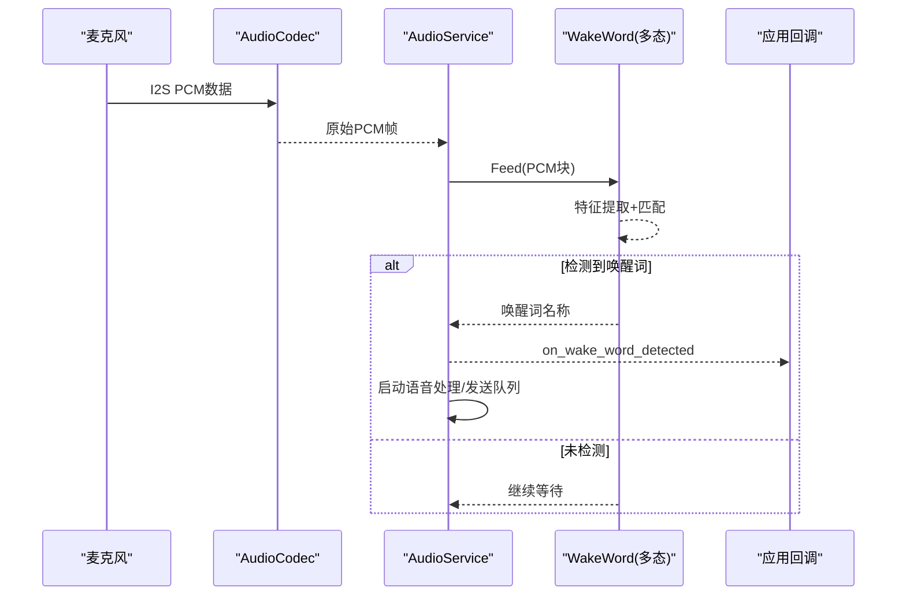
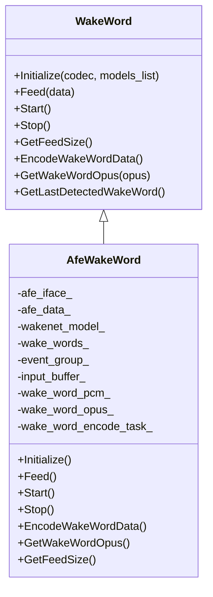
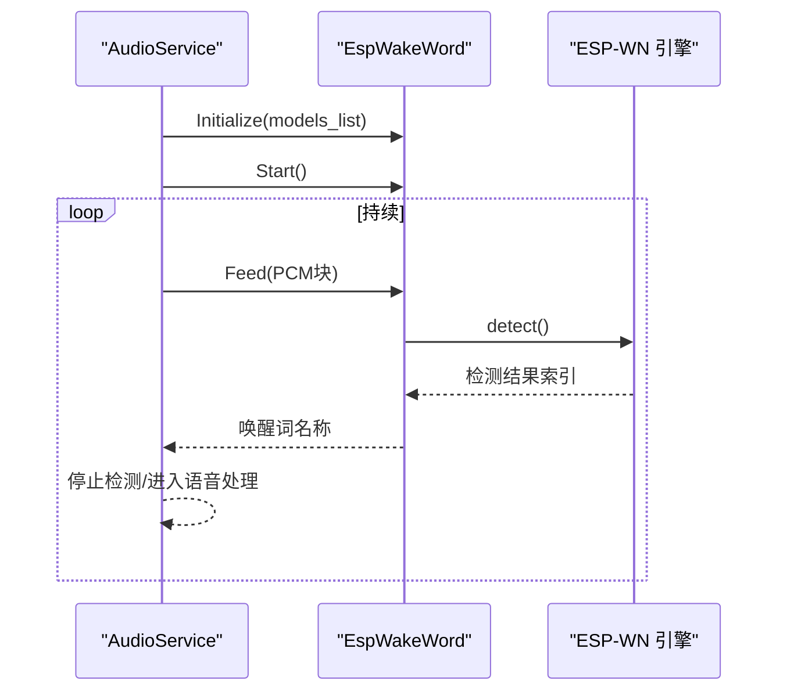
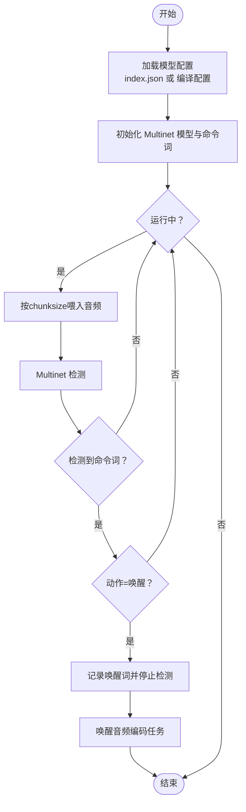
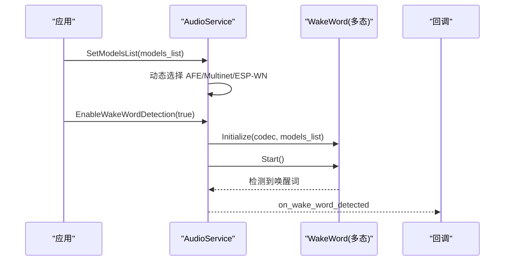
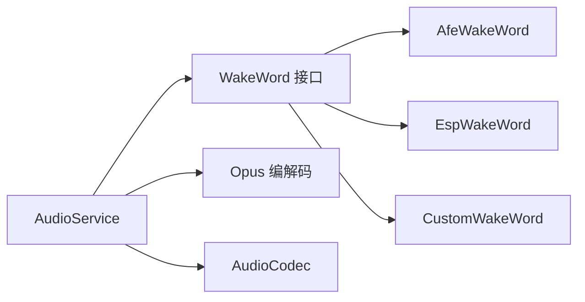
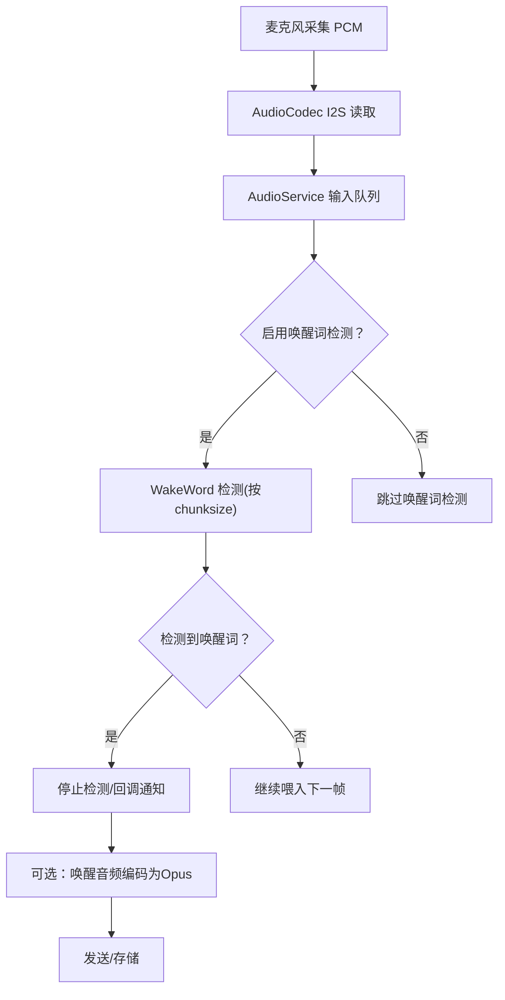

# 唤醒词识别

<cite>
**本文引用的文件**
- [main/audio/wake_words/wake_word.h](file://main/audio/wake_words/wake_word.h)
- [main/audio/wake_words/afe_wake_word.h](file://main/audio/wake_words/afe_wake_word.h)
- [main/audio/wake_words/afe_wake_word.cc](file://main/audio/wake_words/afe_wake_word.cc)
- [main/audio/wake_words/esp_wake_word.h](file://main/audio/wake_words/esp_wake_word.h)
- [main/audio/wake_words/esp_wake_word.cc](file://main/audio/wake_words/esp_wake_word.cc)
- [main/audio/wake_words/custom_wake_word.h](file://main/audio/wake_words/custom_wake_word.h)
- [main/audio/wake_words/custom_wake_word.cc](file://main/audio/wake_words/custom_wake_word.cc)
- [main/audio/audio_service.h](file://main/audio/audio_service.h)
- [main/audio/audio_service.cc](file://main/audio/audio_service.cc)
- [main/audio/README.md](file://main/audio/README.md)
- [main/application.cc](file://main/application.cc)
</cite>

## 目录
1. [简介](#简介)
2. [项目结构](#项目结构)
3. [核心组件](#核心组件)
4. [架构总览](#架构总览)
5. [详细组件分析](#详细组件分析)
6. [依赖关系分析](#依赖关系分析)
7. [性能考量](#性能考量)
8. [故障排查指南](#故障排查指南)
9. [结论](#结论)
10. [附录](#附录)

## 简介
本技术文档围绕ESP32-AI项目的“唤醒词识别”能力，系统阐述从音频采集与预处理、特征提取到匹配识别的完整流程；对比并解析AFE Wake Word与ESP Wake Word两种实现方式在技术架构与性能上的差异；给出自定义唤醒词的训练、部署与优化路径；提供参数调优建议（检测阈值、响应时间与误唤醒率的平衡）；并总结性能测试方法与实际应用中的优化策略。

## 项目结构
唤醒词识别位于main/audio子系统中，采用面向对象的接口抽象与多态实现，支持不同平台与模型族的唤醒词引擎。整体由AudioService统一编排，按需启用WakeWord子系统，并通过回调通知上层应用。

图示来源
- [main/audio/audio_service.h:106-196](file://main/audio/audio_service.h#L106-L196)
- [main/audio/wake_words/wake_word.h:11-26](file://main/audio/wake_words/wake_word.h#L11-L26)
- [main/audio/wake_words/afe_wake_word.h:22-63](file://main/audio/wake_words/afe_wake_word.h#L22-L63)
- [main/audio/wake_words/esp_wake_word.h:17-46](file://main/audio/wake_words/esp_wake_word.h#L17-L46)
- [main/audio/wake_words/custom_wake_word.h:20-72](file://main/audio/wake_words/custom_wake_word.h#L20-L72)

章节来源
- [main/audio/README.md:1-88](file://main/audio/README.md#L1-L88)
- [main/audio/audio_service.h:106-196](file://main/audio/audio_service.h#L106-L196)

## 核心组件
- WakeWord接口：定义唤醒词引擎的统一生命周期与数据接口，包括初始化、喂入音频块、启动/停止、获取每次推理所需采样数、编码唤醒音频片段、拉取编码后的Opus包等。
- AfeWakeWord：基于ESP-ADF的AFE（Audio Front-End）进行高阶语音识别，适合S3/P4平台，具备独立的音频检测任务与唤醒音频编码队列。
- EspWakeWord：基于ESP-WN（WakeNet）引擎，适用于非S3/P4平台，直接在主线程或轻量状态机中进行检测。
- CustomWakeWord：基于ESP-MN（Multinet）的自定义命令词识别，支持多命令词、可配置阈值与持续时长，同时保留唤醒音频编码能力。
- AudioService：统一管理AudioCodec、AudioProcessor、WakeWord、Opus编解码与各任务队列，负责事件编排与回调分发。

章节来源
- [main/audio/wake_words/wake_word.h:11-26](file://main/audio/wake_words/wake_word.h#L11-L26)
- [main/audio/wake_words/afe_wake_word.h:22-63](file://main/audio/wake_words/afe_wake_word.h#L22-L63)
- [main/audio/wake_words/esp_wake_word.h:17-46](file://main/audio/wake_words/esp_wake_word.h#L17-L46)
- [main/audio/wake_words/custom_wake_word.h:20-72](file://main/audio/wake_words/custom_wake_word.h#L20-L72)
- [main/audio/audio_service.h:106-196](file://main/audio/audio_service.h#L106-L196)

## 架构总览
唤醒词识别在AudioService的控制下运行于独立的任务或状态机中，避免与实时语音处理（如AEC/VAD）相互干扰。其核心数据流如下：

图示来源
- [main/audio/audio_service.cc:551-587](file://main/audio/audio_service.cc#L551-L587)
- [main/audio/audio_service.cc:702-736](file://main/audio/audio_service.cc#L702-L736)
- [main/application.cc:102-112](file://main/application.cc#L102-L112)

章节来源
- [main/audio/README.md:22-88](file://main/audio/README.md#L22-L88)
- [main/audio/audio_service.cc:551-587](file://main/audio/audio_service.cc#L551-L587)

## 详细组件分析

### AFE Wake Word 实现
- 技术要点
  - 使用AFE（高阶语音识别）进行唤醒词检测，适合S3/P4平台。
  - 单独的音频检测任务循环，周期性fetch结果并触发唤醒回调。
  - 内置唤醒音频缓冲队列，支持将最近约2秒的PCM片段编码为Opus用于后续上传或处理。
- 关键接口
  - Initialize：根据模型列表选择WakeNet模型，构建AFE句柄与检测任务。
  - Feed：将输入PCM按AFE要求的chunksize喂入，内部维护环形缓冲。
  - Start/Stop：通过事件组控制检测任务的启停与重置。
  - EncodeWakeWordData：静态栈任务将PCM队列逐帧编码为Opus包。
  - GetWakeWordOpus：阻塞式拉取编码完成的Opus包。
- 性能特性
  - 将检测与编码分离至独立任务，降低主线程压力。
  - 通过PSRAM分配编码栈空间，提升大段音频编码稳定性。

图示来源
- [main/audio/wake_words/wake_word.h:11-26](file://main/audio/wake_words/wake_word.h#L11-L26)
- [main/audio/wake_words/afe_wake_word.h:22-63](file://main/audio/wake_words/afe_wake_word.h#L22-L63)

章节来源
- [main/audio/wake_words/afe_wake_word.cc:38-90](file://main/audio/wake_words/afe_wake_word.cc#L38-L90)
- [main/audio/wake_words/afe_wake_word.cc:135-161](file://main/audio/wake_words/afe_wake_word.cc#L135-L161)
- [main/audio/wake_words/afe_wake_word.cc:172-264](file://main/audio/wake_words/afe_wake_word.cc#L172-L264)

### ESP Wake Word 实现
- 技术要点
  - 基于ESP-WN（WakeNet）引擎，适用于非S3/P4平台。
  - 采用原子布尔标志控制运行状态，按模型chunksize进行检测。
  - 支持单声道或左声道抽取（双声道设备仅使用左声道）。
- 关键接口
  - Initialize：加载模型句柄与数据，记录采样率与chunksize。
  - Feed：按chunksize喂入，调用detect并返回检测索引，转换为唤醒词名称。
  - Start/Stop：切换运行状态并清空输入缓冲。
  - EncodeWakeWordData/GetWakeWordOpus：占位实现（不进行唤醒音频编码）。
- 性能特性
  - 轻量状态机，内存占用低，适合资源受限平台。
  - 对双声道输入自动降采样为单声道，减少计算开销。

图示来源
- [main/audio/wake_words/esp_wake_word.cc:17-45](file://main/audio/wake_words/esp_wake_word.cc#L17-L45)
- [main/audio/wake_words/esp_wake_word.cc:62-96](file://main/audio/wake_words/esp_wake_word.cc#L62-L96)

章节来源
- [main/audio/wake_words/esp_wake_word.h:17-46](file://main/audio/wake_words/esp_wake_word.h#L17-L46)
- [main/audio/wake_words/esp_wake_word.cc:17-111](file://main/audio/wake_words/esp_wake_word.cc#L17-L111)

### 自定义唤醒词（Multinet）实现
- 技术要点
  - 基于ESP-MN（Multinet），支持多命令词识别与自定义配置。
  - 可从资产index.json读取语言、检测时长、阈值与命令词表，也可通过编译配置注入默认项。
  - 与AFE类似，维护唤醒音频PCM队列与独立编码任务，输出Opus包。
- 关键接口
  - Initialize：解析配置，选择对应语言的Multinet模型，设置检测阈值与命令词集合。
  - Feed：按Multinet chunksize喂入，检测到命令词后根据动作类型决定是否触发唤醒。
  - EncodeWakeWordData/GetWakeWordOpus：与AFE一致的唤醒音频编码与拉取机制。
- 性能特性
  - 支持多命令词并行识别，适合复杂交互场景。
  - 通过阈值与持续时长参数平衡灵敏度与误唤醒。

图示来源
- [main/audio/wake_words/custom_wake_word.cc:37-82](file://main/audio/wake_words/custom_wake_word.cc#L37-L82)
- [main/audio/wake_words/custom_wake_word.cc:85-129](file://main/audio/wake_words/custom_wake_word.cc#L85-L129)
- [main/audio/wake_words/custom_wake_word.cc:146-200](file://main/audio/wake_words/custom_wake_word.cc#L146-L200)

章节来源
- [main/audio/wake_words/custom_wake_word.h:20-72](file://main/audio/wake_words/custom_wake_word.h#L20-L72)
- [main/audio/wake_words/custom_wake_word.cc:85-129](file://main/audio/wake_words/custom_wake_word.cc#L85-L129)
- [main/audio/wake_words/custom_wake_word.cc:146-200](file://main/audio/wake_words/custom_wake_word.cc#L146-L200)

### AudioService与唤醒词集成
- 选择策略
  - S3/P4平台优先选择AFE或Multinet；非S3/P4平台选择ESP-WN。
  - 根据模型列表动态绑定具体实现，并注册唤醒回调。
- 生命周期管理
  - EnableWakeWordDetection：初始化并启动WakeWord，重置输入重采样器以避免缓冲溢出。
  - 事件位AS_EVENT_WAKE_WORD_RUNNING用于同步状态。
- 回调与上层联动
  - on_wake_word_detected：唤醒后触发应用事件，进入语音处理/发送阶段。

图示来源
- [main/audio/audio_service.cc:702-736](file://main/audio/audio_service.cc#L702-L736)
- [main/audio/audio_service.cc:551-587](file://main/audio/audio_service.cc#L551-L587)
- [main/application.cc:102-112](file://main/application.cc#L102-L112)

章节来源
- [main/audio/audio_service.h:106-196](file://main/audio/audio_service.h#L106-L196)
- [main/audio/audio_service.cc:702-736](file://main/audio/audio_service.cc#L702-L736)
- [main/application.cc:102-112](file://main/application.cc#L102-L112)

## 依赖关系分析
- 平台与模型选择
  - S3/P4平台：优先尝试Multinet（自定义命令词），否则回退到AFE Wake Word。
  - 其他平台：选择ESP-WN Wake Word。
- 外部库依赖
  - AFE/WN/MN：分别来自ESP-ADF/ESP-WN/ESP-MN模型与接口。
  - Opus：用于唤醒音频编码与网络传输。
- 耦合与内聚
  - WakeWord接口保证上层与底层实现解耦；AudioService集中编排，职责清晰。
  - 编码任务与检测逻辑分离，提高可维护性与稳定性。

图示来源
- [main/audio/audio_service.cc:702-736](file://main/audio/audio_service.cc#L702-L736)
- [main/audio/wake_words/wake_word.h:11-26](file://main/audio/wake_words/wake_word.h#L11-L26)

章节来源
- [main/audio/audio_service.cc:702-736](file://main/audio/audio_service.cc#L702-L736)

## 性能考量
- 检测延迟与吞吐
  - AFE与Multinet均采用chunksize批处理，减少频繁调用开销；编码任务异步执行，避免阻塞检测线程。
- 内存与栈
  - AFE/Multinet唤醒编码任务使用静态栈与PSRAM分配，确保大段音频编码稳定。
- 能耗与功耗管理
  - AudioService在无活动时自动关闭ADC/DAC通道，降低功耗；唤醒检测完成后快速切换到语音处理模式。
- 采样率与帧时长
  - Opus帧时长固定为60ms，编码器配置在AudioService中集中管理，保证端到端低延迟与高压缩比。

章节来源
- [main/audio/audio_service.h:39-76](file://main/audio/audio_service.h#L39-L76)
- [main/audio/audio_service.h:47-63](file://main/audio/audio_service.h#L47-L63)
- [main/audio/README.md:86-88](file://main/audio/README.md#L86-L88)

## 故障排查指南
- 无法初始化唤醒模型
  - 检查模型列表是否正确加载，确认目标平台可用的模型族（AFE/MN/ESP-WN）是否存在。
  - 查看日志输出，定位模型初始化失败原因。
- 唤醒不稳定或频繁误唤醒
  - 调整自定义唤醒词的检测阈值与持续时长；在多噪声环境下适当提高阈值。
  - 确认输入通道为单声道（双声道设备会自动抽取左声道）。
- 编码异常或唤醒音频为空
  - 确认已调用EncodeWakeWordData并等待编码任务完成；检查唤醒音频队列是否被及时消费。
- 平台适配问题
  - 确认SetModelsList已根据模型列表正确选择了WakeWord实现；S3/P4平台应优先使用AFE或Multinet。

章节来源
- [main/audio/wake_words/afe_wake_word.cc:48-51](file://main/audio/wake_words/afe_wake_word.cc#L48-L51)
- [main/audio/wake_words/custom_wake_word.cc:101-116](file://main/audio/wake_words/custom_wake_word.cc#L101-L116)
- [main/audio/wake_words/esp_wake_word.cc:26-35](file://main/audio/wake_words/esp_wake_word.cc#L26-L35)
- [main/audio/audio_service.cc:702-736](file://main/audio/audio_service.cc#L702-L736)

## 结论
本项目通过统一的WakeWord接口与AudioService编排，实现了跨平台、可扩展的唤醒词识别方案。AFE与Multinet在S3/P4平台提供了更强的灵活性与自定义能力，而ESP-WN则为其他平台提供了轻量高效的替代方案。结合合理的参数调优与性能优化策略，可在保证低误唤醒率的同时获得良好的响应速度与能耗表现。

## 附录

### 唤醒词检测流程（从采集到识别）

图示来源
- [main/audio/README.md:26-88](file://main/audio/README.md#L26-L88)
- [main/audio/audio_service.cc:551-587](file://main/audio/audio_service.cc#L551-L587)

### 参数调优指南（阈值、响应时间、误唤醒率）
- 检测阈值
  - 自定义唤醒词：通过配置文件或编译宏设置阈值，提高阈值可显著降低误唤醒但可能增加漏检。
  - AFE/Multinet：在初始化时设置检测阈值，结合实际环境反复校准。
- 响应时间
  - 由chunksize与帧时长共同决定；Opus帧时长固定为60ms，检测延迟主要受chunksize影响。
- 误唤醒率
  - 在嘈杂环境中提高阈值、缩短检测窗口或引入静音/噪声抑制策略。
  - 对双声道设备确保仅使用有效通道（左声道），避免混叠导致误判。

章节来源
- [main/audio/wake_words/custom_wake_word.cc:85-129](file://main/audio/wake_words/custom_wake_word.cc#L85-L129)
- [main/audio/audio_service.h:39-76](file://main/audio/audio_service.h#L39-L76)

### 自定义唤醒词训练与部署
- 训练与准备
  - 准备高质量音频样本，覆盖不同口音、语速与噪声条件。
  - 使用官方工具链生成模型与配置文件（模型族：ESP_MN）。
- 部署
  - 将模型与配置文件打包进固件资源；确保模型列表中包含Multinet模型。
  - 运行时由AudioService根据模型列表自动选择CustomWakeWord实现。
- 优化
  - 通过index.json配置语言、阈值、持续时长与命令词表；上线前进行A/B测试评估误唤醒与漏检。

章节来源
- [main/audio/wake_words/custom_wake_word.cc:37-82](file://main/audio/wake_words/custom_wake_word.cc#L37-L82)
- [main/audio/audio_service.cc:702-736](file://main/audio/audio_service.cc#L702-L736)

### 性能测试方法
- 延迟测试
  - 测量从唤醒词输入到回调触发的时间，关注chunksize与帧时长对端到端延迟的影响。
- 吞吐测试
  - 在不同chunksize与帧时长下测量CPU占用与内存峰值，评估编码任务的负载。
- 误唤醒率测试
  - 在安静与噪声环境下分别统计误唤醒次数，调整阈值与持续时长以达到目标指标。
- 能耗测试
  - 对比开启/关闭唤醒检测时的功耗曲线，验证电源管理策略的有效性。

章节来源
- [main/audio/audio_service.h:47-63](file://main/audio/audio_service.h#L47-L63)
- [main/audio/README.md:86-88](file://main/audio/README.md#L86-L88)