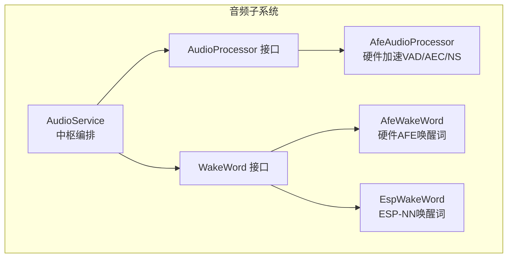
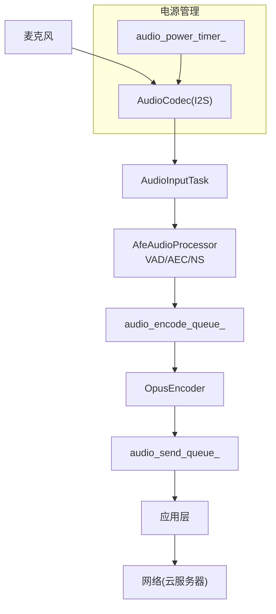
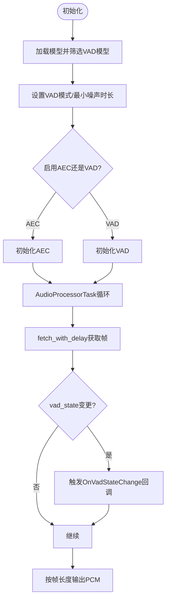
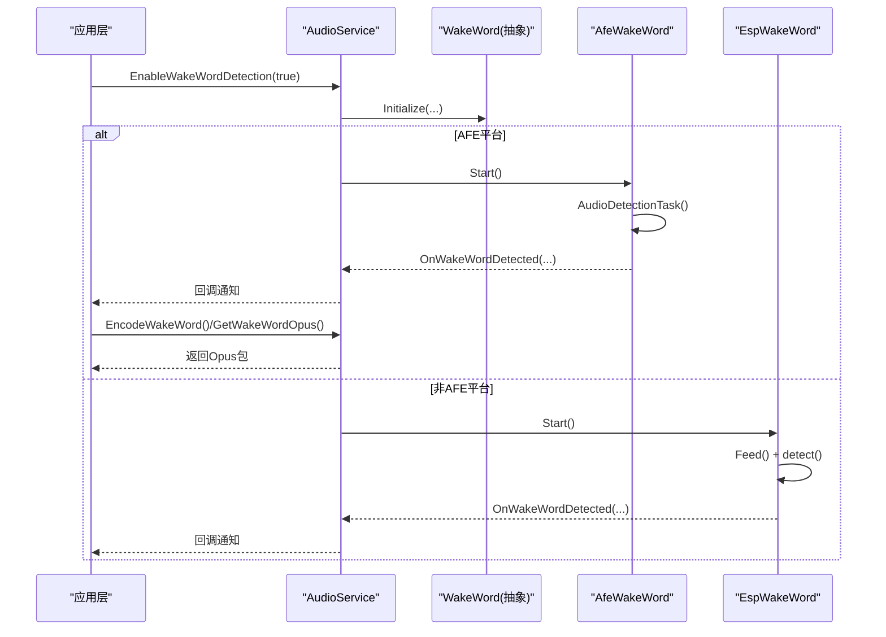
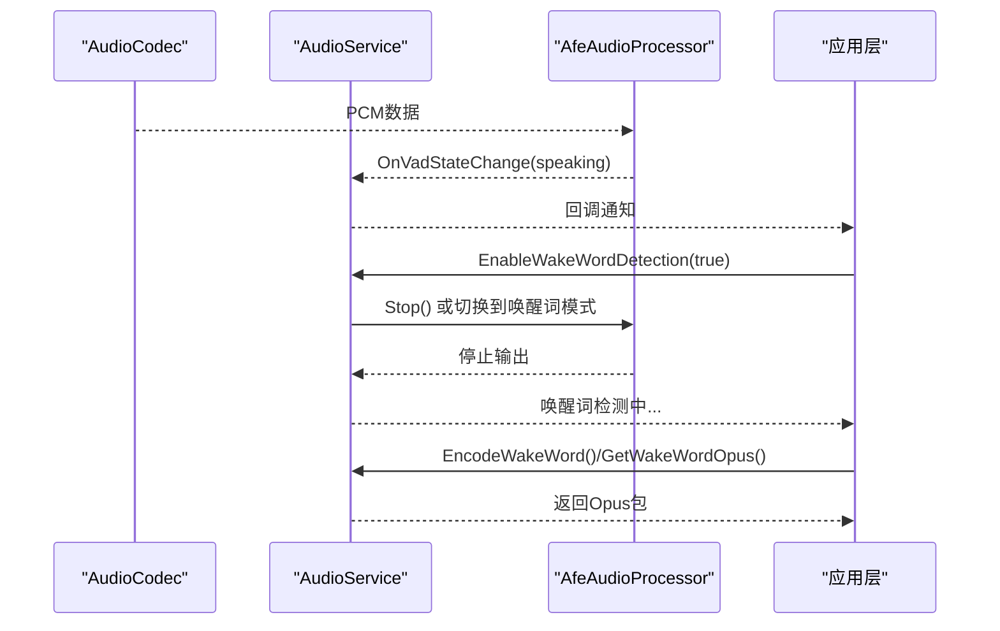
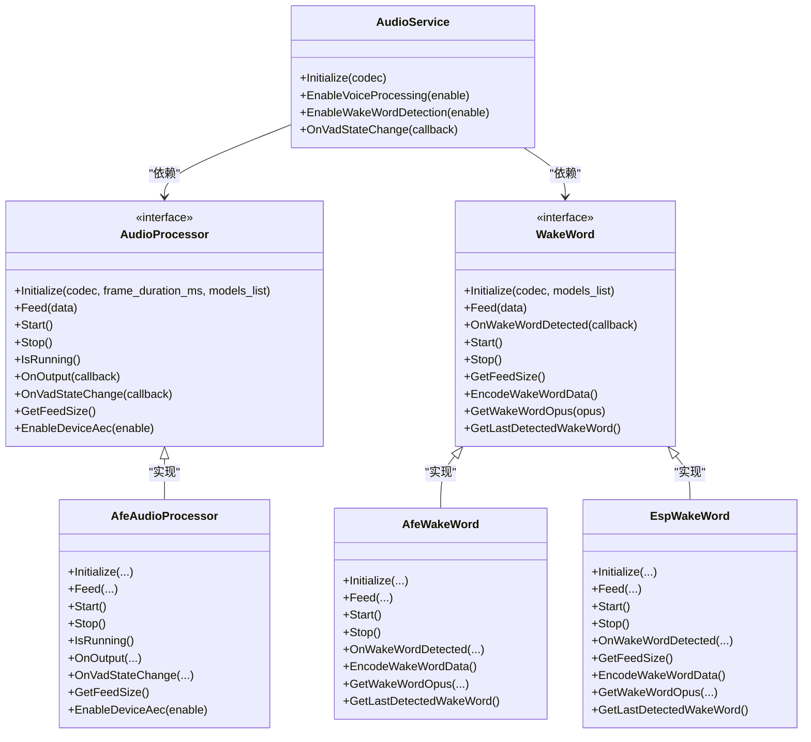

# 语音活动检测

<cite>
**本文引用的文件**
- [main/audio/README.md](file://main/audio/README.md)
- [main/audio/audio_service.h](file://main/audio/audio_service.h)
- [main/audio/audio_service.cc](file://main/audio/audio_service.cc)
- [main/audio/audio_processor.h](file://main/audio/audio_processor.h)
- [main/audio/processors/afe_audio_processor.h](file://main/audio/processors/afe_audio_processor.h)
- [main/audio/processors/afe_audio_processor.cc](file://main/audio/processors/afe_audio_processor.cc)
- [main/audio/wake_word.h](file://main/audio/wake_word.h)
- [main/audio/wake_words/afe_wake_word.h](file://main/audio/wake_words/afe_wake_word.h)
- [main/audio/wake_words/afe_wake_word.cc](file://main/audio/wake_words/afe_wake_word.cc)
- [main/audio/wake_words/esp_wake_word.h](file://main/audio/wake_words/esp_wake_word.h)
- [main/audio/wake_words/esp_wake_word.cc](file://main/audio/wake_words/esp_wake_word.cc)
- [main/application.cc](file://main/application.cc)
</cite>

## 目录
1. [简介](#简介)
2. [项目结构](#项目结构)
3. [核心组件](#核心组件)
4. [架构总览](#架构总览)
5. [详细组件分析](#详细组件分析)
6. [依赖关系分析](#依赖关系分析)
7. [性能考虑](#性能考虑)
8. [故障排查指南](#故障排查指南)
9. [结论](#结论)
10. [附录](#附录)

## 简介
本文件面向ESP32-AI项目的语音活动检测（Voice Activity Detection, VAD）功能，系统性阐述其工作原理、实现机制与工程化细节。重点覆盖以下方面：
- VAD算法在硬件加速前端（AFE）与软件模型上的应用路径
- AFE Wake Word与ESP Wake Word两种唤醒词检测方式的差异与适用场景
- VAD检测参数配置（如VAD模式、最小噪声时长、是否启用VAD等）
- 检测结果处理流程与与其他音频功能（编码、播放、唤醒词）的集成
- 性能优化策略与部署最佳实践

## 项目结构
围绕音频子系统的模块划分如下：
- 音频服务中枢：AudioService负责初始化、任务编排、回调桥接与电源管理
- 音频处理器：AudioProcessor接口及AfeAudioProcessor实现，提供AEC、VAD、降噪等实时处理
- 唤醒词引擎：WakeWord接口及AfeWakeWord/EspWakeWord实现，分别基于硬件AFE与ESP-NN模型
- 应用层集成：通过回调将VAD状态变化传递给上层业务逻辑

图表来源
- [main/audio/audio_service.h:106-122](file://main/audio/audio_service.h#L106-L122)
- [main/audio/audio_processor.h:11-24](file://main/audio/audio_processor.h#L11-L24)
- [main/audio/processors/afe_audio_processor.h:17-46](file://main/audio/processors/afe_audio_processor.h#L17-L46)
- [main/audio/wake_word.h:11-24](file://main/audio/wake_word.h#L11-L24)
- [main/audio/wake_words/afe_wake_word.h:22-60](file://main/audio/wake_words/afe_wake_word.h#L22-L60)
- [main/audio/wake_words/esp_wake_word.h:17-43](file://main/audio/wake_words/esp_wake_word.h#L17-L43)

章节来源
- [main/audio/README.md:1-88](file://main/audio/README.md#L1-L88)
- [main/audio/audio_service.h:106-122](file://main/audio/audio_service.h#L106-L122)

## 核心组件
- AudioService：负责初始化AudioCodec、AudioProcessor与WakeWord；注册VAD状态回调；控制编码/解码队列；管理电源定时器。
- AudioProcessor接口与AfeAudioProcessor实现：提供Initialize/Feed/Start/Stop/OnVadStateChange等能力；内部通过AFE接口进行VAD状态查询与数据流输出。
- WakeWord接口与AfeWakeWord/EspWakeWord实现：提供Initialize/Feed/Start/Stop/OnWakeWordDetected/GetFeedSize等能力；AfeWakeWord使用硬件AFE进行唤醒词检测并可录制前后段音频；EspWakeWord使用ESP-NN模型进行检测。

章节来源
- [main/audio/audio_service.cc:87-123](file://main/audio/audio_service.cc#L87-L123)
- [main/audio/audio_processor.h:11-24](file://main/audio/audio_processor.h#L11-L24)
- [main/audio/processors/afe_audio_processor.h:17-46](file://main/audio/processors/afe_audio_processor.h#L17-L46)
- [main/audio/wake_word.h:11-24](file://main/audio/wake_word.h#L11-L24)
- [main/audio/wake_words/afe_wake_word.h:22-60](file://main/audio/wake_words/afe_wake_word.h#L22-L60)
- [main/audio/wake_words/esp_wake_word.h:17-43](file://main/audio/wake_words/esp_wake_word.h#L17-L43)

## 架构总览
下图展示从麦克风到云端发送的典型上行链路，其中VAD由AfeAudioProcessor在硬件前端完成，输出的“干净PCM”进入编码队列后送网络。

图表来源
- [main/audio/README.md:26-56](file://main/audio/README.md#L26-L56)
- [main/audio/audio_service.cc:87-123](file://main/audio/audio_service.cc#L87-L123)

章节来源
- [main/audio/README.md:1-88](file://main/audio/README.md#L1-L88)

## 详细组件分析

### VAD实现与参数配置
- 初始化阶段：AfeAudioProcessor根据模型列表筛选VAD模型名称，并设置VAD模式与最小噪声时长；同时决定是启用设备AEC还是VAD（取决于宏开关）。
- 运行阶段：AudioProcessorTask循环调用fetch_with_delay获取AFE返回的帧数据，解析vad_state并触发OnVadStateChange回调；随后按帧长度拼接输出缓冲区并回调上层。
- 关键参数位置：
  - VAD模式与最小噪声时长：在配置阶段设定
  - 是否启用VAD或AEC：依据宏与运行期切换函数
  - 帧采样数：由帧时长与采样率计算得到

图表来源
- [main/audio/processors/afe_audio_processor.cc:13-75](file://main/audio/processors/afe_audio_processor.cc#L13-L75)
- [main/audio/processors/afe_audio_processor.cc:135-186](file://main/audio/processors/afe_audio_processor.cc#L135-L186)
- [main/audio/processors/afe_audio_processor.cc:189-201](file://main/audio/processors/afe_audio_processor.cc#L189-L201)

章节来源
- [main/audio/processors/afe_audio_processor.cc:13-75](file://main/audio/processors/afe_audio_processor.cc#L13-L75)
- [main/audio/processors/afe_audio_processor.cc:135-186](file://main/audio/processors/afe_audio_processor.cc#L135-L186)
- [main/audio/processors/afe_audio_processor.cc:189-201](file://main/audio/processors/afe_audio_processor.cc#L189-L201)

### AFE Wake Word 与 ESP Wake Word 的区别与适用场景
- AFE Wake Word
  - 使用硬件AFE进行唤醒词检测，具备更低延迟与更低功耗
  - 支持录制唤醒前后的PCM片段并异步编码为Opus
  - 更适合对实时性与能耗敏感的场景
- ESP Wake Word
  - 使用ESP-NN模型进行检测，便于替换模型与扩展
  - 不支持唤醒词录音与编码
  - 更适合需要灵活模型管理与二次开发的场景

图表来源
- [main/audio/audio_service.cc:551-579](file://main/audio/audio_service.cc#L551-L579)
- [main/audio/wake_words/afe_wake_word.cc:96-108](file://main/audio/wake_words/afe_wake_word.cc#L96-L108)
- [main/audio/wake_words/esp_wake_word.cc:51-60](file://main/audio/wake_words/esp_wake_word.cc#L51-L60)
- [main/audio/wake_words/afe_wake_word.cc:135-161](file://main/audio/wake_words/afe_wake_word.cc#L135-L161)
- [main/audio/wake_words/esp_wake_word.cc:62-96](file://main/audio/wake_words/esp_wake_word.cc#L62-L96)

章节来源
- [main/audio/wake_words/afe_wake_word.h:22-60](file://main/audio/wake_words/afe_wake_word.h#L22-L60)
- [main/audio/wake_words/esp_wake_word.h:17-43](file://main/audio/wake_words/esp_wake_word.h#L17-L43)
- [main/audio/wake_words/afe_wake_word.cc:38-90](file://main/audio/wake_words/afe_wake_word.cc#L38-L90)
- [main/audio/wake_words/esp_wake_word.cc:17-45](file://main/audio/wake_words/esp_wake_word.cc#L17-L45)

### VAD检测参数配置与调优要点
- VAD模式与最小噪声时长
  - 在配置阶段设置VAD模式与最小噪声时长，影响静音/语音判定的稳定性
- 是否启用VAD或AEC
  - 可通过运行期函数在AEC与VAD之间切换，以适配不同场景（如通话或离线识别）
- 帧采样数与输入块大小
  - 由帧时长与采样率计算，确保与AFE的feed/fetch块大小匹配，避免数据截断或堆积

章节来源
- [main/audio/processors/afe_audio_processor.cc:40-65](file://main/audio/processors/afe_audio_processor.cc#L40-L65)
- [main/audio/processors/afe_audio_processor.cc:189-201](file://main/audio/processors/afe_audio_processor.cc#L189-L201)
- [main/audio/processors/afe_audio_processor.cc:13-19](file://main/audio/processors/afe_audio_processor.cc#L13-L19)

### VAD检测结果处理流程与集成
- VAD状态回调：AudioService在初始化时注册OnVadStateChange回调，将底层VAD状态变化上抛至应用层
- 应用层事件：应用层监听VAD状态变化事件，驱动UI、指示灯或业务逻辑
- 与唤醒词的协作：当启用唤醒词检测时，AudioService会切换到唤醒词模式，停止常规音频处理；检测到唤醒词后再切回正常处理

图表来源
- [main/audio/audio_service.cc:102-111](file://main/audio/audio_service.cc#L102-L111)
- [main/application.cc:108-109](file://main/application.cc#L108-L109)
- [main/audio/audio_service.cc:551-579](file://main/audio/audio_service.cc#L551-L579)

章节来源
- [main/audio/audio_service.cc:102-111](file://main/audio/audio_service.cc#L102-L111)
- [main/application.cc:108-109](file://main/application.cc#L108-L109)

## 依赖关系分析
- AudioService依赖AudioCodec、AudioProcessor与WakeWord；通过回调桥接VAD状态与唤醒词检测结果
- AfeAudioProcessor依赖AFE接口与模型列表，内部维护事件组与互斥锁保证线程安全
- AfeWakeWord/EspWakeWord分别依赖AFE接口与ESP-NN接口，均实现WakeWord接口

图表来源
- [main/audio/audio_service.h:106-122](file://main/audio/audio_service.h#L106-L122)
- [main/audio/audio_processor.h:11-24](file://main/audio/audio_processor.h#L11-L24)
- [main/audio/processors/afe_audio_processor.h:17-46](file://main/audio/processors/afe_audio_processor.h#L17-L46)
- [main/audio/wake_word.h:11-24](file://main/audio/wake_word.h#L11-L24)
- [main/audio/wake_words/afe_wake_word.h:22-60](file://main/audio/wake_words/afe_wake_word.h#L22-L60)
- [main/audio/wake_words/esp_wake_word.h:17-43](file://main/audio/wake_words/esp_wake_word.h#L17-L43)

章节来源
- [main/audio/audio_service.h:106-122](file://main/audio/audio_service.h#L106-L122)
- [main/audio/audio_processor.h:11-24](file://main/audio/audio_processor.h#L11-L24)
- [main/audio/processors/afe_audio_processor.h:17-46](file://main/audio/processors/afe_audio_processor.h#L17-L46)
- [main/audio/wake_word.h:11-24](file://main/audio/wake_word.h#L11-L24)
- [main/audio/wake_words/afe_wake_word.h:22-60](file://main/audio/wake_words/afe_wake_word.h#L22-L60)
- [main/audio/wake_words/esp_wake_word.h:17-43](file://main/audio/wake_words/esp_wake_word.h#L17-L43)

## 性能考虑
- 硬件加速优先：在支持AFE的平台上优先启用AEC/VAD/AEC，以降低CPU占用与提升实时性
- 合理的帧时长：根据网络与业务需求选择合适的帧时长，平衡延迟与带宽
- 缓冲与块大小：确保输入缓冲与AFE的feed/fetch块大小一致，减少数据拷贝与丢帧
- 电源管理：利用音频电源定时器在空闲时自动关闭ADC/DAC通道，降低功耗
- 线程与内存：静态任务栈与PSRAM分配策略有助于稳定运行与降低抖动

章节来源
- [main/audio/processors/afe_audio_processor.cc:189-201](file://main/audio/processors/afe_audio_processor.cc#L189-L201)
- [main/audio/README.md:86-88](file://main/audio/README.md#L86-L88)

## 故障排查指南
- VAD不生效
  - 检查是否正确初始化模型列表并启用VAD
  - 确认运行期未切换到AEC模式
- 唤醒词检测异常
  - AFE唤醒词：确认AFE唤醒词任务已启动且输入缓冲未被清空
  - ESP唤醒词：确认模型加载成功且chunksize与采样率匹配
- VAD状态回调未触发
  - 检查AudioService是否注册了OnVadStateChange回调
  - 确认AudioProcessorTask处于运行状态
- 功耗偏高
  - 检查电源定时器是否按预期工作
  - 确认在空闲期间ADC/DAC通道已被关闭

章节来源
- [main/audio/processors/afe_audio_processor.cc:135-186](file://main/audio/processors/afe_audio_processor.cc#L135-L186)
- [main/audio/wake_words/afe_wake_word.cc:96-108](file://main/audio/wake_words/afe_wake_word.cc#L96-L108)
- [main/audio/wake_words/esp_wake_word.cc:51-60](file://main/audio/wake_words/esp_wake_word.cc#L51-L60)
- [main/audio/audio_service.cc:102-111](file://main/audio/audio_service.cc#L102-L111)
- [main/audio/README.md:86-88](file://main/audio/README.md#L86-L88)

## 结论
本项目通过硬件加速前端（AFE）实现了低延迟、低功耗的VAD与唤醒词检测，并提供了清晰的接口抽象与回调桥接，便于与编码、播放及其他音频功能无缝集成。针对不同应用场景，可灵活选择AfeWakeWord或EspWakeWord，并结合VAD参数与电源管理策略实现更优的性能与体验。

## 附录
- 关键实现路径参考
  - VAD初始化与参数：[main/audio/processors/afe_audio_processor.cc:13-75](file://main/audio/processors/afe_audio_processor.cc#L13-L75)
  - VAD状态回调与输出帧拼接：[main/audio/processors/afe_audio_processor.cc:135-186](file://main/audio/processors/afe_audio_processor.cc#L135-L186)
  - AFE唤醒词检测与录音编码：[main/audio/wake_words/afe_wake_word.cc:135-263](file://main/audio/wake_words/afe_wake_word.cc#L135-L263)
  - ESP唤醒词检测：[main/audio/wake_words/esp_wake_word.cc:62-96](file://main/audio/wake_words/esp_wake_word.cc#L62-L96)
  - VAD回调桥接与应用事件：[main/audio/audio_service.cc:102-111](file://main/audio/audio_service.cc#L102-L111), [main/application.cc:108-109](file://main/application.cc#L108-L109)