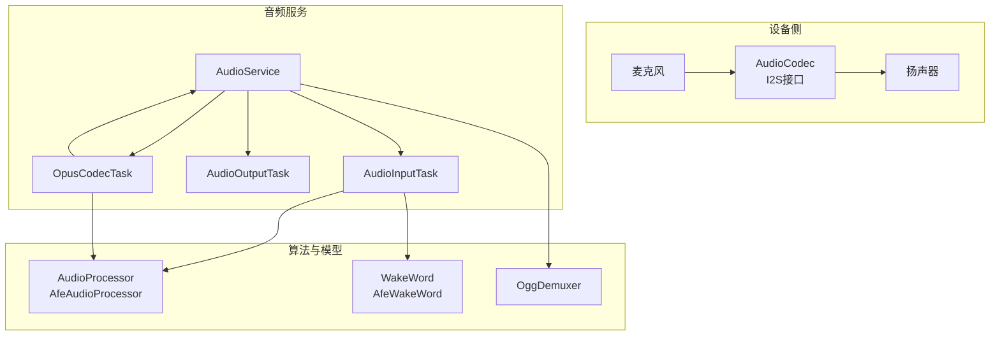
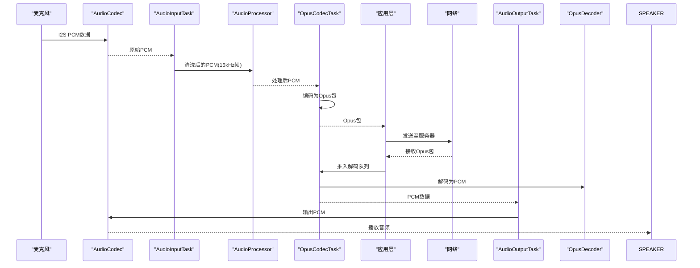
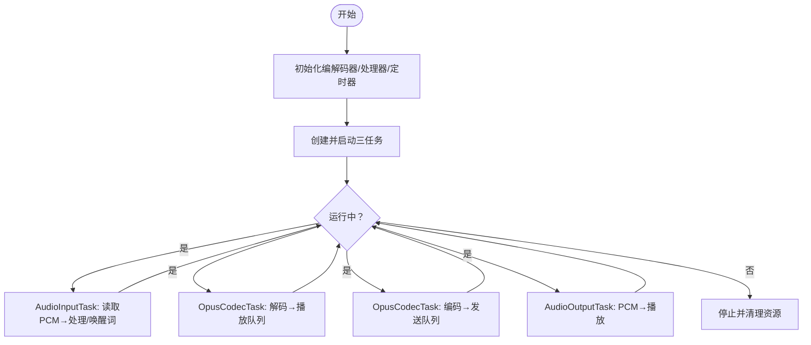
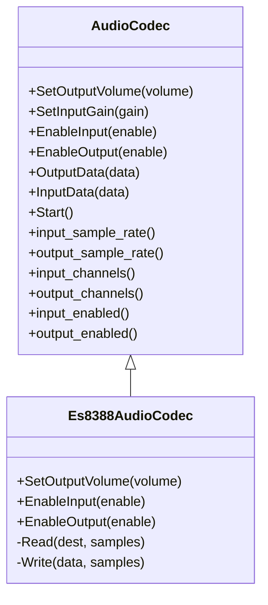
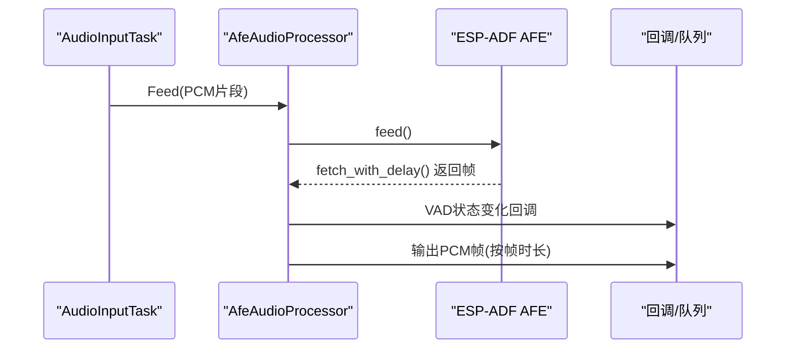
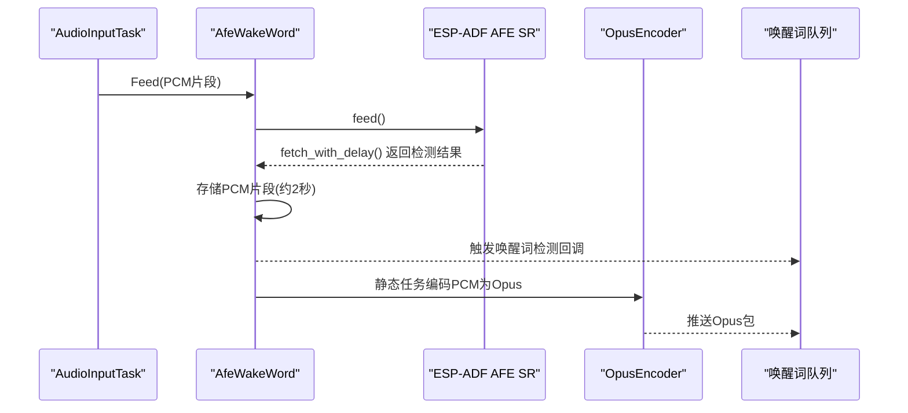
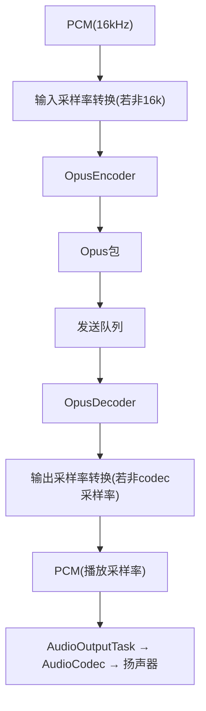
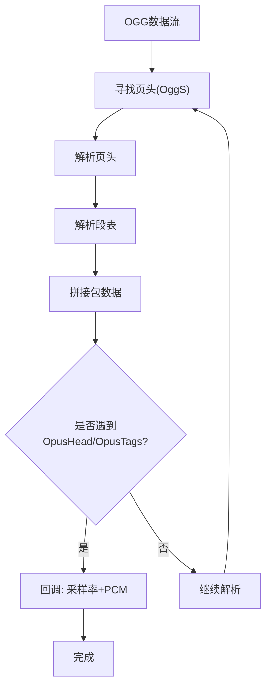
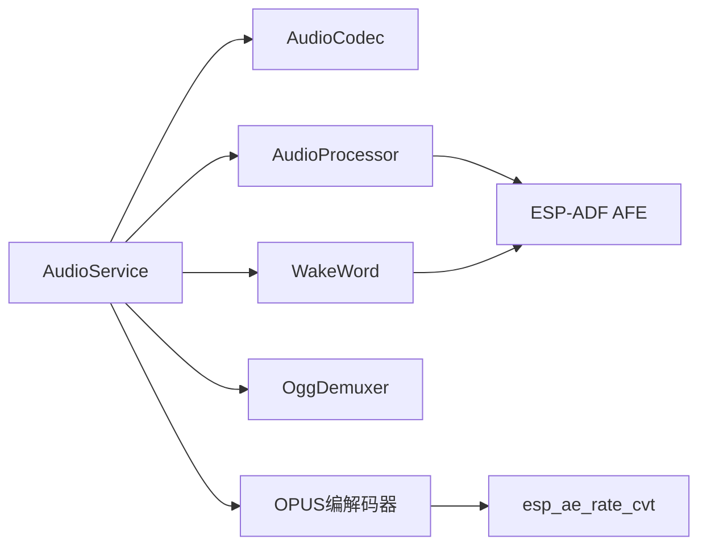

# 音频系统

<cite>
**本文引用的文件**
- [main/audio/README.md](file://main/audio/README.md)
- [main/audio/audio_service.h](file://main/audio/audio_service.h)
- [main/audio/audio_service.cc](file://main/audio/audio_service.cc)
- [main/audio/audio_codec.h](file://main/audio/audio_codec.h)
- [main/audio/audio_codec.cc](file://main/audio/audio_codec.cc)
- [main/audio/audio_processor.h](file://main/audio/audio_processor.h)
- [main/audio/processors/afe_audio_processor.h](file://main/audio/processors/afe_audio_processor.h)
- [main/audio/processors/afe_audio_processor.cc](file://main/audio/processors/afe_audio_processor.cc)
- [main/audio/wake_word.h](file://main/audio/wake_word.h)
- [main/audio/codecs/es8388_audio_codec.h](file://main/audio/codecs/es8388_audio_codec.h)
- [main/audio/codecs/es8388_audio_codec.cc](file://main/audio/codecs/es8388_audio_codec.cc)
- [main/audio/wake_words/afe_wake_word.h](file://main/audio/wake_words/afe_wake_word.h)
- [main/audio/wake_words/afe_wake_word.cc](file://main/audio/wake_words/afe_wake_word.cc)
- [main/audio/demuxer/ogg_demuxer.h](file://main/audio/demuxer/ogg_demuxer.h)
- [main/audio/demuxer/ogg_demuxer.cc](file://main/audio/demuxer/ogg_demuxer.cc)
</cite>

## 目录
1. [简介](#简介)
2. [项目结构](#项目结构)
3. [核心组件](#核心组件)
4. [架构总览](#架构总览)
5. [详细组件分析](#详细组件分析)
6. [依赖关系分析](#依赖关系分析)
7. [性能考虑](#性能考虑)
8. [故障排除指南](#故障排除指南)
9. [结论](#结论)
10. [附录](#附录)

## 简介
本文件面向ESP32-AI项目的音频系统，系统性阐述音频服务架构、OPUS编解码器实现、VAD语音活动检测、离线唤醒词识别等核心技术，并覆盖从音频采集、处理、传输到播放的完整流程。文档同时解释不同音频编解码器的特点与选择策略，重点覆盖ES83xx系列音频芯片支持；并提供音频质量优化、噪声抑制、回声消除等高级功能的实现方法、调试工具使用指南与性能调优建议。

## 项目结构
音频子系统位于main/audio目录下，采用模块化设计，围绕AudioService中枢协调各子模块运行。关键模块包括：
- 音频服务中枢：AudioService，负责任务调度、队列管理、编解码器与处理器初始化、电源管理等
- 音频编解码器抽象层：AudioCodec及其具体实现（如Es8388AudioCodec），屏蔽硬件差异
- 音频处理器：AudioProcessor接口及AfeAudioProcessor实现，提供AEC、VAD、噪声抑制等能力
- 唤醒词引擎：WakeWord接口及AfeWakeWord实现，支持离线关键词检测
- OGG解复用器：OggDemuxer，用于将OGG容器内的Opus帧提取为可播放的PCM数据
- OPUS编解码：通过ESP-ADF提供的esp_opus_*接口进行编码/解码

**图表来源**
- [main/audio/audio_service.h:106-196](file://main/audio/audio_service.h#L106-L196)
- [main/audio/audio_service.cc:126-168](file://main/audio/audio_service.cc#L126-L168)
- [main/audio/audio_codec.h:17-62](file://main/audio/audio_codec.h#L17-L62)
- [main/audio/processors/afe_audio_processor.h:17-48](file://main/audio/processors/afe_audio_processor.h#L17-L48)
- [main/audio/wake_words/afe_wake_word.h:22-63](file://main/audio/wake_words/afe_wake_word.h#L22-L63)
- [main/audio/demuxer/ogg_demuxer.h:9-63](file://main/audio/demuxer/ogg_demuxer.h#L9-L63)

**章节来源**
- [main/audio/README.md:1-88](file://main/audio/README.md#L1-L88)
- [main/audio/audio_service.h:106-196](file://main/audio/audio_service.h#L106-L196)
- [main/audio/audio_service.cc:126-168](file://main/audio/audio_service.cc#L126-L168)

## 核心组件
- AudioService：音频中枢，负责初始化编解码器、启动三类任务（输入/输出/编解码）、管理事件组与队列、电源定时器、回调注册、模型列表设置等
- AudioCodec：硬件抽象层，统一I2S读写、输入/输出使能、采样率/声道/增益/音量等参数
- AudioProcessor：音频处理接口，AfeAudioProcessor基于ESP-ADF AFE提供AEC/VAD/噪声抑制等能力
- WakeWord：唤醒词接口，AfeWakeWord基于AFE SR实现关键词检测与短时音频缓存编码
- OggDemuxer：OGG解复用器，解析OpusHead/OpusTags并提取Opus帧
- OPUS编解码：通过esp_opus_enc/dec接口完成编码/解码，配合采样率转换器进行速率适配

**章节来源**
- [main/audio/audio_service.h:106-196](file://main/audio/audio_service.h#L106-L196)
- [main/audio/audio_codec.h:17-62](file://main/audio/audio_codec.h#L17-L62)
- [main/audio/audio_processor.h:11-27](file://main/audio/audio_processor.h#L11-L27)
- [main/audio/processors/afe_audio_processor.h:17-48](file://main/audio/processors/afe_audio_processor.h#L17-L48)
- [main/audio/wake_word.h:11-27](file://main/audio/wake_word.h#L11-L27)
- [main/audio/wake_words/afe_wake_word.h:22-63](file://main/audio/wake_words/afe_wake_word.h#L22-L63)
- [main/audio/demuxer/ogg_demuxer.h:9-63](file://main/audio/demuxer/ogg_demuxer.h#L9-L63)

## 架构总览
系统采用“输入/输出/编解码”三任务并发模型，配合多队列实现端到端音频流：
- 上行链路（麦克风→服务器）：AudioInputTask读取PCM→AudioProcessor处理→OpusCodecTask编码→应用层发送
- 下行链路（服务器→扬声器）：应用层接收→OpusCodecTask解码→AudioOutputTask播放
- 电源管理：空闲超时自动关闭ADC/DAC通道，降低功耗

**图表来源**
- [main/audio/audio_service.cc:231-448](file://main/audio/audio_service.cc#L231-L448)
- [main/audio/audio_service.h:164-196](file://main/audio/audio_service.h#L164-L196)

**章节来源**
- [main/audio/README.md:22-88](file://main/audio/README.md#L22-L88)
- [main/audio/audio_service.cc:231-448](file://main/audio/audio_service.cc#L231-L448)

## 详细组件分析

### AudioService 中枢
- 初始化：打开OPUS编解码器、建立输入/输出采样率转换器、注册音频处理器回调、创建电源定时器
- 启动：创建并启动三个任务：AudioInputTask、AudioOutputTask、OpusCodecTask
- 任务职责：
  - AudioInputTask：从AudioCodec读取PCM，喂给WakeWord与AudioProcessor
  - AudioOutputTask：从播放队列取出PCM写入AudioCodec
  - OpusCodecTask：在编码/解码间切换，完成PCM与Opus互转
- 队列与事件：使用事件组控制状态，多队列隔离上/下行数据，防止阻塞
- 电源管理：周期检查最后输入/输出时间，超过阈值自动关闭输入/输出通道

**图表来源**
- [main/audio/audio_service.cc:126-168](file://main/audio/audio_service.cc#L126-L168)
- [main/audio/audio_service.cc:231-448](file://main/audio/audio_service.cc#L231-L448)

**章节来源**
- [main/audio/audio_service.h:106-196](file://main/audio/audio_service.h#L106-L196)
- [main/audio/audio_service.cc:63-124](file://main/audio/audio_service.cc#L63-L124)
- [main/audio/audio_service.cc:126-168](file://main/audio/audio_service.cc#L126-L168)
- [main/audio/audio_service.cc:684-700](file://main/audio/audio_service.cc#L684-L700)

### AudioCodec 抽象层与 ES83xx 支持
- AudioCodec定义了统一接口：输入/输出使能、音量/增益设置、Start启动、I2S读写等
- Es8388AudioCodec实现：
  - 双工I2S通道创建，支持主模式与时钟配置
  - 输入/输出设备通过esp_codec_dev打开/关闭，支持参考输入以启用回声消除
  - 输出时设置模拟HP/SPK音量寄存器，PA引脚控制功放开关
  - 读写路径通过esp_codec_dev_read/write完成

**图表来源**
- [main/audio/audio_codec.h:17-62](file://main/audio/audio_codec.h#L17-L62)
- [main/audio/codecs/es8388_audio_codec.h:12-41](file://main/audio/codecs/es8388_audio_codec.h#L12-L41)

**章节来源**
- [main/audio/audio_codec.h:17-62](file://main/audio/audio_codec.h#L17-L62)
- [main/audio/audio_codec.cc:29-68](file://main/audio/audio_codec.cc#L29-L68)
- [main/audio/codecs/es8388_audio_codec.cc:73-221](file://main/audio/codecs/es8388_audio_codec.cc#L73-L221)

### AudioProcessor 与 VAD/AEC/噪声抑制
- AudioProcessor接口定义了Initialize/Feed/Start/Stop/OnOutput/OnVadStateChange/EnableDeviceAec等
- AfeAudioProcessor基于ESP-ADF AFE：
  - 自动选择VAD/NS模型，配置AEC模式与内存分配策略
  - 通过事件组控制运行状态，内部任务循环fetch处理结果
  - 将处理后的PCM按帧大小输出，触发VAD状态变化回调
  - 支持启用/禁用设备级AEC（取决于编译选项）

**图表来源**
- [main/audio/processors/afe_audio_processor.cc:135-187](file://main/audio/processors/afe_audio_processor.cc#L135-L187)
- [main/audio/audio_processor.h:11-27](file://main/audio/audio_processor.h#L11-L27)

**章节来源**
- [main/audio/audio_processor.h:11-27](file://main/audio/audio_processor.h#L11-L27)
- [main/audio/processors/afe_audio_processor.h:17-48](file://main/audio/processors/afe_audio_processor.h#L17-L48)
- [main/audio/processors/afe_audio_processor.cc:13-75](file://main/audio/processors/afe_audio_processor.cc#L13-L75)

### 唤醒词检测（WakeWord）
- WakeWord接口定义Initialize/Feed/Start/Stop/OnWakeWordDetected/EncodeWakeWordData等
- AfeWakeWord实现：
  - 从模型列表中筛选唤醒网模型，解析唤醒词集合
  - 通过AFE SR进行关键词检测，检测到后触发回调
  - 内部维护约2秒的PCM环形缓冲，供后续编码为Opus包
  - 提供静态编码任务将缓冲PCM编码为Opus流

**图表来源**
- [main/audio/wake_words/afe_wake_word.cc:135-161](file://main/audio/wake_words/afe_wake_word.cc#L135-161)
- [main/audio/wake_words/afe_wake_word.cc:172-253](file://main/audio/wake_words/afe_wake_word.cc#L172-253)

**章节来源**
- [main/audio/wake_word.h:11-27](file://main/audio/wake_word.h#L11-L27)
- [main/audio/wake_words/afe_wake_word.h:22-63](file://main/audio/wake_words/afe_wake_word.h#L22-L63)
- [main/audio/wake_words/afe_wake_word.cc:38-90](file://main/audio/wake_words/afe_wake_word.cc#L38-90)

### OPUS 编解码与采样率转换
- 编码配置：16kHz单声道、可变比特率、开启Dtx、帧时长60ms
- 解码配置：按输入包的采样率与帧时长动态重建解码器
- 采样率转换：输入/输出分别通过esp_ae_rate_cvt进行16k互转，保证处理与播放一致性
- 队列容量：根据帧时长计算最大包数量，避免阻塞

**图表来源**
- [main/audio/audio_service.h:65-76](file://main/audio/audio_service.h#L65-L76)
- [main/audio/audio_service.cc:450-484](file://main/audio/audio_service.cc#L450-484)
- [main/audio/audio_service.cc:329-448](file://main/audio/audio_service.cc#L329-448)

**章节来源**
- [main/audio/audio_service.h:65-76](file://main/audio/audio_service.h#L65-L76)
- [main/audio/audio_service.cc:450-484](file://main/audio/audio_service.cc#L450-484)
- [main/audio/audio_service.cc:329-448](file://main/audio/audio_service.cc#L329-448)

### OGG 解复用器
- 实现Ogg容器解析，寻找页头、段表、OpusHead/OpusTags，提取Opus帧
- 固定大小缓冲区避免动态分配，提升实时性
- 解析完成后回调上层，传入采样率与PCM数据

**图表来源**
- [main/audio/demuxer/ogg_demuxer.cc:36-310](file://main/audio/demuxer/ogg_demuxer.cc#L36-310)

**章节来源**
- [main/audio/demuxer/ogg_demuxer.h:9-63](file://main/audio/demuxer/ogg_demuxer.h#L9-L63)
- [main/audio/demuxer/ogg_demuxer.cc:6-312](file://main/audio/demuxer/ogg_demuxer.cc#L6-312)

## 依赖关系分析
- 组件耦合
  - AudioService对AudioCodec、AudioProcessor、WakeWord、OggDemuxer、OPUS编解码器存在强依赖
  - AudioProcessor与WakeWord均通过事件组与AudioService协作
- 外部依赖
  - ESP-ADF AFE、esp_opus_*、esp_ae_rate_cvt、I2S、esp_codec_dev等
- 潜在风险
  - 队列满/空竞争、采样率转换器状态切换、解码器重建频繁导致抖动

**图表来源**
- [main/audio/audio_service.h:106-196](file://main/audio/audio_service.h#L106-L196)
- [main/audio/processors/afe_audio_processor.h:17-48](file://main/audio/processors/afe_audio_processor.h#L17-L48)
- [main/audio/wake_words/afe_wake_word.h:22-63](file://main/audio/wake_words/afe_wake_word.h#L22-L63)

**章节来源**
- [main/audio/audio_service.h:106-196](file://main/audio/audio_service.h#L106-L196)
- [main/audio/processors/afe_audio_processor.h:17-48](file://main/audio/processors/afe_audio_processor.h#L17-L48)
- [main/audio/wake_words/afe_wake_word.h:22-63](file://main/audio/wake_words/afe_wake_word.h#L22-L63)

## 性能考虑
- 任务优先级与栈空间：输入/输出/编解码任务分别配置不同优先级与栈深，确保实时性
- 队列容量与背压：根据帧时长限制队列长度，避免内存占用过高与延迟累积
- 采样率转换：仅在必要时创建/重建转换器，减少CPU开销
- 功耗优化：空闲超时自动关闭输入/输出通道，降低待机功耗
- 编码参数：可变比特率与Dtx在低能量场景下降低带宽占用；帧时长60ms平衡延迟与效率

[本节为通用性能讨论，无需列出具体文件来源]

## 故障排除指南
- 无法启动音频或无声
  - 检查AudioCodec是否成功Start，输入/输出使能状态
  - 确认I2S通道创建与时钟配置正确
  - 参考：[main/audio/audio_codec.cc:29-68](file://main/audio/audio_codec.cc#L29-L68)，[main/audio/codecs/es8388_audio_codec.cc:139-206](file://main/audio/codecs/es8388_audio_codec.cc#L139-L206)
- 编解码失败或卡顿
  - 检查队列是否满/空，确认事件组状态
  - 确认帧大小与编码器期望一致，避免无效帧尺寸
  - 参考：[main/audio/audio_service.cc:329-448](file://main/audio/audio_service.cc#L329-L448)
- 唤醒词不生效
  - 确认模型列表包含唤醒网模型，且AfeWakeWord初始化成功
  - 检查输入格式与通道数匹配
  - 参考：[main/audio/wake_words/afe_wake_word.cc:38-90](file://main/audio/wake_words/afe_wake_word.cc#L38-L90)
- OGG播放异常
  - 确保容器内包含OpusHead/OpusTags，解复用器会据此提取帧
  - 参考：[main/audio/demuxer/ogg_demuxer.cc:240-275](file://main/audio/demuxer/ogg_demuxer.cc#L240-L275)
- 功耗偏高
  - 检查电源定时器是否被停止或频率不当
  - 参考：[main/audio/audio_service.cc:684-700](file://main/audio/audio_service.cc#L684-L700)

**章节来源**
- [main/audio/audio_service.cc:329-448](file://main/audio/audio_service.cc#L329-L448)
- [main/audio/wake_words/afe_wake_word.cc:38-90](file://main/audio/wake_words/afe_wake_word.cc#L38-L90)
- [main/audio/demuxer/ogg_demuxer.cc:240-275](file://main/audio/demuxer/ogg_demuxer.cc#L240-275)
- [main/audio/audio_service.cc:684-700](file://main/audio/audio_service.cc#L684-L700)

## 结论
本音频系统以AudioService为核心，结合AudioCodec硬件抽象、AfeAudioProcessor算法能力、AfeWakeWord唤醒词引擎与OggDemuxer，构建了从采集、处理、传输到播放的完整链路。通过OPUS编解码与采样率转换，系统在低延迟与高压缩比之间取得平衡；通过事件组与多队列实现并发与解耦；通过电源定时器实现智能省电。针对ES83xx系列芯片提供了完善的驱动与配置，满足多种开发板需求。

[本节为总结性内容，无需列出具体文件来源]

## 附录

### 配置与使用要点
- 编解码器初始化
  - 通过AudioService::Initialize传入AudioCodec实例
  - 参考：[main/audio/audio_service.cc:63-124](file://main/audio/audio_service.cc#L63-L124)
- 启动/停止音频服务
  - AudioService::Start创建任务；Stop清理队列与资源
  - 参考：[main/audio/audio_service.cc:126-183](file://main/audio/audio_service.cc#L126-L183)
- 启用/禁用功能
  - 唤醒词检测：EnableWakeWordDetection
  - 语音处理：EnableVoiceProcessing
  - 设备AEC：EnableDeviceAec
  - 参考：[main/audio/audio_service.cc:551-629](file://main/audio/audio_service.cc#L551-L629)
- 播放本地音频
  - 使用PlaySound传入OGG数据，内部通过OggDemuxer提取并推入解码队列
  - 参考：[main/audio/audio_service.cc:635-656](file://main/audio/audio_service.cc#L635-L656)

**章节来源**
- [main/audio/audio_service.cc:63-124](file://main/audio/audio_service.cc#L63-L124)
- [main/audio/audio_service.cc:126-183](file://main/audio/audio_service.cc#L126-L183)
- [main/audio/audio_service.cc:551-629](file://main/audio/audio_service.cc#L551-L629)
- [main/audio/audio_service.cc:635-656](file://main/audio/audio_service.cc#L635-L656)