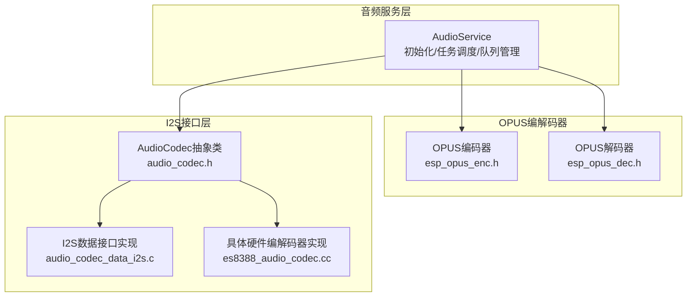
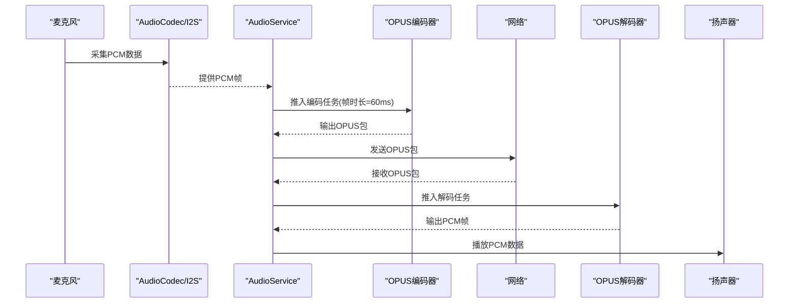
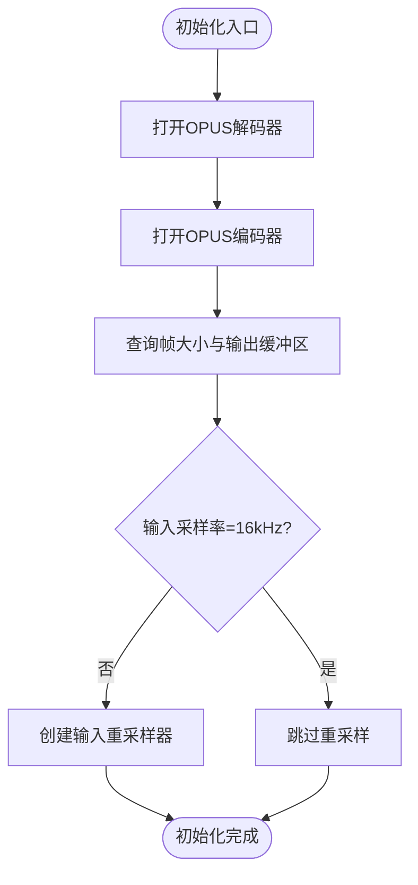
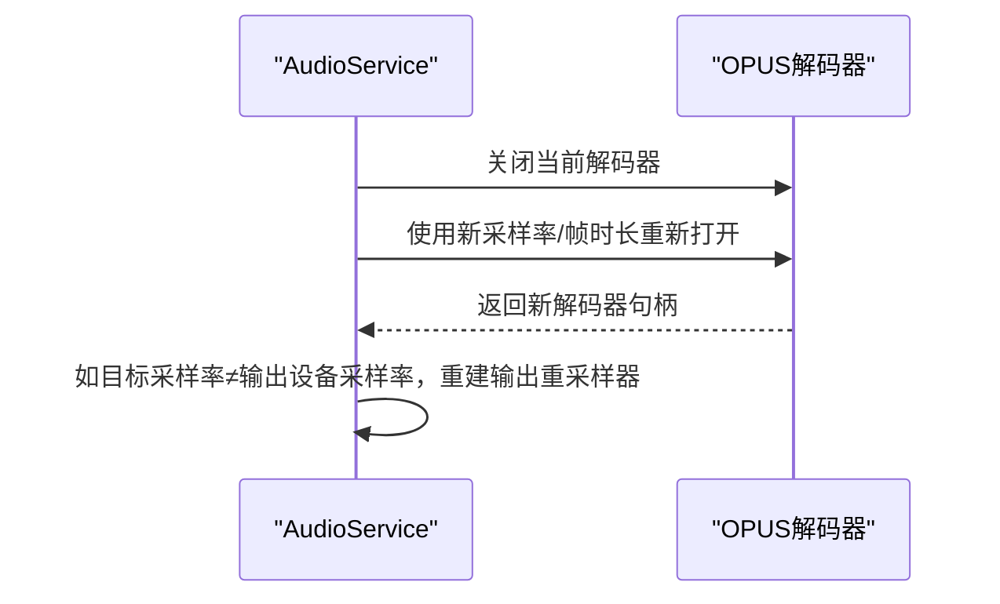
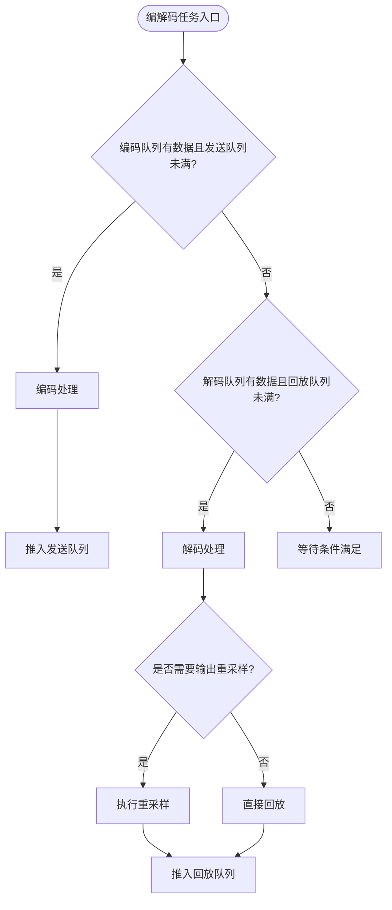
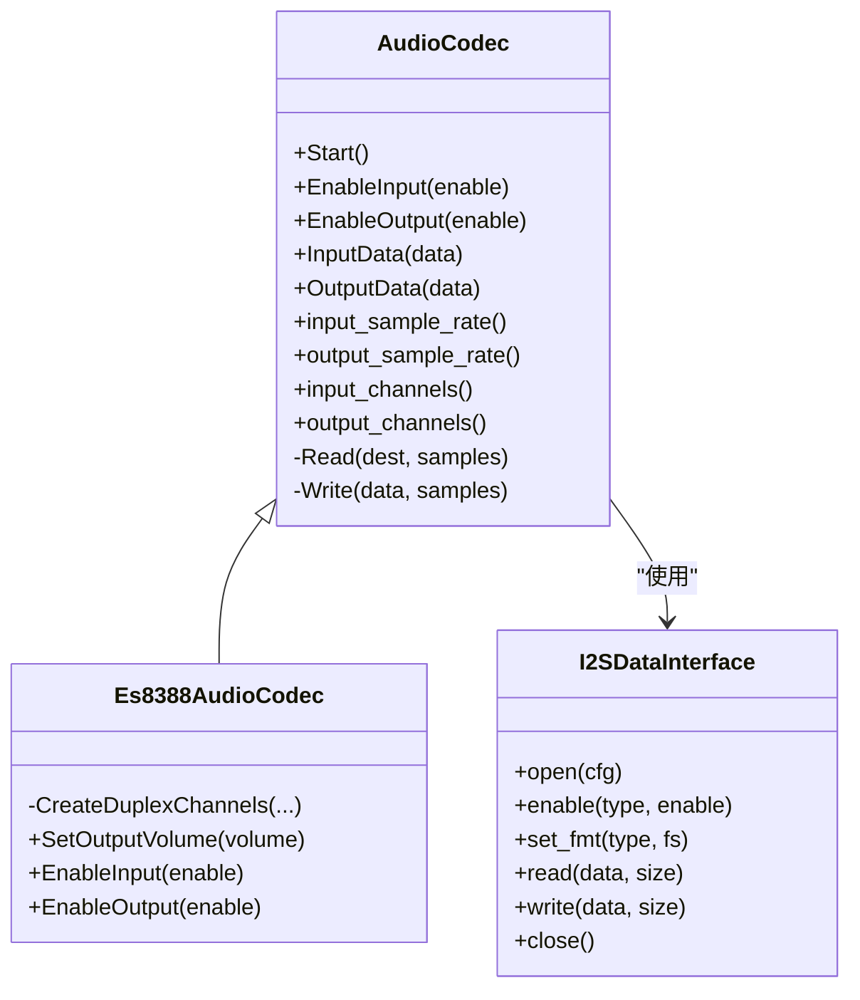
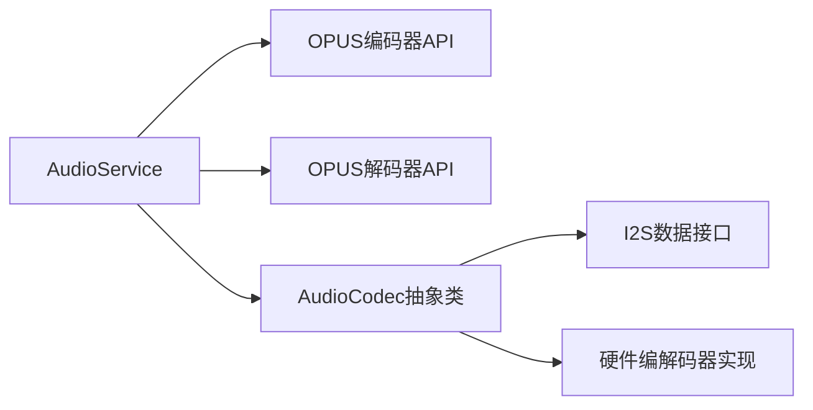

# OPUS编解码器

<cite>
**本文档引用的文件**
- [audio_service.cc](file://main/audio/audio_service.cc)
- [audio_service.h](file://main/audio/audio_service.h)
- [esp_opus_dec.h](file://managed_components/espressif__esp_audio_codec/include/decoder/impl/esp_opus_dec.h)
- [esp_opus_enc.h](file://managed_components/espressif__esp_audio_codec/include/encoder/impl/esp_opus_enc.h)
- [audio_codec.h](file://main/audio/audio_codec.h)
- [audio_codec_data_i2s.c](file://managed_components/espressif__esp_codec_dev/platform/audio_codec_data_i2s.c)
- [es8388_audio_codec.cc](file://main/audio/codecs/es8388_audio_codec.cc)
</cite>

## 目录
1. [简介](#简介)
2. [项目结构](#项目结构)
3. [核心组件](#核心组件)
4. [架构总览](#架构总览)
5. [详细组件分析](#详细组件分析)
6. [依赖关系分析](#依赖关系分析)
7. [性能考虑](#性能考虑)
8. [故障排除指南](#故障排除指南)
9. [结论](#结论)

## 简介
本文件面向ESP32-AI项目中OPUS编解码器的应用，系统性阐述其在语音压缩中的配置、比特率控制、质量优化与性能调优，并给出与I2S接口的集成方案（数据格式转换与缓冲区管理）。文档以代码级分析为基础，辅以流程图与时序图，帮助开发者快速理解并正确使用OPUS编解码器。

## 项目结构
OPUS编解码器在项目中的位置与职责如下：
- 编解码器API定义：位于受管组件目录，提供OPUS编码器与解码器的配置结构体、打开/处理/重置/关闭等接口。
- 音频服务层：封装OPUS编解码器的初始化、参数配置、任务调度与队列管理，负责PCM与OPUS包之间的双向转换。
- I2S接口层：通过音频编解码器抽象类与I2S驱动对接，完成音频采集与播放的数据通路。
- 具体硬件编解码器实现：以ES8388为例，展示如何创建I2S通道、配置采样率与位宽，并与音频服务层协同工作。

**图表来源**
- [audio_service.cc:63-124](file://main/audio/audio_service.cc#L63-L124)
- [esp_opus_enc.h:69-97](file://managed_components/espressif__esp_audio_codec/include/encoder/impl/esp_opus_enc.h#L69-L97)
- [esp_opus_dec.h:53-64](file://managed_components/espressif__esp_audio_codec/include/decoder/impl/esp_opus_dec.h#L53-L64)
- [audio_codec.h:17-59](file://main/audio/audio_codec.h#L17-L59)
- [audio_codec_data_i2s.c:521-544](file://managed_components/espressif__esp_codec_dev/platform/audio_codec_data_i2s.c#L521-L544)
- [es8388_audio_codec.cc:85-137](file://main/audio/codecs/es8388_audio_codec.cc#L85-L137)

**章节来源**
- [audio_service.cc:63-124](file://main/audio/audio_service.cc#L63-L124)
- [audio_service.h:38-76](file://main/audio/audio_service.h#L38-L76)
- [audio_codec.h:17-59](file://main/audio/audio_codec.h#L17-L59)
- [audio_codec_data_i2s.c:521-544](file://managed_components/espressif__esp_codec_dev/platform/audio_codec_data_i2s.c#L521-L544)
- [es8388_audio_codec.cc:85-137](file://main/audio/codecs/es8388_audio_codec.cc#L85-L137)

## 核心组件
- OPUS编码器配置宏与参数
  - 帧时长固定为60ms，采样率为16kHz，单声道，16位深，自动比特率，VBR开启，DTX开启，FEC关闭，复杂度设为0。
  - 可通过枚举映射函数将毫秒值转换为OPUS帧时长枚举。
- OPUS解码器配置
  - 支持多种帧时长（2.5~120ms），采样率、通道数、自界定包标志等可配置。
- 音频服务初始化
  - 打开OPUS解码器与编码器句柄；根据输入采样率决定是否需要输入重采样；启动音频输入/输出任务与OPUS编解码任务。
- 队列与任务
  - 编码队列、发送队列、解码队列、回放队列与测试队列；最大队列长度基于帧时长与最大时长限制。
- I2S与音频编解码器
  - 通过AudioCodec抽象类与I2S驱动对接，支持双工模式、通道掩码、位宽与采样率配置。

**章节来源**
- [audio_service.h:38-76](file://main/audio/audio_service.h#L38-L76)
- [audio_service.cc:63-124](file://main/audio/audio_service.cc#L63-L124)
- [esp_opus_enc.h:69-97](file://managed_components/espressif__esp_audio_codec/include/encoder/impl/esp_opus_enc.h#L69-L97)
- [esp_opus_dec.h:53-64](file://managed_components/espressif__esp_audio_codec/include/decoder/impl/esp_opus_dec.h#L53-L64)
- [audio_codec.h:17-59](file://main/audio/audio_codec.h#L17-L59)

## 架构总览
OPUS编解码器在系统中的数据流分为两条主线：
- 录音路径：麦克风PCM → 处理器/唤醒词 → 编码队列 → OPUS编码 → 发送队列 → 服务器
- 播放路径：服务器 → 解码队列 → OPUS解码 → 回放队列 → 扬声器PCM

**图表来源**
- [audio_service.cc:231-290](file://main/audio/audio_service.cc#L231-L290)
- [audio_service.cc:329-448](file://main/audio/audio_service.cc#L329-L448)
- [audio_service.cc:63-124](file://main/audio/audio_service.cc#L63-L124)

## 详细组件分析

### OPUS编码器初始化与参数配置
- 初始化流程
  - 打开OPUS解码器：根据输出采样率与帧时长构造配置，返回解码器句柄。
  - 打开OPUS编码器：使用宏AS_OPUS_ENC_CONFIG()生成编码配置，返回编码器句柄。
  - 查询帧大小与输出缓冲区大小，计算编码帧样本数。
  - 若输入采样率不为16kHz，则创建输入重采样器。
- 关键参数说明
  - 帧时长：60ms（固定）
  - 应用模式：音频模式（广播/高保真）
  - 自动比特率：启用（由库根据采样率、通道与帧时长自动选择）
  - VBR：启用
  - DTX：启用（满足条件：采样率8/12/16kHz、VOIP模式、帧时长>5ms）
  - FEC：禁用
  - 复杂度：0（最低）

**图表来源**
- [audio_service.cc:63-94](file://main/audio/audio_service.cc#L63-L94)
- [audio_service.h:65-76](file://main/audio/audio_service.h#L65-L76)

**章节来源**
- [audio_service.cc:63-94](file://main/audio/audio_service.cc#L63-L94)
- [audio_service.h:65-76](file://main/audio/audio_service.h#L65-L76)
- [esp_opus_enc.h:69-97](file://managed_components/espressif__esp_audio_codec/include/encoder/impl/esp_opus_enc.h#L69-L97)

### OPUS解码器参数与动态切换
- 参数结构体包含采样率、通道数、帧时长、自界定包标志。
- 动态切换解码采样率与帧时长时，需先关闭旧解码器，再按新参数重新打开，并重建输出重采样器（若需要）。

**图表来源**
- [audio_service.cc:450-484](file://main/audio/audio_service.cc#L450-L484)
- [esp_opus_dec.h:53-64](file://managed_components/espressif__esp_audio_codec/include/decoder/impl/esp_opus_dec.h#L53-L64)

**章节来源**
- [audio_service.cc:450-484](file://main/audio/audio_service.cc#L450-L484)
- [esp_opus_dec.h:53-64](file://managed_components/espressif__esp_audio_codec/include/decoder/impl/esp_opus_dec.h#L53-L64)

### 编解码任务与队列管理
- 编码任务
  - 从编码队列取出PCM帧（帧大小必须等于编码器查询到的帧大小），调用编码器处理，得到OPUS包后放入发送队列或测试队列。
- 解码任务
  - 从解码队列取出OPUS包，按包内采样率与帧时长动态重建解码器，解码后进行输出重采样（如需要），推入回放队列。
- 队列容量
  - 最大队列长度基于最大时长（2400ms）与帧时长（60ms）计算，确保缓冲区不会溢出。

**图表来源**
- [audio_service.cc:329-448](file://main/audio/audio_service.cc#L329-L448)
- [audio_service.h:38-46](file://main/audio/audio_service.h#L38-L46)

**章节来源**
- [audio_service.cc:329-448](file://main/audio/audio_service.cc#L329-L448)
- [audio_service.h:38-46](file://main/audio/audio_service.h#L38-L46)

### I2S接口集成与数据格式转换
- I2S通道创建
  - ES8388示例展示了如何创建双工I2S通道（主模式），配置采样率、位宽、WS宽度、左右对齐与字节序等。
- 数据接口实现
  - I2S数据接口通过标准模式配置，支持不同通信模式（STD/PDM/TDM），并能根据通道数与位宽自动扩展槽位宽度。
- 音频编解码器抽象
  - AudioCodec抽象类统一了I2S通道的启用/禁用、格式设置与读写操作，便于上层服务透明使用。

**图表来源**
- [audio_codec.h:17-59](file://main/audio/audio_codec.h#L17-L59)
- [es8388_audio_codec.cc:85-137](file://main/audio/codecs/es8388_audio_codec.cc#L85-L137)
- [audio_codec_data_i2s.c:521-544](file://managed_components/espressif__esp_codec_dev/platform/audio_codec_data_i2s.c#L521-L544)

**章节来源**
- [audio_codec.h:17-59](file://main/audio/audio_codec.h#L17-L59)
- [es8388_audio_codec.cc:85-137](file://main/audio/codecs/es8388_audio_codec.cc#L85-L137)
- [audio_codec_data_i2s.c:521-544](file://managed_components/espressif__esp_codec_dev/platform/audio_codec_data_i2s.c#L521-L544)

### 实际配置示例（路径指引）
- OPUS编码器配置宏
  - 路径：[AS_OPUS_ENC_CONFIG:65-76](file://main/audio/audio_service.h#L65-L76)
- OPUS解码器配置宏
  - 路径：[OPUS_DEC_CFG:17-24](file://main/audio/audio_service.cc#L17-L24)
- 初始化与打开编解码器
  - 路径：[Initialize:63-85](file://main/audio/audio_service.cc#L63-L85)
- 设置解码采样率与帧时长
  - 路径：[SetDecodeSampleRate:450-484](file://main/audio/audio_service.cc#L450-L484)
- 编码任务处理
  - 路径：[OpusCodecTask 编码分支:396-444](file://main/audio/audio_service.cc#L396-L444)
- 解码任务处理
  - 路径：[OpusCodecTask 解码分支:341-395](file://main/audio/audio_service.cc#L341-L395)

**章节来源**
- [audio_service.h:65-76](file://main/audio/audio_service.h#L65-L76)
- [audio_service.cc:17-24](file://main/audio/audio_service.cc#L17-L24)
- [audio_service.cc:63-85](file://main/audio/audio_service.cc#L63-L85)
- [audio_service.cc:450-484](file://main/audio/audio_service.cc#L450-L484)
- [audio_service.cc:396-444](file://main/audio/audio_service.cc#L396-L444)
- [audio_service.cc:341-395](file://main/audio/audio_service.cc#L341-L395)

## 依赖关系分析
- 组件耦合
  - AudioService依赖OPUS编解码器API与I2S数据接口，同时通过AudioCodec抽象类屏蔽底层差异。
- 外部依赖
  - OPUS编解码器API来自受管组件，I2S驱动来自ESP-IDF。
- 潜在循环依赖
  - 无直接循环依赖；各模块通过抽象接口交互。

**图表来源**
- [audio_service.cc:63-124](file://main/audio/audio_service.cc#L63-L124)
- [audio_codec.h:17-59](file://main/audio/audio_codec.h#L17-L59)
- [audio_codec_data_i2s.c:521-544](file://managed_components/espressif__esp_codec_dev/platform/audio_codec_data_i2s.c#L521-L544)
- [es8388_audio_codec.cc:85-137](file://main/audio/codecs/es8388_audio_codec.cc#L85-L137)

**章节来源**
- [audio_service.cc:63-124](file://main/audio/audio_service.cc#L63-L124)
- [audio_codec.h:17-59](file://main/audio/audio_codec.h#L17-L59)
- [audio_codec_data_i2s.c:521-544](file://managed_components/espressif__esp_codec_dev/platform/audio_codec_data_i2s.c#L521-L544)
- [es8388_audio_codec.cc:85-137](file://main/audio/codecs/es8388_audio_codec.cc#L85-L137)

## 性能考虑
- 帧时长与延迟
  - 60ms帧时长平衡了带宽与延迟；更短帧时长（如10/20ms）可降低端到端延迟但增加开销。
- 自动比特率与VBR
  - 自动比特率与VBR在保证质量的同时减少带宽占用；可根据网络状况动态调整。
- 重采样策略
  - 输入重采样仅在采样率不匹配时启用；输出重采样用于适配硬件播放采样率。
- 队列长度与背压
  - 合理设置最大队列长度，避免内存压力；当队列接近上限时应主动阻塞或丢弃策略，防止积压。

[本节为通用指导，无需列出具体文件来源]

## 故障排除指南
- 编码失败
  - 现象：编码任务日志显示失败，错误码提示编码失败。
  - 排查：确认输入PCM帧大小与编码器查询到的帧大小一致；检查编码器句柄是否成功创建。
  - 参考路径：[编码处理与错误日志:408-442](file://main/audio/audio_service.cc#L408-L442)
- 解码失败
  - 现象：解码任务日志显示失败，错误码提示解码失败。
  - 排查：确认解码器已按包内采样率与帧时长重建；检查输出缓冲区是否足够。
  - 参考路径：[解码处理与错误日志:352-394](file://main/audio/audio_service.cc#L352-L394)
- 音频无声或破音
  - 现象：播放无声音或有噪声。
  - 排查：检查I2S格式配置（采样率、位宽、通道掩码）；确认硬件编解码器增益与音量设置；验证输出重采样是否生效。
  - 参考路径：[I2S格式设置与硬件配置:144-200](file://main/audio/codecs/es8388_audio_codec.cc#L144-L200)
- 队列溢出
  - 现象：发送队列或解码队列持续增长。
  - 排查：检查网络发送速率与接收速率；适当增大队列容量或降低帧时长以提升吞吐。
  - 参考路径：[队列容量与等待逻辑:38-46](file://main/audio/audio_service.h#L38-L46)

**章节来源**
- [audio_service.cc:408-442](file://main/audio/audio_service.cc#L408-L442)
- [audio_service.cc:352-394](file://main/audio/audio_service.cc#L352-L394)
- [es8388_audio_codec.cc:144-200](file://main/audio/codecs/es8388_audio_codec.cc#L144-L200)
- [audio_service.h:38-46](file://main/audio/audio_service.h#L38-L46)

## 结论
OPUS编解码器在ESP32-AI项目中承担了语音压缩与传输的关键角色。通过合理的参数配置（60ms帧时长、自动比特率、VBR与DTX）、清晰的任务与队列设计，以及与I2S接口的紧密集成，系统实现了低延迟、高质量的音频处理能力。建议在实际部署中结合网络带宽与设备性能，动态调整帧时长与比特率策略，并完善异常监控与告警机制，以获得更稳定的用户体验。