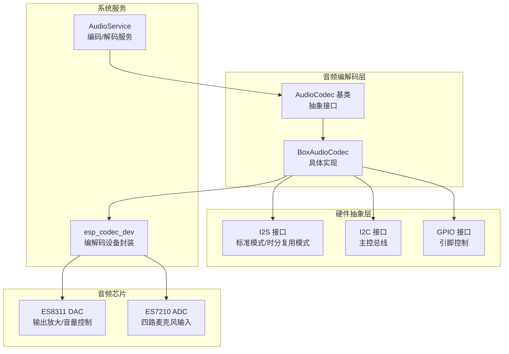
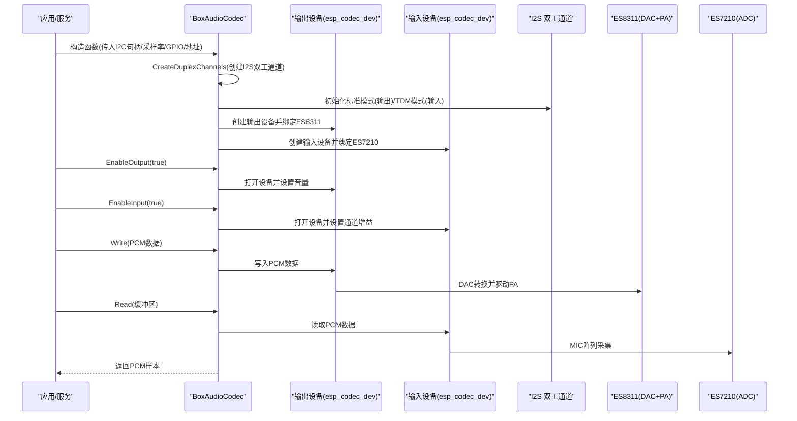
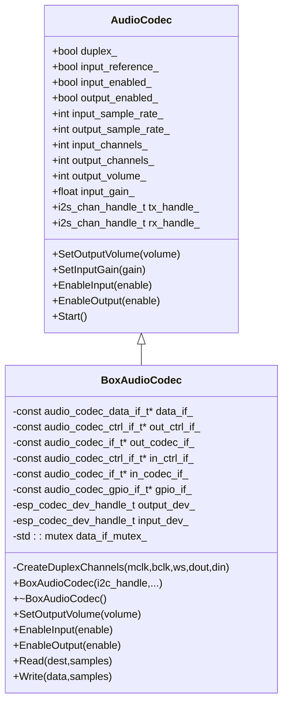
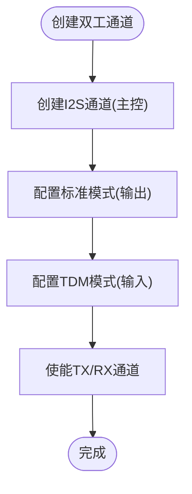
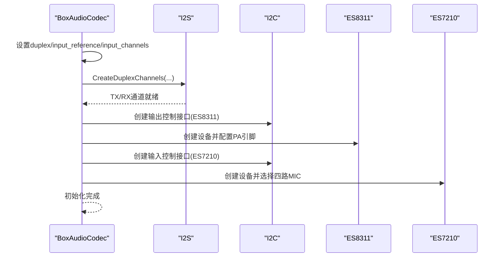
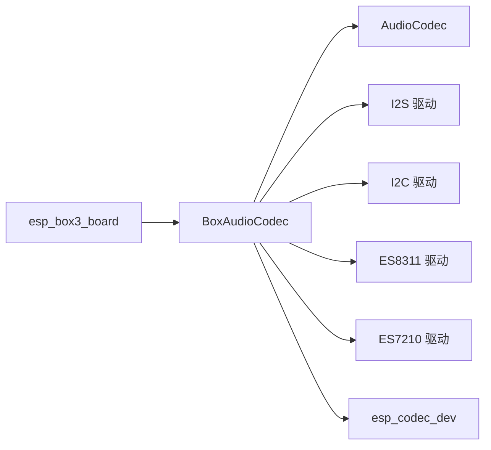

# BoxAudioCodec编解码器

<cite>
**本文档引用的文件**
- [box_audio_codec.h](file://main/audio/codecs/box_audio_codec.h)
- [box_audio_codec.cc](file://main/audio/codecs/box_audio_codec.cc)
- [audio_codec.h](file://main/audio/audio_codec.h)
- [esp_box3_board.cc](file://main/boards/esp-box-3/esp_box3_board.cc)
- [config.h](file://main/boards/esp-box-3/config.h)
- [audio_service.cc](file://main/audio/audio_service.cc)
</cite>

## 目录
1. [简介](#简介)
2. [项目结构](#项目结构)
3. [核心组件](#核心组件)
4. [架构总览](#架构总览)
5. [详细组件分析](#详细组件分析)
6. [依赖关系分析](#依赖关系分析)
7. [性能考虑](#性能考虑)
8. [故障排除指南](#故障排除指南)
9. [结论](#结论)
10. [附录](#附录)

## 简介
本文件为BoxAudioCodec编解码器的深度技术文档，面向需要在ESP32平台上实现双通道音频采集与播放的工程师与开发者。文档围绕以下目标展开：
- 解释BoxAudioCodec类的实现架构与职责边界
- 详解双通道音频处理（I2S接口配置）与PA放大器控制
- 说明构造函数参数含义（I2C句柄、采样率、GPIO引脚、音频芯片地址）
- 阐述内部数据结构与成员变量作用（output_dev_与input_dev_等）
- 提供完整的初始化流程、音频读写操作与音量控制实现
- 给出实际硬件连接示例与配置参数调优建议

## 项目结构
BoxAudioCodec位于音频编解码器子模块中，作为具体硬件平台的音频编解码实现，向上提供统一的AudioCodec接口，向下对接I2S、I2C以及音频芯片驱动。

图表来源
- [box_audio_codec.h:11-38](file://main/audio/codecs/box_audio_codec.h#L11-L38)
- [box_audio_codec.cc:9-78](file://main/audio/codecs/box_audio_codec.cc#L9-L78)
- [audio_codec.h:17-59](file://main/audio/audio_codec.h#L17-L59)

章节来源
- [box_audio_codec.h:11-38](file://main/audio/codecs/box_audio_codec.h#L11-L38)
- [box_audio_codec.cc:9-78](file://main/audio/codecs/box_audio_codec.cc#L9-L78)
- [audio_codec.h:17-59](file://main/audio/audio_codec.h#L17-L59)

## 核心组件
- BoxAudioCodec：继承自AudioCodec，负责双工音频通道的创建与管理、I2S接口配置、I2C控制音频芯片、音量与输入增益控制、以及音频设备的打开/关闭。
- AudioCodec基类：定义了音频编解码器的通用接口与状态字段，如采样率、通道数、音量、增益、启用状态等。
- esp_codec_dev：对音频芯片进行统一控制与数据传输的设备封装，分别用于输入与输出路径。
- I2S接口：通过标准模式（DAC输出）与TDM模式（ADC输入）实现双工。
- I2C接口：用于控制ES8311（DAC+PA）与ES7210（ADC）。

章节来源
- [box_audio_codec.h:11-38](file://main/audio/codecs/box_audio_codec.h#L11-L38)
- [box_audio_codec.cc:9-78](file://main/audio/codecs/box_audio_codec.cc#L9-L78)
- [audio_codec.h:17-59](file://main/audio/audio_codec.h#L17-L59)

## 架构总览
BoxAudioCodec的运行时架构如下：

图表来源
- [box_audio_codec.cc:9-78](file://main/audio/codecs/box_audio_codec.cc#L9-L78)
- [box_audio_codec.cc:184-247](file://main/audio/codecs/box_audio_codec.cc#L184-L247)
- [audio_service.cc:63-85](file://main/audio/audio_service.cc#L63-L85)

## 详细组件分析

### 类结构与成员变量
BoxAudioCodec继承自AudioCodec，内部持有以下关键成员：
- data_if_：I2S数据接口指针，连接I2S通道与编解码设备
- out_ctrl_if_/in_ctrl_if_：I2C控制接口指针，分别控制ES8311与ES7210
- out_codec_if_/in_codec_if_：音频芯片接口指针，封装ES8311与ES7210功能
- gpio_if_：GPIO接口指针，用于PA使能等引脚控制
- output_dev_/input_dev_：输出/输入设备句柄，由esp_codec_dev封装
- data_if_mutex_：互斥锁，保护I2S数据接口的并发访问

图表来源
- [audio_codec.h:17-59](file://main/audio/audio_codec.h#L17-L59)
- [box_audio_codec.h:11-38](file://main/audio/codecs/box_audio_codec.h#L11-L38)

章节来源
- [box_audio_codec.h:11-38](file://main/audio/codecs/box_audio_codec.h#L11-L38)
- [audio_codec.h:17-59](file://main/audio/audio_codec.h#L17-L59)

### 构造函数参数与含义
构造函数接收以下参数：
- i2c_master_handle：I2C主控总线句柄，用于ES8311与ES7210的寄存器访问
- input_sample_rate/output_sample_rate：输入/输出采样率（要求一致以保证双工）
- mclk/bclk/ws/dout/din：I2S相关GPIO引脚定义
- pa_pin：功放使能引脚（由ES8311控制PA）
- es8311_addr/es7210_addr：音频芯片I2C地址
- input_reference：是否启用参考输入（用于回声消除）

章节来源
- [box_audio_codec.cc:9-17](file://main/audio/codecs/box_audio_codec.cc#L9-L17)
- [box_audio_codec.h:30-32](file://main/audio/codecs/box_audio_codec.h#L30-L32)

### I2S接口配置（双通道/双工）
- 标准模式（I2S_STD）：用于DAC输出，配置为立体声槽位，MCLK倍频256，BCLK分频可选
- TDM模式（I2S_TDM）：用于ADC输入，配置为4路麦克风全选，WS自动，左对齐
- 通道角色：主控（MASTER），DMA描述符与帧数固定，自动清空回调策略已配置
- 引脚映射：MCLK/BCLK/WS/DOUT/DIN分别绑定到对应GPIO

图表来源
- [box_audio_codec.cc:94-182](file://main/audio/codecs/box_audio_codec.cc#L94-L182)

章节来源
- [box_audio_codec.cc:94-182](file://main/audio/codecs/box_audio_codec.cc#L94-L182)

### 音频芯片与PA控制
- 输出路径：ES8311作为DAC+PA芯片，通过I2C控制寄存器，使用MCLK，PA引脚由构造函数传入
- 输入路径：ES7210作为ADC，选择MIC1/MIC2/MIC3/MIC4四路麦克风，形成4声道输入
- 设备封装：输出/输入分别由esp_codec_dev创建并打开，采样信息与通道掩码按需设置

章节来源
- [box_audio_codec.cc:30-78](file://main/audio/codecs/box_audio_codec.cc#L30-L78)

### 初始化流程
- 设置双工标志与输入通道数（参考输入时为双通道）
- 创建双工I2S通道（标准/TDM）
- 初始化I2S数据接口（audio_codec_new_i2s_data）
- 初始化ES8311输出控制接口与设备（I2C+GPIO）
- 初始化ES7210输入控制接口与设备（I2C）
- 记录日志并返回

图表来源
- [box_audio_codec.cc:9-78](file://main/audio/codecs/box_audio_codec.cc#L9-L78)

章节来源
- [box_audio_codec.cc:9-78](file://main/audio/codecs/box_audio_codec.cc#L9-L78)

### 音频读写操作
- Write：当输出启用时，将PCM数据写入输出设备；否则直接返回
- Read：当输入启用时，从输入设备读取PCM数据；否则返回0样本
- 数据单位：以16位样本为单位，字节数为samples*sizeof(int16_t)

章节来源
- [box_audio_codec.cc:235-247](file://main/audio/codecs/box_audio_codec.cc#L235-L247)

### 音量控制与输入增益
- SetOutputVolume：通过esp_codec_dev设置输出音量，并更新基类音量状态
- EnableInput：打开输入设备时，设置采样信息（16位/4声道或2声道，取决于input_reference），并设置通道增益
- EnableOutput：打开输出设备时，设置采样信息（16位/1声道），并设置初始音量

章节来源
- [box_audio_codec.cc:184-233](file://main/audio/codecs/box_audio_codec.cc#L184-L233)

### 实际硬件连接示例
基于ESP-BOX-3开发板的引脚定义与连接方式：
- I2S引脚：MCLK=GPIO2、BCLK=GPIO17、WS=GPIO45、DOUT=GPIO15、DIN=GPIO16
- I2C引脚：SDA=GPIO8、SCL=GPIO18
- PA引脚：GPIO46
- 音频芯片地址：ES8311默认地址、ES7210默认地址
- 参考输入：启用以支持回声消除场景

章节来源
- [config.h:6-21](file://main/boards/esp-box-3/config.h#L6-L21)
- [esp_box3_board.cc:148-163](file://main/boards/esp-box-3/esp_box3_board.cc#L148-L163)

### 配置参数调优指南
- 采样率一致性：输入与输出采样率必须相同，且与I2S配置匹配
- I2S时钟：MCLK倍频256，BCLK分频根据采样率与位宽计算；确保与音频芯片期望值一致
- 通道数与掩码：输入通道数与掩码应与MIC选择一致；参考输入时启用第二通道
- 增益与音量：输入增益建议在合理范围内（例如30dB），避免削波；输出音量根据PA电压与负载阻抗调整
- 并发安全：读写路径使用互斥锁保护I2S数据接口，避免竞态条件

章节来源
- [box_audio_codec.cc:94-182](file://main/audio/codecs/box_audio_codec.cc#L94-L182)
- [box_audio_codec.cc:189-233](file://main/audio/codecs/box_audio_codec.cc#L189-L233)

## 依赖关系分析
- 继承关系：BoxAudioCodec继承AudioCodec，复用其状态字段与通用接口
- 外部库依赖：esp_codec_dev、I2S驱动、I2C驱动、音频芯片驱动
- 板级集成：通过esp_box3_board.cc在具体硬件上实例化BoxAudioCodec并注入引脚与地址

图表来源
- [box_audio_codec.h:4-8](file://main/audio/codecs/box_audio_codec.h#L4-L8)
- [box_audio_codec.cc:3-5](file://main/audio/codecs/box_audio_codec.cc#L3-L5)
- [esp_box3_board.cc:148-163](file://main/boards/esp-box-3/esp_box3_board.cc#L148-L163)

章节来源
- [box_audio_codec.h:4-8](file://main/audio/codecs/box_audio_codec.h#L4-L8)
- [box_audio_codec.cc:3-5](file://main/audio/codecs/box_audio_codec.cc#L3-L5)
- [esp_box3_board.cc:148-163](file://main/boards/esp-box-3/esp_box3_board.cc#L148-L163)

## 性能考虑
- DMA配置：DMA描述符数量与帧数影响中断频率与延迟，需结合应用帧长与内存预算权衡
- I2S时钟：过高的采样率会增加CPU与I2S带宽压力；在满足音频质量前提下优先选择较低采样率
- 互斥锁：读写路径加锁避免竞争，但应尽量缩短临界区；必要时分离读写线程
- 编解码服务：AudioService中的Opus编解码器与音频编解码器采样率需协调，避免额外重采样

## 故障排除指南
- 无法初始化I2S：检查MCLK/BCLK/WS/DOUT/DIN引脚是否正确配置，采样率与分频是否匹配
- 无声音输出：确认ES8311设备已创建并打开，PA引脚有效，音量未设为0
- 输入无声：确认ES7210设备已创建并打开，MIC选择是否包含所需通道，输入增益是否合理
- 读写异常：检查EnableInput/EnableOutput状态，避免在未启用时进行读写
- 日志定位：关注BoxAudioCodec初始化与读写过程的日志输出，便于快速定位问题

章节来源
- [box_audio_codec.cc:77-78](file://main/audio/codecs/box_audio_codec.cc#L77-L78)
- [box_audio_codec.cc:189-247](file://main/audio/codecs/box_audio_codec.cc#L189-L247)

## 结论
BoxAudioCodec通过统一的AudioCodec接口，结合I2S标准/TDM模式与I2C控制，实现了双工音频处理与PA控制。其设计清晰地分离了数据路径、控制路径与设备封装，具备良好的可扩展性与可维护性。在实际部署中，建议严格遵循引脚定义与采样率一致性，并根据硬件特性进行增益与音量的精细调优。

## 附录
- 集成点：AudioService通过AudioCodec接口与编解码器交互，实现音频编解码与播放控制
- 板级适配：不同开发板通过各自的Board类提供具体的I2C句柄与引脚定义，从而实例化对应的编解码器

章节来源
- [audio_service.cc:63-85](file://main/audio/audio_service.cc#L63-L85)
- [esp_box3_board.cc:148-163](file://main/boards/esp-box-3/esp_box3_board.cc#L148-L163)