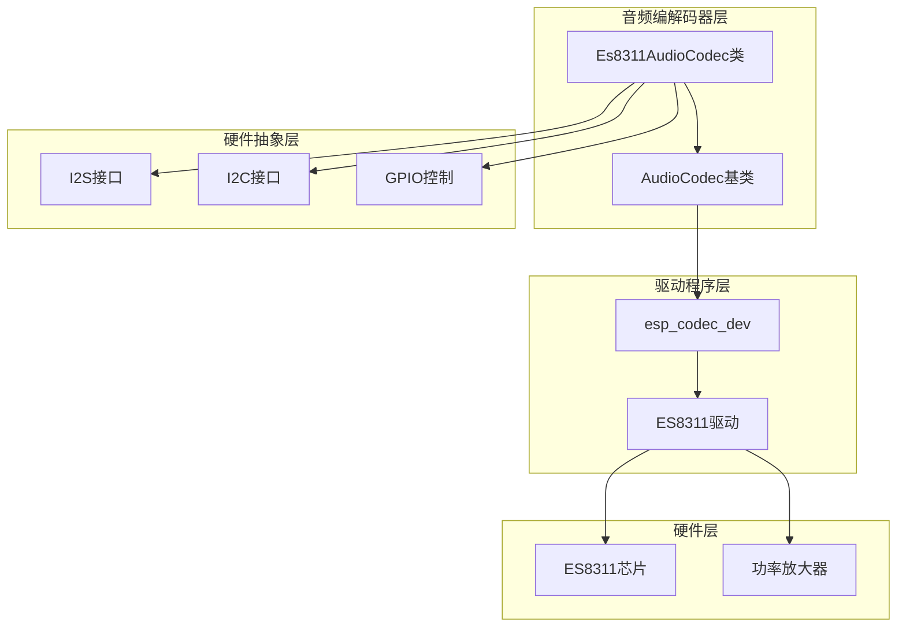
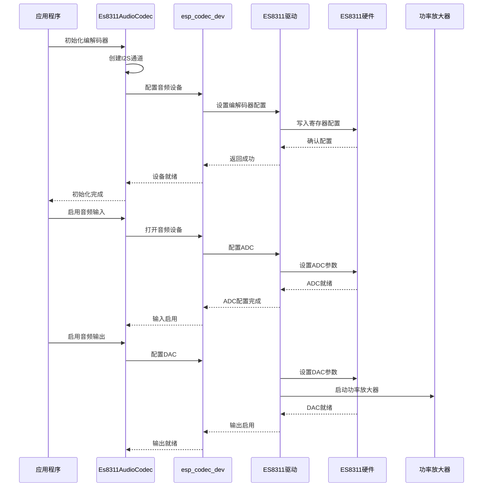
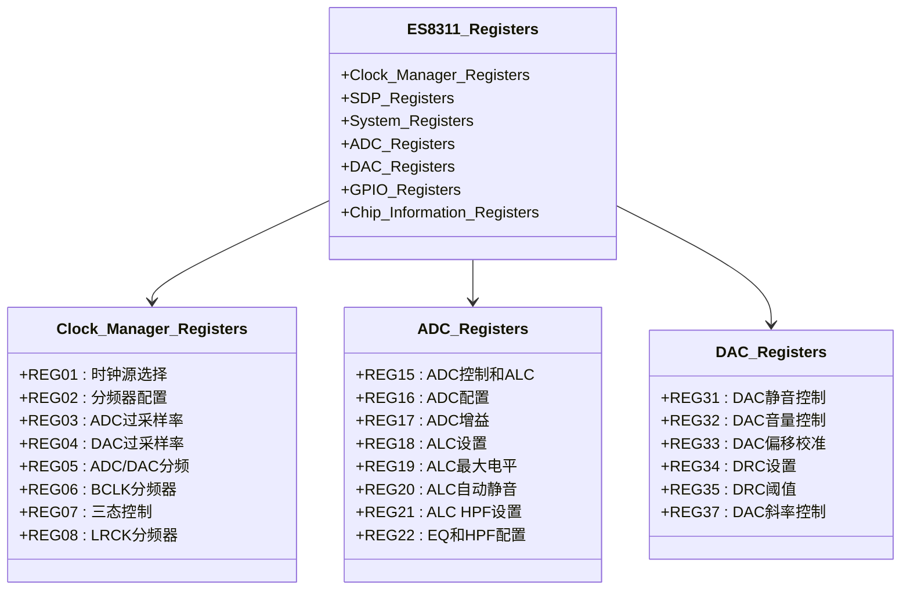
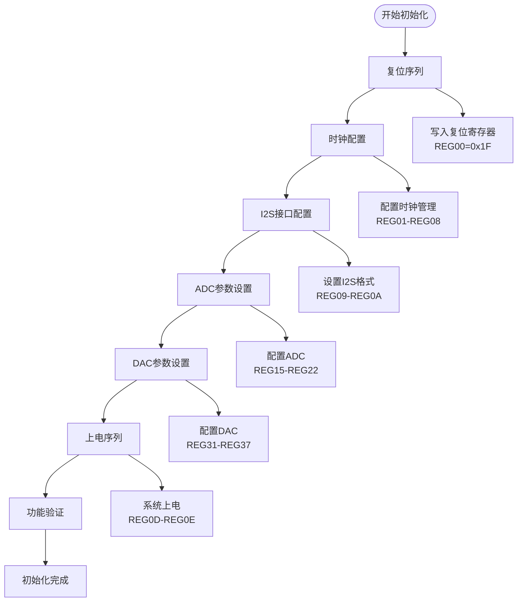
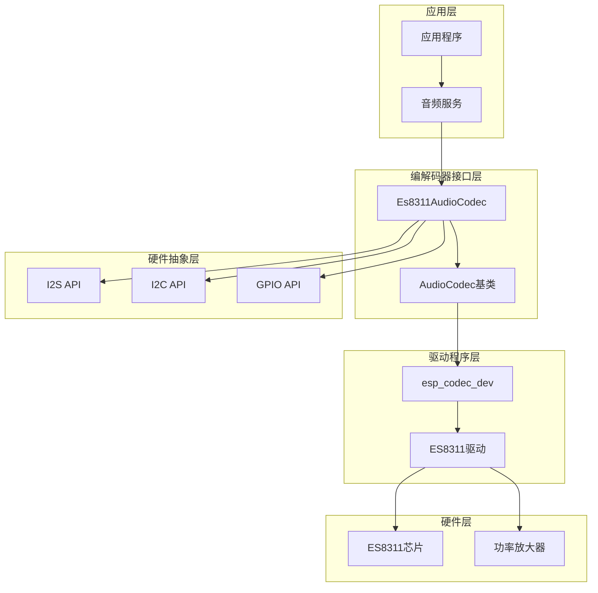
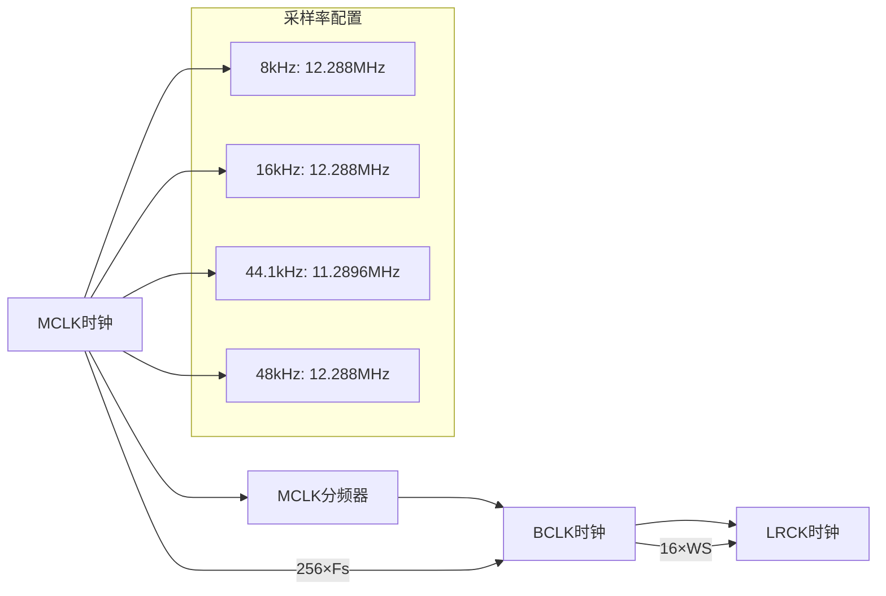

# ES8311音频编解码器

<cite>
**本文档引用的文件**
- [es8311_audio_codec.h](file://main/audio/codecs/es8311_audio_codec.h)
- [es8311_audio_codec.cc](file://main/audio/codecs/es8311_audio_codec.cc)
- [audio_codec.h](file://main/audio/audio_codec.h)
- [es8311_codec.h](file://managed_components/espressif__esp_codec_dev/device/include/es8311_codec.h)
- [es8311_reg.h](file://managed_components/espressif__esp_codec_dev/device/es8311/es8311_reg.h)
- [es8311.c](file://managed_components/espressif__esp_codec_dev/device/es8311/es8311.c)
- [atoms3r_echo_base.cc](file://main/boards/atoms3r-echo-base/atoms3r_echo_base.cc)
- [atoms3_echo_base.cc](file://main/boards/atoms3-echo-base/atoms3_echo_base.cc)
- [config.h](file://main/boards/kevin-c3/config.h)
- [i2c_device.h](file://main/boards/common/i2c_device.h)
- [i2c_device.cc](file://main/boards/common/i2c_device.cc)
</cite>

## 目录
1. [简介](#简介)
2. [项目结构](#项目结构)
3. [核心组件](#核心组件)
4. [架构概览](#架构概览)
5. [详细组件分析](#详细组件分析)
6. [依赖关系分析](#依赖关系分析)
7. [性能考虑](#性能考虑)
8. [故障诊断指南](#故障诊断指南)
9. [结论](#结论)
10. [附录](#附录)

## 简介

ES8311是一款高性能立体声音频编解码器，集成了高保真ADC和DAC转换器、模拟前端电路以及数字信号处理单元。该编解码器支持多种采样率（8kHz到96kHz），提供立体声输入输出能力，具备低功耗设计和灵活的接口配置。

在本项目中，ES8311通过ESP32的I2S接口与主控制器通信，使用I2C进行寄存器配置和控制。编解码器支持双工模式，可同时进行音频录制和播放，适用于各种语音识别、音频处理和多媒体应用。

## 项目结构

ES8311音频编解码器在项目中的组织结构如下：



**图表来源**
- [es8311_audio_codec.cc:7-59](file://main/audio/codecs/es8311_audio_codec.cc#L7-L59)
- [es8311_codec.h:23-48](file://managed_components/espressif__esp_codec_dev/device/include/es8311_codec.h#L23-L48)

**章节来源**
- [es8311_audio_codec.h:13-40](file://main/audio/codecs/es8311_audio_codec.h#L13-L40)
- [es8311_audio_codec.cc:7-59](file://main/audio/codecs/es8311_audio_codec.cc#L7-L59)

## 核心组件

### Es8311AudioCodec类

Es8311AudioCodec是ES8311编解码器的主要接口类，继承自AudioCodec基类。该类封装了编解码器的所有功能，包括初始化、配置、音频数据传输和状态管理。

主要特性：
- 双工音频处理（同时支持输入和输出）
- 支持多种采样率配置
- 音量和增益控制
- 功率放大器控制
- 线程安全的数据传输

### I2S接口配置

编解码器使用标准I2S接口进行音频数据传输，配置特点包括：
- I2S标准模式
- 16位数据宽度
- 立体声模式
- MCLK倍频256倍
- 左对齐格式

### I2C控制接口

通过I2C接口进行编解码器寄存器配置，支持：
- 寄存器读写操作
- 设备地址配置
- 时钟管理和分频设置

**章节来源**
- [es8311_audio_codec.h:13-40](file://main/audio/codecs/es8311_audio_codec.h#L13-L40)
- [es8311_audio_codec.cc:100-156](file://main/audio/codecs/es8311_audio_codec.cc#L100-L156)

## 架构概览

ES8311音频编解码器采用分层架构设计，从底层硬件到高层应用的完整栈式结构：



**图表来源**
- [es8311_audio_codec.cc:70-98](file://main/audio/codecs/es8311_audio_codec.cc#L70-L98)
- [es8311_audio_codec.cc:163-185](file://main/audio/codecs/es8311_audio_codec.cc#L163-L185)

## 详细组件分析

### 硬件架构分析

ES8311芯片采用先进的CMOS工艺制造，集成了以下关键模块：

#### 模拟前端电路
- **麦克风前置放大器**：提供可编程增益控制（-1dB到+42dB）
- **ADC输入路径**：24位Σ-Δ ADC，支持高信噪比转换
- **DAC输出路径**：24位PWM DAC，低失真输出
- **参考电压生成**：内部带隙基准电压源

#### 数字信号处理单元
- **I2S接口控制器**：支持多种数据格式和采样率
- **时钟管理系统**：精确的时序控制和分频
- **音频处理算法**：数字滤波和音效增强
- **功率管理**：智能电源关闭和唤醒机制

### 寄存器映射详解

ES8311寄存器映射采用分组管理方式，便于功能模块化控制：



**图表来源**
- [es8311_reg.h:16-77](file://managed_components/espressif__esp_codec_dev/device/es8311/es8311_reg.h#L16-L77)

### 初始化序列流程

ES8311的完整初始化过程包括多个关键步骤：



**图表来源**
- [es8311.c:312-381](file://managed_components/espressif__esp_codec_dev/device/es8311/es8311.c#L312-L381)

### 时钟设置算法

ES8311支持多种MCLK频率和采样率组合，系统内置了预计算的时钟系数表：

| 采样率 | 推荐MCLK频率 | 预分频 | 倍频 | ADC分频 | DAC分频 |
|--------|-------------|--------|------|---------|---------|
| 8kHz   | 12.288MHz   | 6      | ×1   | 1       | 1       |
| 16kHz  | 12.288MHz   | 3      | ×1   | 1       | 1       |
| 24kHz  | 12.288MHz   | 2      | ×1   | 1       | 1       |
| 44.1kHz| 11.2896MHz  | 1      | ×1   | 1       | 1       |
| 48kHz  | 12.288MHz   | 1      | ×1   | 1       | 1       |

**章节来源**
- [es8311.c:46-147](file://managed_components/espressif__esp_codec_dev/device/es8311/es8311.c#L46-L147)
- [es8311.c:279-286](file://managed_components/espressif__esp_codec_dev/device/es8311/es8311.c#L279-L286)

## 依赖关系分析

ES8311音频编解码器的依赖关系体现了清晰的分层架构：



**图表来源**
- [es8311_audio_codec.cc:22-52](file://main/audio/codecs/es8311_audio_codec.cc#L22-L52)
- [es8311_codec.h:23-48](file://managed_components/espressif__esp_codec_dev/device/include/es8311_codec.h#L23-L48)

**章节来源**
- [es8311_audio_codec.cc:22-52](file://main/audio/codecs/es8311_audio_codec.cc#L22-L52)
- [audio_codec.h:17-59](file://main/audio/audio_codec.h#L17-L59)

## 性能考虑

### 采样率优化

ES8311支持广泛的采样率范围，不同采样率下的性能表现：

- **高质量音频**（44.1kHz/48kHz）：最佳音质，较高CPU占用
- **语音应用**（16kHz）：平衡音质和性能，推荐用于语音识别
- **低功耗模式**（8kHz）：最低功耗，适合电池供电设备

### DMA配置优化

DMA缓冲区配置直接影响音频处理性能：

- **描述符数量**：6个描述符提供良好的吞吐量
- **帧数量**：240帧确保连续音频流
- **自动清除**：启用回调后自动清除，减少CPU干预

### 时钟同步策略

MCLK与采样率的精确匹配对于避免音频失真至关重要：



**图表来源**
- [es8311.c:46-147](file://managed_components/espressif__esp_codec_dev/device/es8311/es8311.c#L46-L147)

## 故障诊断指南

### 常见问题及解决方案

#### 1. 设备无法初始化
**症状**：编解码器初始化失败，日志显示错误
**可能原因**：
- I2C地址配置错误
- I2C总线连接问题
- 外部时钟未正确配置

**诊断步骤**：
1. 验证I2C地址配置（默认地址0x30）
2. 检查I2C总线电平和上拉电阻
3. 确认MCLK时钟信号

#### 2. 音频无声
**症状**：输出无声音或输入无信号
**可能原因**：
- 功率放大器未启用
- 音量设置过低
- I2S接口配置错误

**诊断步骤**：
1. 检查PA引脚配置和电平
2. 验证音量和增益设置
3. 确认I2S格式和时序

#### 3. 音频质量差
**症状**：音频有杂音或失真
**可能原因**：
- 时钟抖动过大
- PCB布线问题
- 电源纹波干扰

**诊断步骤**：
1. 测量时钟信号完整性
2. 检查PCB地平面和电源走线
3. 使用示波器观察音频信号

### 调试工具和方法

#### I2C寄存器读写测试
```cpp
// 示例：读取芯片ID寄存器
uint8_t chip_id = 0;
esp_err_t ret = i2c_device.ReadReg(ES8311_CHD1_REGFD, chip_id);
if (ret == ESP_OK) {
    printf("Chip ID: 0x%02X\n", chip_id);
}
```

#### 时序分析
使用逻辑分析仪监控以下关键信号：
- MCLK：主时钟信号
- BCLK：位时钟信号  
- LRCK：左右声道选择信号
- I2S_DOUT：数据输出
- I2S_DIN：数据输入

**章节来源**
- [i2c_device.cc:22-38](file://main/boards/common/i2c_device.cc#L22-L38)
- [es8311_audio_codec.cc:187-199](file://main/audio/codecs/es8311_audio_codec.cc#L187-L199)

## 结论

ES8311音频编解码器提供了完整的音频处理解决方案，具有以下优势：

1. **高性能集成**：单芯片集成ADC、DAC和模拟前端
2. **灵活配置**：支持多种采样率和接口格式
3. **低功耗设计**：智能电源管理，适合移动设备
4. **易于使用**：通过标准I2C和I2S接口简化集成

在实际应用中，建议根据具体需求选择合适的采样率和配置参数，在保证音质的前提下优化功耗和性能。通过遵循本文档提供的配置指南和故障诊断方法，可以快速实现可靠的音频系统。

## 附录

### 引脚定义和电气特性

#### I2C接口引脚
- **SDA**: 数据线，上拉电阻通常为4.7kΩ
- **SCL**: 时钟线，上拉电阻通常为4.7kΩ
- **地址引脚**: 通过上拉或下拉配置不同的I2C地址

#### I2S音频接口引脚
- **MCLK**: 主时钟，频率取决于采样率
- **BCLK**: 位时钟，通常为采样率的16倍
- **LRCK**: 左右声道选择，低电平表示左声道
- **DOUT**: 主设备输出，从设备输入
- **DIN**: 主设备输入，从设备输出

#### 电气特性
- **工作电压**: 3.3V逻辑电平
- **I2C速度**: 标准模式（100kHz）或快速模式（400kHz）
- **时钟精度**: ±0.1%典型值
- **功耗**: 典型150mW（满量程输出）

### 常用配置示例

#### 基础初始化配置
```cpp
// 创建ES8311编解码器实例
Es8311AudioCodec codec(
    i2c_bus_handle,     // I2C总线句柄
    I2C_NUM_1,          // I2C端口
    24000,              // 输入采样率
    24000,              // 输出采样率
    GPIO_NUM_10,        // MCLK引脚
    GPIO_NUM_8,         // BCLK引脚
    GPIO_NUM_12,        // LRCK引脚
    GPIO_NUM_11,        // DOUT引脚
    GPIO_NUM_7,         // DIN引脚
    GPIO_NUM_13,        // PA引脚
    ES8311_CODEC_DEFAULT_ADDR, // I2C地址
    true,               // 使用外部MCLK
    false               // PA引脚不反相
);
```

#### 音频参数配置
```cpp
// 启用音频输入
codec.EnableInput(true);

// 设置输入增益
codec.SetInputGain(30.0); // 30dB增益

// 启用音频输出
codec.EnableOutput(true);

// 设置输出音量
codec.SetOutputVolume(70); // 70%音量
```

**章节来源**
- [atoms3r_echo_base.cc:285-300](file://main/boards/atoms3r-echo-base/atoms3r_echo_base.cc#L285-L300)
- [config.h:6-18](file://main/boards/kevin-c3/config.h#L6-L18)