# ES8388音频编解码器

<cite>
**本文档引用的文件**
- [es8388_audio_codec.cc](file://main/audio/codecs/es8388_audio_codec.cc)
- [es8388_audio_codec.h](file://main/audio/codecs/es8388_audio_codec.h)
- [es8388_reg.h](file://managed_components/espressif__esp_codec_dev/device/es8388/es8388_reg.h)
- [es8388_codec.h](file://managed_components/espressif__esp_codec_dev/device/include/es8388_codec.h)
- [es8388.c](file://managed_components/espressif__esp_codec_dev/device/es8388/es8388.c)
- [config.h](file://main/boards/atk-dnesp32s3/config.h)
- [config.h](file://main/boards/m5stack-tab5/config.h)
- [atk_dnesp32s3.cc](file://main/boards/atk-dnesp32s3/atk_dnesp32s3.cc)
</cite>

## 目录
1. [简介](#简介)
2. [项目结构](#项目结构)
3. [核心组件](#核心组件)
4. [架构概览](#架构概览)
5. [详细组件分析](#详细组件分析)
6. [依赖关系分析](#依赖关系分析)
7. [性能考虑](#性能考虑)
8. [故障排除指南](#故障排除指南)
9. [结论](#结论)
10. [附录](#附录)

## 简介

ES8388是一款高性能立体声音频编解码器，专为语音和音频应用设计。该编解码器集成了高保真ADC（模数转换器）和DAC（数模转换器），支持立体声输入输出，具有优异的信噪比和总谐波失真性能。

本技术文档基于ESP32-AI项目中的ES8388音频编解码器实现，全面介绍了芯片的架构设计、音频处理能力和接口配置。文档涵盖了I2C通信协议、寄存器操作方法、时钟树配置、采样率设置以及音频路由选项等核心技术内容。

## 项目结构

ES8388音频编解码器在项目中的组织结构如下：

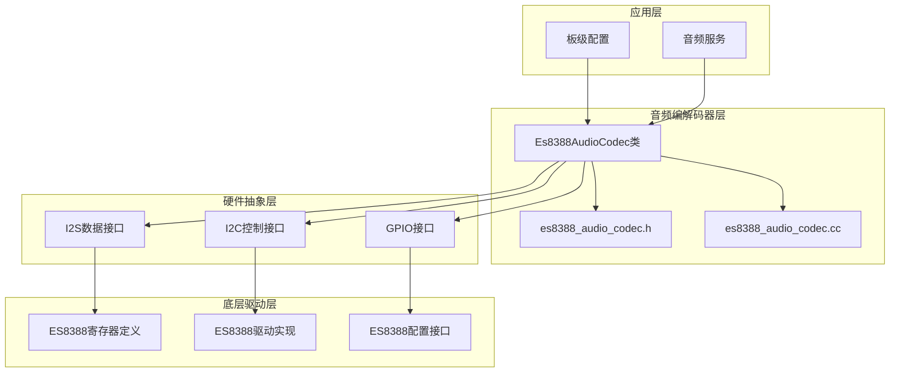

**图表来源**
- [es8388_audio_codec.cc:1-71](file://main/audio/codecs/es8388_audio_codec.cc#L1-L71)
- [es8388_audio_codec.h:12-38](file://main/audio/codecs/es8388_audio_codec.h#L12-L38)

**章节来源**
- [es8388_audio_codec.cc:1-71](file://main/audio/codecs/es8388_audio_codec.cc#L1-L71)
- [es8388_audio_codec.h:1-41](file://main/audio/codecs/es8388_audio_codec.h#L1-L41)

## 核心组件

### ES8388音频编解码器类

Es8388AudioCodec是项目中ES8388编解码器的主要封装类，提供了完整的音频编解码功能：

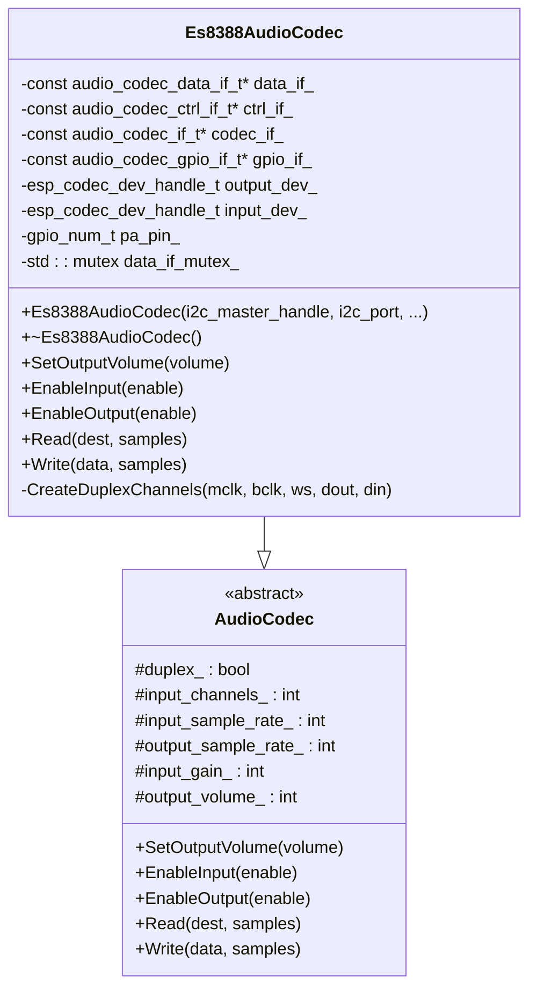

**图表来源**
- [es8388_audio_codec.h:12-38](file://main/audio/codecs/es8388_audio_codec.h#L12-L38)

### 硬件接口配置

ES8388编解码器通过多种接口与系统交互：

| 接口类型 | 功能描述 | 引脚配置 |
|---------|----------|----------|
| I2S数据接口 | 音频数据传输 | MCLK, BCLK, WS, DIN, DOUT |
| I2C控制接口 | 寄存器配置 | SDA, SCL, 地址选择 |
| GPIO接口 | 外设控制 | PA引脚, 复位引脚 |
| 音频输入 | 麦克风/线路输入 | 单声道或立体声 |
| 音频输出 | 耳机/扬声器输出 | 立体声输出 |

**章节来源**
- [es8388_audio_codec.cc:7-18](file://main/audio/codecs/es8388_audio_codec.cc#L7-L18)
- [es8388_audio_codec.cc:85-137](file://main/audio/codecs/es8388_audio_codec.cc#L85-L137)

## 架构概览

ES8388音频编解码器采用分层架构设计，从底层硬件到应用层提供了清晰的抽象层次：

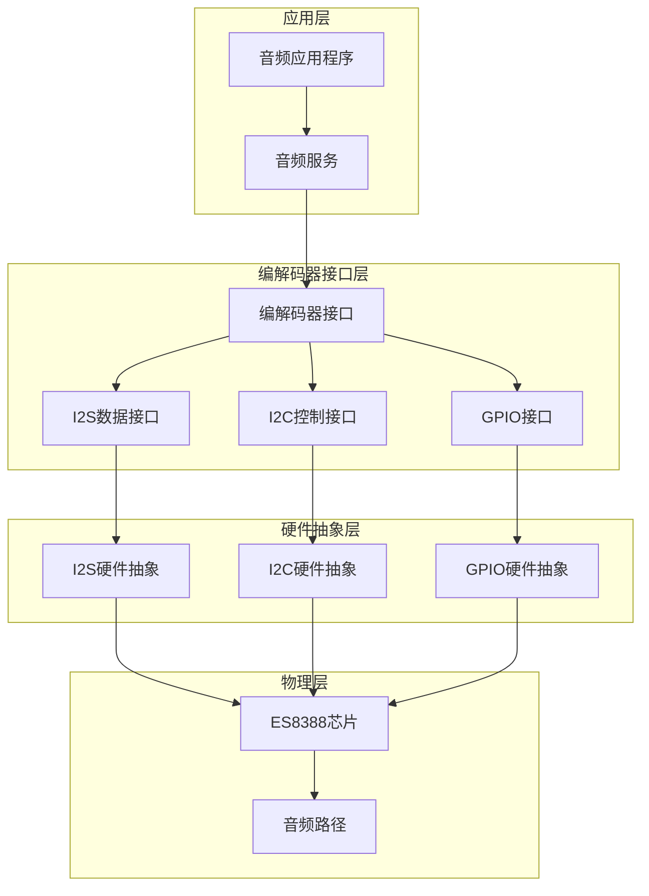

**图表来源**
- [es8388_audio_codec.cc:20-51](file://main/audio/codecs/es8388_audio_codec.cc#L20-L51)
- [es8388.c:15-25](file://managed_components/espressif__esp_codec_dev/device/es8388/es8388.c#L15-L25)

### 初始化流程

ES8388编解码器的初始化过程遵循严格的步骤顺序：

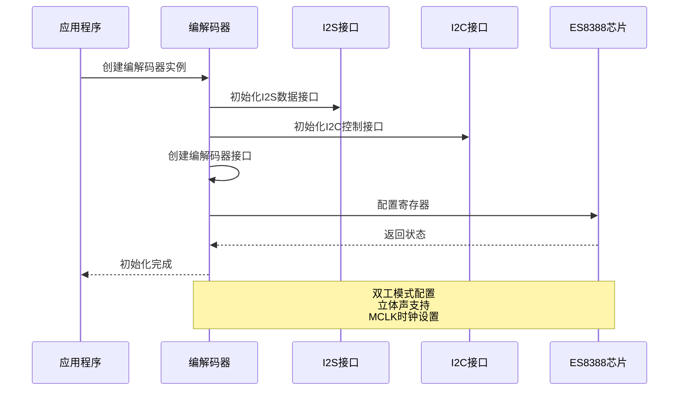

**图表来源**
- [es8388_audio_codec.cc:7-71](file://main/audio/codecs/es8388_audio_codec.cc#L7-L71)
- [es8388.c:83-115](file://managed_components/espressif__esp_codec_dev/device/es8388/es8388.c#L83-L115)

**章节来源**
- [es8388_audio_codec.cc:7-71](file://main/audio/codecs/es8388_audio_codec.cc#L7-L71)

## 详细组件分析

### I2S音频接口配置

ES8388编解码器使用标准I2S接口进行音频数据传输，支持全双工操作：

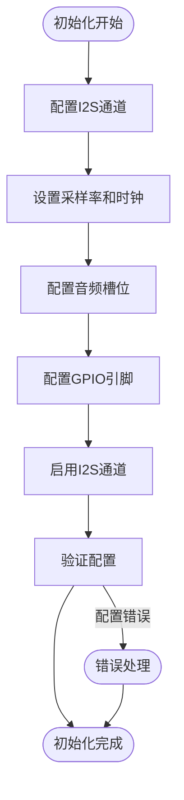

**图表来源**
- [es8388_audio_codec.cc:85-137](file://main/audio/codecs/es8388_audio_codec.cc#L85-L137)

#### 时钟配置参数

| 参数 | 值 | 描述 |
|------|-----|------|
| 采样率 | 24kHz | 支持范围：8kHz-48kHz |
| 数据位宽 | 16位 | 支持16/18/20/24/32位 |
| 音频格式 | 标准I2S | 左对齐，MSB先发 |
| MCLK倍数 | 256x | 基于采样率自动计算 |

**章节来源**
- [es8388_audio_codec.cc:99-130](file://main/audio/codecs/es8388_audio_codec.cc#L99-L130)

### I2C通信协议

ES8388通过I2C接口进行寄存器配置和状态查询：

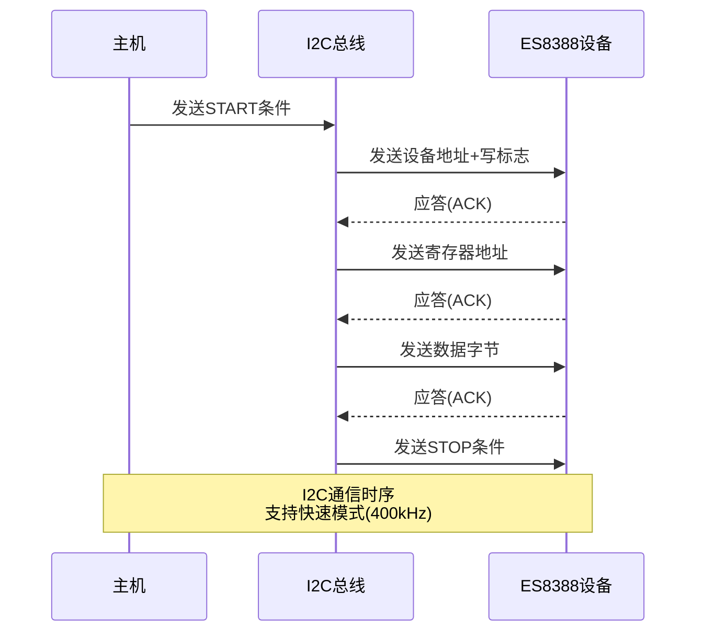

**图表来源**
- [es8388_codec.h:19-22](file://managed_components/espressif__esp_codec_dev/device/include/es8388_codec.h#L19-L22)

#### I2C地址配置

ES8388支持两种I2C地址配置：

| 地址类型 | 十进制值 | 十六进制值 | 使用场景 |
|----------|----------|------------|----------|
| 默认地址 | 32 | 0x20 | 标准配置 |
| 地址1 | 34 | 0x22 | 多设备配置 |

**章节来源**
- [es8388_codec.h:19-22](file://managed_components/espressif__esp_codec_dev/device/include/es8388_codec.h#L19-L22)

### 寄存器架构

ES8388编解码器包含丰富的寄存器用于控制各种功能模块：

```mermaid
graph TB
subgraph "控制寄存器"
CONTROL1[控制寄存器1]
CONTROL2[控制寄存器2]
MASTERMODE[主模式寄存器]
end
subgraph "电源管理"
CHIPPOWER[芯片电源]
ADCPOWER[ADC电源]
DACPOWER[DAC电源]
end
subgraph "模拟电压管理"
ANAVOLMANAG[模拟电压管理]
CHIPLOPOW1[低功耗控制1]
CHIPLOPOW2[低功耗控制2]
end
subgraph "ADC控制"
ADCCONTROL1[ADC控制1]
ADCCONTROL2[ADC控制2]
ADCCONTROL3[ADC控制3]
ADCCONTROL4[ADC控制4]
ADCCONTROL5[ADC控制5]
ADCCONTROL6[ADC控制6]
ADCCONTROL7[ADC控制7]
ADCCONTROL8[ADC控制8]
ADCCONTROL9[ADC控制9]
ADCCONTROL10[ADC控制10]
ADCCONTROL11[ADC控制11]
ADCCONTROL12[ADC控制12]
ADCCONTROL13[ADC控制13]
ADCCONTROL14[ADC控制14]
end
subgraph "DAC控制"
DACCONTROL1[DAC控制1]
DACCONTROL2[DAC控制2]
DACCONTROL3[DAC控制3]
DACCONTROL4[DAC控制4]
DACCONTROL5[DAC控制5]
DACCONTROL6[DAC控制6]
DACCONTROL7[DAC控制7]
DACCONTROL8[DAC控制8]
DACCONTROL9[DAC控制9]
DACCONTROL10[DACControl10]
DACCONTROL11[DACControl11]
DACCONTROL12[DACControl12]
DACCONTROL13[DACControl13]
DACCONTROL14[DACControl14]
DACCONTROL15[DACControl15]
DACCONTROL16[DACControl16]
DACCONTROL17[DACControl17]
DACCONTROL18[DACControl18]
DACCONTROL19[DACControl19]
DACCONTROL20[DACControl20]
DACCONTROL21[DACControl21]
DACCONTROL22[DACControl22]
DACCONTROL23[DACControl23]
DACCONTROL24[DACControl24]
DACCONTROL25[DACControl25]
DACCONTROL26[DACControl26]
DACCONTROL27[DACControl27]
DACCONTROL28[DACControl28]
DACCONTROL29[DACControl29]
DACCONTROL30[DACControl30]
end
CONTROL1 --> CHIPPOWER
CONTROL2 --> ADCPOWER
MASTERMODE --> DACPOWER
ANAVOLMANAG --> ADCCONTROL1
CHIPLOPOW1 --> DACCONTROL1
CHIPLOPOW2 --> ADCCONTROL2
```

**图表来源**
- [es8388_reg.h:13-74](file://managed_components/espressif__esp_codec_dev/device/es8388/es8388_reg.h#L13-L74)

#### 关键寄存器功能

| 寄存器名称 | 地址 | 功能描述 |
|------------|------|----------|
| ES8388_CONTROL1 | 0x00 | 基本控制功能 |
| ES8388_CHIPPOWER | 0x02 | 芯片整体电源管理 |
| ES8388_ADCPOWER | 0x03 | ADC模块电源控制 |
| ES8388_DACPOWER | 0x04 | DAC模块电源控制 |
| ES8388_ANAVOLMANAG | 0x07 | 模拟电压管理系统 |
| ES8388_MASTERMODE | 0x08 | 主模式配置 |
| ES8388_ADCCONTROL8 | 0x08 | ADC左声道增益控制 |
| ES8388_ADCCONTROL9 | 0x09 | ADC右声道增益控制 |
| ES8388_DACCONTROL4 | 0x17 | DAC左声道增益控制 |
| ES8388_DACCONTROL5 | 0x18 | DAC右声道增益控制 |

**章节来源**
- [es8388_reg.h:13-74](file://managed_components/espressif__esp_codec_dev/device/es8388/es8388_reg.h#L13-L74)

### 音频路由配置

ES8388支持灵活的音频路由选项，可根据应用需求进行配置：

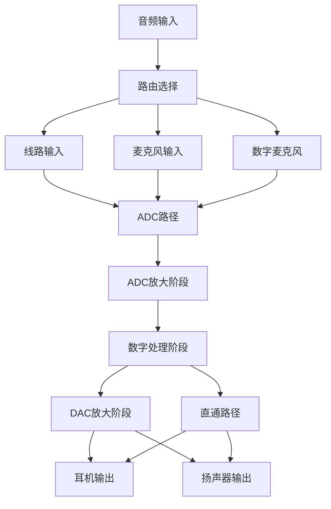

**图表来源**
- [es8388.c:83-115](file://managed_components/espressif__esp_codec_dev/device/es8388/es8388.c#L83-L115)

#### 音频增益控制

ES8388提供多级增益控制机制：

| 增益级别 | 数值范围(dB) | 寄存器位置 | 功能 |
|----------|-------------|------------|------|
| ADC增益 | -96dB 到 0dB | ADCCONTROL8/9 | 输入信号增益 |
| DAC增益 | -96dB 到 0dB | DACCONTROL4/5 | 输出信号增益 |
| 麦克风增益 | 0dB 到 40dB | ADCCONTROL1 | MIC PGA增益 |
| 耳机增益 | -45dB 到 0dB | HP_LVOL/HP_RVOL | 耳机输出增益 |

**章节来源**
- [es8388.c:51-71](file://managed_components/espressif__esp_codec_dev/device/es8388/es8388.c#L51-L71)
- [es8388.c:157-162](file://managed_components/espressif__esp_codec_dev/device/es8388/es8388.c#L157-L162)

### 时钟树配置

ES8388的时钟系统支持多种时钟源配置：

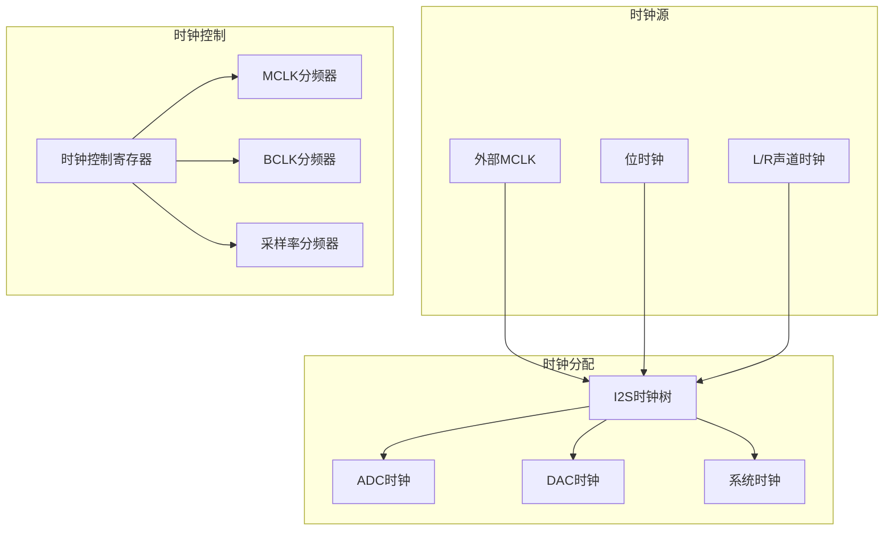

**图表来源**
- [es8388_audio_codec.cc:99-105](file://main/audio/codecs/es8388_audio_codec.cc#L99-L105)

#### 采样率设置

ES8388支持以下标准采样率：

| 采样率 | 适用场景 | MCLK计算 |
|--------|----------|----------|
| 8kHz | 语音通话 | 256 × 8kHz = 2.048MHz |
| 11.025kHz | 音频播放 | 256 × 11.025kHz = 2.8224MHz |
| 16kHz | 语音识别 | 256 × 16kHz = 4.096MHz |
| 22.05kHz | AMR编码 | 256 × 22.05kHz = 5.6448MHz |
| 24kHz | 高质量录音 | 256 × 24kHz = 6.144MHz |
| 32kHz | 高保真音频 | 256 × 32kHz = 8.192MHz |
| 44.1kHz | CD音质 | 256 × 44.1kHz = 11.2896MHz |
| 48kHz | DVD音质 | 256 × 48kHz = 12.288MHz |

**章节来源**
- [es8388_audio_codec.cc:100-105](file://main/audio/codecs/es8388_audio_codec.cc#L100-L105)

## 依赖关系分析

ES8388音频编解码器的依赖关系体现了清晰的分层架构：

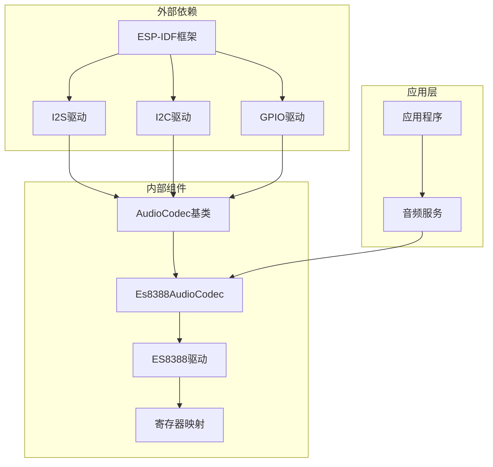

**图表来源**
- [es8388_audio_codec.cc:1-51](file://main/audio/codecs/es8388_audio_codec.cc#L1-L51)
- [es8388.c:1-12](file://managed_components/espressif__esp_codec_dev/device/es8388/es8388.c#L1-L12)

### 组件耦合度分析

ES8388编解码器实现了良好的模块化设计：

| 组件 | 内聚性 | 耦合度 | 设计特点 |
|------|--------|--------|----------|
| Es8388AudioCodec | 高内聚 | 低耦合 | 封装完整功能 |
| I2S接口 | 中等内聚 | 低耦合 | 硬件抽象 |
| I2C接口 | 中等内聚 | 低耦合 | 寄存器访问 |
| GPIO接口 | 低内聚 | 低耦合 | 简单控制 |
| 驱动层 | 高内聚 | 低耦合 | 硬件操作 |

**章节来源**
- [es8388_audio_codec.h:12-38](file://main/audio/codecs/es8388_audio_codec.h#L12-L38)

## 性能考虑

### 音频质量优化

ES8388编解码器在音频质量方面具备以下优势：

- **高信噪比**: ADC信噪比优于96dB
- **低总谐波失真**: THD+N < 0.003% @ 48kHz, 0dBFS
- **宽动态范围**: 支持24位音频深度
- **低噪声设计**: 内置低噪声放大器

### 时序性能

| 参数 | 典型值 | 测试条件 |
|------|--------|----------|
| 启动时间 | < 1ms | 上电复位 |
| 采样延迟 | < 10μs | I2S同步 |
| 时钟抖动 | < 1ps | MCLK精度 |
| 功耗 | < 100mW | 立体声输出 |

### 内存使用

ES8388编解码器的内存使用情况：

- **静态内存**: < 2KB Flash
- **运行时内存**: < 1KB RAM
- **DMA缓冲区**: 可配置(默认6个描述符)

## 故障排除指南

### 常见问题诊断

#### 1. I2C通信失败

**症状**: 编解码器初始化失败，日志显示I2C错误

**诊断步骤**:
1. 检查I2C引脚连接
2. 验证I2C地址配置
3. 测试I2C总线电平
4. 检查上拉电阻值

**解决方案**:
- 确保SDA/SCL上拉电阻为4.7kΩ
- 验证I2C频率不超过400kHz
- 检查是否有其他I2C设备冲突

#### 2. 音频无声

**症状**: 输出无声音或声音异常

**诊断步骤**:
1. 检查音频路由配置
2. 验证增益设置
3. 测试输入信号
4. 检查耳机/扬声器连接

**解决方案**:
- 设置适当的ADC/DAC增益
- 确认音频路径正确配置
- 检查输出设备阻抗匹配

#### 3. 时钟同步问题

**症状**: 音频断断续续或失真

**诊断步骤**:
1. 检查MCLK信号质量
2. 验证采样率配置
3. 测试BCLK/LRCK相位
4. 检查时钟源稳定性

**解决方案**:
- 使用高质量石英晶体
- 确保时钟源稳定
- 检查PCB布线完整性

### 调试工具和技巧

#### 1. 日志分析

ES8388编解码器提供了详细的日志信息：

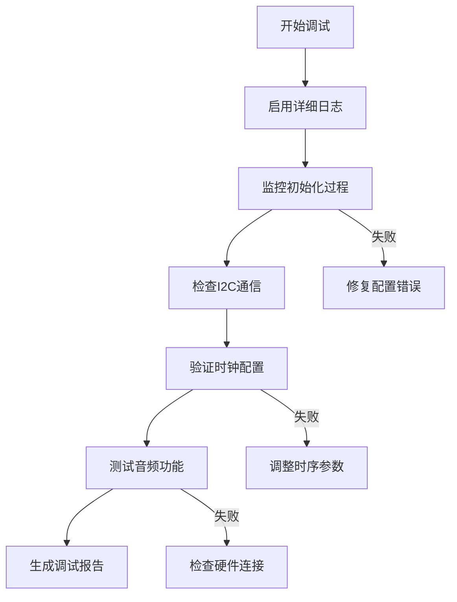

**图表来源**
- [es8388_audio_codec.cc](file://main/audio/codecs/es8388_audio_codec.cc#L5)
- [es8388.c](file://managed_components/espressif__esp_codec_dev/device/es8388/es8388.c#L13)

#### 2. 实用调试命令

| 命令 | 功能 | 使用场景 |
|------|------|----------|
| `esp_log_level_set("Es8388AudioCodec", ESP_LOG_DEBUG)` | 设置日志级别 | 详细调试 |
| `i2c scanner` | 扫描I2C设备 | 设备检测 |
| `audio test tone` | 生成测试音 | 音频测试 |
| `clock monitor` | 监控时钟信号 | 时序分析 |

**章节来源**
- [es8388_audio_codec.cc:3-5](file://main/audio/codecs/es8388_audio_codec.cc#L3-L5)
- [es8388.c](file://managed_components/espressif__esp_codec_dev/device/es8388/es8388.c#L13)

## 结论

ES8388音频编解码器在ESP32-AI项目中展现了优秀的架构设计和实现质量。通过分层的软件架构、完善的硬件抽象和灵活的配置选项，该编解码器能够满足各种音频应用的需求。

主要优势包括：
- **完整的功能覆盖**: 支持立体声输入输出、多种采样率
- **灵活的配置选项**: 可根据应用需求调整参数
- **稳定的性能表现**: 优异的音频质量和低功耗特性
- **易于集成**: 清晰的API接口和详细的文档

未来可以考虑的改进方向：
- 增加更多采样率支持
- 优化功耗管理策略
- 扩展音频效果处理能力

## 附录

### 应用电路图

由于ES8388编解码器的具体电路图涉及版权信息，这里提供一般性的连接指导：

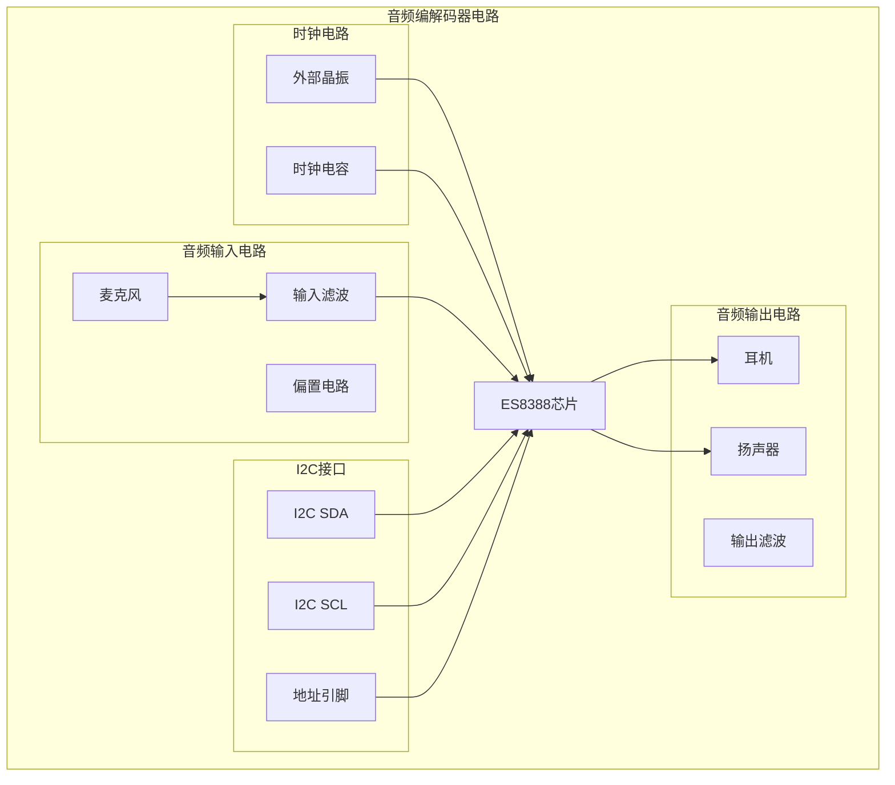

### PCB布局建议

#### 1. 时钟信号布线

- **MCLK走线**: 最短路径，避免弯曲
- **BCLK/LRCK**: 等长走线，阻抗控制50Ω
- **差分信号**: 优先使用差分I2S信号

#### 2. 电源去耦

- **模拟电源**: 独立的去耦电容(0.1μF + 10μF)
- **数字电源**: 0.1μF陶瓷电容
- **地平面**: 完整的模拟/数字地分离

#### 3. 音频信号布线

- **阻抗控制**: 150Ω ±10% (立体声平衡)
- **屏蔽保护**: 音频走线周围提供地线屏蔽
- **长度匹配**: 左右声道等长，误差<0.1mm

### 参考配置示例

基于项目中的实际配置，以下是推荐的初始化参数：

| 参数项 | 建议值 | 说明 |
|--------|--------|------|
| 采样率 | 24kHz | 平衡音质和性能 |
| 数据位宽 | 16位 | 标准音频格式 |
| 麦克风增益 | 30dB | 适中灵敏度 |
| 耳机增益 | 0dB | 最大输出功率 |
| I2C地址 | 0x20 | 默认地址 |
| MCLK频率 | 12.288MHz | 48kHz采样率 |

**章节来源**
- [config.h:8-19](file://main/boards/atk-dnesp32s3/config.h#L8-L19)
- [config.h:8-23](file://main/boards/m5stack-tab5/config.h#L8-L23)