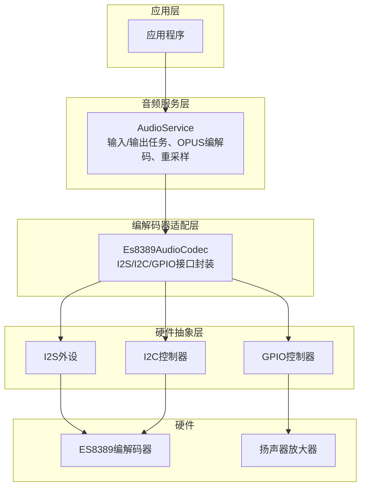
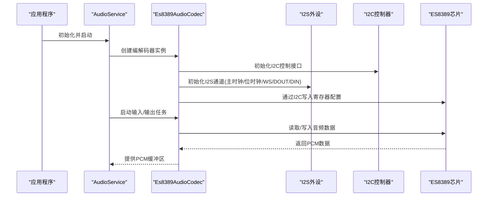
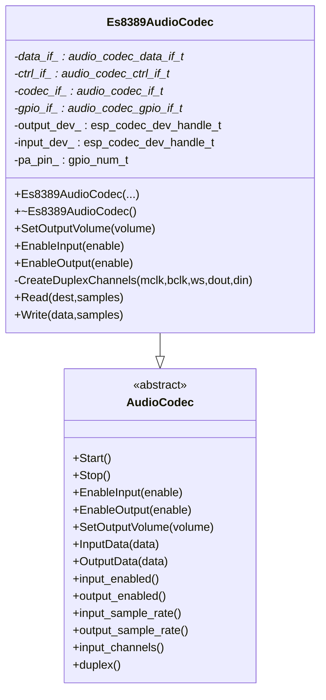
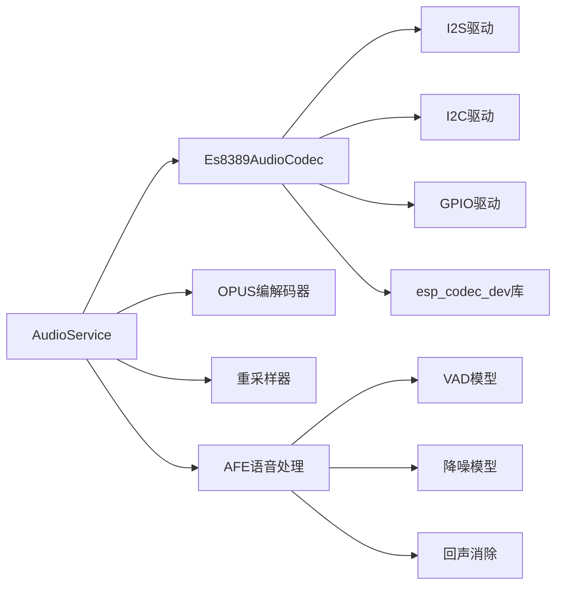

# ES8389音频编解码器

<cite>
**本文档引用的文件**
- [es8389_audio_codec.cc](file://main/audio/codecs/es8389_audio_codec.cc)
- [es8389_audio_codec.h](file://main/audio/codecs/es8389_audio_codec.h)
- [audio_service.cc](file://main/audio/audio_service.cc)
- [audio_service.h](file://main/audio/audio_service.h)
- [afe_audio_processor.cc](file://main/audio/processors/afe_audio_processor.cc)
- [atk_dnesp32s3_box2-4g/config.h](file://main/boards/atk-dnesp32s3-box2-4g/config.h)
- [atk_dnesp32s3_box2-wifi/config.h](file://main/boards/atk-dnesp32s3-box2-wifi/config.h)
- [es8388_audio_codec.cc](file://main/audio/codecs/es8388_audio_codec.cc)
- [es8388_audio_codec.h](file://main/audio/codecs/es8388_audio_codec.h)
</cite>

## 目录
1. [简介](#简介)
2. [项目结构](#项目结构)
3. [核心组件](#核心组件)
4. [架构总览](#架构总览)
5. [详细组件分析](#详细组件分析)
6. [依赖关系分析](#依赖关系分析)
7. [性能考虑](#性能考虑)
8. [故障排查指南](#故障排查指南)
9. [结论](#结论)
10. [附录](#附录)

## 简介
本文件面向ES8389音频编解码器的专业技术文档，基于仓库中的实现进行系统化梳理。ES8389作为一款高性能音频编解码芯片，在该工程中通过I2S接口与主控通信，并通过I2C对寄存器进行配置；同时结合音频服务层完成编解码、重采样、语音处理（如VAD、降噪、回声消除）等高级功能。本文将从硬件接口、软件架构、寄存器配置、GPIO与中断、测试与性能等方面进行全面说明。

## 项目结构
围绕ES8389的相关代码主要分布在以下模块：
- 音频编解码器适配层：Es8389AudioCodec类封装I2S/I2C/GPIO接口，负责初始化、启停、读写与音量控制
- 音频服务层：AudioService协调输入/输出任务、OPUS编解码、重采样以及唤醒词/语音处理
- 语音处理层：AfeAudioProcessor集成VAD、降噪、回声消除等算法
- 板级配置：各开发板头文件定义I2S引脚、I2C地址等硬件资源

图表来源
- [es8389_audio_codec.cc:7-82](file://main/audio/codecs/es8389_audio_codec.cc#L7-L82)
- [audio_service.cc:63-124](file://main/audio/audio_service.cc#L63-L124)
- [afe_audio_processor.cc:13-75](file://main/audio/processors/afe_audio_processor.cc#L13-L75)

章节来源
- [es8389_audio_codec.cc:7-82](file://main/audio/codecs/es8389_audio_codec.cc#L7-L82)
- [audio_service.cc:63-124](file://main/audio/audio_service.cc#L63-L124)
- [afe_audio_processor.cc:13-75](file://main/audio/processors/afe_audio_processor.cc#L13-L75)

## 核心组件
- Es8389AudioCodec：负责I2S数据接口、I2C控制接口、GPIO接口的初始化与管理；提供输入/输出使能、音量设置、读写PCM数据等能力
- AudioService：统一调度音频输入/输出任务、OPUS编码/解码、重采样、唤醒词检测与语音处理回调
- AfeAudioProcessor：集成VAD、降噪、回声消除等算法，支持设备端AEC切换
- 板级配置：定义I2S引脚、I2C地址、采样率等硬件参数

章节来源
- [es8389_audio_codec.h:12-38](file://main/audio/codecs/es8389_audio_codec.h#L12-L38)
- [es8389_audio_codec.cc:7-82](file://main/audio/codecs/es8389_audio_codec.cc#L7-L82)
- [audio_service.h:106-194](file://main/audio/audio_service.h#L106-L194)
- [afe_audio_processor.cc:8-75](file://main/audio/processors/afe_audio_processor.cc#L8-L75)

## 架构总览
ES8389在系统中的工作流如下：
- 应用程序通过AudioService启动编解码流程
- AudioService根据配置创建输入/输出任务，分别对接Es8389AudioCodec
- Es8389AudioCodec通过I2S与ES8389芯片通信，I2C用于寄存器配置
- 可选地，AfeAudioProcessor对音频进行实时处理（VAD、降噪、AEC）

图表来源
- [es8389_audio_codec.cc:7-82](file://main/audio/codecs/es8389_audio_codec.cc#L7-L82)
- [audio_service.cc:126-168](file://main/audio/audio_service.cc#L126-L168)

## 详细组件分析

### Es8389AudioCodec类分析
- 接口封装
  - I2S数据接口：创建双工通道，配置主时钟、位时钟、WS、DOUT/DIN引脚
  - I2C控制接口：用于向ES8389写入寄存器配置
  - GPIO接口：用于功放使能等扩展控制
- 设备初始化
  - 通过esp_codec_dev创建输入/输出设备句柄
  - 设置工作模式为双向，启用MCLK可选
  - 配置硬件增益参数（功放电压、DAC电压）
- 能力接口
  - EnableInput/EnableOutput：按需打开/关闭输入/输出路径
  - SetOutputVolume：设置输出音量
  - Read/Write：直接读写PCM数据

图表来源
- [es8389_audio_codec.h:12-38](file://main/audio/codecs/es8389_audio_codec.h#L12-L38)
- [es8389_audio_codec.cc:7-82](file://main/audio/codecs/es8389_audio_codec.cc#L7-L82)

章节来源
- [es8389_audio_codec.h:12-38](file://main/audio/codecs/es8389_audio_codec.h#L12-L38)
- [es8389_audio_codec.cc:7-82](file://main/audio/codecs/es8389_audio_codec.cc#L7-L82)
- [es8388_audio_codec.h:12-38](file://main/audio/codecs/es8388_audio_codec.h#L12-L38)
- [es8388_audio_codec.cc:7-83](file://main/audio/codecs/es8388_audio_codec.cc#L7-L83)

### I2S与GPIO引脚配置
- I2S标准模式配置要点
  - 主时钟倍数：256倍
  - 数据位宽：16位
  - 时钟极性：非反相
  - 左对齐：启用
  - 字节序：LSB优先
- 引脚映射
  - MCLK/BCLK/WS/DOUT/DIN分别连接到具体GPIO
  - 板级配置文件中定义了典型引脚分配

章节来源
- [es8389_audio_codec.cc:84-137](file://main/audio/codecs/es8389_audio_codec.cc#L84-L137)
- [atk_dnesp32s3_box2-4g/config.h:15-23](file://main/boards/atk-dnesp32s3-box2-4g/config.h#L15-L23)
- [atk_dnesp32s3_box2-wifi/config.h:14-22](file://main/boards/atk-dnesp32s3-box2-wifi/config.h#L14-L22)

### I2C寄存器配置与默认值
- 控制接口初始化
  - 指定I2C端口与设备地址
  - 通过I2C写入ES8389寄存器配置
- 默认硬件增益
  - 功放供电电压：5.0V
  - DAC供电电压：3.3V
- 寄存器写入流程
  - 通过codec_if->ctrl_if->write_reg完成

章节来源
- [es8389_audio_codec.cc:29-48](file://main/audio/codecs/es8389_audio_codec.cc#L29-L48)
- [es8389_audio_codec.cc:150-163](file://main/audio/codecs/es8389_audio_codec.cc#L150-L163)

### 自动增益控制与噪声抑制
- 输入增益设置
  - EnableInput时设置输入增益
- 噪声抑制与VAD
  - AfeAudioProcessor集成降噪模型与VAD模型
  - 支持设备端AEC切换（取决于编译选项）

章节来源
- [es8389_audio_codec.cc:150-163](file://main/audio/codecs/es8389_audio_codec.cc#L150-L163)
- [afe_audio_processor.cc:37-65](file://main/audio/processors/afe_audio_processor.cc#L37-L65)
- [afe_audio_processor.cc:189-200](file://main/audio/processors/afe_audio_processor.cc#L189-L200)

### 回声消除与参考输入
- 参考输入概念
  - 通过input_reference_与input_channels_组合实现双通道输入（主麦克风+参考麦克风）
- ES8388对比
  - ES8388支持参考输入模式，可通过寄存器设置参考通道增益
- ES8389当前实现
  - 当前实现未启用参考输入模式，输入通道数为1

章节来源
- [es8388_audio_codec.cc:144-171](file://main/audio/codecs/es8388_audio_codec.cc#L144-L171)
- [es8388_audio_codec.cc:41-50](file://main/audio/codecs/es8388_audio_codec.cc#L41-L50)
- [es8389_audio_codec.cc:10-16](file://main/audio/codecs/es8389_audio_codec.cc#L10-L16)

### 中断处理机制
- 本实现未显式使用中断驱动I2S传输
- I2S DMA描述符与帧长度已配置，DMA回调由I2S驱动处理
- 若需外部中断（如按键、状态指示），可在上层应用中注册GPIO中断

章节来源
- [es8389_audio_codec.cc:87-96](file://main/audio/codecs/es8389_audio_codec.cc#L87-L96)

### 测试方法与性能基准
- 音频测试队列
  - AudioService提供音频测试模式，将拾音数据转为OPUS包并放入测试队列
- 队列容量与帧长
  - 编码/解码队列最大包数与帧时长固定
- 性能计数
  - 统计输入/解码/编码/播放次数，便于评估吞吐

章节来源
- [audio_service.cc:608-619](file://main/audio/audio_service.cc#L608-L619)
- [audio_service.h:40-46](file://main/audio/audio_service.h#L40-L46)
- [audio_service.cc:102-111](file://main/audio/audio_service.cc#L102-L111)

## 依赖关系分析
- 组件耦合
  - Es8389AudioCodec依赖I2S、I2C、GPIO驱动与esp_codec_dev库
  - AudioService依赖Es8389AudioCodec、OPUS编解码器、重采样器、唤醒词与语音处理
- 外部依赖
  - ESP-IDF I2S、I2C、GPIO驱动
  - esp_codec_dev库（包含ES8389驱动）
  - OPUS编解码器与重采样库
  - AFE语音处理库（VAD、降噪、AEC）

图表来源
- [es8389_audio_codec.cc:25-48](file://main/audio/codecs/es8389_audio_codec.cc#L25-L48)
- [audio_service.cc:67-85](file://main/audio/audio_service.cc#L67-L85)
- [afe_audio_processor.cc:37-65](file://main/audio/processors/afe_audio_processor.cc#L37-L65)

章节来源
- [es8389_audio_codec.cc:25-48](file://main/audio/codecs/es8389_audio_codec.cc#L25-L48)
- [audio_service.cc:67-85](file://main/audio/audio_service.cc#L67-L85)
- [afe_audio_processor.cc:37-65](file://main/audio/processors/afe_audio_processor.cc#L37-L65)

## 性能考虑
- I2S DMA参数
  - 描述符数量与帧长度影响延迟与稳定性，当前配置为小批量DMA以降低抖动
- 采样率与通道
  - 输入/输出采样率一致，均为16kHz；单声道输入
- 功耗策略
  - AudioService定时检查输入/输出空闲状态，自动关闭编解码器以节省功耗
- 编解码与重采样
  - OPUS编码采用自适应比特率与丢帧保护；重采样器在输入/输出速率不匹配时启用

章节来源
- [es8389_audio_codec.cc:87-96](file://main/audio/codecs/es8389_audio_codec.cc#L87-L96)
- [audio_service.cc:684-700](file://main/audio/audio_service.cc#L684-L700)
- [audio_service.cc:87-94](file://main/audio/audio_service.cc#L87-L94)
- [audio_service.cc:470-483](file://main/audio/audio_service.cc#L470-L483)

## 故障排查指南
- 初始化失败
  - 检查I2C地址是否正确、I2C总线是否上拉、ES8389供电是否正常
  - 查看codec_if创建与esp_codec_dev句柄创建日志
- 无声音或音量异常
  - 确认EnableOutput已调用且功放引脚有效
  - 检查SetOutputVolume与输入增益设置
- 录音无声或失真
  - 确认EnableInput已调用，输入通道数与采样率配置正确
  - 检查I2S引脚连接与时钟极性配置
- 语音处理无效
  - 确认AfeAudioProcessor已初始化并处于运行状态
  - 检查VAD/降噪模型加载情况与设备AEC开关

章节来源
- [es8389_audio_codec.cc:72-82](file://main/audio/codecs/es8389_audio_codec.cc#L72-L82)
- [es8389_audio_codec.cc:166-192](file://main/audio/codecs/es8389_audio_codec.cc#L166-L192)
- [afe_audio_processor.cc:13-75](file://main/audio/processors/afe_audio_processor.cc#L13-L75)

## 结论
本实现基于Espressif官方esp_codec_dev库对ES8389进行了完整封装，结合AudioService与AFE语音处理，提供了从硬件接口到底层算法的全栈解决方案。其特点包括：
- 明确的I2S/I2C/GPIO接口抽象，易于移植
- 完整的输入/输出路径与音量控制
- 丰富的语音处理能力（VAD、降噪、AEC）
- 良好的功耗管理与测试工具链

对于需要更高阶功能（如参考输入、更灵活的寄存器配置）的场景，可在现有基础上扩展寄存器写入接口与参考输入模式。

## 附录

### I2C寄存器配置要点（基于现有实现）
- I2C地址与端口：通过板级配置文件定义
- 控制接口初始化：指定端口、地址与总线句柄
- 寄存器写入：通过codec_if->ctrl_if->write_reg完成
- 硬件增益：功放电压与DAC电压在初始化时设定

章节来源
- [es8389_audio_codec.cc:29-48](file://main/audio/codecs/es8389_audio_codec.cc#L29-L48)
- [atk_dnesp32s3_box2-4g/config.h:21-23](file://main/boards/atk-dnesp32s3-box2-4g/config.h#L21-L23)
- [atk_dnesp32s3_box2-wifi/config.h:20-22](file://main/boards/atk-dnesp32s3-box2-wifi/config.h#L20-L22)

### GPIO复用与中断
- GPIO复用：I2S引脚（MCLK/BCLK/WS/DOUT/DIN）在板级配置中定义
- 中断：当前未使用外部中断；如需按键/状态指示，可在应用层注册GPIO中断

章节来源
- [atk_dnesp32s3_box2-4g/config.h:15-19](file://main/boards/atk-dnesp32s3-box2-4g/config.h#L15-L19)
- [es8389_audio_codec.cc:120-130](file://main/audio/codecs/es8389_audio_codec.cc#L120-L130)

### 测试与验证流程
- 启用音频测试模式：AudioService提供测试事件标志位
- 数据通路验证：录音→编码→解码→播放的端到端链路
- 性能统计：输入/解码/编码/播放计数用于评估吞吐

章节来源
- [audio_service.cc:608-619](file://main/audio/audio_service.cc#L608-L619)
- [audio_service.cc:231-290](file://main/audio/audio_service.cc#L231-L290)
- [audio_service.cc:329-448](file://main/audio/audio_service.cc#L329-L448)