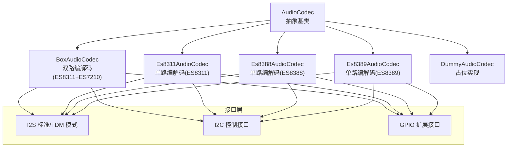
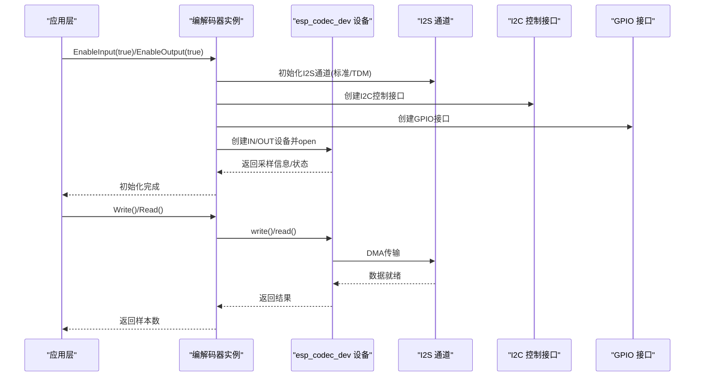
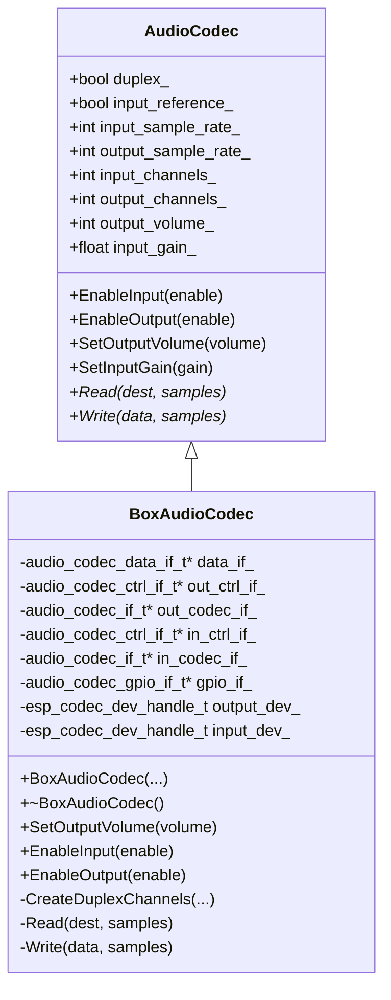
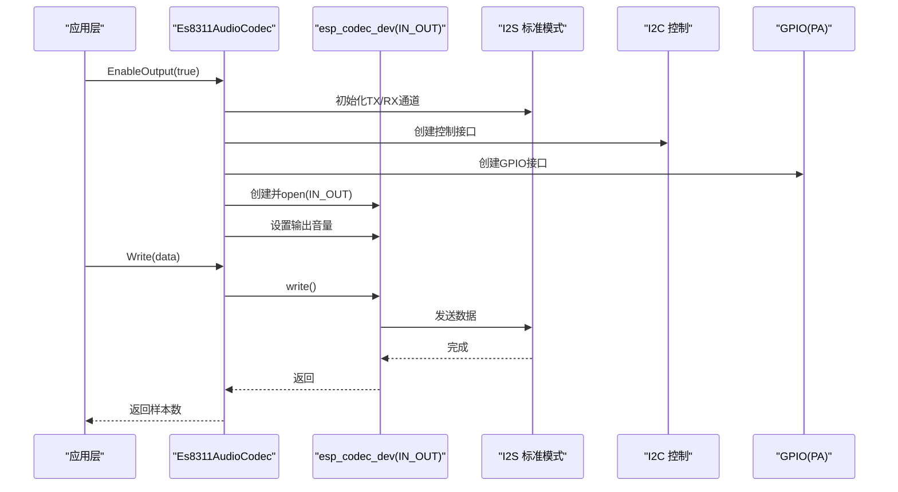
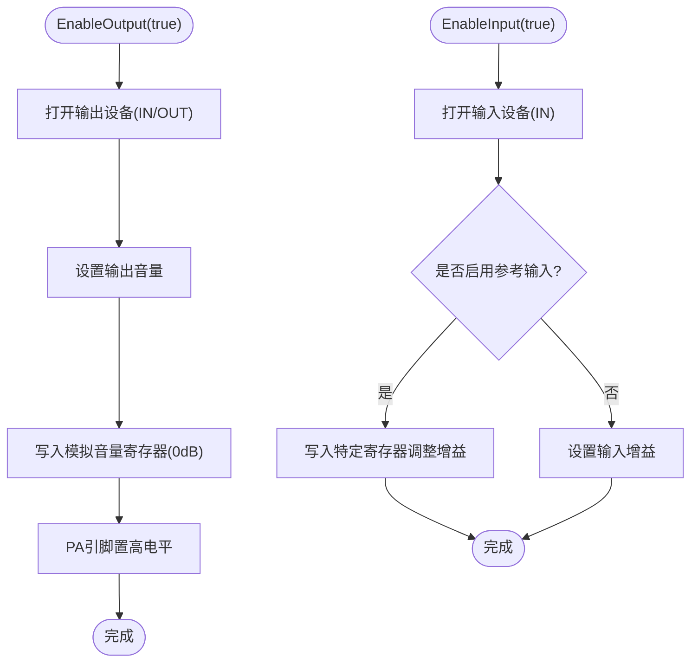
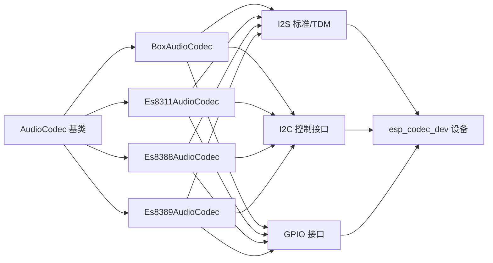

# 硬件编解码器

<cite>
**本文引用的文件**
- [main/audio/audio_codec.h](file://main/audio/audio_codec.h)
- [main/audio/codecs/box_audio_codec.h](file://main/audio/codecs/box_audio_codec.h)
- [main/audio/codecs/box_audio_codec.cc](file://main/audio/codecs/box_audio_codec.cc)
- [main/audio/codecs/es8311_audio_codec.h](file://main/audio/codecs/es8311_audio_codec.h)
- [main/audio/codecs/es8311_audio_codec.cc](file://main/audio/codecs/es8311_audio_codec.cc)
- [main/audio/codecs/es8388_audio_codec.h](file://main/audio/codecs/es8388_audio_codec.h)
- [main/audio/codecs/es8388_audio_codec.cc](file://main/audio/codecs/es8388_audio_codec.cc)
- [main/audio/codecs/es8389_audio_codec.h](file://main/audio/codecs/es8389_audio_codec.h)
- [main/audio/codecs/es8389_audio_codec.cc](file://main/audio/codecs/es8389_audio_codec.cc)
- [main/audio/codecs/dummy_audio_codec.h](file://main/audio/codecs/dummy_audio_codec.h)
</cite>

## 目录
1. [简介](#简介)
2. [项目结构](#项目结构)
3. [核心组件](#核心组件)
4. [架构总览](#架构总览)
5. [详细组件分析](#详细组件分析)
6. [依赖关系分析](#依赖关系分析)
7. [性能与时序特性](#性能与时序特性)
8. [故障诊断与排错](#故障诊断与排错)
9. [结论](#结论)
10. [附录：硬件连接与配置要点](#附录硬件连接与配置要点)

## 简介
本文件面向ESP32-AI项目的硬件编解码器模块，系统性梳理并对比多种硬件音频编解码器（含BoxAudioCodec、ES8311、ES8388、ES8389）在I2S与I2C接口上的实现方式、初始化流程、寄存器配置要点、引脚定义、电源管理与信号完整性注意事项，并给出可复用的初始化序列、参数调优建议与常见问题排查路径。

## 项目结构
硬件编解码器相关代码集中在main/audio/codecs目录，采用“抽象基类 + 多具体实现”的分层设计：
- 抽象基类负责统一的I2S通道管理、输入输出使能、音量/增益控制与公共状态字段
- 具体编解码器类封装各自芯片的I2C控制接口、GPIO扩展接口以及esp_codec_dev设备实例化
- 各实现均通过I2S标准模式与TDM模式组合，实现双工（收发同时）或单工场景

图表来源
- [main/audio/audio_codec.h:17-59](file://main/audio/audio_codec.h#L17-L59)
- [main/audio/codecs/box_audio_codec.h:11-38](file://main/audio/codecs/box_audio_codec.h#L11-L38)
- [main/audio/codecs/es8311_audio_codec.h:13-40](file://main/audio/codecs/es8311_audio_codec.h#L13-L40)
- [main/audio/codecs/es8388_audio_codec.h:12-37](file://main/audio/codecs/es8388_audio_codec.h#L12-L37)
- [main/audio/codecs/es8389_audio_codec.h:12-37](file://main/audio/codecs/es8389_audio_codec.h#L12-L37)

章节来源
- [main/audio/audio_codec.h:17-59](file://main/audio/audio_codec.h#L17-L59)
- [main/audio/codecs/box_audio_codec.h:11-38](file://main/audio/codecs/box_audio_codec.h#L11-L38)
- [main/audio/codecs/es8311_audio_codec.h:13-40](file://main/audio/codecs/es8311_audio_codec.h#L13-L40)
- [main/audio/codecs/es8388_audio_codec.h:12-37](file://main/audio/codecs/es8388_audio_codec.h#L12-L37)
- [main/audio/codecs/es8389_audio_codec.h:12-37](file://main/audio/codecs/es8389_audio_codec.h#L12-L37)

## 核心组件
- 抽象基类AudioCodec
  - 统一管理I2S收发通道句柄、采样率、声道数、音量/增益、输入输出开关状态
  - 提供虚函数Read/Write供子类实现数据读写
  - 提供EnableInput/EnableOutput/SetOutputVolume/SetInputGain等通用能力
- 具体编解码器
  - BoxAudioCodec：双工I2S + 双芯片（ES8311 DAC + ES7210 ADC），支持回声抵消参考输入
  - Es8311AudioCodec：单工/双工I2S + ES8311，支持PA引脚电平控制
  - Es8388AudioCodec：单工/双工I2S + ES8388，支持模拟输出默认0dB设置
  - Es8389AudioCodec：单工/双工I2S + ES8389，支持MCLK可选
  - DummyAudioCodec：空实现，用于无硬件或测试场景

章节来源
- [main/audio/audio_codec.h:17-59](file://main/audio/audio_codec.h#L17-L59)
- [main/audio/codecs/dummy_audio_codec.h:6-14](file://main/audio/codecs/dummy_audio_codec.h#L6-L14)

## 架构总览
各编解码器均通过以下层次协作：
- I2S层：标准模式（主模式）与TDM模式组合，配置MCLK倍频、位宽、WS极性、字长对齐等
- I2C层：通过audio_codec_new_i2c_ctrl创建控制接口，访问芯片寄存器
- GPIO层：通过audio_codec_new_gpio扩展接口，控制外部功放等
- 设备层：基于esp_codec_dev封装IN/OUT设备，统一open/read/write/close与音量/增益设置

图表来源
- [main/audio/codecs/box_audio_codec.cc:94-182](file://main/audio/codecs/box_audio_codec.cc#L94-L182)
- [main/audio/codecs/es8311_audio_codec.cc:100-156](file://main/audio/codecs/es8311_audio_codec.cc#L100-L156)
- [main/audio/codecs/es8388_audio_codec.cc:85-137](file://main/audio/codecs/es8388_audio_codec.cc#L85-L137)
- [main/audio/codecs/es8389_audio_codec.cc:84-138](file://main/audio/codecs/es8389_audio_codec.cc#L84-L138)

## 详细组件分析

### BoxAudioCodec（ES8311+ES7210）
- 双工架构：I2S主模式发送（ES8311 DAC），I2S TDM接收（ES7210 ADC），采样率一致
- I2C配置：分别创建ES8311与ES7210的I2C控制接口；ES8311作为输出设备，ES7210作为输入设备
- GPIO：用于外置功放使能；支持输入参考通道（回声抵消）
- 关键流程
  - 初始化I2S双通道（标准/TDM）
  - 创建I2S数据接口与I2C控制接口
  - 实例化ES8311与ES7210编解码器接口
  - 构造IN/OUT设备并open
  - 读写通过esp_codec_dev_read/write进行DMA传输

图表来源
- [main/audio/audio_codec.h:17-59](file://main/audio/audio_codec.h#L17-L59)
- [main/audio/codecs/box_audio_codec.h:11-38](file://main/audio/codecs/box_audio_codec.h#L11-L38)

章节来源
- [main/audio/codecs/box_audio_codec.h:11-38](file://main/audio/codecs/box_audio_codec.h#L11-L38)
- [main/audio/codecs/box_audio_codec.cc:9-78](file://main/audio/codecs/box_audio_codec.cc#L9-L78)
- [main/audio/codecs/box_audio_codec.cc:94-182](file://main/audio/codecs/box_audio_codec.cc#L94-L182)
- [main/audio/codecs/box_audio_codec.cc:184-247](file://main/audio/codecs/box_audio_codec.cc#L184-L247)

### Es8311AudioCodec（ES8311）
- 单/双工：通过I2S标准模式收发，采样率一致
- I2C：ES8311作为IN/OUT设备，支持PA引脚电平翻转
- 设备：仅创建一个IN_OUT设备，按需open/close
- 关键流程
  - 初始化I2S双通道（标准模式）
  - 创建I2C控制与GPIO接口
  - 实例化ES8311编解码器接口
  - 在EnableInput/EnableOutput中动态open/close设备并设置增益/音量

图表来源
- [main/audio/codecs/es8311_audio_codec.cc:70-98](file://main/audio/codecs/es8311_audio_codec.cc#L70-L98)
- [main/audio/codecs/es8311_audio_codec.cc:100-156](file://main/audio/codecs/es8311_audio_codec.cc#L100-L156)
- [main/audio/codecs/es8311_audio_codec.cc:158-185](file://main/audio/codecs/es8311_audio_codec.cc#L158-L185)

章节来源
- [main/audio/codecs/es8311_audio_codec.h:13-40](file://main/audio/codecs/es8311_audio_codec.h#L13-L40)
- [main/audio/codecs/es8311_audio_codec.cc:7-59](file://main/audio/codecs/es8311_audio_codec.cc#L7-L59)
- [main/audio/codecs/es8311_audio_codec.cc:100-156](file://main/audio/codecs/es8311_audio_codec.cc#L100-L156)
- [main/audio/codecs/es8311_audio_codec.cc:158-199](file://main/audio/codecs/es8311_audio_codec.cc#L158-L199)

### Es8388AudioCodec（ES8388）
- 双工：I2S标准模式收发，采样率一致
- I2C：ES8388作为IN/OUT设备，分别创建IN/OUT设备句柄
- 特性：支持模拟输出默认0dB设置；PA引脚高电平使能；输入参考通道可选
- 关键流程
  - 初始化I2S双通道（标准模式）
  - 分别创建IN/OUT设备并open
  - 输出打开时设置HP/SPK模拟音量寄存器为0dB
  - PA引脚在输出打开时拉高

图表来源
- [main/audio/codecs/es8388_audio_codec.cc:139-206](file://main/audio/codecs/es8388_audio_codec.cc#L139-L206)

章节来源
- [main/audio/codecs/es8388_audio_codec.h:12-37](file://main/audio/codecs/es8388_audio_codec.h#L12-L37)
- [main/audio/codecs/es8388_audio_codec.cc:7-71](file://main/audio/codecs/es8388_audio_codec.cc#L7-L71)
- [main/audio/codecs/es8388_audio_codec.cc:139-221](file://main/audio/codecs/es8388_audio_codec.cc#L139-L221)

### Es8389AudioCodec（ES8389）
- 双工：I2S标准模式收发，采样率一致
- I2C：ES8389作为IN/OUT设备，分别创建IN/OUT设备句柄
- 特性：支持MCLK可选；PA引脚在输出打开时拉高
- 关键流程
  - 初始化I2S双通道（标准模式）
  - 分别创建IN/OUT设备并open
  - 输出打开时设置音量并拉高PA引脚

章节来源
- [main/audio/codecs/es8389_audio_codec.h:12-37](file://main/audio/codecs/es8389_audio_codec.h#L12-L37)
- [main/audio/codecs/es8389_audio_codec.cc:7-70](file://main/audio/codecs/es8389_audio_codec.cc#L7-L70)
- [main/audio/codecs/es8389_audio_codec.cc:140-192](file://main/audio/codecs/es8389_audio_codec.cc#L140-L192)

## 依赖关系分析
- 组件耦合
  - 所有编解码器均继承自AudioCodec，共享I2S通道与公共状态
  - 各自通过audio_codec_*系列接口创建I2C与GPIO接口，再由esp_codec_dev统一管理IN/OUT设备
- 外部依赖
  - I2S驱动：i2s_new_channel、i2s_channel_init_*、i2s_channel_enable
  - I2C驱动：i2c_master或i2c端口选择（ES8311/ES8388/ES8389）
  - esp_codec_dev：设备创建、open/read/write/close、音量/增益设置
- 潜在环路
  - 无直接循环包含；接口层通过指针注入，降低耦合

图表来源
- [main/audio/audio_codec.h:17-59](file://main/audio/audio_codec.h#L17-L59)
- [main/audio/codecs/box_audio_codec.cc:22-59](file://main/audio/codecs/box_audio_codec.cc#L22-L59)
- [main/audio/codecs/es8311_audio_codec.cc:23-53](file://main/audio/codecs/es8311_audio_codec.cc#L23-L53)
- [main/audio/codecs/es8388_audio_codec.cc:41-69](file://main/audio/codecs/es8388_audio_codec.cc#L41-L69)
- [main/audio/codecs/es8389_audio_codec.cc:40-66](file://main/audio/codecs/es8389_audio_codec.cc#L40-L66)

章节来源
- [main/audio/audio_codec.h:17-59](file://main/audio/audio_codec.h#L17-L59)
- [main/audio/codecs/box_audio_codec.cc:22-78](file://main/audio/codecs/box_audio_codec.cc#L22-L78)
- [main/audio/codecs/es8311_audio_codec.cc:23-59](file://main/audio/codecs/es8311_audio_codec.cc#L23-L59)
- [main/audio/codecs/es8388_audio_codec.cc:41-71](file://main/audio/codecs/es8388_audio_codec.cc#L41-L71)
- [main/audio/codecs/es8389_audio_codec.cc:40-70](file://main/audio/codecs/es8389_audio_codec.cc#L40-L70)

## 性能与时序特性
- I2S时钟配置
  - MCLK倍频统一使用256倍；采样率一致时避免采样率不匹配导致的抖动
  - 标准模式与TDM模式组合时，注意WS极性、位宽与字长对齐一致性
- DMA与回调
  - DMA描述符数量与帧长度固定，确保低延迟与稳定吞吐
- 功放控制
  - ES8388/ES8389在输出打开时拉高PA引脚，关闭时拉低，避免噪声与功耗
- 音量/增益
  - 输出音量通过esp_codec_dev_set_out_vol设置；输入增益通过设备接口或寄存器设置

章节来源
- [main/audio/audio_codec.h:14-15](file://main/audio/audio_codec.h#L14-L15)
- [main/audio/codecs/box_audio_codec.cc:108-178](file://main/audio/codecs/box_audio_codec.cc#L108-L178)
- [main/audio/codecs/es8388_audio_codec.cc:178-205](file://main/audio/codecs/es8388_audio_codec.cc#L178-L205)
- [main/audio/codecs/es8389_audio_codec.cc:172-191](file://main/audio/codecs/es8389_audio_codec.cc#L172-L191)

## 故障诊断与排错
- 无法初始化I2S通道
  - 检查采样率一致性（双工要求一致）
  - 检查MCLK/BCLK/WS/DOUT/DIN引脚映射与上拉/阻抗匹配
- I2C通信失败
  - 确认I2C地址正确、总线速率与上拉电阻满足芯片规格
  - 使用I2C扫描工具验证从机响应
- 设备open失败
  - 确认esp_codec_dev_create返回非空；检查bits_per_sample/channel/sample_rate配置
- 无声或噪声
  - ES8388模拟输出默认-45dB，需写寄存器至0dB
  - PA引脚未使能会导致无输出
  - 输入增益过低或过高都会影响信噪比
- 回声抵消无效
  - 确认输入参考通道已启用且通道掩码正确

章节来源
- [main/audio/codecs/es8388_audio_codec.cc:189-195](file://main/audio/codecs/es8388_audio_codec.cc#L189-L195)
- [main/audio/codecs/box_audio_codec.cc:202-205](file://main/audio/codecs/box_audio_codec.cc#L202-L205)
- [main/audio/codecs/es8311_audio_codec.cc:94-98](file://main/audio/codecs/es8311_audio_codec.cc#L94-L98)

## 结论
本项目通过统一的AudioCodec抽象与多芯片适配层，实现了对BoxAudioCodec、ES8311、ES8388、ES8389等硬件编解码器的一致化接入。其关键优势在于：
- 明确的I2S/I2C/GPIO接口分层，便于移植与维护
- 双工/单工灵活配置，覆盖多种应用场景
- 通过esp_codec_dev统一设备生命周期与参数管理，简化上层逻辑

## 附录：硬件连接与配置要点
- 引脚定义（示例）
  - MCLK/BCLK/WS/DOUT/DIN：I2S接口引脚，需与I2S配置一致
  - I2C_SDA/SCL：I2C接口，上拉电阻建议4.7kΩ
  - PA：外置功放使能引脚，注意电平与电流需求
- 电源与信号完整性
  - I2S时钟与数据线尽量等长走线，减少相位偏差
  - I2C总线上并联小电容（如4.7pF）有助于抑制高频噪声
  - 模拟电源与数字电源分离，地平面完整，避免串扰
- 初始化序列（通用步骤）
  - 配置I2S通道（标准/TDM），设置采样率与位宽
  - 创建I2C控制接口与GPIO接口
  - 实例化编解码器接口并创建IN/OUT设备
  - open设备并设置音量/增益
  - EnableInput/EnableOutput后开始DMA传输
- 参数调优
  - 采样率：优先使用44.1kHz/48kHz，兼顾编解码器与算法需求
  - 增益/音量：从较低值逐步提升，避免削波与失真
  - ES8388模拟输出：首次使用前将HP/SPK音量寄存器设为0dB

章节来源
- [main/audio/codecs/box_audio_codec.cc:22-78](file://main/audio/codecs/box_audio_codec.cc#L22-L78)
- [main/audio/codecs/es8311_audio_codec.cc:23-59](file://main/audio/codecs/es8311_audio_codec.cc#L23-L59)
- [main/audio/codecs/es8388_audio_codec.cc:41-69](file://main/audio/codecs/es8388_audio_codec.cc#L41-L69)
- [main/audio/codecs/es8389_audio_codec.cc:40-66](file://main/audio/codecs/es8389_audio_codec.cc#L40-L66)