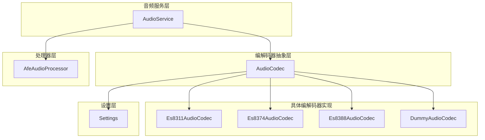
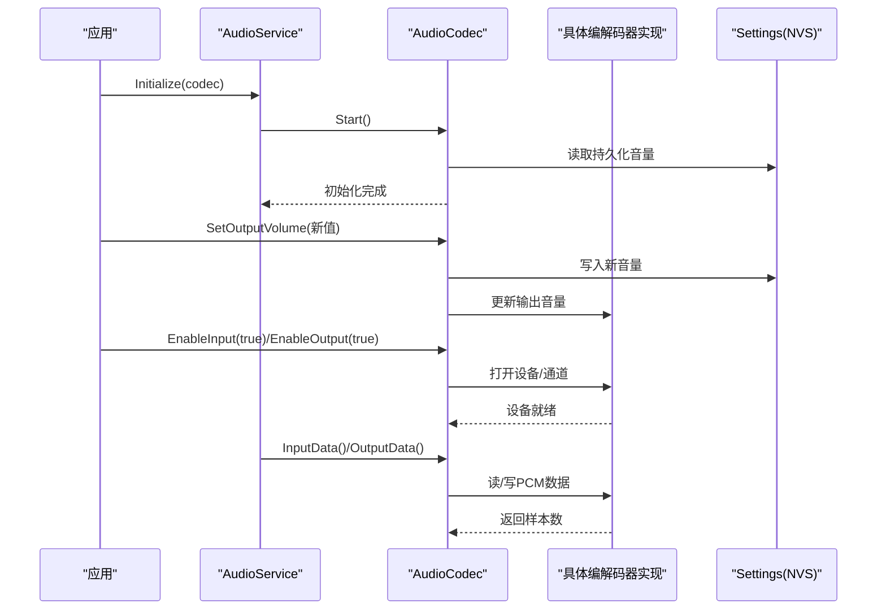
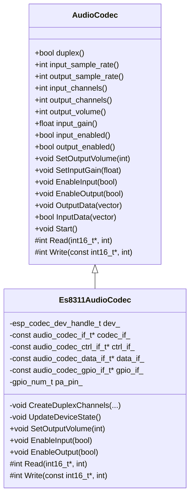
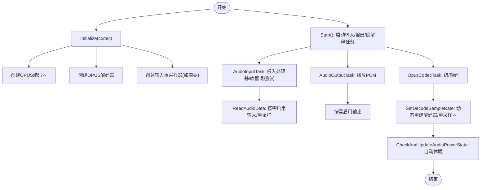
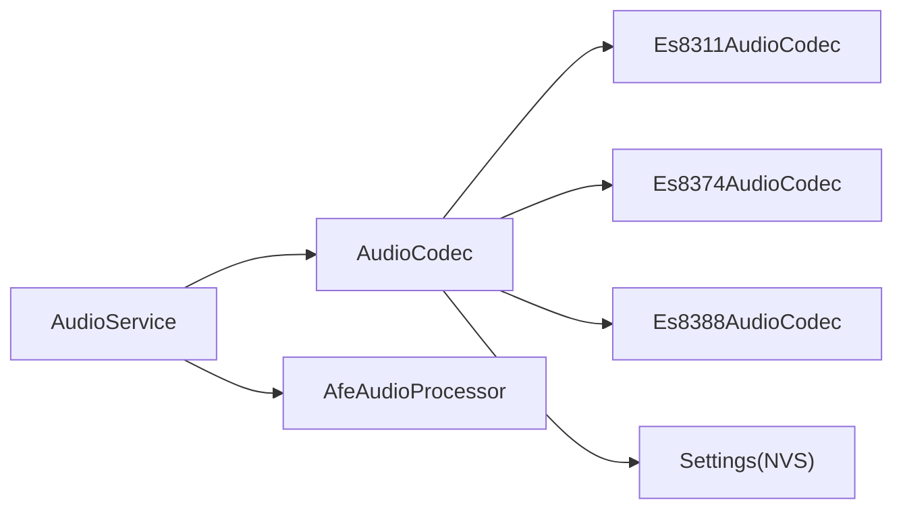

# 编解码器配置

<cite>
**本文引用的文件**
- [audio_codec.h](file://main/audio/audio_codec.h)
- [audio_codec.cc](file://main/audio/audio_codec.cc)
- [es8311_audio_codec.h](file://main/audio/codecs/es8311_audio_codec.h)
- [es8311_audio_codec.cc](file://main/audio/codecs/es8311_audio_codec.cc)
- [es8374_audio_codec.h](file://main/audio/codecs/es8374_audio_codec.h)
- [es8374_audio_codec.cc](file://main/audio/codecs/es8374_audio_codec.cc)
- [es8388_audio_codec.h](file://main/audio/codecs/es8388_audio_codec.h)
- [es8388_audio_codec.cc](file://main/audio/codecs/es8388_audio_codec.cc)
- [audio_service.h](file://main/audio/audio_service.h)
- [audio_service.cc](file://main/audio/audio_service.cc)
- [afe_audio_processor.h](file://main/audio/processors/afe_audio_processor.h)
- [afe_audio_processor.cc](file://main/audio/processors/afe_audio_processor.cc)
- [settings.h](file://main/settings.h)
- [settings.cc](file://main/settings.cc)
- [dummy_audio_codec.h](file://main/audio/codecs/dummy_audio_codec.h)
- [dummy_audio_codec.cc](file://main/audio/codecs/dummy_audio_codec.cc)
</cite>

## 目录
1. [简介](#简介)
2. [项目结构](#项目结构)
3. [核心组件](#核心组件)
4. [架构总览](#架构总览)
5. [详细组件分析](#详细组件分析)
6. [依赖关系分析](#依赖关系分析)
7. [性能考量](#性能考量)
8. [故障排查指南](#故障排查指南)
9. [结论](#结论)
10. [附录](#附录)

## 简介
本文件聚焦于ESP32-AI项目的“编解码器配置模块”，系统性阐述以下主题：
- 运行时配置与动态参数调整机制（采样率、声道、音量、增益）
- 编解码器状态管理、错误处理与异常恢复策略
- 最佳实践、性能优化与内存管理建议
- 完整配置示例与调试指南

目标是帮助开发者在不同硬件平台与应用场景中，快速、稳定地完成编解码器的配置与调优。

## 项目结构
编解码器相关代码主要位于main/audio目录，采用“抽象基类 + 多种具体实现”的分层设计：
- 抽象层：AudioCodec定义统一接口与公共状态字段
- 具体实现层：针对不同芯片（ES8311/ES8374/ES8388）的编解码器实现
- 服务层：AudioService协调编解码器与编码/解码、处理器、队列等子系统
- 处理器层：AFE语音处理（可选），提供VAD、降噪、AEC等功能
- 设置层：Settings封装NVS持久化读写

图表来源
- [audio_service.h:106-196](file://main/audio/audio_service.h#L106-L196)
- [audio_codec.h:17-59](file://main/audio/audio_codec.h#L17-L59)
- [es8311_audio_codec.h:13-40](file://main/audio/codecs/es8311_audio_codec.h#L13-L40)
- [es8374_audio_codec.h:13-39](file://main/audio/codecs/es8374_audio_codec.h#L13-L39)
- [es8388_audio_codec.h:12-38](file://main/audio/codecs/es8388_audio_codec.h#L12-L38)
- [dummy_audio_codec.h:6-14](file://main/audio/codecs/dummy_audio_codec.h#L6-L14)
- [afe_audio_processor.h:17-46](file://main/audio/processors/afe_audio_processor.h#L17-L46)
- [settings.h:7-26](file://main/settings.h#L7-L26)

章节来源
- [audio_codec.h:17-59](file://main/audio/audio_codec.h#L17-L59)
- [audio_service.h:106-196](file://main/audio/audio_service.h#L106-L196)

## 核心组件
- 抽象编解码器接口：定义采样率、声道、音量、增益、启用状态等属性与虚函数接口；负责I2S通道句柄与基础状态管理。
- 具体编解码器实现：基于esp_codec_dev框架，分别对接ES8311/ES8374/ES8388，完成I2S初始化、设备打开/关闭、音量/增益设置、PA引脚控制等。
- 音频服务：负责编解码器生命周期、队列调度、编码/解码任务、处理器集成、电源定时与自动休眠。
- 语音处理器：可选的AfeAudioProcessor，提供VAD、降噪、AEC等能力，按帧喂入/取数。
- 设置：通过NVS持久化音量等参数，启动时加载，变更时保存。

章节来源
- [audio_codec.h:17-59](file://main/audio/audio_codec.h#L17-L59)
- [audio_codec.cc:11-67](file://main/audio/audio_codec.cc#L11-L67)
- [es8311_audio_codec.cc:70-98](file://main/audio/codecs/es8311_audio_codec.cc#L70-L98)
- [es8374_audio_codec.cc:140-186](file://main/audio/codecs/es8374_audio_codec.cc#L140-L186)
- [es8388_audio_codec.cc:144-205](file://main/audio/codecs/es8388_audio_codec.cc#L144-L205)
- [audio_service.cc:63-124](file://main/audio/audio_service.cc#L63-L124)
- [afe_audio_processor.cc:13-75](file://main/audio/processors/afe_audio_processor.cc#L13-L75)
- [settings.cc:8-19](file://main/settings.cc#L8-L19)

## 架构总览
编解码器配置贯穿“初始化 → 启用/禁用 → 参数调整 → 数据通路”全流程。整体流程如下：

图表来源
- [audio_service.cc:63-124](file://main/audio/audio_service.cc#L63-L124)
- [audio_codec.cc:29-67](file://main/audio/audio_codec.cc#L29-L67)
- [es8311_audio_codec.cc:158-185](file://main/audio/codecs/es8311_audio_codec.cc#L158-L185)
- [es8374_audio_codec.cc:135-186](file://main/audio/codecs/es8374_audio_codec.cc#L135-L186)
- [es8388_audio_codec.cc:139-205](file://main/audio/codecs/es8388_audio_codec.cc#L139-L205)
- [settings.cc:49-68](file://main/settings.cc#L49-L68)

## 详细组件分析

### 抽象编解码器接口（AudioCodec）
- 职责：统一对外接口、维护编解码器状态（采样率、声道、音量、增益、启用状态）、封装I2S通道句柄。
- 关键点：
  - 提供Start()加载默认/持久化参数；SetOutputVolume/SetInputGain/EnableInput/EnableOutput用于动态调整。
  - 通过虚函数Read/Write交由具体实现完成I/O。
  - 通过Settings进行NVS读写，确保音量等参数持久化。

章节来源
- [audio_codec.h:17-59](file://main/audio/audio_codec.h#L17-L59)
- [audio_codec.cc:11-67](file://main/audio/audio_codec.cc#L11-L67)
- [settings.h:7-26](file://main/settings.h#L7-L26)
- [settings.cc:49-68](file://main/settings.cc#L49-L68)

### ES8311编解码器（Es8311AudioCodec）
- 特性：双工、单声道输入、固定输入增益、PA引脚支持、通过esp_codec_dev设置音量。
- 关键流程：
  - 初始化：创建I2S双工通道、配置I2S标准模式、打开设备、设置采样信息、设置增益与音量。
  - 动态调整：SetOutputVolume更新设备音量；EnableInput/EnableOutput根据状态打开/关闭设备；UpdateDeviceState在启用/禁用时切换设备句柄与PA电平。
  - I/O：Read/Write委托esp_codec_dev完成。

图表来源
- [audio_codec.h:17-59](file://main/audio/audio_codec.h#L17-L59)
- [es8311_audio_codec.h:13-40](file://main/audio/codecs/es8311_audio_codec.h#L13-L40)
- [es8311_audio_codec.cc:70-98](file://main/audio/codecs/es8311_audio_codec.cc#L70-L98)

章节来源
- [es8311_audio_codec.h:13-40](file://main/audio/codecs/es8311_audio_codec.h#L13-L40)
- [es8311_audio_codec.cc:70-199](file://main/audio/codecs/es8311_audio_codec.cc#L70-L199)

### ES8374编解码器（Es8374AudioCodec）
- 特性：双工、独立输入/输出设备句柄、数字麦克风模式、PA引脚控制。
- 关键流程：
  - 初始化：创建I2S通道、分别创建输入/输出设备、设置采样信息与增益/音量。
  - 动态调整：EnableInput/EnableOutput分别打开/关闭对应设备；SetOutputVolume更新输出设备音量。
  - I/O：Read/Write分别委托输入/输出设备。

章节来源
- [es8374_audio_codec.h:13-39](file://main/audio/codecs/es8374_audio_codec.h#L13-L39)
- [es8374_audio_codec.cc:77-201](file://main/audio/codecs/es8374_audio_codec.cc#L77-L201)

### ES8388编解码器（Es8388AudioCodec）
- 特性：双工、可选输入参考通道（回声消除）、模拟输出音量寄存器设置、PA引脚控制。
- 关键流程：
  - 初始化：创建I2S通道、创建输入/输出设备；根据是否启用输入参考通道决定输入声道数。
  - 动态调整：EnableInput根据是否启用参考通道设置通道掩码；EnableOutput设置模拟HP/SPK音量寄存器。
  - I/O：Read/Write委托设备。

章节来源
- [es8388_audio_codec.h:12-38](file://main/audio/codecs/es8388_audio_codec.h#L12-L38)
- [es8388_audio_codec.cc:85-221](file://main/audio/codecs/es8388_audio_codec.cc#L85-L221)

### Dummy编解码器（DummyAudioCodec）
- 用途：无硬件场景下的占位实现，便于开发与测试。
- 行为：返回空数据流，不执行实际I/O。

章节来源
- [dummy_audio_codec.h:6-14](file://main/audio/codecs/dummy_audio_codec.h#L6-L14)
- [dummy_audio_codec.cc:3-21](file://main/audio/codecs/dummy_audio_codec.cc#L3-L21)

### 音频服务（AudioService）
- 职责：编解码器生命周期管理、队列调度、编码/解码任务、处理器集成、电源定时与自动休眠。
- 关键点：
  - Initialize：启动编解码器、创建OPUS编解码器与重采样器、初始化处理器。
  - Start/Stop：创建音频输入/输出任务与OPUS编解码任务。
  - 读写路径：ReadAudioData按需启用输入、按采样率差异进行重采样；AudioOutputTask按需启用输出并推送PCM。
  - 动态参数：SetDecodeSampleRate按包内采样率动态重建解码器与输出重采样器。
  - 电源管理：CheckAndUpdateAudioPowerState根据超时自动关闭输入/输出。

图表来源
- [audio_service.cc:63-124](file://main/audio/audio_service.cc#L63-L124)
- [audio_service.cc:126-168](file://main/audio/audio_service.cc#L126-L168)
- [audio_service.cc:231-290](file://main/audio/audio_service.cc#L231-L290)
- [audio_service.cc:292-327](file://main/audio/audio_service.cc#L292-L327)
- [audio_service.cc:329-448](file://main/audio/audio_service.cc#L329-L448)
- [audio_service.cc:450-484](file://main/audio/audio_service.cc#L450-L484)
- [audio_service.cc:684-700](file://main/audio/audio_service.cc#L684-L700)

章节来源
- [audio_service.h:106-196](file://main/audio/audio_service.h#L106-L196)
- [audio_service.cc:63-124](file://main/audio/audio_service.cc#L63-L124)
- [audio_service.cc:126-168](file://main/audio/audio_service.cc#L126-L168)
- [audio_service.cc:185-229](file://main/audio/audio_service.cc#L185-L229)
- [audio_service.cc:292-327](file://main/audio/audio_service.cc#L292-L327)
- [audio_service.cc:329-448](file://main/audio/audio_service.cc#L329-L448)
- [audio_service.cc:450-484](file://main/audio/audio_service.cc#L450-L484)
- [audio_service.cc:684-700](file://main/audio/audio_service.cc#L684-L700)

### 语音处理器（AfeAudioProcessor）
- 职责：集成AFE语音引擎，提供VAD、降噪、AEC等能力；以帧为单位喂入/取数。
- 关键点：
  - Initialize：根据输入格式（M/R）与模型列表构建AFE配置，创建任务。
  - Feed/Fetch：按chunk大小喂入PCM，从AFE取出处理后的数据；回调通知VAD状态变化。
  - EnableDeviceAec：在支持设备AEC时切换VAD/AEC模式。

章节来源
- [afe_audio_processor.h:17-46](file://main/audio/processors/afe_audio_processor.h#L17-L46)
- [afe_audio_processor.cc:13-75](file://main/audio/processors/afe_audio_processor.cc#L13-L75)
- [afe_audio_processor.cc:91-107](file://main/audio/processors/afe_audio_processor.cc#L91-L107)
- [afe_audio_processor.cc:135-187](file://main/audio/processors/afe_audio_processor.cc#L135-L187)
- [afe_audio_processor.cc:189-201](file://main/audio/processors/afe_audio_processor.cc#L189-L201)

## 依赖关系分析
- 组件耦合：
  - AudioService强依赖AudioCodec接口，通过Start/EnableInput/EnableOutput/OutputData/InputData与具体实现交互。
  - 具体编解码器实现依赖esp_codec_dev与I2S驱动，负责底层设备打开/关闭与参数设置。
  - AfeAudioProcessor可选集成，与AudioService通过回调连接。
- 外部依赖：
  - NVS：Settings提供持久化存储，用于音量等参数。
  - FreeRTOS：事件组、任务、条件变量用于线程同步与队列调度。
  - ESP-Audio库：OPUS编解码、重采样器、语音模型管理。

图表来源
- [audio_service.h:106-196](file://main/audio/audio_service.h#L106-L196)
- [audio_codec.h:17-59](file://main/audio/audio_codec.h#L17-L59)
- [es8311_audio_codec.h:13-40](file://main/audio/codecs/es8311_audio_codec.h#L13-L40)
- [es8374_audio_codec.h:13-39](file://main/audio/codecs/es8374_audio_codec.h#L13-L39)
- [es8388_audio_codec.h:12-38](file://main/audio/codecs/es8388_audio_codec.h#L12-L38)
- [afe_audio_processor.h:17-46](file://main/audio/processors/afe_audio_processor.h#L17-L46)
- [settings.h:7-26](file://main/settings.h#L7-L26)

章节来源
- [audio_service.h:106-196](file://main/audio/audio_service.h#L106-L196)
- [audio_codec.h:17-59](file://main/audio/audio_codec.h#L17-L59)

## 性能考量
- 采样率与重采样：
  - 输入/输出采样率不一致时，AudioService会创建重采样器，避免硬解码器限制带来的兼容性问题。
  - 解码器采样率随包内参数动态重建，减少静态配置的刚性约束。
- 队列与帧长：
  - 编解码任务与播放队列均设置最大长度，防止内存暴涨；OPUS帧长固定为60ms，平衡延迟与带宽。
- 电源管理：
  - 通过定时器检测输入/输出空闲时间，自动关闭编解码器以降低功耗；保持RX时钟以避免某些板卡的接收停滞。
- 线程与锁：
  - 具体编解码器对关键路径加互斥锁，避免并发访问设备句柄导致的竞态；AudioService使用条件变量与事件组协调多任务。

章节来源
- [audio_service.cc:87-94](file://main/audio/audio_service.cc#L87-L94)
- [audio_service.cc:450-484](file://main/audio/audio_service.cc#L450-L484)
- [audio_service.cc:684-700](file://main/audio/audio_service.cc#L684-L700)
- [es8374_audio_codec.cc:140-186](file://main/audio/codecs/es8374_audio_codec.cc#L140-L186)
- [es8388_audio_codec.cc:144-205](file://main/audio/codecs/es8388_audio_codec.cc#L144-L205)

## 故障排查指南
- 启动后无声或无法录音
  - 检查编解码器是否已启用：AudioService在读写前会按需启用输入/输出；若未启用，先调用EnableInput/EnableOutput。
  - 确认I2S通道与引脚配置正确，采样率一致（多数实现要求输入/输出采样率相同）。
- 音量过小或过大
  - 通过SetOutputVolume调整音量，并确认Settings已写入持久化；部分芯片（如ES8388）还存在模拟HP/SPK音量寄存器，需额外设置。
- 增益异常
  - ES8311/ES8374/ES8388分别有各自的默认增益；若效果不佳，可通过SetInputGain调整。
- 设备句柄冲突或崩溃
  - 确保同一时刻仅一个任务访问设备句柄；具体实现内部已加锁，避免竞态。
- 解码失败或播放卡顿
  - 检查解码器采样率与帧长配置；AudioService会根据包内参数动态重建解码器与重采样器。
- 功耗偏高
  - 检查电源定时器是否被意外停止；确认空闲超时阈值合理，避免频繁启停。

章节来源
- [audio_codec.cc:29-67](file://main/audio/audio_codec.cc#L29-L67)
- [es8311_audio_codec.cc:158-185](file://main/audio/codecs/es8311_audio_codec.cc#L158-L185)
- [es8374_audio_codec.cc:135-186](file://main/audio/codecs/es8374_audio_codec.cc#L135-L186)
- [es8388_audio_codec.cc:139-205](file://main/audio/codecs/es8388_audio_codec.cc#L139-L205)
- [audio_service.cc:450-484](file://main/audio/audio_service.cc#L450-L484)
- [audio_service.cc:684-700](file://main/audio/audio_service.cc#L684-L700)

## 结论
本模块通过抽象接口与具体实现分离，结合音频服务的队列调度与电源管理，提供了灵活、稳定的编解码器配置方案。开发者可在不同硬件平台上快速适配采样率、声道、音量与增益等参数，并借助动态重建与重采样机制应对多样化的应用场景。

## 附录

### 配置示例（步骤说明）
- 初始化编解码器
  - 创建具体编解码器实例（如Es8311AudioCodec/Es8374AudioCodec/Es8388AudioCodec），传入I2C/I2S引脚与采样率。
  - 调用AudioService::Initialize(codec)，内部会调用codec->Start()加载持久化音量。
- 动态调整参数
  - SetOutputVolume：实时调整输出音量并写入NVS。
  - SetInputGain：调整输入增益（不同芯片默认值不同）。
  - EnableInput/EnableOutput：按需启用输入/输出，内部会打开设备并设置PA引脚。
- 运行时数据通路
  - 录音：AudioService::ReadAudioData按需启用输入，必要时进行重采样，然后进入处理器或直接进入编码队列。
  - 播放：AudioService::AudioOutputTask按需启用输出，将PCM推送到编解码器。
- 动态解码
  - 接收端根据包内采样率与帧长调用SetDecodeSampleRate，动态重建解码器与输出重采样器。

章节来源
- [audio_codec.cc:29-67](file://main/audio/audio_codec.cc#L29-L67)
- [es8311_audio_codec.cc:158-185](file://main/audio/codecs/es8311_audio_codec.cc#L158-L185)
- [es8374_audio_codec.cc:135-186](file://main/audio/codecs/es8374_audio_codec.cc#L135-L186)
- [es8388_audio_codec.cc:139-205](file://main/audio/codecs/es8388_audio_codec.cc#L139-L205)
- [audio_service.cc:185-229](file://main/audio/audio_service.cc#L185-L229)
- [audio_service.cc:292-327](file://main/audio/audio_service.cc#L292-L327)
- [audio_service.cc:450-484](file://main/audio/audio_service.cc#L450-L484)