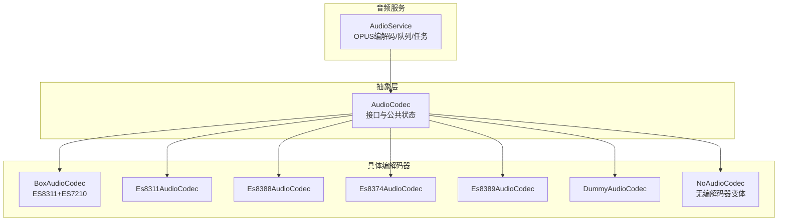
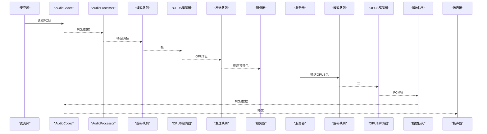
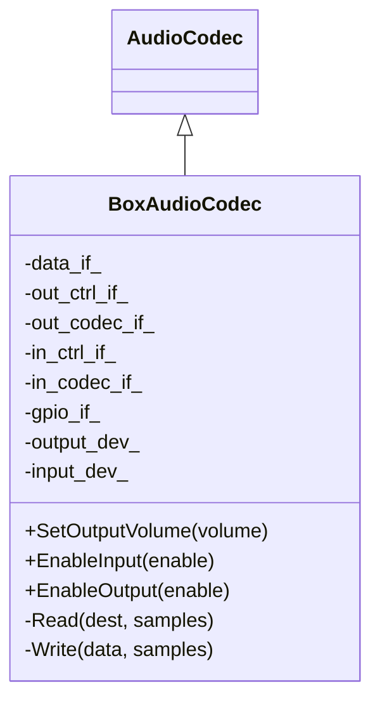
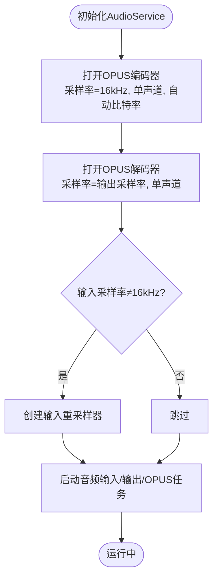
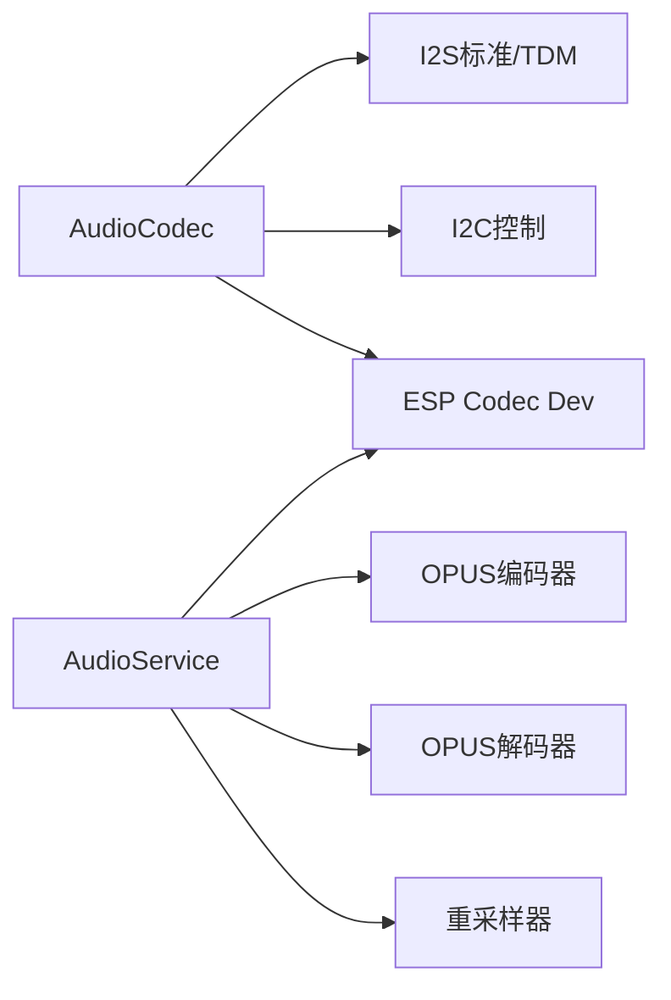

# 音频编解码器

<cite>
**本文引用的文件**
- [audio_codec.h](file://main/audio/audio_codec.h)
- [audio_service.h](file://main/audio/audio_service.h)
- [audio_service.cc](file://main/audio/audio_service.cc)
- [box_audio_codec.h](file://main/audio/codecs/box_audio_codec.h)
- [box_audio_codec.cc](file://main/audio/codecs/box_audio_codec.cc)
- [es8311_audio_codec.h](file://main/audio/codecs/es8311_audio_codec.h)
- [es8311_audio_codec.cc](file://main/audio/codecs/es8311_audio_codec.cc)
- [es8388_audio_codec.h](file://main/audio/codecs/es8388_audio_codec.h)
- [es8388_audio_codec.cc](file://main/audio/codecs/es8388_audio_codec.cc)
- [es8374_audio_codec.h](file://main/audio/codecs/es8374_audio_codec.h)
- [es8374_audio_codec.cc](file://main/audio/codecs/es8374_audio_codec.cc)
- [es8389_audio_codec.h](file://main/audio/codecs/es8389_audio_codec.h)
- [es8389_audio_codec.cc](file://main/audio/codecs/es8389_audio_codec.cc)
- [dummy_audio_codec.h](file://main/audio/codecs/dummy_audio_codec.h)
- [no_audio_codec.h](file://main/audio/codecs/no_audio_codec.h)
- [esp_opus_enc.h](file://managed_components/espressif__esp_audio_codec/include/encoder/impl/esp_opus_enc.h)
- [esp_opus_dec.h](file://managed_components/espressif__esp_audio_codec/include/decoder/impl/esp_opus_dec.h)
</cite>

## 目录
1. [简介](#简介)
2. [项目结构](#项目结构)
3. [核心组件](#核心组件)
4. [架构总览](#架构总览)
5. [详细组件分析](#详细组件分析)
6. [依赖关系分析](#依赖关系分析)
7. [性能与参数调优](#性能与参数调优)
8. [故障排查指南](#故障排查指南)
9. [结论](#结论)
10. [附录：编解码器选择与场景建议](#附录编解码器选择与场景建议)

## 简介
本文件面向ESP32-AI项目的音频编解码器模块，系统性阐述OPUS编解码器的配置与使用（含编码参数、比特率控制、帧长优化），对比ES83xx系列音频芯片的实现差异，并深入解析BoxAudioCodec、ES8311、ES8388等具体编解码器的硬件接口与软件配置。同时提供初始化流程、参数调整与故障诊断的实用指南，帮助开发者在不同硬件平台与应用场景中做出合理选择。

## 项目结构
音频子系统由“编解码器抽象层”“具体编解码器实现”“音频服务调度层”三部分组成：
- 抽象层：统一的AudioCodec接口定义，屏蔽I2S通道与设备驱动细节
- 具体编解码器：基于ESP Codec Dev与I2S的ES83xx系列及Box方案
- 音频服务：封装OPUS编解码、采样率转换、任务队列与事件管理

图示来源
- [audio_codec.h:17-59](file://main/audio/audio_codec.h#L17-L59)
- [box_audio_codec.h:11-38](file://main/audio/codecs/box_audio_codec.h#L11-L38)
- [es8311_audio_codec.h:13-40](file://main/audio/codecs/es8311_audio_codec.h#L13-L40)
- [es8388_audio_codec.h:12-38](file://main/audio/codecs/es8388_audio_codec.h#L12-L38)
- [es8374_audio_codec.h:13-39](file://main/audio/codecs/es8374_audio_codec.h#L13-L39)
- [es8389_audio_codec.h:12-38](file://main/audio/codecs/es8389_audio_codec.h#L12-L38)
- [dummy_audio_codec.h:6-14](file://main/audio/codecs/dummy_audio_codec.h#L6-L14)
- [no_audio_codec.h:10-41](file://main/audio/codecs/no_audio_codec.h#L10-L41)
- [audio_service.h:106-194](file://main/audio/audio_service.h#L106-L194)

章节来源
- [audio_codec.h:17-59](file://main/audio/audio_codec.h#L17-L59)
- [audio_service.h:28-50](file://main/audio/audio_service.h#L28-L50)

## 核心组件
- AudioCodec抽象类：定义输入输出使能、音量/增益设置、I2S通道句柄、采样率/声道/音量/增益等状态字段，以及纯虚函数Read/Write供子类实现
- 具体编解码器：围绕I2S标准/TDM模式与I2C控制接口，分别对接ES83xx系列或组合方案（如ES8311+ES7210）
- AudioService：负责OPUS编解码器初始化、采样率转换、输入/输出任务、发送/播放队列、唤醒词/VAD回调、功耗定时器等

章节来源
- [audio_codec.h:17-59](file://main/audio/audio_codec.h#L17-L59)
- [audio_service.h:106-194](file://main/audio/audio_service.h#L106-L194)

## 架构总览
音频数据流分为两条路径：
- 录音侧：麦克风PCM → 处理器/预处理 → 编码队列 → OPUS编码 → 发送队列 → 服务器
- 播放侧：服务器 → 解码队列 → OPUS解码 → 播放队列 → 扬声器

图示来源
- [audio_service.h:28-37](file://main/audio/audio_service.h#L28-L37)
- [audio_service.cc:63-85](file://main/audio/audio_service.cc#L63-L85)
- [esp_opus_enc.h:69-97](file://managed_components/espressif__esp_audio_codec/include/encoder/impl/esp_opus_enc.h#L69-L97)
- [esp_opus_dec.h:53-64](file://managed_components/espressif__esp_audio_codec/include/decoder/impl/esp_opus_dec.h#L53-L64)

## 详细组件分析

### AudioCodec抽象层
- 职责：统一I2S通道管理、输入输出使能、音量/增益控制、采样率/声道配置
- 关键点：
  - 双工标志duplex_与输入参考输入input_reference_用于回声消除场景
  - 通过tx_handle_/rx_handle_管理I2S通道
  - 提供虚函数Read/Write供子类实现底层I2S读写

章节来源
- [audio_codec.h:17-59](file://main/audio/audio_codec.h#L17-L59)

### BoxAudioCodec（ES8311+ES7210）
- 硬件接口：I2S标准模式（主时钟MCLK）用于DAC输出；I2S TDM模式用于ADC输入（多路麦克风）
- 控制接口：I2C控制ES8311（DAC）与ES7210（ADC）
- 特性：
  - 支持输入参考信号（回声消除）
  - 输出设备通过esp_codec_dev设置音量
  - 输入设备支持多通道选择与增益设置
- 初始化要点：
  - 创建I2S双工通道（标准+TDMS）
  - 初始化ES8311输出设备与ES7210输入设备
  - 通过GPIO控制PA（功放）

图示来源
- [box_audio_codec.h:11-38](file://main/audio/codecs/box_audio_codec.h#L11-L38)
- [box_audio_codec.cc:9-78](file://main/audio/codecs/box_audio_codec.cc#L9-L78)

章节来源
- [box_audio_codec.h:11-38](file://main/audio/codecs/box_audio_codec.h#L11-L38)
- [box_audio_codec.cc:94-182](file://main/audio/codecs/box_audio_codec.cc#L94-L182)

### Es8311AudioCodec（ES8311）
- 硬件接口：I2S标准模式（主时钟MCLK）
- 控制接口：I2C控制ES8311（双工）
- 特性：
  - 可选是否使用MCLK
  - PA引脚可反相控制
  - 运行时按输入/输出状态动态打开/关闭设备
- 初始化要点：
  - 创建I2S双工通道
  - 初始化ES8311编解码器设备
  - 通过GPIO控制PA

章节来源
- [es8311_audio_codec.h:13-40](file://main/audio/codecs/es8311_audio_codec.h#L13-L40)
- [es8311_audio_codec.cc:70-156](file://main/audio/codecs/es8311_audio_codec.cc#L70-L156)

### Es8388AudioCodec（ES8388）
- 硬件接口：I2S标准模式（主时钟MCLK）
- 控制接口：I2C控制ES8388（双工）
- 特性：
  - 支持输入参考信号（回声消除）
  - 输出设备默认不因关闭而失能
  - 启用时设置模拟HP/SPK音量寄存器为0dB
  - PA引脚直接拉高
- 初始化要点：
  - 创建I2S双工通道
  - 分别初始化输入/输出设备
  - 设置增益与模拟音量寄存器

章节来源
- [es8388_audio_codec.h:12-38](file://main/audio/codecs/es8388_audio_codec.h#L12-L38)
- [es8388_audio_codec.cc:85-137](file://main/audio/codecs/es8388_audio_codec.cc#L85-L137)

### Es8374AudioCodec（ES8374）
- 硬件接口：I2S标准模式（主时钟MCLK）
- 控制接口：I2C控制ES8374（双工）
- 特性：
  - 可选是否使用MCLK
  - 支持PA引脚控制
- 初始化要点：
  - 创建I2S双工通道
  - 初始化输入/输出设备

章节来源
- [es8374_audio_codec.h:13-39](file://main/audio/codecs/es8374_audio_codec.h#L13-L39)
- [es8374_audio_codec.cc:1-199](file://main/audio/codecs/es8374_audio_codec.cc#L1-L199)

### Es8389AudioCodec（ES8389）
- 硬件接口：I2S标准模式（主时钟MCLK）
- 控制接口：I2C控制ES8389（双工）
- 特性：
  - 可选是否使用MCLK
  - 支持PA引脚控制
- 初始化要点：
  - 创建I2S双工通道
  - 初始化输入/输出设备

章节来源
- [es8389_audio_codec.h:12-38](file://main/audio/codecs/es8389_audio_codec.h#L12-L38)
- [es8389_audio_codec.cc:1-200](file://main/audio/codecs/es8389_audio_codec.cc#L1-L200)

### DummyAudioCodec与NoAudioCodec
- DummyAudioCodec：空实现，便于开发测试
- NoAudioCodec：直接使用I2S STD/TDM/PDM，无外部编解码器，适合自研板卡或直连DAC

章节来源
- [dummy_audio_codec.h:6-14](file://main/audio/codecs/dummy_audio_codec.h#L6-L14)
- [no_audio_codec.h:10-41](file://main/audio/codecs/no_audio_codec.h#L10-L41)

### OPUS编解码器配置与使用
- 编码器配置（AudioService初始化）：
  - 采样率：固定16kHz
  - 声道：单声道
  - 位深：16bit
  - 比特率：自动
  - 帧时长：通过宏OPUS_FRAME_DURATION_MS（默认60ms）
  - 应用模式：音频模式
  - VBR：启用；DTX：启用；FEC：禁用
- 解码器配置：
  - 采样率：与输出设备一致
  - 声道：单声道
  - 帧时长：与编码端对应
  - 自界定包：需与编码端一致

图示来源
- [audio_service.cc:63-94](file://main/audio/audio_service.cc#L63-L94)
- [esp_opus_enc.h:69-97](file://managed_components/espressif__esp_audio_codec/include/encoder/impl/esp_opus_enc.h#L69-L97)
- [esp_opus_dec.h:53-64](file://managed_components/espressif__esp_audio_codec/include/decoder/impl/esp_opus_dec.h#L53-L64)

章节来源
- [audio_service.h:65-76](file://main/audio/audio_service.h#L65-L76)
- [audio_service.cc:63-94](file://main/audio/audio_service.cc#L63-L94)

## 依赖关系分析
- 编解码器对I2S与I2C的依赖：所有ES83xx方案均通过I2S标准/TDM模式与I2C控制接口工作
- 对ESP Codec Dev的依赖：通过esp_codec_dev封装I2S数据接口与I2C控制接口，简化设备初始化与参数设置
- 对OPUS库的依赖：通过esp_opus_enc/esp_opus_dec进行编码/解码
- 对采样率转换的依赖：当输入采样率非16kHz时，使用esp_ae_rate_cvt进行重采样

图示来源
- [audio_codec.h:4-12](file://main/audio/audio_codec.h#L4-L12)
- [audio_service.cc:63-94](file://main/audio/audio_service.cc#L63-L94)
- [esp_opus_enc.h:1-30](file://managed_components/espressif__esp_audio_codec/include/encoder/impl/esp_opus_enc.h#L1-L30)
- [esp_opus_dec.h:1-30](file://managed_components/espressif__esp_audio_codec/include/decoder/impl/esp_opus_dec.h#L1-L30)

章节来源
- [audio_codec.h:4-12](file://main/audio/audio_codec.h#L4-L12)
- [audio_service.cc:63-94](file://main/audio/audio_service.cc#L63-L94)

## 性能与参数调优

### OPUS参数与帧长优化
- 帧时长（OPUS_FRAME_DURATION_MS）：
  - 默认60ms，适合一般语音通信
  - 更短帧长（如10/20ms）可降低延迟但增加开销
  - 更长帧长（如120ms）可提升压缩比但增加抖动
- 自适应比特率（bitrate=自动）：
  - 在相同采样率/帧长下自动选择合适码率
  - 可结合VBR与DTX进一步优化带宽占用
- 应用模式：
  - 音频模式更注重保真
  - VOIP模式更注重清晰度与低延迟
- 复杂度（complexity）：
  - 0最低，10最高；编码质量与CPU占用权衡

章节来源
- [audio_service.h:65-76](file://main/audio/audio_service.h#L65-L76)
- [esp_opus_enc.h:69-97](file://managed_components/espressif__esp_audio_codec/include/encoder/impl/esp_opus_enc.h#L69-L97)

### I2S与采样率配置
- MCLK倍数：普遍使用256倍采样率
- 数据位宽：16bit
- 左对齐/字长：根据硬件版本条件编译适配
- 输入重采样：当输入采样率≠16kHz时，使用重采样器保证编码器输入稳定

章节来源
- [box_audio_codec.cc:108-178](file://main/audio/codecs/box_audio_codec.cc#L108-L178)
- [es8311_audio_codec.cc:114-155](file://main/audio/codecs/es8311_audio_codec.cc#L114-L155)
- [es8388_audio_codec.cc:99-135](file://main/audio/codecs/es8388_audio_codec.cc#L99-L135)
- [audio_service.cc:87-94](file://main/audio/audio_service.cc#L87-L94)

### 功耗与时序
- 音频功耗定时器：周期性检查最近输入/输出时间，超时后进入低功耗状态
- 队列容量：解码/发送队列按帧时长计算最大包数，避免内存压力

章节来源
- [audio_service.h:47-48](file://main/audio/audio_service.h#L47-L48)
- [audio_service.h:42-43](file://main/audio/audio_service.h#L42-L43)
- [audio_service.cc:113-123](file://main/audio/audio_service.cc#L113-L123)

## 故障排查指南

### 编解码器初始化失败
- 现象：日志显示初始化失败或句柄为空
- 排查：
  - 确认I2C地址与引脚配置正确
  - 确认I2S通道创建成功且已启用
  - 检查PA引脚电平与外部功放连接

章节来源
- [box_audio_codec.cc:53-78](file://main/audio/codecs/box_audio_codec.cc#L53-L78)
- [es8311_audio_codec.cc:54-58](file://main/audio/codecs/es8311_audio_codec.cc#L54-L58)
- [es8388_audio_codec.cc:53-70](file://main/audio/codecs/es8388_audio_codec.cc#L53-L70)

### 无声或音量异常
- 现象：无声音或音量过低
- 排查：
  - 检查输出设备音量设置与模拟寄存器（ES8388在启用时会设置0dB）
  - 检查PA引脚电平（ES8311支持反相）
  - 检查输入增益与参考输入通道掩码

章节来源
- [box_audio_codec.cc:184-187](file://main/audio/codecs/box_audio_codec.cc#L184-L187)
- [es8311_audio_codec.cc:158-161](file://main/audio/codecs/es8311_audio_codec.cc#L158-L161)
- [es8388_audio_codec.cc:189-199](file://main/audio/codecs/es8388_audio_codec.cc#L189-L199)

### 延迟大或卡顿
- 现象：播放/录音有明显延迟或断续
- 排查：
  - 调整OPUS帧时长（更短帧长降低延迟）
  - 检查队列容量与任务优先级
  - 确认输入采样率与重采样器配置

章节来源
- [audio_service.h:39-43](file://main/audio/audio_service.h#L39-L43)
- [audio_service.cc:134-167](file://main/audio/audio_service.cc#L134-L167)
- [audio_service.cc:87-94](file://main/audio/audio_service.cc#L87-L94)

### 无法识别唤醒词或VAD异常
- 现象：唤醒词检测失败或VAD频繁切换
- 排查：
  - 确认音频处理器已启用并正确回调
  - 检查输入增益与参考输入配置
  - 核对采样率与重采样器一致性

章节来源
- [audio_service.cc:96-111](file://main/audio/audio_service.cc#L96-L111)

## 结论
本项目以AudioCodec为核心抽象，结合ESP Codec Dev与I2S/I2C接口，实现了对ES83xx系列编解码器的统一接入；通过AudioService封装OPUS编解码、重采样与任务队列，形成稳定的音频通路。针对不同硬件平台与应用场景，可灵活选择ES8311/ES8388/ES8374/ES8389或BoxAudioCodec方案，并通过OPUS参数与I2S配置实现性能与资源的平衡。

## 附录：编解码器选择与场景建议

- ES8311（双工，支持MCLK可选）
  - 适用：通用语音通话/广播场景
  - 优势：PA可反相，运行时动态开关设备
  - 注意：确保MCLK与I2S配置匹配

- ES8388（双工，主模式，PA直控）
  - 适用：需要参考输入的回声消除场景
  - 优势：启用时自动设置模拟音量寄存器
  - 注意：PA引脚直接拉高，注意外部功放匹配

- ES8374/ES8389（双工，支持MCLK可选）
  - 适用：低成本或定制化方案
  - 优势：接口简单，易于集成
  - 注意：根据硬件确认MCLK与寄存器配置

- BoxAudioCodec（ES8311+ES7210）
  - 适用：多麦克风阵列与回声消除需求
  - 优势：ADC多通道选择，参考输入增强AEC效果
  - 注意：I2S TDM配置与MCLK分频

章节来源
- [es8311_audio_codec.h:32-34](file://main/audio/codecs/es8311_audio_codec.h#L32-L34)
- [es8388_audio_codec.h:30-32](file://main/audio/codecs/es8388_audio_codec.h#L30-L32)
- [es8374_audio_codec.h:31-33](file://main/audio/codecs/es8374_audio_codec.h#L31-L33)
- [es8389_audio_codec.h:30-32](file://main/audio/codecs/es8389_audio_codec.h#L30-L32)
- [box_audio_codec.h:30-32](file://main/audio/codecs/box_audio_codec.h#L30-L32)