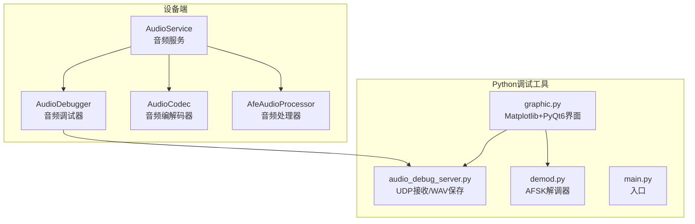
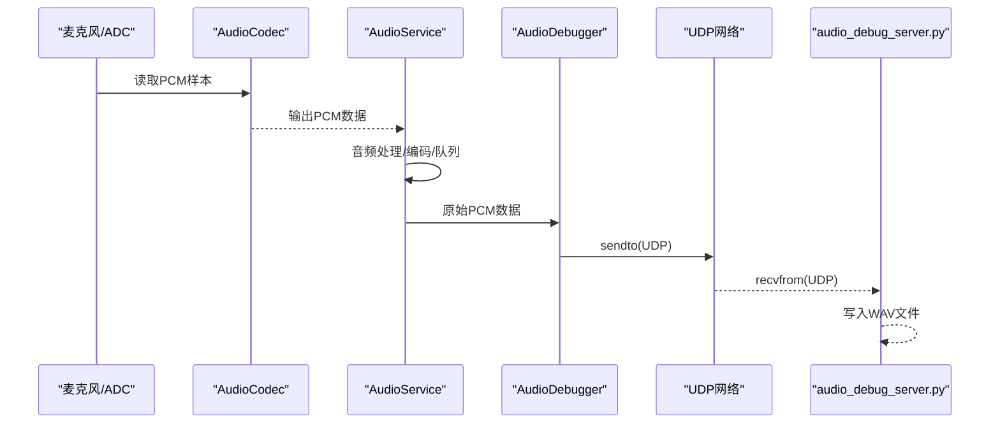
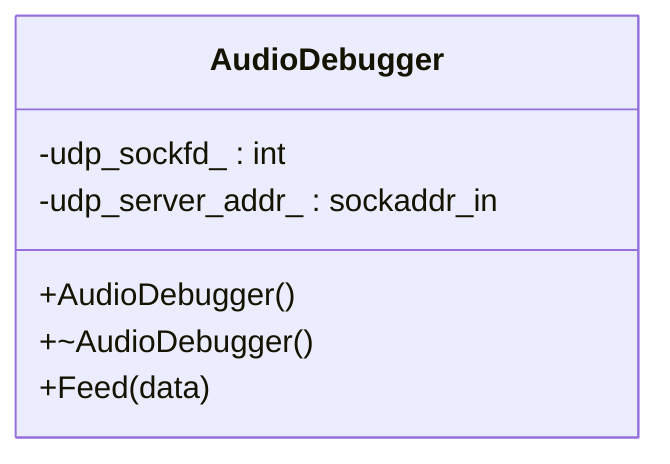
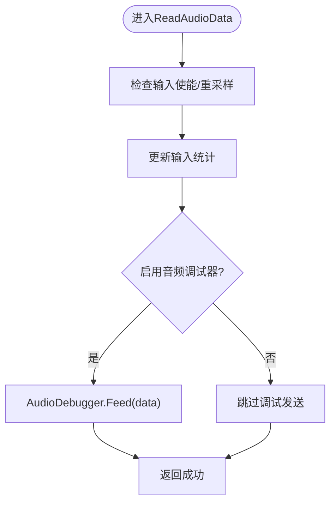
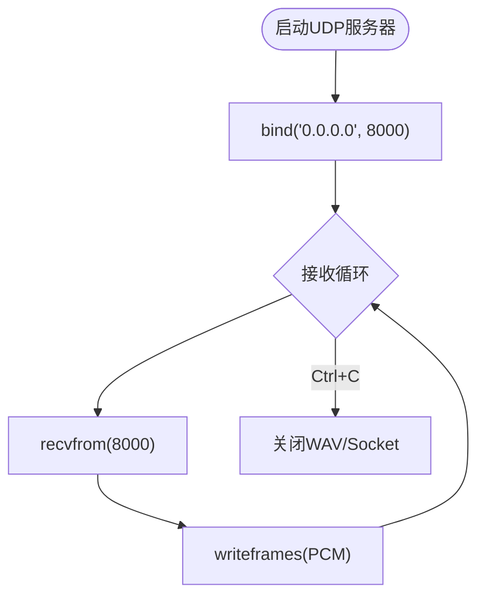
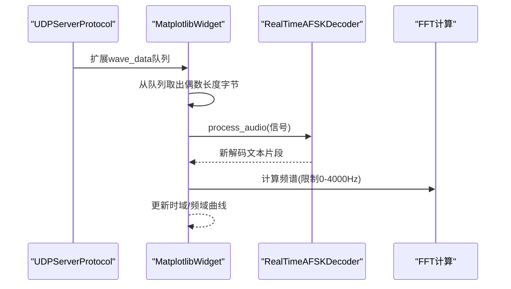
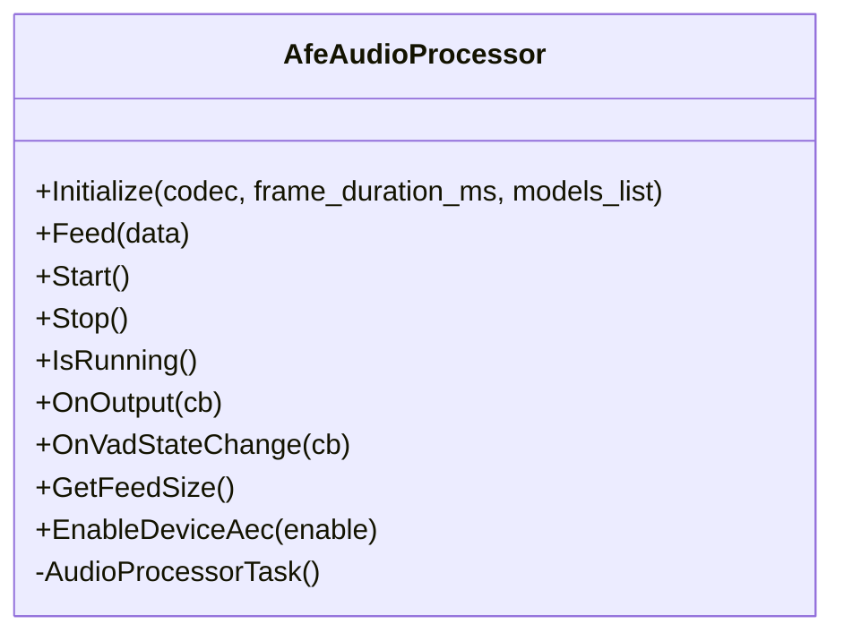
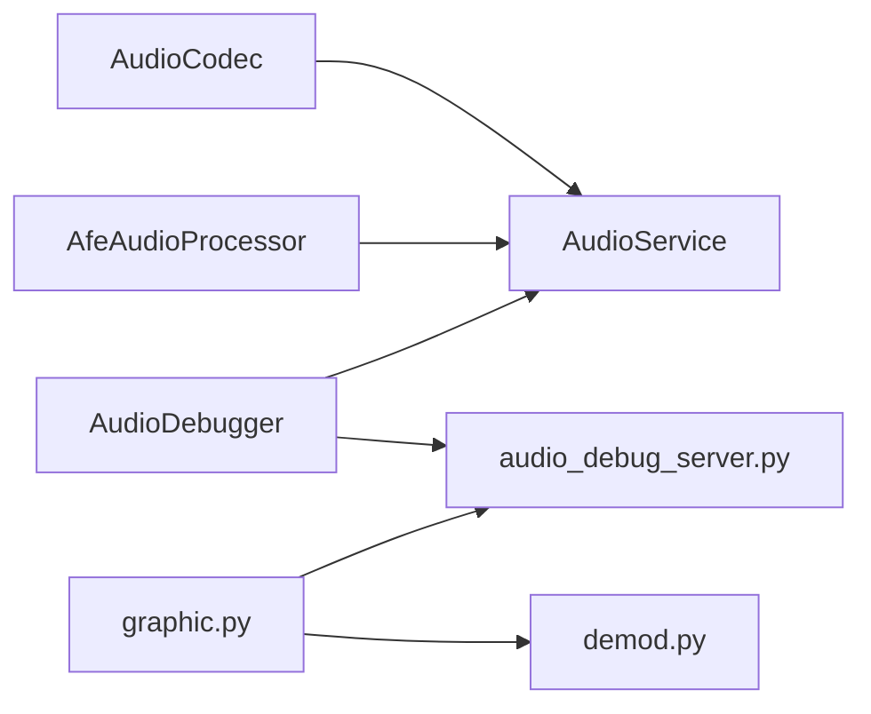

# 音频调试工具

<cite>
**本文引用的文件**
- [audio_debugger.h](file://main/audio/processors/audio_debugger.h)
- [audio_debugger.cc](file://main/audio/processors/audio_debugger.cc)
- [audio_service.h](file://main/audio/audio_service.h)
- [audio_service.cc](file://main/audio/audio_service.cc)
- [audio_codec.h](file://main/audio/audio_codec.h)
- [audio_codec.cc](file://main/audio/audio_codec.cc)
- [afe_audio_processor.h](file://main/audio/processors/afe_audio_processor.h)
- [afe_audio_processor.cc](file://main/audio/processors/afe_audio_processor.cc)
- [audio_debug_server.py](file://scripts/audio_debug_server.py)
- [main.py](file://scripts/acoustic_check/main.py)
- [demod.py](file://scripts/acoustic_check/demod.py)
- [graphic.py](file://scripts/acoustic_check/graphic.py)
- [websocket.md](file://docs/websocket.md)
</cite>

## 目录
1. [简介](#简介)
2. [项目结构](#项目结构)
3. [核心组件](#核心组件)
4. [架构总览](#架构总览)
5. [详细组件分析](#详细组件分析)
6. [依赖关系分析](#依赖关系分析)
7. [性能考量](#性能考量)
8. [故障排查指南](#故障排查指南)
9. [结论](#结论)
10. [附录](#附录)

## 简介
本指南面向ESP32-AI项目的音频调试场景，聚焦“音频调试服务器”的搭建与使用、Python调试脚本的运行与配置、音频调试器的功能特性（实时监控、波形显示、频谱分析、性能统计）、音频问题诊断流程（噪声检测、失真分析、延迟测量、质量评估）、音频日志与关键指标解读、常见问题快速排查与性能优化建议，以及最佳实践与工具链集成方案。

## 项目结构
围绕音频调试的关键目录与文件如下：
- 设备端音频服务与调试器
  - 音频服务：负责采集、编码、解码、播放、队列管理与统计
  - 音频调试器：按配置将PCM数据通过UDP发送至调试服务器
  - 音频编解码器：抽象I2S读写与增益/音量控制
  - AFE音频处理器：语音增强、VAD、模型加载与回调
- Python侧调试工具
  - UDP音频接收与WAV保存
  - 实时波形与频谱绘制
  - AFSK解调与文本解码

**图表来源**
- [audio_service.h](file://main/audio/audio_service.h)
- [audio_service.cc](file://main/audio/audio_service.cc)
- [audio_debugger.h](file://main/audio/processors/audio_debugger.h)
- [audio_debugger.cc](file://main/audio/processors/audio_debugger.cc)
- [audio_codec.h](file://main/audio/audio_codec.h)
- [afe_audio_processor.h](file://main/audio/processors/afe_audio_processor.h)
- [audio_debug_server.py](file://scripts/audio_debug_server.py)
- [graphic.py](file://scripts/acoustic_check/graphic.py)
- [demod.py](file://scripts/acoustic_check/demod.py)
- [main.py](file://scripts/acoustic_check/main.py)

**章节来源**
- [audio_service.h](file://main/audio/audio_service.h)
- [audio_service.cc](file://main/audio/audio_service.cc)
- [audio_debugger.h](file://main/audio/processors/audio_debugger.h)
- [audio_debugger.cc](file://main/audio/processors/audio_debugger.cc)
- [audio_codec.h](file://main/audio/audio_codec.h)
- [afe_audio_processor.h](file://main/audio/processors/afe_audio_processor.h)
- [audio_debug_server.py](file://scripts/audio_debug_server.py)
- [graphic.py](file://scripts/acoustic_check/graphic.py)
- [demod.py](file://scripts/acoustic_check/demod.py)
- [main.py](file://scripts/acoustic_check/main.py)

## 核心组件
- 音频服务（AudioService）
  - 负责音频输入/输出任务、Opus编解码任务、队列管理、统计计数、唤醒词/语音处理开关、设备功耗定时器
  - 在读取音频数据路径中，条件启用音频调试器，将原始PCM数据经UDP发送
- 音频调试器（AudioDebugger）
  - 条件编译启用，从SDK配置读取UDP服务器地址，创建UDP套接字并发送PCM数据
- 音频编解码器（AudioCodec）
  - 抽象I2S读写、增益/音量设置、输入/输出使能
- 音频处理器（AfeAudioProcessor）
  - 加载模型、配置AEC/VAD、处理音频流、回调输出与VAD状态变化
- Python调试工具
  - UDP服务器：接收PCM并保存为WAV
  - 图形界面：实时波形与频谱绘制、AFSK解调、文本解码展示
  - AFSK解调器：基于Goertzel算法的双频解调

**章节来源**
- [audio_service.h](file://main/audio/audio_service.h)
- [audio_service.cc](file://main/audio/audio_service.cc)
- [audio_debugger.h](file://main/audio/processors/audio_debugger.h)
- [audio_debugger.cc](file://main/audio/processors/audio_debugger.cc)
- [audio_codec.h](file://main/audio/audio_codec.h)
- [afe_audio_processor.h](file://main/audio/processors/afe_audio_processor.h)
- [afe_audio_processor.cc](file://main/audio/processors/afe_audio_processor.cc)
- [audio_debug_server.py](file://scripts/audio_debug_server.py)
- [graphic.py](file://scripts/acoustic_check/graphic.py)
- [demod.py](file://scripts/acoustic_check/demod.py)

## 架构总览
设备端与Python调试工具之间的数据通路如下：

**图表来源**
- [audio_service.cc](file://main/audio/audio_service.cc)
- [audio_debugger.cc](file://main/audio/processors/audio_debugger.cc)
- [audio_debug_server.py](file://scripts/audio_debug_server.py)

**章节来源**
- [audio_service.cc](file://main/audio/audio_service.cc)
- [audio_debugger.cc](file://main/audio/processors/audio_debugger.cc)
- [audio_debug_server.py](file://scripts/audio_debug_server.py)

## 详细组件分析

### 音频调试器（AudioDebugger）
- 功能要点
  - 条件编译启用，读取SDK配置中的UDP服务器地址（IP:PORT）
  - 创建UDP套接字，发送设备端采集的PCM数据
  - 日志记录发送状态与错误
- 关键行为
  - 初始化：解析地址、填充sockaddr_in、记录日志
  - 发送：sendto发送int16_t数组
  - 析构：关闭套接字

**图表来源**
- [audio_debugger.h](file://main/audio/processors/audio_debugger.h)
- [audio_debugger.cc](file://main/audio/processors/audio_debugger.cc)

**章节来源**
- [audio_debugger.h](file://main/audio/processors/audio_debugger.h)
- [audio_debugger.cc](file://main/audio/processors/audio_debugger.cc)

### 音频服务（AudioService）
- 功能要点
  - 初始化编解码器、Opus编解码器、重采样器
  - 启动音频输入/输出任务、Opus编解码任务
  - 在读取音频数据路径中，条件启用AudioDebugger并发送原始PCM
  - 维护多队列（编码/解码/回放/测试）与统计计数
- 关键行为
  - ReadAudioData：读取PCM、重采样、更新统计、可选发送调试数据
  - AudioInputTask/AudioOutputTask/OpusCodecTask：三类任务驱动数据流转
  - SetDecodeSampleRate：动态重建解码器与输出重采样器

**图表来源**
- [audio_service.cc](file://main/audio/audio_service.cc)
- [audio_debugger.cc](file://main/audio/processors/audio_debugger.cc)

**章节来源**
- [audio_service.h](file://main/audio/audio_service.h)
- [audio_service.cc](file://main/audio/audio_service.cc)

### Python音频调试服务器（audio_debug_server.py）
- 功能要点
  - 创建UDP套接字并绑定本地端口
  - 接收PCM数据，按采样率与声道数写入WAV文件
  - 支持命令行参数指定采样率与声道数
- 关键行为
  - 绑定地址与端口
  - 循环recvfrom并writeframes
  - Ctrl+C优雅退出并提示保存完成

**图表来源**
- [audio_debug_server.py](file://scripts/audio_debug_server.py)

**章节来源**
- [audio_debug_server.py](file://scripts/audio_debug_server.py)

### 实时图形与AFSK解调（graphic.py + demod.py）
- 功能要点
  - PyQt6 + Matplotlib绘制时域波形与频域谱图
  - 异步UDP接收PCM数据，转换为浮点信号进行实时解码
  - AFSK解调器：双频Goertzel算法，基于起始帧触发的状态机
- 关键行为
  - UDPServerProtocol：接收UDP数据并入队
  - MatplotlibWidget：定时器更新图表，计算FFT并限制显示范围
  - RealTimeAFSKDecoder：逐样本处理，累积比特，识别起止帧并解码ASCII文本

**图表来源**
- [graphic.py](file://scripts/acoustic_check/graphic.py)
- [demod.py](file://scripts/acoustic_check/demod.py)

**章节来源**
- [graphic.py](file://scripts/acoustic_check/graphic.py)
- [demod.py](file://scripts/acoustic_check/demod.py)

### AFE音频处理器（AfeAudioProcessor）
- 功能要点
  - 加载语音增强/模型，配置AEC/VAD模式
  - 输入缓冲与分块喂入AFE接口，fetch输出并回调
  - VAD状态变化回调，便于外部感知说话/静默
- 关键行为
  - Feed：将PCM分块喂入AFE
  - AudioProcessorTask：循环fetch并处理VAD状态

**图表来源**
- [afe_audio_processor.h](file://main/audio/processors/afe_audio_processor.h)
- [afe_audio_processor.cc](file://main/audio/processors/afe_audio_processor.cc)

**章节来源**
- [afe_audio_processor.h](file://main/audio/processors/afe_audio_processor.h)
- [afe_audio_processor.cc](file://main/audio/processors/afe_audio_processor.cc)

## 依赖关系分析
- 设备端
  - AudioService依赖AudioCodec、AfeAudioProcessor、AudioDebugger
  - AudioDebugger依赖网络栈（UDP）
- Python端
  - graphic.py依赖demod.py与UDP服务器
  - audio_debug_server.py独立运行，也可与graphic.py配合

**图表来源**
- [audio_service.h](file://main/audio/audio_service.h)
- [audio_debugger.h](file://main/audio/processors/audio_debugger.h)
- [audio_debug_server.py](file://scripts/audio_debug_server.py)
- [graphic.py](file://scripts/acoustic_check/graphic.py)
- [demod.py](file://scripts/acoustic_check/demod.py)

**章节来源**
- [audio_service.h](file://main/audio/audio_service.h)
- [audio_debugger.h](file://main/audio/processors/audio_debugger.h)
- [audio_debug_server.py](file://scripts/audio_debug_server.py)
- [graphic.py](file://scripts/acoustic_check/graphic.py)
- [demod.py](file://scripts/acoustic_check/demod.py)

## 性能考量
- 设备端
  - 音频输入/输出/编解码采用FreeRTOS任务分离，降低耦合
  - 队列容量与最大帧时长限制，防止内存膨胀
  - 动态重采样器按需开启，避免不必要的CPU消耗
  - 调试数据发送在条件编译下进行，减少非必要网络开销
- Python端
  - FFT计算限制显示频率范围，避免过度计算
  - 定时器更新频率可控，平衡流畅度与CPU占用
  - WAV写入批量写入，减少IO次数

[本节为通用性能讨论，不直接分析具体文件]

## 故障排查指南

### 快速排查清单
- 网络与地址
  - 确认设备端UDP服务器地址配置正确（IP:PORT）
  - 确认Python调试服务器监听地址与端口与设备一致
- 采样率与声道
  - Python侧采样率与声道参数与设备一致，避免WAV写入异常
- 调试开关
  - 确认设备端启用音频调试功能（条件编译）
- 数据接收
  - Python端是否持续接收并写入WAV
  - 图形界面是否显示波形与频谱

### 常见问题与定位
- 无法接收UDP数据
  - 检查防火墙/安全策略
  - 确认设备与主机在同一网段
- 波形/频谱空白
  - 检查Python端是否正确解析PCM字节
  - 确认采样率/声道参数与实际一致
- AFSK解码失败
  - 起止帧不匹配或阈值不当
  - 采样率与Goertzel参数不一致

**章节来源**
- [audio_debugger.cc](file://main/audio/processors/audio_debugger.cc)
- [audio_debug_server.py](file://scripts/audio_debug_server.py)
- [graphic.py](file://scripts/acoustic_check/graphic.py)
- [demod.py](file://scripts/acoustic_check/demod.py)

## 结论
通过设备端的AudioService与AudioDebugger，结合Python侧的UDP接收与图形化分析工具，可以构建完整的音频调试闭环：从原始PCM采集、网络传输、到可视化与AFSK解调，覆盖实时监控、波形与频谱分析、性能统计与问题诊断。按本指南配置与操作，可高效定位噪声、失真、延迟与质量等问题，并形成可复现的调试流程与报告。

## 附录

### 操作步骤（搭建与使用）

- 准备工作
  - 确保设备端启用音频调试功能（条件编译）
  - 在设备端配置UDP服务器地址（IP:PORT）
  - 在主机安装Python依赖并准备音频调试环境

- 启动Python调试服务器
  - 运行UDP接收并保存WAV
  - 参数：采样率与声道数与设备一致

- 启动图形界面与AFSK解调
  - 启动图形界面，设置监听地址与端口
  - 开始监听，观察波形与频谱
  - 查看AFSK解码结果与统计

- 采集与分析
  - 采集一段时间音频，保存WAV
  - 使用图形界面进行实时观测
  - 分析频谱峰值、噪声带宽、谐波失真等

**章节来源**
- [audio_debug_server.py](file://scripts/audio_debug_server.py)
- [graphic.py](file://scripts/acoustic_check/graphic.py)
- [demod.py](file://scripts/acoustic_check/demod.py)

### 日志与关键指标解读
- 设备端日志
  - 初始化/错误/发送状态日志，便于定位网络与发送问题
- Python端日志
  - 接收字节数、保存完成提示
- 图形界面指标
  - 时域波形幅度范围、频域峰值位置与幅度
  - AFSK解码统计：前置比特、接收字符数、缓冲比特数、状态机

**章节来源**
- [audio_debugger.cc](file://main/audio/processors/audio_debugger.cc)
- [audio_debug_server.py](file://scripts/audio_debug_server.py)
- [graphic.py](file://scripts/acoustic_check/graphic.py)

### 工具链集成方案
- 与WebSocket协议的协同
  - 设备端可通过WebSocket协议进行语音会话，调试工具用于离线音频采集与分析
- 与语音增强/唤醒词流程的衔接
  - AFE处理器与VAD状态可用于判断语音活动，辅助噪声与失真定位

**章节来源**
- [websocket.md](file://docs/websocket.md)
- [afe_audio_processor.h](file://main/audio/processors/afe_audio_processor.h)
- [audio_service.h](file://main/audio/audio_service.h)