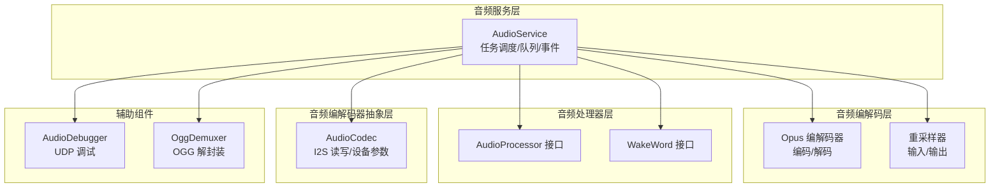
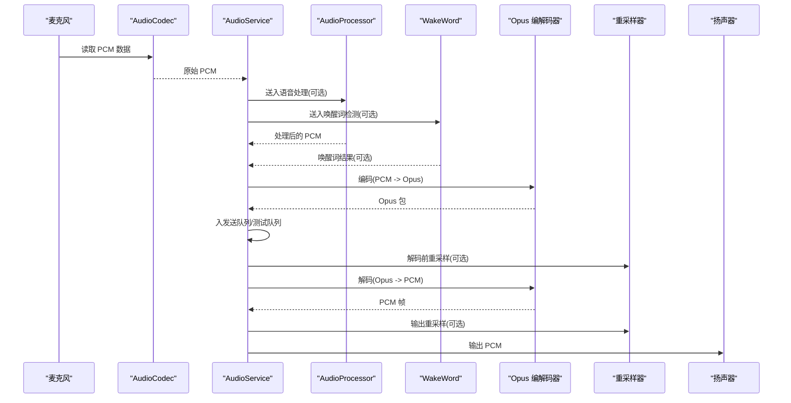
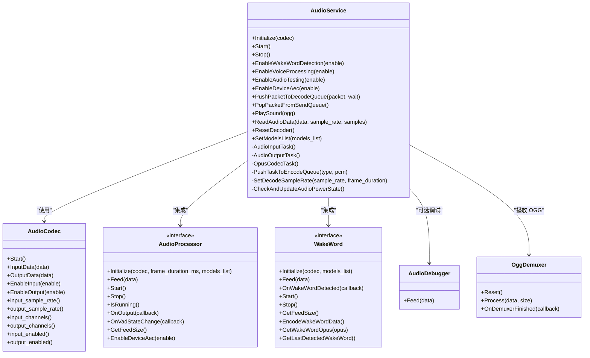
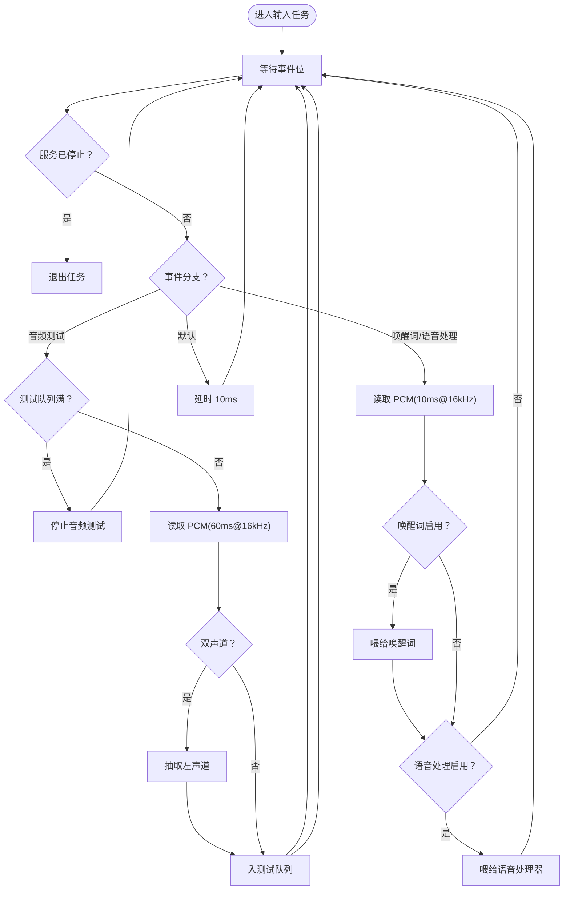
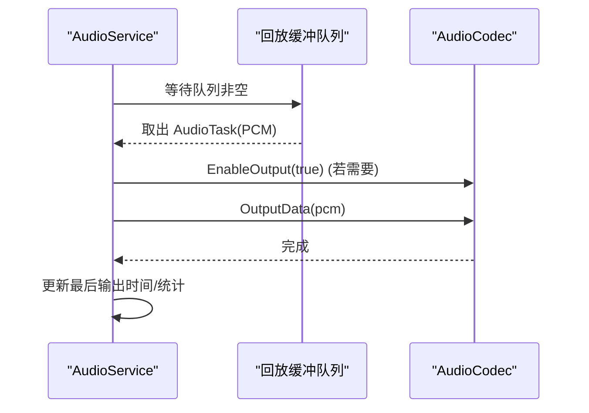
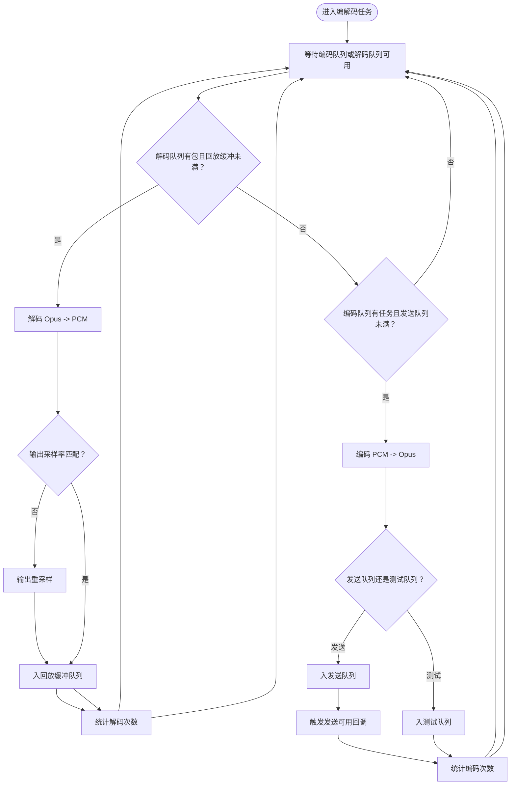
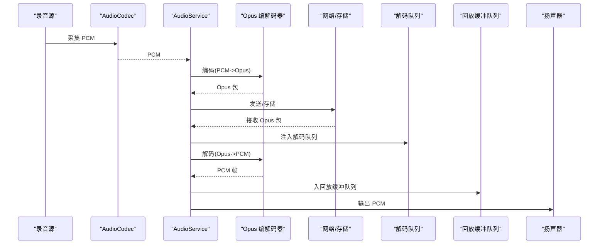
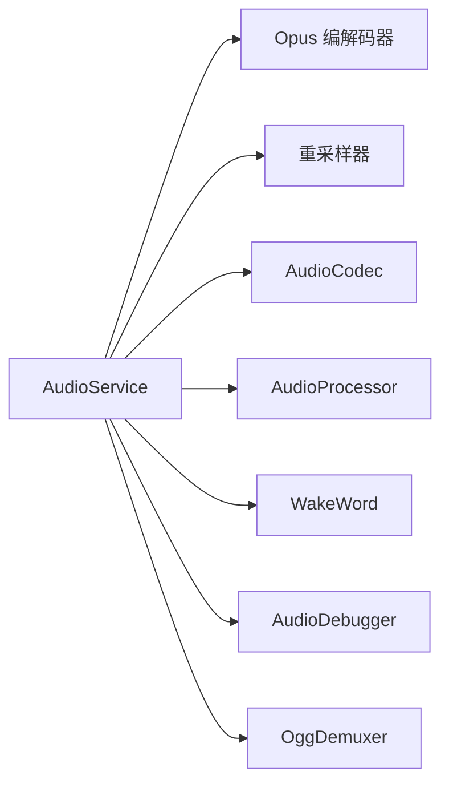

# 音频采集与处理

<cite>
**本文引用的文件**
- [audio_service.h](file://main/audio/audio_service.h)
- [audio_service.cc](file://main/audio/audio_service.cc)
- [audio_codec.h](file://main/audio/audio_codec.h)
- [audio_codec.cc](file://main/audio/audio_codec.cc)
- [audio_processor.h](file://main/audio/audio_processor.h)
- [audio_debugger.h](file://main/audio/processors/audio_debugger.h)
- [audio_debugger.cc](file://main/audio/processors/audio_debugger.cc)
- [wake_word.h](file://main/audio/wake_word.h)
- [ogg_demuxer.h](file://main/audio/demuxer/ogg_demuxer.h)
- [ogg_demuxer.cc](file://main/audio/demuxer/ogg_demuxer.cc)
</cite>

## 目录
1. [简介](#简介)
2. [项目结构](#项目结构)
3. [核心组件](#核心组件)
4. [架构总览](#架构总览)
5. [详细组件分析](#详细组件分析)
6. [依赖关系分析](#依赖关系分析)
7. [性能考量](#性能考量)
8. [故障排查指南](#故障排查指南)
9. [结论](#结论)
10. [附录](#附录)

## 简介
本技术文档围绕 ESP32-AI 项目的音频采集与处理模块，系统性阐述 AudioService 类的核心架构与实现细节。重点覆盖以下方面：
- 音频输入任务、输出任务与编解码任务的职责划分与协作机制
- 音频队列管理、事件驱动架构与多线程同步策略
- 音频数据流全链路：从麦克风采集、PCM 数据处理、重采样、编码到发送队列的全过程
- 采样率转换、重采样器配置与缓冲区管理
- 实时性能优化策略与音频调试工具使用方法
- 常见问题定位与解决建议

## 项目结构
音频子系统采用“分层+任务分离”的设计：
- 音频服务层：AudioService 负责初始化、任务调度、队列管理、事件控制与资源生命周期
- 音频编解码层：基于 ESP-ADF 提供的 Opus 编解码器与重采样器
- 音频处理器层：可插拔的语音处理（如 VAD、AEC、唤醒词检测等），通过统一接口对接
- 音频编解码器抽象层：AudioCodec 封装 I2S 读写与设备能力（采样率、通道、增益、音量等）
- 调试与解复用：AudioDebugger 提供 UDP 音频调试；OggDemuxer 支持 OGG 容器内 Opus 数据提取

图表来源
- [audio_service.h:106-196](file://main/audio/audio_service.h#L106-L196)
- [audio_service.cc:63-124](file://main/audio/audio_service.cc#L63-L124)
- [audio_codec.h:17-61](file://main/audio/audio_codec.h#L17-L61)
- [audio_processor.h:11-27](file://main/audio/audio_processor.h#L11-L27)
- [audio_debugger.h:10-22](file://main/audio/processors/audio_debugger.h#L10-L22)
- [ogg_demuxer.h:9-63](file://main/audio/demuxer/ogg_demuxer.h#L9-L63)

章节来源
- [audio_service.h:28-37](file://main/audio/audio_service.h#L28-L37)
- [audio_service.cc:126-168](file://main/audio/audio_service.cc#L126-L168)

## 核心组件
- AudioService：音频主控制器，负责三类任务的创建与协调、队列容量控制、事件组驱动、定时电源管理、唤醒词与语音处理模块集成、播放与测试模式切换等
- AudioCodec：I2S 设备抽象，提供输入/输出数据读写、启用/禁用、采样率/通道/增益/音量查询与设置
- AudioProcessor/WakeWord：可插拔的音频处理与唤醒词检测接口，支持不同平台的实现
- Opus 编解码器与重采样器：用于音频帧的压缩编码与解码重采样
- AudioDebugger：将原始 PCM 数据通过 UDP 发送到调试服务器
- OggDemuxer：从 OGG 容器中提取 Opus 数据帧

章节来源
- [audio_service.h:106-196](file://main/audio/audio_service.h#L106-L196)
- [audio_codec.h:17-61](file://main/audio/audio_codec.h#L17-L61)
- [audio_processor.h:11-27](file://main/audio/audio_processor.h#L11-L27)
- [wake_word.h:11-27](file://main/audio/wake_word.h#L11-L27)
- [audio_debugger.h:10-22](file://main/audio/processors/audio_debugger.h#L10-L22)
- [ogg_demuxer.h:9-63](file://main/audio/demuxer/ogg_demuxer.h#L9-L63)

## 架构总览
AudioService 将音频处理拆分为三个独立任务：
- 音频输入任务：从麦克风读取 PCM 数据，按需进行通道/采样率转换，送入编码队列或唤醒词/语音处理器
- 音频输出任务：从回放队列取出 PCM，写入扬声器
- Opus 编解码任务：在发送队列与解码队列之间搬运数据，执行编码或解码，并在必要时进行重采样

图表来源
- [audio_service.cc:231-290](file://main/audio/audio_service.cc#L231-L290)
- [audio_service.cc:292-327](file://main/audio/audio_service.cc#L292-L327)
- [audio_service.cc:329-448](file://main/audio/audio_service.cc#L329-L448)
- [audio_service.cc:486-506](file://main/audio/audio_service.cc#L486-L506)
- [audio_service.cc:635-656](file://main/audio/audio_service.cc#L635-L656)

## 详细组件分析

### AudioService 类与任务体系
- 初始化流程：打开解码器、编码器，根据输入采样率决定是否创建输入重采样器；构建音频处理器与唤醒词模块；注册电源定时器
- 启动流程：创建音频输入/输出任务与 Opus 编解码任务；启动电源定时器
- 停止流程：停止电源定时器，阻塞式清空各队列并通知等待线程
- 事件驱动：使用 FreeRTOS 事件组控制“音频测试”“唤醒词检测”“语音处理”三类运行状态位，输入任务依据事件位选择处理分支
- 队列与容量：编码队列、发送队列、测试队列、解码队列、回放缓冲队列均有上限，防止内存膨胀；编码/解码任务在条件变量上等待队列空间或数据可用
- 电源管理：周期性检查最近输入/输出时间，超时则自动关闭 I2S 输入/输出以节能

图表来源
- [audio_service.h:106-196](file://main/audio/audio_service.h#L106-L196)
- [audio_codec.h:17-61](file://main/audio/audio_codec.h#L17-L61)
- [audio_processor.h:11-27](file://main/audio/audio_processor.h#L11-L27)
- [wake_word.h:11-27](file://main/audio/wake_word.h#L11-L27)
- [audio_debugger.h:10-22](file://main/audio/processors/audio_debugger.h#L10-L22)
- [ogg_demuxer.h:9-63](file://main/audio/demuxer/ogg_demuxer.h#L9-L63)

章节来源
- [audio_service.h:106-196](file://main/audio/audio_service.h#L106-L196)
- [audio_service.cc:63-124](file://main/audio/audio_service.cc#L63-L124)
- [audio_service.cc:126-168](file://main/audio/audio_service.cc#L126-L168)
- [audio_service.cc:170-183](file://main/audio/audio_service.cc#L170-L183)

### 音频输入任务（AudioInputTask）
- 功能：从麦克风读取 PCM，按事件位选择处理路径：音频测试、唤醒词检测、语音处理
- 关键逻辑：
  - 音频测试：按固定帧长（60ms）读取并转为单声道，推入测试队列
  - 唤醒词/语音处理：按 10ms 帧长读取，分别喂给对应模块
  - 采样率/通道适配：当输入采样率非 16kHz 或双声道时，先进行重采样与通道抽取
  - 事件等待：通过事件组阻塞等待，避免忙轮询
  - 异常处理：读取超时/错误不退出，延时后继续

图表来源
- [audio_service.cc:231-290](file://main/audio/audio_service.cc#L231-L290)

章节来源
- [audio_service.cc:231-290](file://main/audio/audio_service.cc#L231-L290)

### 音频输出任务（AudioOutputTask）
- 功能：从回放缓冲队列取出 PCM，写入扬声器
- 关键逻辑：
  - 条件变量等待队列非空
  - 若输出被禁用，则启用输出并启动电源定时器
  - 写入成功后更新最后输出时间，统计播放计数
  - 支持服务器 AEC 时间戳记录（可选）

图表来源
- [audio_service.cc:292-327](file://main/audio/audio_service.cc#L292-L327)

章节来源
- [audio_service.cc:292-327](file://main/audio/audio_service.cc#L292-L327)

### Opus 编解码任务（OpusCodecTask）
- 功能：在编码与解码路径间搬运数据，执行编码/解码与必要的重采样
- 编码路径：
  - 从编码队列取出任务，构造 Opus 包，调用编码器处理
  - 成功后入发送队列或测试队列，并触发回调
- 解码路径：
  - 从解码队列取出包，按包内采样率与帧长重建解码器
  - 解码后按目标采样率进行输出重采样，入回放缓冲队列
- 队列容量控制：编码/解码任务均受各自队列上限约束，避免拥塞

图表来源
- [audio_service.cc:329-448](file://main/audio/audio_service.cc#L329-L448)
- [audio_service.cc:450-484](file://main/audio/audio_service.cc#L450-L484)

章节来源
- [audio_service.cc:329-448](file://main/audio/audio_service.cc#L329-L448)
- [audio_service.cc:450-484](file://main/audio/audio_service.cc#L450-L484)

### 音频队列管理与事件驱动
- 队列类型与容量：
  - 编码队列：限制同时在处理的任务数量
  - 发送队列/测试队列：限制最大包数，结合帧时长计算上限
  - 解码队列/回放缓冲队列：限制最大任务数
- 同步机制：
  - 互斥锁保护队列访问
  - 条件变量在队列空/满时阻塞等待
  - 事件组控制功能开关（测试/唤醒词/语音处理）
- 统计与调试：
  - 统计输入/解码/编码/播放计数，便于性能评估
  - 可选 AudioDebugger 将原始 PCM 通过 UDP 发送

章节来源
- [audio_service.h:39-45](file://main/audio/audio_service.h#L39-L45)
- [audio_service.h:164-177](file://main/audio/audio_service.h#L164-L177)
- [audio_service.cc:486-506](file://main/audio/audio_service.cc#L486-L506)
- [audio_service.cc:508-520](file://main/audio/audio_service.cc#L508-L520)
- [audio_service.cc:658-668](file://main/audio/audio_service.cc#L658-L668)
- [audio_debugger.h:10-22](file://main/audio/processors/audio_debugger.h#L10-L22)

### 采样率转换与重采样器配置
- 输入重采样：当设备输入采样率非 16kHz 时，创建输入重采样器，将输入 PCM 转换为编码器期望的 16kHz 单声道帧
- 输出重采样：解码得到的 PCM 与设备输出采样率不一致时，创建输出重采样器进行重采样
- 重采样器配置：固定位深与性能优先级，复杂度可控，兼顾速度与质量
- 切换处理：解码器参数变化时，动态重建解码器与输出重采样器

章节来源
- [audio_service.cc:87-94](file://main/audio/audio_service.cc#L87-L94)
- [audio_service.cc:450-484](file://main/audio/audio_service.cc#L450-L484)
- [audio_service.cc:670-682](file://main/audio/audio_service.cc#L670-L682)

### 音频数据流全链路
- 录音侧：麦克风 → AudioCodec → AudioInputTask → AudioProcessor/WakeWord → 编码队列 → OpusCodecTask → 发送队列/测试队列
- 播放侧：服务器/本地 OGG → OpusCodecTask → 解码队列 → 回放缓冲队列 → AudioOutputTask → 扬声器
- 特殊路径：本地 OGG 通过 OggDemuxer 提取 Opus 数据，注入解码队列

图表来源
- [audio_service.cc:635-656](file://main/audio/audio_service.cc#L635-L656)
- [audio_service.cc:329-448](file://main/audio/audio_service.cc#L329-L448)

章节来源
- [audio_service.cc:635-656](file://main/audio/audio_service.cc#L635-L656)
- [ogg_demuxer.cc:269-275](file://main/audio/demuxer/ogg_demuxer.cc#L269-L275)

### 音频调试工具
- AudioDebugger：将原始 PCM 数据通过 UDP 发送到指定服务器，便于抓包与波形分析
- 使用方式：在配置中设置 UDP 服务器地址（IP:PORT），初始化后即可将数据发送
- 注意事项：仅在启用调试宏时生效，避免影响生产环境性能

章节来源
- [audio_debugger.h:10-22](file://main/audio/processors/audio_debugger.h#L10-L22)
- [audio_debugger.cc:16-66](file://main/audio/processors/audio_debugger.cc#L16-L66)

## 依赖关系分析
- AudioService 依赖：
  - ESP-ADF 的 Opus 编解码器与重采样器
  - FreeRTOS 事件组、定时器、互斥锁与条件变量
  - AudioCodec 抽象与具体板卡实现
  - 可插拔的 AudioProcessor 与 WakeWord 实现
  - OggDemuxer 用于本地播放
- 耦合与内聚：
  - AudioService 对外暴露清晰接口，内部通过事件与队列解耦
  - 处理器与唤醒词通过接口抽象，便于替换与扩展
  - 重采样器与编解码器参数化配置，降低平台差异影响

图表来源
- [audio_service.h:106-196](file://main/audio/audio_service.h#L106-L196)
- [audio_service.cc:63-124](file://main/audio/audio_service.cc#L63-L124)

章节来源
- [audio_service.h:106-196](file://main/audio/audio_service.h#L106-L196)
- [audio_service.cc:63-124](file://main/audio/audio_service.cc#L63-L124)

## 性能考量
- 任务优先级与栈空间：
  - 输入/输出任务优先级高于编解码任务，确保实时性
  - 各任务栈空间按实际负载预留，避免栈溢出
- 队列容量与背压：
  - 通过上限控制避免内存暴涨；条件变量阻塞等待，减少忙轮询
- 重采样与编解码开销：
  - 重采样器性能优先级设为速度型，降低 CPU 占用
  - 编码器帧时长固定，便于端到端延迟控制
- 电源管理：
  - 定期检查输入/输出活跃时间，超时自动关闭 I2S，降低功耗

章节来源
- [audio_service.cc:134-167](file://main/audio/audio_service.cc#L134-L167)
- [audio_service.cc:684-700](file://main/audio/audio_service.cc#L684-L700)

## 故障排查指南
- 无法启动编码器/解码器：
  - 检查返回值与日志，确认硬件初始化与配置正确
  - 参考初始化流程中的错误处理
- 音频断断续续或卡顿：
  - 检查发送队列/解码队列是否频繁达到上限
  - 观察编码/解码任务是否长时间阻塞
- 唤醒词/语音处理无效：
  - 确认事件位已正确设置（唤醒词/语音处理启用）
  - 检查输入采样率与通道是否符合预期
- 播放无声：
  - 确认输出已被启用，且输出采样率与设备匹配
  - 检查输出重采样器是否正常工作
- 调试数据未到达：
  - 检查 UDP 地址格式与网络连通性
  - 确认调试宏已启用

章节来源
- [audio_service.cc:67-85](file://main/audio/audio_service.cc#L67-L85)
- [audio_service.cc:329-448](file://main/audio/audio_service.cc#L329-L448)
- [audio_service.cc:551-579](file://main/audio/audio_service.cc#L551-L579)
- [audio_service.cc:635-656](file://main/audio/audio_service.cc#L635-L656)
- [audio_debugger.cc:16-66](file://main/audio/processors/audio_debugger.cc#L16-L66)

## 结论
AudioService 通过清晰的任务分工、严格的队列控制与事件驱动机制，实现了从麦克风采集到扬声器播放的完整音频链路。其可插拔的处理器与唤醒词接口、灵活的重采样与编解码配置，以及完善的电源管理策略，使其在资源受限的嵌入式平台上具备良好的实时性与可维护性。

## 附录
- 关键配置项（示例）
  - OPUS 帧时长：60ms
  - 编码器应用模式：音频类
  - 是否启用 FEC/DTX/VBR：可配置
  - 输入/输出重采样性能类型：速度优先
- 常用操作
  - 启用/禁用唤醒词检测
  - 启用/禁用语音处理
  - 启用/禁用音频测试模式
  - 设置模型列表以选择唤醒词实现
  - 播放本地 OGG 文件（经 OggDemuxer 解封装）

章节来源
- [audio_service.h:39-76](file://main/audio/audio_service.h#L39-L76)
- [audio_service.cc:551-629](file://main/audio/audio_service.cc#L551-L629)
- [audio_service.cc:635-656](file://main/audio/audio_service.cc#L635-L656)
- [ogg_demuxer.cc:269-275](file://main/audio/demuxer/ogg_demuxer.cc#L269-L275)