# 核心特性与优势

<cite>
**本文引用的文件**
- [README.md](file://README.md)
- [main.cc](file://main/main.cc)
- [application.cc](file://main/application.cc)
- [websocket.md](file://docs/websocket.md)
- [mqtt-udp.md](file://docs/mqtt-udp.md)
- [audio_codec.cc](file://main/audio/audio_codec.cc)
- [wake_word.h](file://main/audio/wake_word.h)
- [display.h](file://main/display/display.h)
- [board.h](file://main/boards/common/board.h)
- [mcp_server.h](file://main/mcp_server.h)
- [aipi-lite config.h](file://main/boards/aipi-lite/config.h)
- [esp-box config.h](file://main/boards/esp-box/config.h)
- [m5stack-core-s3 config.h](file://main/boards/m5stack-core-s3/config.h)
- [adc_battery_monitor.h](file://main/boards/common/adc_battery_monitor.h)
</cite>

## 目录
1. [简介](#简介)
2. [项目结构](#项目结构)
3. [核心组件](#核心组件)
4. [架构总览](#架构总览)
5. [详细组件分析](#详细组件分析)
6. [依赖关系分析](#依赖关系分析)
7. [性能考量](#性能考量)
8. [故障排查指南](#故障排查指南)
9. [结论](#结论)
10. [附录](#附录)

## 简介
本项目是一个基于MCP协议的智能语音交互终端，围绕ESP32系列及多款开源硬件平台构建，提供从唤醒词检测、流式语音识别、大模型对话到语音合成的完整链路，同时支持设备侧MCP控制与云端MCP扩展，覆盖Wi-Fi/4G网络、离线唤醒、双协议通信（WebSocket/MQTT+UDP）、OPUS编解码、显示与电池管理、多语言与多芯片平台适配等能力。

## 项目结构
项目采用“应用层-协议层-音频层-显示层-硬件抽象层”的分层组织，入口程序负责初始化与事件循环，应用层协调网络、协议、音频与UI，协议层提供WebSocket与MQTT+UDP两种通信方案，音频层封装编解码与唤醒词检测，显示层统一抽象OLED/LCD界面，硬件抽象层屏蔽多款开发板差异。

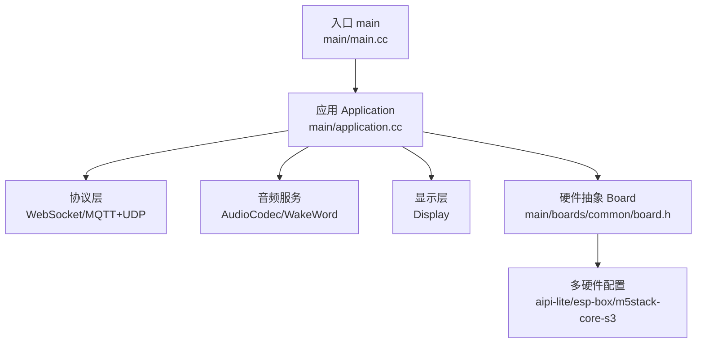

图表来源
- [main.cc:14-29](file://main/main.cc#L14-L29)
- [application.cc:85-199](file://main/application.cc#L85-L199)
- [board.h:49-86](file://main/boards/common/board.h#L49-L86)

章节来源
- [main.cc:14-29](file://main/main.cc#L14-L29)
- [application.cc:85-199](file://main/application.cc#L85-L199)
- [board.h:49-86](file://main/boards/common/board.h#L49-L86)

## 核心组件
- 网络与协议
  - 支持Wi-Fi与ML307 Cat.1 4G网络接入，运行时动态选择MQTT或WebSocket协议，二者均采用OPUS音频编解码与JSON控制消息。
- 离线语音唤醒
  - 基于ESP-SR的离线唤醒词检测，支持自定义唤醒词与OPUS唤醒音频上传。
- 双协议通信
  - WebSocket：统一的文本+二进制帧协议，适合中小规模部署与跨防火墙友好。
  - MQTT+UDP：控制走MQTT、音频走UDP加密通道，强调实时性与安全性。
- OPUS音频编解码
  - 设备端与服务器端采样率可配置，支持60ms帧时长，兼顾带宽与延迟。
- 流式语音识别+大模型+语音合成架构
  - 设备端发送录音帧，服务器端返回STT文本、LLM情感与TTS控制，设备端播放合成音频。
- 说话人识别
  - 集成3D Speaker模型，支持当前说话人识别。
- 显示与交互
  - OLED/LCD统一抽象，支持表情、通知、聊天消息与状态栏。
- 电池管理
  - ADC监测充电/放电状态与电量等级，支持电源策略切换。
- 多语言与多芯片平台
  - 多语言资源覆盖广泛，多款开发板配置文件适配不同芯片平台（ESP32-C3/C5/P4/S3）。
- 设备侧MCP与云端MCP
  - 设备侧MCP用于控制LED、扬声器、GPIO等；云端MCP扩展至智能家居、桌面操作、知识搜索等。

章节来源
- [README.md:23-37](file://README.md#L23-L37)
- [websocket.md:128-292](file://docs/websocket.md#L128-L292)
- [mqtt-udp.md:71-173](file://docs/mqtt-udp.md#L71-L173)
- [application.cc:518-655](file://main/application.cc#L518-L655)

## 架构总览
下图展示设备端与服务器端的交互路径：设备通过网络协议建立控制通道，随后按需开启音频通道进行双向流式传输，期间通过JSON消息传递STT/LLM/TTS/MCP等控制指令。

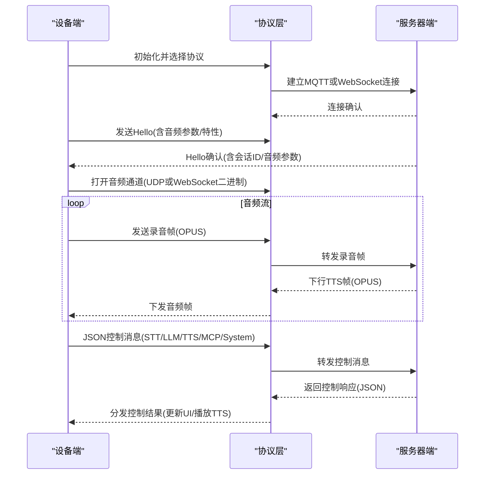

图表来源
- [websocket.md:7-79](file://docs/websocket.md#L7-L79)
- [mqtt-udp.md:22-57](file://docs/mqtt-udp.md#L22-L57)
- [application.cc:518-655](file://main/application.cc#L518-L655)

## 详细组件分析

### 网络与协议（WebSocket/MQTT+UDP）
- 选择策略
  - 应用启动时依据OTA配置决定使用MQTT还是WebSocket；两者均支持MCP消息与系统命令。
- 通道特性
  - WebSocket：握手后发送Hello，二进制帧承载OPUS音频，文本帧承载JSON控制。
  - MQTT+UDP：MQTT用于控制与会话管理，UDP用于实时音频加密传输，支持AES-CTR加密与序列号防护。
- 实时性与可靠性
  - UDP通道优先满足低延迟音频传输；MQTT通道保障控制消息可靠与重连。

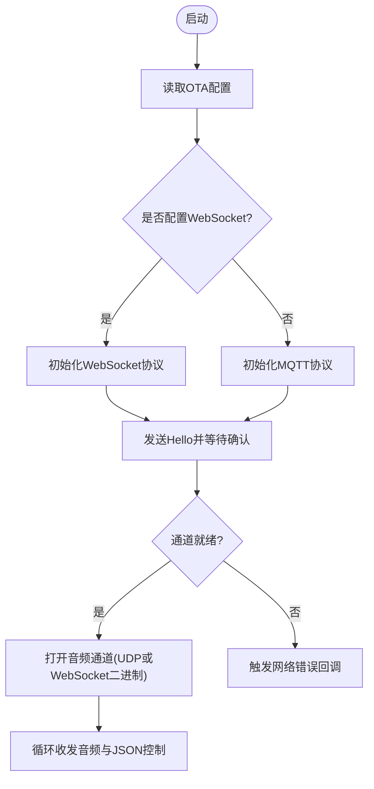

图表来源
- [application.cc:518-655](file://main/application.cc#L518-L655)
- [websocket.md:22-79](file://docs/websocket.md#L22-L79)
- [mqtt-udp.md:71-113](file://docs/mqtt-udp.md#L71-L113)

章节来源
- [application.cc:518-655](file://main/application.cc#L518-L655)
- [websocket.md:128-292](file://docs/websocket.md#L128-L292)
- [mqtt-udp.md:176-224](file://docs/mqtt-udp.md#L176-L224)

### 离线语音唤醒（ESP-SR）
- 能力概述
  - 支持离线唤醒词检测，检测到后可上传唤醒音频用于声纹识别。
- 接口要点
  - WakeWord接口定义了初始化、喂入音频、回调注册、启动/停止与OPUS编码等能力。

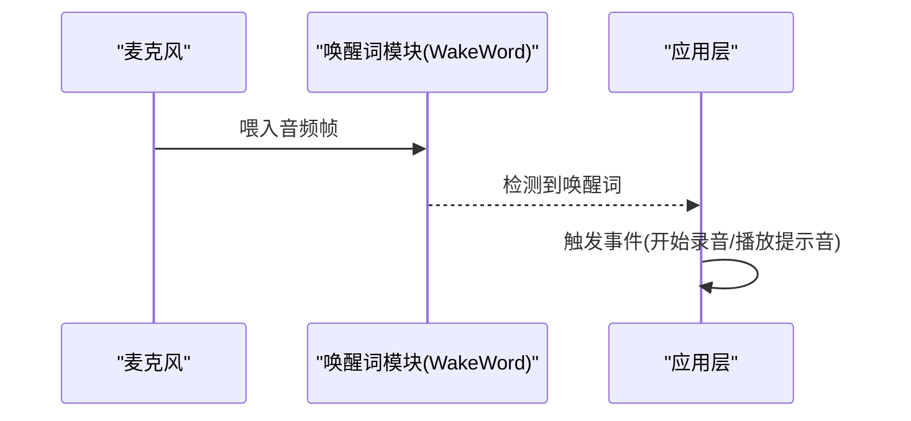

图表来源
- [wake_word.h:11-24](file://main/audio/wake_word.h#L11-L24)
- [application.cc:106-112](file://main/application.cc#L106-L112)

章节来源
- [wake_word.h:11-24](file://main/audio/wake_word.h#L11-L24)
- [application.cc:106-112](file://main/application.cc#L106-L112)

### OPUS音频编解码
- 设备端能力
  - 提供输入/输出开关、音量与增益设置、I/O数据读写接口。
- 采样率与帧时长
  - 设备端通常配置为16kHz或24kHz，服务器端可能为更高采样率，解码后重采样。
- 二进制协议版本
  - 支持版本1（直接OPUS）、版本2（含时间戳）与版本3（简化结构）。

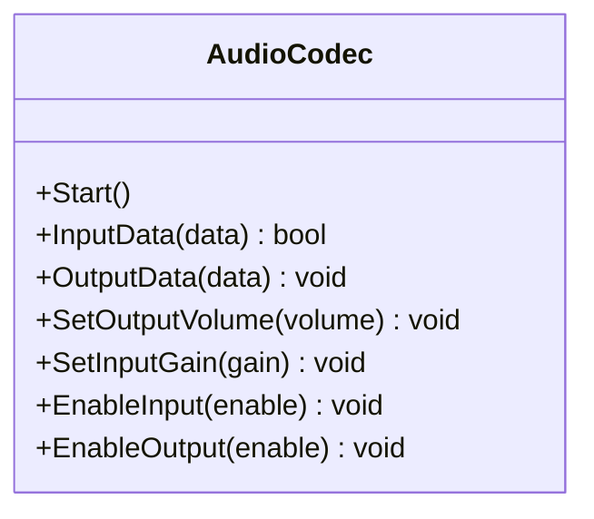

图表来源
- [audio_codec.cc:11-68](file://main/audio/audio_codec.cc#L11-L68)

章节来源
- [audio_codec.cc:11-68](file://main/audio/audio_codec.cc#L11-L68)
- [websocket.md:295-305](file://docs/websocket.md#L295-L305)
- [mqtt-udp.md:186-203](file://docs/mqtt-udp.md#L186-L203)

### 流式语音识别+大模型+语音合成架构
- 工作流
  - 设备端发送录音帧，服务器端返回STT文本、LLM情感与TTS控制，设备端播放TTS音频并更新UI。
- 状态机
  - 设备端维护Idle/Connecting/Listening/Speaking等状态，依据事件驱动转换。

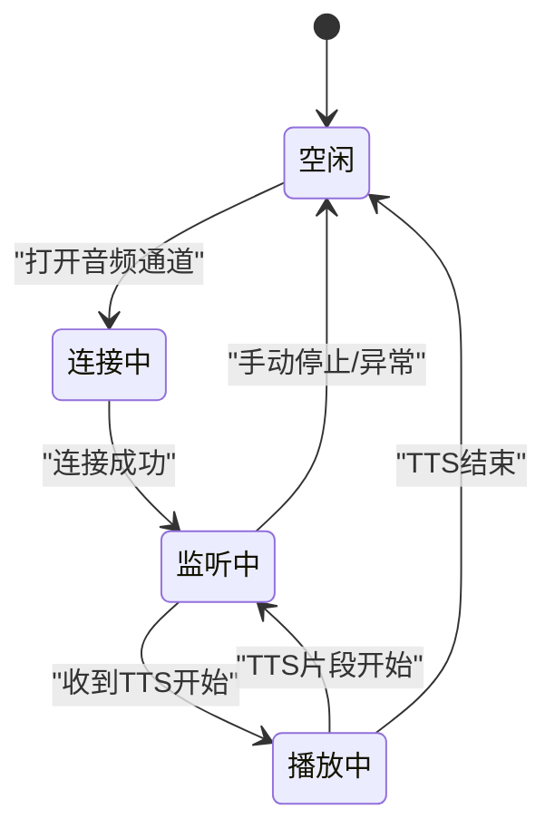

图表来源
- [websocket.md:308-366](file://docs/websocket.md#L308-L366)
- [application.cc:768-800](file://main/application.cc#L768-L800)

章节来源
- [websocket.md:410-483](file://docs/websocket.md#L410-L483)
- [application.cc:768-800](file://main/application.cc#L768-L800)

### 说话人识别（3D Speaker）
- 能力说明
  - 集成3D Speaker模型，支持识别当前说话人，提升交互体验与个性化能力。
- 应用场景
  - 适用于多人场景下的身份区分与个性化回应。

章节来源
- [README.md:30](file://README.md#L30)

### 显示与交互（OLED/LCD）
- 抽象接口
  - Display提供状态、通知、表情、聊天消息与主题设置等统一接口。
- UI更新
  - 应用层在事件循环中周期刷新状态栏与传感器数据，配合提醒管理器推送通知。

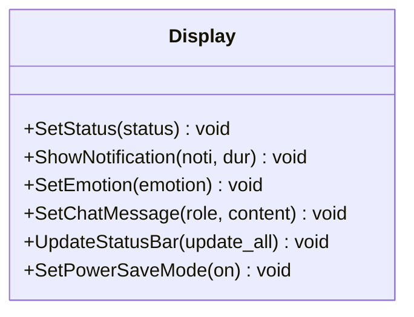

图表来源
- [display.h:28-63](file://main/display/display.h#L28-L63)

章节来源
- [display.h:28-63](file://main/display/display.h#L28-L63)
- [application.cc:284-298](file://main/application.cc#L284-L298)

### 电池管理与电源策略
- 监测
  - 通过ADC与充电引脚监测电量、充电/放电状态。
- 策略
  - Board抽象定义低功耗、平衡与高性能三种电源保存级别，协议连接/断开时动态切换。

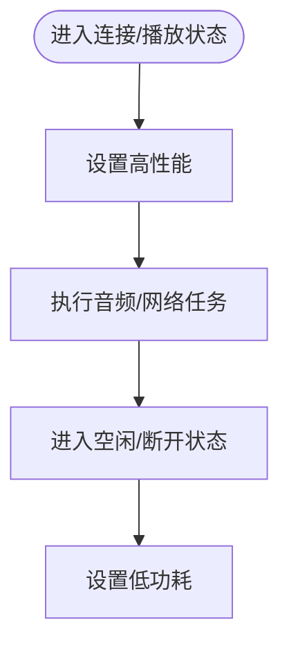

图表来源
- [board.h:35-40](file://main/boards/common/board.h#L35-L40)
- [application.cc:549-564](file://main/application.cc#L549-L564)

章节来源
- [adc_battery_monitor.h:9-28](file://main/boards/common/adc_battery_monitor.h#L9-L28)
- [board.h:35-40](file://main/boards/common/board.h#L35-L40)

### 多语言支持
- 资源覆盖
  - 项目提供大量语言目录（如zh-CN、en-US、ja-JP等），支持多语言界面与提示。
- 使用建议
  - 通过OTA或本地资源加载对应语言包，实现本地化体验。

章节来源
- [README.md:33](file://README.md#L33)

### 多芯片平台支持
- 平台覆盖
  - 明确支持ESP32-C3、ESP32-S3、ESP32-P4等芯片平台。
- 硬件适配
  - 不同开发板通过各自config.h配置I2S、显示、背光、按键与ADC等引脚与参数。

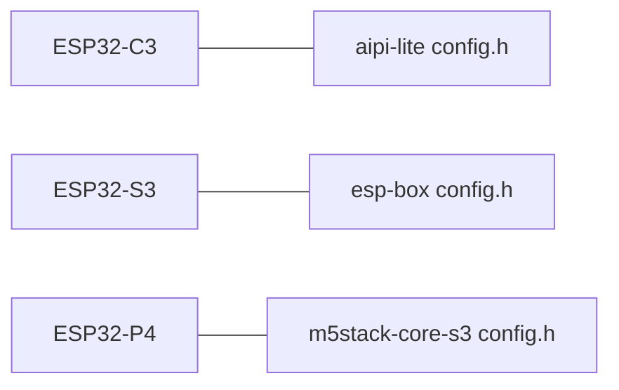

图表来源
- [aipi-lite config.h:1-54](file://main/boards/aipi-lite/config.h#L1-L54)
- [esp-box config.h:1-42](file://main/boards/esp-box/config.h#L1-L42)
- [m5stack-core-s3 config.h:1-67](file://main/boards/m5stack-core-s3/config.h#L1-L67)

章节来源
- [aipi-lite config.h:1-54](file://main/boards/aipi-lite/config.h#L1-L54)
- [esp-box config.h:1-42](file://main/boards/esp-box/config.h#L1-L42)
- [m5stack-core-s3 config.h:1-67](file://main/boards/m5stack-core-s3/config.h#L1-L67)

### 设备侧MCP与云端MCP扩展
- 设备侧MCP
  - 通过McpServer注册工具与属性，实现对LED、扬声器、GPIO等设备的控制。
- 云端MCP扩展
  - 通过MCP协议扩展至智能家居、桌面操作、知识搜索、邮件等能力，统一JSON-RPC 2.0语义。

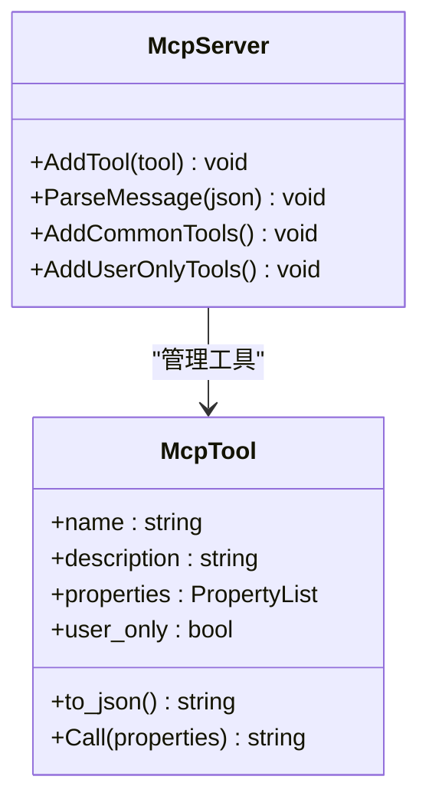

图表来源
- [mcp_server.h:208-342](file://main/mcp_server.h#L208-L342)

章节来源
- [mcp_server.h:208-342](file://main/mcp_server.h#L208-L342)
- [README.md:35-36](file://README.md#L35-L36)

## 依赖关系分析
- 应用层依赖
  - Board抽象提供网络、显示、音频编解码与传感器接口；协议层根据配置选择WebSocket或MQTT+UDP；音频层负责编解码与唤醒词；显示层统一UI；MCP服务提供设备侧控制能力。
- 硬件依赖
  - 各开发板通过config.h声明I2S、显示、背光、按键与ADC等引脚，Board抽象屏蔽差异。

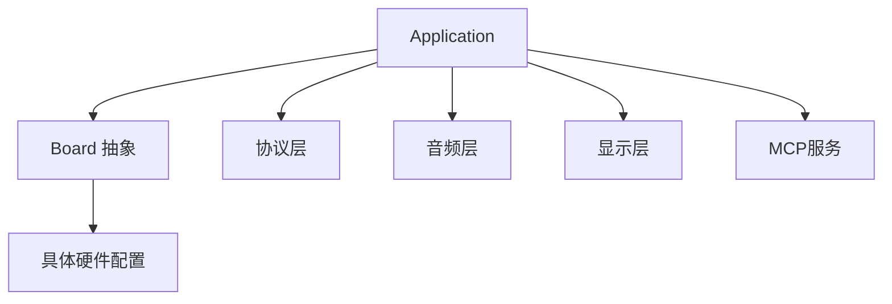

图表来源
- [application.cc:85-199](file://main/application.cc#L85-L199)
- [board.h:49-86](file://main/boards/common/board.h#L49-L86)

章节来源
- [application.cc:85-199](file://main/application.cc#L85-L199)
- [board.h:49-86](file://main/boards/common/board.h#L49-L86)

## 性能考量
- 实时性
  - UDP通道优先保证音频实时性；WebSocket在跨防火墙与兼容性方面更优。
- 能耗
  - 通过电源保存级别在性能与功耗间平衡；连接/播放时高性能，空闲/断开时低功耗。
- 带宽与延迟
  - OPUS 16kHz/24kHz与60ms帧时长在清晰度与延迟间折中；服务器下行可使用更高采样率优化音质。
- 安全
  - MQTT+UDP方案采用AES-CTR加密与序列号防护；WebSocket方案依赖TLS与授权头。

## 故障排查指南
- 网络连接问题
  - 检查Wi-Fi/4G配置与OTA配置；关注网络事件回调中的扫描、连接、断开与模组错误提示。
- 协议握手失败
  - 确认Hello消息中的音频参数与特性字段；WebSocket需检查握手头与会话ID；MQTT+UDP需核对UDP密钥与随机数。
- 音频异常
  - 检查采样率一致性与重采样；确认OPUS帧格式与二进制协议版本；关注解密失败与序列号异常。
- UI与显示
  - 确认Display初始化与锁机制；检查状态栏更新频率与通知时长。

章节来源
- [application.cc:127-182](file://main/application.cc#L127-L182)
- [websocket.md:369-378](file://docs/websocket.md#L369-L378)
- [mqtt-udp.md:218-223](file://docs/mqtt-udp.md#L218-L223)

## 结论
本项目以模块化架构实现从硬件抽象到云端MCP扩展的全栈能力，具备高实时性、强扩展性与良好跨平台适配性。通过双协议通信与OPUS编解码，满足多样部署场景；通过设备侧MCP与云端MCP协同，实现从语音交互到智能控制的无缝衔接。

## 附录
- 快速定位
  - 网络与协议：[application.cc:518-655](file://main/application.cc#L518-L655)、[websocket.md](file://docs/websocket.md)、[mqtt-udp.md](file://docs/mqtt-udp.md)
  - 音频编解码：[audio_codec.cc](file://main/audio/audio_codec.cc)
  - 唤醒词：[wake_word.h](file://main/audio/wake_word.h)
  - 显示：[display.h](file://main/display/display.h)
  - 硬件抽象：[board.h](file://main/boards/common/board.h)
  - MCP：[mcp_server.h](file://main/mcp_server.h)
  - 多硬件配置：[aipi-lite config.h](file://main/boards/aipi-lite/config.h)、[esp-box config.h](file://main/boards/esp-box/config.h)、[m5stack-core-s3 config.h](file://main/boards/m5stack-core-s3/config.h)
  - 电池监控：[adc_battery_monitor.h](file://main/boards/common/adc_battery_monitor.h)