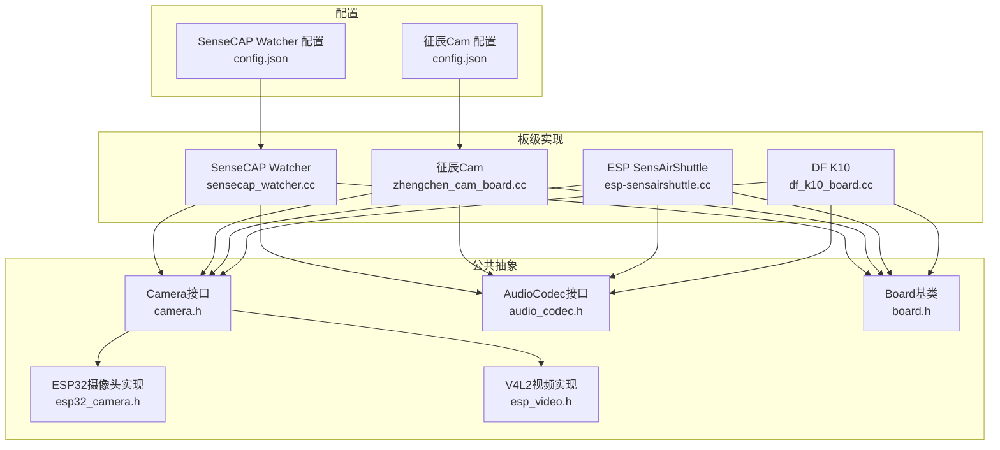
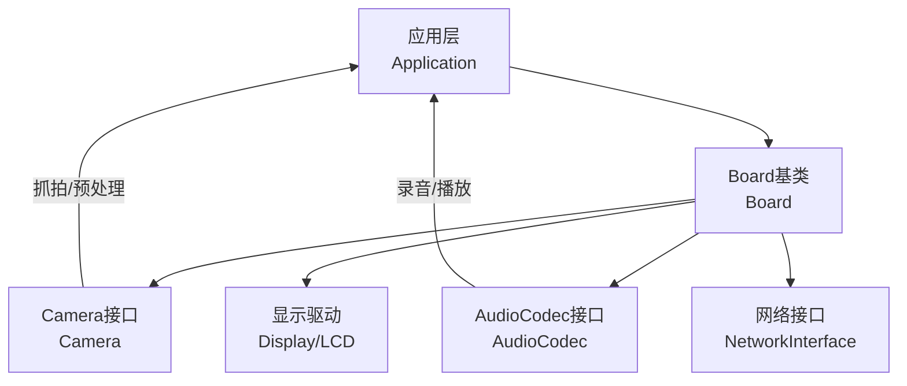
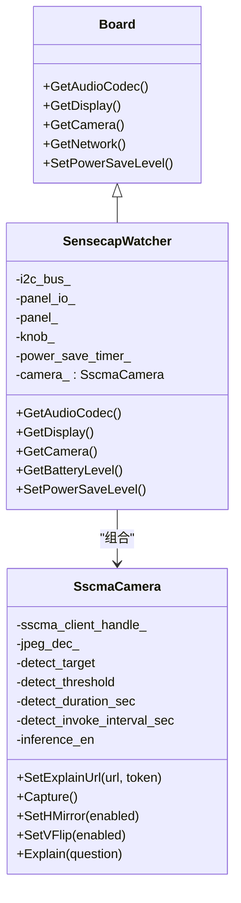
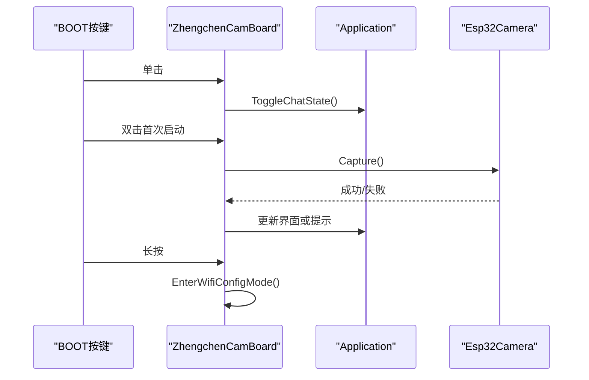
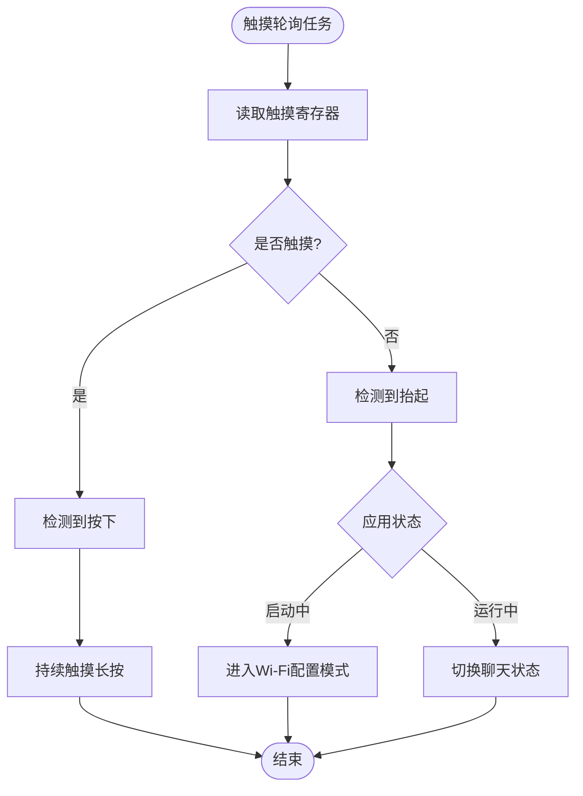
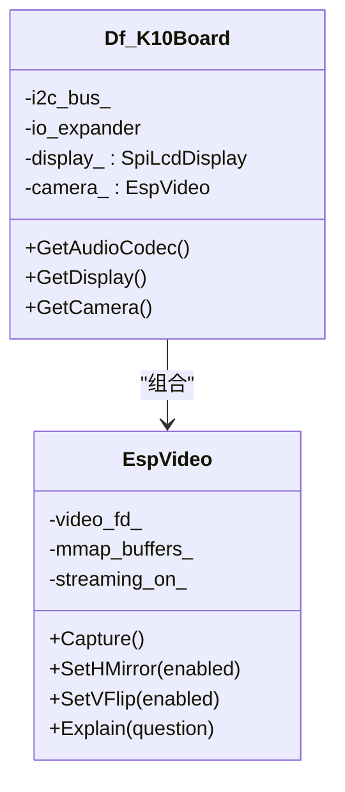
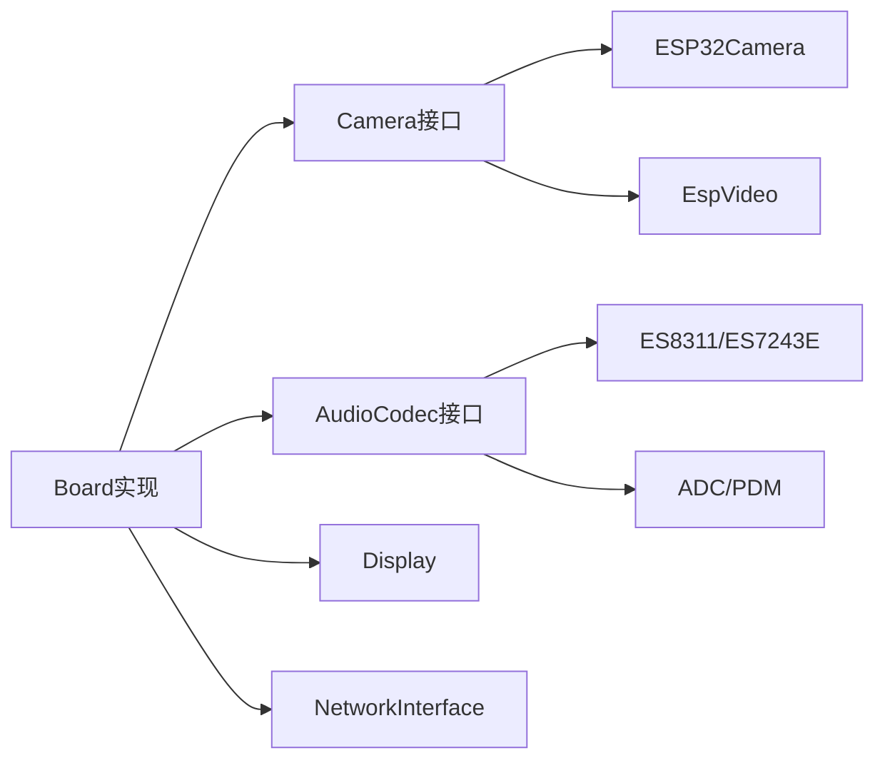

# AI摄像头板

<cite>
**本文引用的文件**
- [README.md](file://main/boards/sensecap-watcher/README.md)
- [sensecap_watcher.cc](file://main/boards/sensecap-watcher/sensecap_watcher.cc)
- [sscma_camera.h](file://main/boards/sensecap-watcher/sscma_camera.h)
- [README.md](file://main/boards/zhengchen-cam/README.md)
- [zhengchen_cam_board.cc](file://main/boards/zhengchen-cam/zhengchen_cam_board.cc)
- [README.md](file://main/boards/esp-sensairshuttle/README.md)
- [esp-sensairshuttle.cc](file://main/boards/esp-sensairshuttle/esp-sensairshuttle.cc)
- [camera.h](file://main/boards/common/camera.h)
- [esp32_camera.h](file://main/boards/common/esp32_camera.h)
- [esp_video.h](file://main/boards/common/esp_video.h)
- [README.md](file://main/boards/df-k10/README.md)
- [df_k10_board.cc](file://main/boards/df-k10/df_k10_board.cc)
- [config.json](file://main/boards/sensecap-watcher/config.json)
- [config.json](file://main/boards/zhengchen-cam/config.json)
- [audio_codec.h](file://main/audio/audio_codec.h)
- [board.h](file://main/boards/common/board.h)
</cite>

## 目录
1. [简介](#简介)
2. [项目结构](#项目结构)
3. [核心组件](#核心组件)
4. [架构总览](#架构总览)
5. [详细组件分析](#详细组件分析)
6. [依赖关系分析](#依赖关系分析)
7. [性能考虑](#性能考虑)
8. [故障排查指南](#故障排查指南)
9. [结论](#结论)
10. [附录](#附录)

## 简介
本章节面向ESP32-AI项目中的AI摄像头板，重点覆盖以下开发板与方案：
- SenseCAP Watcher：支持摄像头与SSCMA推理的AI相机，具备圆形LCD显示、音视频编解码、按键/旋钮交互与低功耗管理。
- 征辰Cam系列（ZhengChen Cam）：基于ESP32-S3的AI相机，集成双麦克风、ST7789 LCD、PCA9557电源与IO扩展，支持拍照、AEC、MCP工具链。
- ESP SensAirShuttle：面向动作感知与大模型交互的开发板，配备ILI9341 LCD、CST816D电容触摸、ADC/PDM音频编解码器。
- DF K10：行空板K10，采用ESP32-S3与V4L2视频框架（EspVideo），支持DVP摄像头接口、环形LED灯带与IO扩展。

本文件将从系统架构、数据流、处理逻辑、集成点、错误处理与性能优化等方面，全面解析这些AI摄像头板的实现与使用方法，并提供摄像头校准、图像质量优化与功耗管理的实用指南。

## 项目结构
围绕AI摄像头板的关键目录与文件组织如下：
- 板级适配层：各开发板在 main/boards/<board-name>/ 下提供独立的Board实现与配置文件。
- 公共摄像头抽象：main/boards/common/ 提供统一的Camera接口与具体实现（ESP32摄像头、V4L2视频）。
- 音频系统：main/audio/ 提供通用AudioCodec接口与多种编解码器实现。
- 构建配置：各板的config.json定义目标芯片、SDK配置追加项；README.md提供编译与烧录说明。

**图表来源**
- [sensecap_watcher.cc:105-663](file://main/boards/sensecap-watcher/sensecap_watcher.cc#L105-L663)
- [zhengchen_cam_board.cc:79-333](file://main/boards/zhengchen-cam/zhengchen_cam_board.cc#L79-L333)
- [esp-sensairshuttle.cc:154-315](file://main/boards/esp-sensairshuttle/esp-sensairshuttle.cc#L154-L315)
- [df_k10_board.cc:23-299](file://main/boards/df-k10/df_k10_board.cc#L23-L299)
- [camera.h:6-14](file://main/boards/common/camera.h#L6-L14)
- [esp32_camera.h:22-44](file://main/boards/common/esp32_camera.h#L22-L44)
- [esp_video.h:21-53](file://main/boards/common/esp_video.h#L21-L53)
- [audio_codec.h:17-61](file://main/audio/audio_codec.h#L17-L61)
- [board.h:49-93](file://main/boards/common/board.h#L49-L93)
- [config.json:1-16](file://main/boards/sensecap-watcher/config.json#L1-L16)
- [config.json:1-17](file://main/boards/zhengchen-cam/config.json#L1-L17)

**章节来源**
- [README.md:1-52](file://main/boards/sensecap-watcher/README.md#L1-L52)
- [README.md:1-49](file://main/boards/zhengchen-cam/README.md#L1-L49)
- [README.md:1-40](file://main/boards/esp-sensairshuttle/README.md#L1-L40)
- [README.md:1-58](file://main/boards/df-k10/README.md#L1-L58)

## 核心组件
- Camera接口与实现
  - 统一接口定义了摄像头的解释URL设置、抓拍、水平/垂直翻转、可选字节交换以及解释调用。
  - ESP32摄像头实现封装了ESP32-camera库，支持帧缓冲、JPEG编码与解释服务对接。
  - V4L2视频实现基于V4L2框架，支持DVP摄像头、内存映射缓冲与旋转配置。
- 音频编解码器
  - AudioCodec提供输入增益、输出音量、输入/输出使能、全双工参数等抽象，具体编解码器由各板实现。
- 板级Board
  - Board基类提供网络事件回调、温度/电量查询、电源策略、系统信息等统一接口，各板通过GetAudioCodec/GetCamera等虚函数暴露硬件能力。

**章节来源**
- [camera.h:6-14](file://main/boards/common/camera.h#L6-L14)
- [esp32_camera.h:22-44](file://main/boards/common/esp32_camera.h#L22-L44)
- [esp_video.h:21-53](file://main/boards/common/esp_video.h#L21-L53)
- [audio_codec.h:17-61](file://main/audio/audio_codec.h#L17-L61)
- [board.h:49-93](file://main/boards/common/board.h#L49-L93)

## 架构总览
下图展示了AI摄像头板的整体架构：板级Board负责初始化与调度，Camera负责图像采集与预处理，AudioCodec负责音频输入输出，二者通过应用层协同完成AI视觉与语音的融合任务。

**图表来源**
- [board.h:49-93](file://main/boards/common/board.h#L49-L93)
- [camera.h:6-14](file://main/boards/common/camera.h#L6-L14)
- [audio_codec.h:17-61](file://main/audio/audio_codec.h#L17-L61)

## 详细组件分析

### SenseCAP Watcher（SSCMA AI相机）
- 功能特性
  - 圆形LCD显示与自定义UI布局，支持顶部栏、状态栏、通知滚动与低电量弹窗。
  - IO扩展器供电与背光控制，支持长按关机、充电状态检测与定时休眠。
  - 旋钮音量调节、按键事件处理与工厂命令行工具（重启、关机、电池查询、MAC读取、版本信息）。
  - 基于SSCMA的摄像头模块，支持推理状态机（验证、冷却）、阈值与持续时间配置。
- 摄像头与AI推理
  - 使用SscmaCamera封装SSCMA客户端，提供解释URL与令牌设置、抓拍、镜像翻转与解释调用。
  - 推理状态机包含空闲、验证（连续检测3秒）、冷却阶段，防止频繁触发。
- 音频系统
  - 通过SensecapAudioCodec实现ES8311/ES7243E编解码器，支持MCLK/BCLK/WS/DOUT/DIN与PA引脚配置。
- 电源与显示
  - PowerSaveTimer在放电状态下启用自动休眠，进入睡眠降低背光亮度；关机请求根据充电状态控制电源输出。
  - SPD2010 LCD面板通过SPI/QSPI接口初始化，刷新区域对齐至4的倍数以满足面板要求。

**图表来源**
- [sensecap_watcher.cc:105-663](file://main/boards/sensecap-watcher/sensecap_watcher.cc#L105-L663)
- [sscma_camera.h:27-73](file://main/boards/sensecap-watcher/sscma_camera.h#L27-L73)

**章节来源**
- [README.md:1-52](file://main/boards/sensecap-watcher/README.md#L1-L52)
- [sensecap_watcher.cc:105-663](file://main/boards/sensecap-watcher/sensecap_watcher.cc#L105-L663)
- [sscma_camera.h:27-73](file://main/boards/sensecap-watcher/sscma_camera.h#L27-L73)
- [config.json:1-16](file://main/boards/sensecap-watcher/config.json#L1-L16)

### 征辰Cam（ZhengChen Cam）
- 功能特性
  - ST7789 LCD显示，支持横竖屏切换与颜色反转；PCA9557作为IO扩展，控制背光、摄像头电源与音频输出使能。
  - 多按键交互：BOOT键双击拍照、长按进入Wi-Fi配置；音量上下键调节音量并支持长按置最大/静音。
  - 集成MCP控制器初始化入口，支持后续扩展。
- 摄像头与AI推理
  - 使用Esp32Camera封装ESP32-camera库，配置RGB565格式、VGA分辨率、PSRAM帧缓冲与DVP接口。
  - 支持解释URL设置与解释调用，结合应用层实现AI视觉功能。
- 音频系统
  - 自定义BoxAudioCodec派生类，通过PCA9557控制音频输出使能引脚，实现与硬件的联动。

**图表来源**
- [zhengchen_cam_board.cc:122-157](file://main/boards/zhengchen-cam/zhengchen_cam_board.cc#L122-L157)
- [zhengchen_cam_board.cc:240-273](file://main/boards/zhengchen-cam/zhengchen_cam_board.cc#L240-L273)

**章节来源**
- [README.md:1-49](file://main/boards/zhengchen-cam/README.md#L1-L49)
- [zhengchen_cam_board.cc:79-333](file://main/boards/zhengchen-cam/zhengchen_cam_board.cc#L79-L333)
- [config.json:1-17](file://main/boards/zhengchen-cam/config.json#L1-L17)

### ESP SensAirShuttle
- 功能特性
  - ILI9341 LCD显示，支持厂商初始化序列与颜色反转、镜像与XY交换；内置CST816D电容触摸，轮询检测按下/抬起/长按事件。
  - ADC/PDM音频编解码器，支持麦克风输入与扬声器输出，配合应用层实现语音唤醒与对话。
- 触摸与交互
  - 触摸事件任务周期轮询，释放事件触发聊天状态切换或Wi-Fi配置模式。
- 音频系统
  - AdcPdmAudioCodec封装ADC与PDM引脚配置，实现低延迟音频通路。

**图表来源**
- [esp-sensairshuttle.cc:178-204](file://main/boards/esp-sensairshuttle/esp-sensairshuttle.cc#L178-L204)
- [esp-sensairshuttle.cc:206-210](file://main/boards/esp-sensairshuttle/esp-sensairshuttle.cc#L206-L210)

**章节来源**
- [README.md:1-40](file://main/boards/esp-sensairshuttle/README.md#L1-L40)
- [esp-sensairshuttle.cc:154-315](file://main/boards/esp-sensairshuttle/esp-sensairshuttle.cc#L154-L315)

### DF K10（行空板）
- 功能特性
  - ILI9341 LCD显示，SPI接口初始化；PCA9555 IO扩展器控制LED与按键；环形LED灯带控制。
  - EspVideo基于V4L2框架的摄像头实现，支持DVP接口、内存映射缓冲与可选图像旋转。
- 摄像头与AI推理
  - 通过EspVideo配置DVP引脚、SCCB、复位/电源引脚与XCLK频率，实现稳定图像采集。
  - 支持解释URL设置与解释调用，便于接入云端AI服务。

**图表来源**
- [df_k10_board.cc:23-299](file://main/boards/df-k10/df_k10_board.cc#L23-L299)
- [esp_video.h:21-53](file://main/boards/common/esp_video.h#L21-L53)

**章节来源**
- [README.md:1-58](file://main/boards/df-k10/README.md#L1-L58)
- [df_k10_board.cc:175-213](file://main/boards/df-k10/df_k10_board.cc#L175-L213)

## 依赖关系分析
- 组件耦合
  - Board实现强依赖Camera与AudioCodec的具体实现；Camera接口与实现解耦，便于替换不同传感器或视频框架。
  - 音频编解码器通过AudioCodec抽象屏蔽硬件差异，各板仅需实现特定编解码器类。
- 外部依赖
  - SenseCAP Watcher依赖SSCMA客户端与JPEG解码；征辰Cam依赖ESP32-camera库；DF K10依赖V4L2视频框架。
- 集成点
  - 应用层通过Board统一获取硬件资源；网络层通过Board提供的NetworkInterface进行连接与状态上报。

**图表来源**
- [board.h:49-93](file://main/boards/common/board.h#L49-L93)
- [camera.h:6-14](file://main/boards/common/camera.h#L6-L14)
- [audio_codec.h:17-61](file://main/audio/audio_codec.h#L17-L61)
- [esp32_camera.h:22-44](file://main/boards/common/esp32_camera.h#L22-L44)
- [esp_video.h:21-53](file://main/boards/common/esp_video.h#L21-L53)

**章节来源**
- [board.h:49-93](file://main/boards/common/board.h#L49-L93)
- [camera.h:6-14](file://main/boards/common/camera.h#L6-L14)
- [audio_codec.h:17-61](file://main/audio/audio_codec.h#L17-L61)

## 性能考虑
- 图像采集与传输
  - 优先使用PSRAM作为帧缓冲，减少DRAM占用；合理设置帧格式（RGB565/VGA）与JPEG质量，平衡清晰度与带宽。
  - 对于V4L2路径，启用内存映射缓冲与DMA通道，降低CPU占用与延迟。
- 音频通路
  - 选择合适的采样率与通道数，避免过高的I2S负载；在低功耗模式下动态降采样或关闭非关键音频路径。
- 显示与刷新
  - LCD刷新区域对齐至像素边界，减少面板驱动开销；在休眠/低功耗模式下调低刷新频率或关闭背光。
- 功耗管理
  - 利用PowerSaveTimer在放电状态下自动休眠，进入睡眠降低背光与显示刷新；长按关机与充电状态检测避免误关机。

[本节为通用指导，无需列出章节来源]

## 故障排查指南
- 固件烧录与分区
  - SenseCAP Watcher需注意生产信息分区备份与擦写风险，刷写前建议备份工厂信息，避免影响SenseCraft服务器连接。
- 摄像头无图像/花屏
  - 检查DVP引脚配置、XCLK频率与SCCB初始化；确保PSRAM可用且帧缓冲分配成功；必要时开启字节交换或调整像素格式。
- 触摸无响应
  - 确认I2C地址与引脚配置正确；检查触摸轮询任务是否正常运行；释放事件触发逻辑是否生效。
- 音频无声/杂音
  - 校验编解码器引脚配置与PA使能；检查音量与增益设置；在低功耗模式下确认音频路径未被关闭。
- 电量异常
  - 使用内置命令行工具查询电池百分比与MAC地址；检查充电/放电状态检测逻辑与PowerSaveTimer行为。

**章节来源**
- [README.md:44-52](file://main/boards/sensecap-watcher/README.md#L44-L52)
- [sensecap_watcher.cc:436-564](file://main/boards/sensecap-watcher/sensecap_watcher.cc#L436-L564)
- [esp-sensairshuttle.cc:178-204](file://main/boards/esp-sensairshuttle/esp-sensairshuttle.cc#L178-L204)

## 结论
本文系统梳理了ESP32-AI项目中多款AI摄像头板的实现与使用要点，涵盖摄像头采集、视频处理、音频编解码与系统集成。通过统一的Camera与AudioCodec接口，项目实现了跨板硬件抽象与快速移植；借助SSCMA、ESP32-camera与V4L2等技术栈，能够灵活支持人脸识别、物体识别等AI功能。结合功耗管理与图像质量优化策略，可在资源受限环境下实现稳定高效的AI视觉应用。

[本节为总结性内容，无需列出章节来源]

## 附录

### 摄像头配置与校准要点
- 分辨率与帧率
  - VGA（640x480）适合大多数AI推理场景；若内存紧张可考虑QVGA或更低分辨率。
- 像素格式
  - RGB565在ESP32上处理效率高；如需压缩可启用JPEG质量参数。
- 镜像与翻转
  - 根据安装方向设置水平/垂直翻转，确保画面符合预期。
- 字节交换
  - 在部分硬件上启用字节交换可改善显示效果，需在构建配置中开启相应选项。

**章节来源**
- [esp32_camera.h:22-44](file://main/boards/common/esp32_camera.h#L22-L44)
- [esp_video.h:21-53](file://main/boards/common/esp_video.h#L21-L53)
- [README.md:33-47](file://main/boards/df-k10/README.md#L33-L47)

### 图像质量优化建议
- 曝光与白平衡
  - 通过摄像头寄存器或上位机工具调整曝光与白平衡，提升识别准确率。
- 传输与缓存
  - 使用PSRAM作为帧缓冲，避免DRAM碎片化；合理设置帧队列长度，防止丢帧。
- 压缩与传输
  - JPEG压缩参数与网络带宽匹配，避免超时或丢包导致的推理失败。

**章节来源**
- [esp32_camera.h:22-44](file://main/boards/common/esp32_camera.h#L22-L44)
- [zhengchen_cam_board.cc:240-273](file://main/boards/zhengchen-cam/zhengchen_cam_board.cc#L240-L273)

### 功耗管理最佳实践
- 低功耗模式
  - 在放电状态下启用PowerSaveTimer自动休眠；长按关机与充电检测避免误关机。
- 显示与背光
  - 休眠时降低背光亮度或关闭背光；在应用空闲时减少刷新频率。
- 音频路径
  - 在待机或休眠时关闭音频输出/输入，仅保留必要的唤醒通道。

**章节来源**
- [sensecap_watcher.cc:120-141](file://main/boards/sensecap-watcher/sensecap_watcher.cc#L120-L141)
- [esp-sensairshuttle.cc:178-204](file://main/boards/esp-sensairshuttle/esp-sensairshuttle.cc#L178-L204)