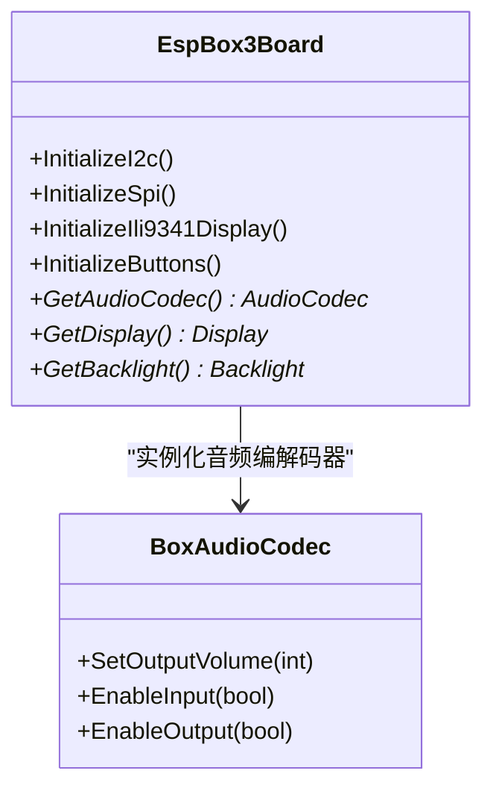
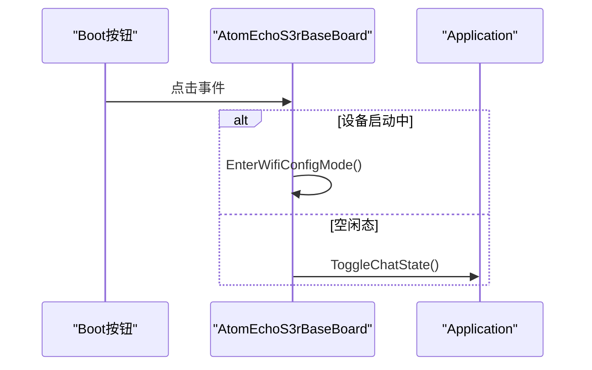
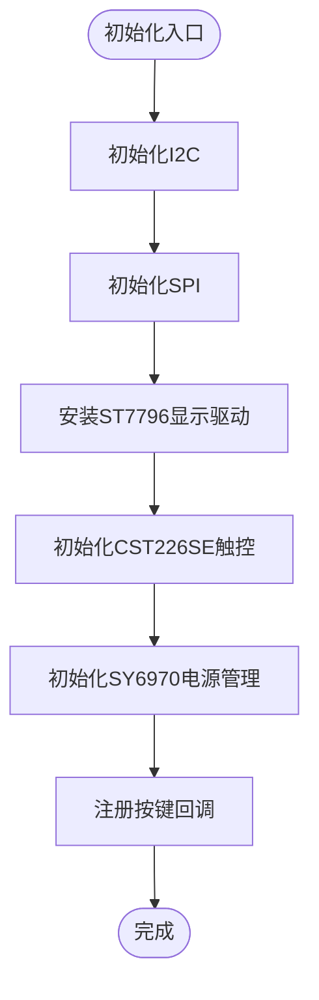
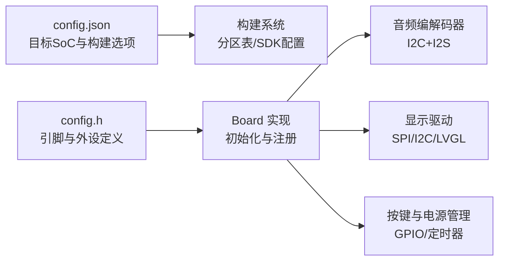

# 典型硬件平台介绍

<cite>
**本文引用的文件**
- [main/boards/esp-box/config.h](file://main/boards/esp-box/config.h)
- [main/boards/esp-box/config.json](file://main/boards/esp-box/config.json)
- [main/boards/esp-box/esp_box_board.cc](file://main/boards/esp-box/esp_box_board.cc)
- [main/boards/atom-echos3r/config.h](file://main/boards/atom-echos3r/config.h)
- [main/boards/atom-echos3r/config.json](file://main/boards/atom-echos3r/config.json)
- [main/boards/atom-echos3r/atom_echos3r.cc](file://main/boards/atom-echos3r/atom_echos3r.cc)
- [main/boards/lilygo-t-display-s3-pro-mvsrlora/config.h](file://main/boards/lilygo-t-display-s3-pro-mvsrlora/config.h)
- [main/boards/lilygo-t-display-s3-pro-mvsrlora/config.json](file://main/boards/lilygo-t-display-s3-pro-mvsrlora/config.json)
- [main/boards/lilygo-t-display-s3-pro-mvsrlora/lilygo-t-display-s3-pro-mvsrlora.cc](file://main/boards/lilygo-t-display-s3-pro-mvsrlora/lilygo-t-display-s3-pro-mvsrlora.cc)
- [main/boards/esp-box-3/config.h](file://main/boards/esp-box-3/config.h)
- [main/boards/esp-box-lite/config.h](file://main/boards/esp-box-lite/config.h)
- [main/boards/atk-dnesp32s3-box2-wifi/config.h](file://main/boards/atk-dnesp32s3-box2-wifi/config.h)
- [main/boards/atk-dnesp32s3-box2-wifi/atk_dnesp32s3_box2.cc](file://main/boards/atk-dnesp32s3-box2-wifi/atk_dnesp32s3_box2.cc)
- [main/boards/lilygo-t-display-p4/config.h](file://main/boards/lilygo-t-display-p4/config.h)
- [main/boards/lilygo-t-display-p4/t_display_p4_config.h](file://main/boards/lilygo-t-display-p4/t_display_p4_config.h)
- [main/boards/m5stack-core-s3/config.h](file://main/boards/m5stack-core-s3/config.h)
- [main/boards/m5stack-core-s3/cores3_audio_codec.h](file://main/boards/m5stack-core-s3/cores3_audio_codec.h)
- [main/boards/doit-s3-aibox/config.h](file://main/boards/doit-s3-aibox/config.h)
</cite>

## 目录
1. [简介](#简介)
2. [项目结构](#项目结构)
3. [核心组件](#核心组件)
4. [架构总览](#架构总览)
5. [详细组件分析](#详细组件分析)
6. [依赖关系分析](#依赖关系分析)
7. [性能考虑](#性能考虑)
8. [故障排查指南](#故障排查指南)
9. [结论](#结论)
10. [附录](#附录)

## 简介
本章节面向ESP32-AI项目的典型硬件平台，系统性梳理并对比多款主流开发板（如ESP Box系列、Atom Echo系列、Lilygo T-Display系列等），从硬件规格、引脚配置、外设连接、特殊功能等方面进行深入解析，并提供可复用的配置与使用指南，帮助开发者在不同平台上实现一致的功能体验。

## 项目结构
围绕“硬件平台”这一主题，项目采用按板级模块化的组织方式：每个硬件平台以独立目录呈现，包含该平台的配置头文件、构建配置JSON以及具体板级实现源码。下图给出与本章节相关的关键目录与文件关系：

```mermaid
graph TB
subgraph "硬件平台目录"
A["main/boards/esp-box"]
B["main/boards/atom-echos3r"]
C["main/boards/lilygo-t-display-s3-pro-mvsrlora"]
D["main/boards/esp-box-3"]
E["main/boards/esp-box-lite"]
F["main/boards/atk-dnesp32s3-box2-wifi"]
G["main/boards/lilygo-t-display-p4"]
H["main/boards/m5stack-core-s3"]
I["main/boards/doit-s3-aibox"]
end
A --> A1["config.h"]
A --> A2["config.json"]
A --> A3["esp_box_board.cc"]
B --> B1["config.h"]
B --> B2["config.json"]
B --> B3["atom_echos3r.cc"]
C --> C1["config.h"]
C --> C2["config.json"]
C --> C3["lilygo-t-display-s3-pro-mvsrlora.cc"]
D --> D1["config.h"]
E --> E1["config.h"]
F --> F1["config.h"]
F --> F2["atk_dnesp32s3_box2.cc"]
G --> G1["config.h"]
G --> G2["t_display_p4_config.h"]
H --> H1["config.h"]
H --> H2["cores3_audio_codec.h"]
I --> I1["config.h"]
```

图表来源
- [main/boards/esp-box/config.h:1-42](file://main/boards/esp-box/config.h#L1-L42)
- [main/boards/esp-box/config.json:1-9](file://main/boards/esp-box/config.json#L1-L9)
- [main/boards/esp-box/esp_box_board.cc:1-175](file://main/boards/esp-box/esp_box_board.cc#L1-L175)
- [main/boards/atom-echos3r/config.h:1-30](file://main/boards/atom-echos3r/config.h#L1-L30)
- [main/boards/atom-echos3r/config.json:1-13](file://main/boards/atom-echos3r/config.json#L1-L13)
- [main/boards/atom-echos3r/atom_echos3r.cc:1-92](file://main/boards/atom-echos3r/atom_echos3r.cc#L1-L92)
- [main/boards/lilygo-t-display-s3-pro-mvsrlora/config.h:1-48](file://main/boards/lilygo-t-display-s3-pro-mvsrlora/config.h#L1-L48)
- [main/boards/lilygo-t-display-s3-pro-mvsrlora/config.json:1-9](file://main/boards/lilygo-t-display-s3-pro-mvsrlora/config.json#L1-L9)
- [main/boards/lilygo-t-display-s3-pro-mvsrlora/lilygo-t-display-s3-pro-mvsrlora.cc:1-284](file://main/boards/lilygo-t-display-s3-pro-mvsrlora/lilygo-t-display-s3-pro-mvsrlora.cc#L1-L284)
- [main/boards/esp-box-3/config.h:1-42](file://main/boards/esp-box-3/config.h#L1-L42)
- [main/boards/esp-box-lite/config.h:1-40](file://main/boards/esp-box-lite/config.h#L1-L40)
- [main/boards/atk-dnesp32s3-box2-wifi/config.h:1-72](file://main/boards/atk-dnesp32s3-box2-wifi/config.h#L1-L72)
- [main/boards/atk-dnesp32s3-box2-wifi/atk_dnesp32s3_box2.cc:1-457](file://main/boards/atk-dnesp32s3-box2-wifi/atk_dnesp32s3_box2.cc#L1-L457)
- [main/boards/lilygo-t-display-p4/config.h:1-77](file://main/boards/lilygo-t-display-p4/config.h#L1-L77)
- [main/boards/lilygo-t-display-p4/t_display_p4_config.h:1-233](file://main/boards/lilygo-t-display-p4/t_display_p4_config.h#L1-L233)
- [main/boards/m5stack-core-s3/config.h:1-67](file://main/boards/m5stack-core-s3/config.h#L1-L67)
- [main/boards/m5stack-core-s3/cores3_audio_codec.h:1-38](file://main/boards/m5stack-core-s3/cores3_audio_codec.h#L1-L38)
- [main/boards/doit-s3-aibox/config.h:1-30](file://main/boards/doit-s3-aibox/config.h#L1-L30)

章节来源
- [main/boards/esp-box/config.h:1-42](file://main/boards/esp-box/config.h#L1-L42)
- [main/boards/esp-box/config.json:1-9](file://main/boards/esp-box/config.json#L1-L9)
- [main/boards/esp-box/esp_box_board.cc:1-175](file://main/boards/esp-box/esp_box_board.cc#L1-L175)
- [main/boards/atom-echos3r/config.h:1-30](file://main/boards/atom-echos3r/config.h#L1-L30)
- [main/boards/atom-echos3r/config.json:1-13](file://main/boards/atom-echos3r/config.json#L1-L13)
- [main/boards/atom-echos3r/atom_echos3r.cc:1-92](file://main/boards/atom-echos3r/atom_echos3r.cc#L1-L92)
- [main/boards/lilygo-t-display-s3-pro-mvsrlora/config.h:1-48](file://main/boards/lilygo-t-display-s3-pro-mvsrlora/config.h#L1-L48)
- [main/boards/lilygo-t-display-s3-pro-mvsrlora/config.json:1-9](file://main/boards/lilygo-t-display-s3-pro-mvsrlora/config.json#L1-L9)
- [main/boards/lilygo-t-display-s3-pro-mvsrlora/lilygo-t-display-s3-pro-mvsrlora.cc:1-284](file://main/boards/lilygo-t-display-s3-pro-mvsrlora/lilygo-t-display-s3-pro-mvsrlora.cc#L1-L284)
- [main/boards/esp-box-3/config.h:1-42](file://main/boards/esp-box-3/config.h#L1-L42)
- [main/boards/esp-box-lite/config.h:1-40](file://main/boards/esp-box-lite/config.h#L1-L40)
- [main/boards/atk-dnesp32s3-box2-wifi/config.h:1-72](file://main/boards/atk-dnesp32s3-box2-wifi/config.h#L1-L72)
- [main/boards/atk-dnesp32s3-box2-wifi/atk_dnesp32s3_box2.cc:1-457](file://main/boards/atk-dnesp32s3-box2-wifi/atk_dnesp32s3_box2.cc#L1-L457)
- [main/boards/lilygo-t-display-p4/config.h:1-77](file://main/boards/lilygo-t-display-p4/config.h#L1-L77)
- [main/boards/lilygo-t-display-p4/t_display_p4_config.h:1-233](file://main/boards/lilygo-t-display-p4/t_display_p4_config.h#L1-L233)
- [main/boards/m5stack-core-s3/config.h:1-67](file://main/boards/m5stack-core-s3/config.h#L1-L67)
- [main/boards/m5stack-core-s3/cores3_audio_codec.h:1-38](file://main/boards/m5stack-core-s3/cores3_audio_codec.h#L1-L38)
- [main/boards/doit-s3-aibox/config.h:1-30](file://main/boards/doit-s3-aibox/config.h#L1-L30)

## 核心组件
- 音频编解码器抽象与平台适配
  - 各平台通过统一的音频编解码器接口对接具体硬件，如ES8311、ES7210、AW88298等，配置项集中在config.h中，运行时由对应Board类实例化。
- 显示子系统
  - LCD/MIPI DSI屏幕通过SPI/I2C/LVGL等驱动接入，显示尺寸、镜像、偏移等参数在config.h中定义；部分平台还包含背光PWM控制。
- 按键与电源管理
  - Boot按键用于进入配网模式或切换聊天状态；部分平台集成IO扩展器、电源管理定时器与低功耗策略。
- 构建目标与SDK配置
  - config.json中的target字段指定目标SoC，build段可附加sdkconfig选项，确保分区表与Flash大小匹配。

章节来源
- [main/boards/esp-box/config.h:6-42](file://main/boards/esp-box/config.h#L6-L42)
- [main/boards/esp-box/esp_box_board.cc:147-171](file://main/boards/esp-box/esp_box_board.cc#L147-L171)
- [main/boards/atom-echos3r/config.h:8-30](file://main/boards/atom-echos3r/config.h#L8-L30)
- [main/boards/atom-echos3r/atom_echos3r.cc:73-88](file://main/boards/atom-echos3r/atom_echos3r.cc#L73-L88)
- [main/boards/lilygo-t-display-s3-pro-mvsrlora/config.h:28-48](file://main/boards/lilygo-t-display-s3-pro-mvsrlora/config.h#L28-L48)
- [main/boards/atk-dnesp32s3-box2-wifi/config.h:6-72](file://main/boards/atk-dnesp32s3-box2-wifi/config.h#L6-L72)
- [main/boards/lilygo-t-display-p4/config.h:51-77](file://main/boards/lilygo-t-display-p4/config.h#L51-L77)

## 架构总览
下图展示了典型硬件平台的软件架构：Board基类派生出各平台实现，负责初始化I2C/SPI、显示面板、按键与电源管理；音频编解码器作为可插拔组件，依据config.h中的引脚与地址配置进行实例化；应用层通过Application统一调度设备状态与功能。

```mermaid
graph TB
App["Application<br/>应用层"] --> BoardBase["Board 基类<br/>统一接口"]
BoardBase --> EspBox["EspBox3Board<br/>ESP Box 系列"]
BoardBase --> AtomEcho["AtomEchoS3rBaseBoard<br/>Atom Echo 系列"]
BoardBase --> TDisplay["LilygoTDisplays3ProMVSRLoraBoard<br/>T-Display Pro 系列"]
BoardBase --> ATKBox["atk_dnesp32s3_box2_wifi<br/>ATK DNESP32S3 Box 系列"]
BoardBase --> TDisplayP4["T-Display P4 Board<br/>Lilygo P4 系列"]
BoardBase --> M5CoreS3["M5Stack CoreS3 Board<br/>M5Stack 系列"]
BoardBase --> DoItAiBox["DoIt S3 Ai-Box Board<br/>DoIt 系列"]
EspBox --> CodecA["Es8311/Es7210 Audio Codec<br/>I2C+I2S"]
AtomEcho --> CodecB["Es8311 Audio Codec<br/>I2C+I2S"]
TDisplay --> CodecC["定制音频编解码器<br/>I2S Mic/Spk"]
ATKBox --> CodecD["Es8389 Audio Codec<br/>I2C+I2S"]
TDisplayP4 --> CodecE["Es8311 Audio Codec<br/>I2C+I2S"]
M5CoreS3 --> CodecF["AW88298/ES7210 Audio Codec<br/>I2C+I2S"]
DoItAiBox --> CodecG["定制音频引脚配置<br/>I2S Mic/Spk"]
EspBox --> DispA["ILI9341 LCD<br/>SPI"]
TDisplay --> DispB["ST7796 LCD<br/>SPI"]
ATKBox --> DispC["ST7789 LCD<br/>I80"]
TDisplayP4 --> DispD["HI8561/RM69A10 MIPI DSI<br/>LVGL"]
M5CoreS3 --> DispE["内置/外接LCD<br/>I2C/SPI"]
DoItAiBox --> DispF["按键/指示灯<br/>GPIO"]
EspBox --> BtnA["Boot Button<br/>进入配网/切换状态"]
AtomEcho --> BtnB["User Button"]
TDisplay --> BtnC["Boot Button + 触摸"]
ATKBox --> BtnD["L/M/R 按键 + 电源管理"]
TDisplayP4 --> BtnE["Boot Button"]
M5CoreS3 --> BtnF["Boot Button"]
DoItAiBox --> BtnG["多按键组合"]
EspBox --> PwrA["背光 PWM 控制"]
TDisplay --> PwrB["背光 PWM 控制"]
ATKBox --> PwrC["电源管理定时器/低功耗"]
TDisplayP4 --> PwrD["背光控制"]
M5CoreS3 --> PwrE["背光控制"]
DoItAiBox --> PwrF["LED/GPIO"]
```

图表来源
- [main/boards/esp-box/esp_box_board.cc:138-171](file://main/boards/esp-box/esp_box_board.cc#L138-L171)
- [main/boards/atom-echos3r/atom_echos3r.cc:14-88](file://main/boards/atom-echos3r/atom_echos3r.cc#L14-L88)
- [main/boards/lilygo-t-display-s3-pro-mvsrlora/lilygo-t-display-s3-pro-mvsrlora.cc:70-281](file://main/boards/lilygo-t-display-s3-pro-mvsrlora/lilygo-t-display-s3-pro-mvsrlora.cc#L70-L281)
- [main/boards/atk-dnesp32s3-box2-wifi/atk_dnesp32s3_box2.cc:23-451](file://main/boards/atk-dnesp32s3-box2-wifi/atk_dnesp32s3_box2.cc#L23-L451)
- [main/boards/lilygo-t-display-p4/config.h:20-77](file://main/boards/lilygo-t-display-p4/config.h#L20-L77)
- [main/boards/m5stack-core-s3/config.h:8-67](file://main/boards/m5stack-core-s3/config.h#L8-L67)
- [main/boards/doit-s3-aibox/config.h:6-30](file://main/boards/doit-s3-aibox/config.h#L6-L30)

## 详细组件分析

### ESP Box 系列
- 硬件规格与外设
  - 显示：320×240像素ILI9341，SPI接口，背光由GPIO控制。
  - 音频：ES8311+ES7210双芯片方案，I2C+I2S引脚在config.h中定义。
  - 按键：Boot按钮用于进入WiFi配网模式或切换聊天状态。
- 引脚配置要点
  - I2S引脚：MCLK、WS、BCLK、DIN、DOUT均在config.h中明确。
  - I2C引脚：SDA/SCL及音频编解码器地址在config.h中定义。
  - 背光：DISPLAY_BACKLIGHT_PIN与输出极性在config.h中设置。
- 使用指南
  - 在Board实现中，先初始化I2C与SPI，再安装显示驱动与背光控制，最后注册按键回调。
  - 音频编解码器通过BoxAudioCodec实例化，传入I2C句柄与引脚配置。
- 优点与适用场景
  - 屏幕清晰、音频方案成熟，适合语音交互与多媒体演示。
- 缺点与注意事项
  - 需要正确配置I2C地址与I2S引脚，避免冲突。

图表来源
- [main/boards/esp-box/esp_box_board.cc:38-171](file://main/boards/esp-box/esp_box_board.cc#L38-L171)
- [main/boards/esp-box/config.h:6-42](file://main/boards/esp-box/config.h#L6-L42)

章节来源
- [main/boards/esp-box/config.h:6-42](file://main/boards/esp-box/config.h#L6-L42)
- [main/boards/esp-box/config.json:1-9](file://main/boards/esp-box/config.json#L1-L9)
- [main/boards/esp-box/esp_box_board.cc:1-175](file://main/boards/esp-box/esp_box_board.cc#L1-L175)

### Atom Echo 系列（AtomEchoS3R）
- 硬件规格与外设
  - 音频：ES8311单芯片，I2C+I2S引脚在config.h中定义。
  - 显示：未在该板级实现中启用LCD，主要通过I2C扫描与按键交互。
- 引脚配置要点
  - I2C引脚与音频编解码器地址在config.h中定义。
  - Boot按钮映射到USER_BUTTON_GPIO。
- 使用指南
  - 初始化I2C后执行I2C设备探测，随后注册按键回调处理配网与聊天状态切换。
- 优点与适用场景
  - 开发调试友好，便于验证I2C与音频链路。
- 缺点与注意事项
  - 无内置显示，需外接屏幕或通过串口观察I2C扫描结果。

图表来源
- [main/boards/atom-echos3r/atom_echos3r.cc:56-71](file://main/boards/atom-echos3r/atom_echos3r.cc#L56-L71)

章节来源
- [main/boards/atom-echos3r/config.h:1-30](file://main/boards/atom-echos3r/config.h#L1-L30)
- [main/boards/atom-echos3r/config.json:1-13](file://main/boards/atom-echos3r/config.json#L1-L13)
- [main/boards/atom-echos3r/atom_echos3r.cc:1-92](file://main/boards/atom-echos3r/atom_echos3r.cc#L1-L92)

### Lilygo T-Display 系列（T-Display S3 Pro MVSRLora）
- 硬件规格与外设
  - 显示：ST7796，SPI接口，支持背光控制与电源节省定时器。
  - 音频：定制音频编解码器，分别配置麦克风与扬声器I2S引脚。
  - 触控：集成CST226SE电容触控，I2C接口。
  - 电源：SY6970电源管理芯片，配合PowerSaveTimer实现低功耗。
- 引脚配置要点
  - 显示：CS、DC、SCLK、MOSI、RST、BL等在config.h中定义。
  - 音频：Mic与Spk的BCLK、LRCK、DATA与使能引脚在config.h中定义。
  - 触控：I2C SDA/SCL在config.h中定义。
- 使用指南
  - 初始化I2C与SPI，安装ST7796驱动，创建背光控制对象。
  - 注册按键回调，结合PowerSaveTimer在空闲时降低亮度与进入睡眠。
- 优点与适用场景
  - 触控交互体验佳，具备完善的电源管理策略，适合便携式语音助手。
- 缺点与注意事项
  - 需要正确配置触控与电源芯片地址，避免I2C冲突。

图表来源
- [main/boards/lilygo-t-display-s3-pro-mvsrlora/lilygo-t-display-s3-pro-mvsrlora.cc:92-246](file://main/boards/lilygo-t-display-s3-pro-mvsrlora/lilygo-t-display-s3-pro-mvsrlora.cc#L92-L246)

章节来源
- [main/boards/lilygo-t-display-s3-pro-mvsrlora/config.h:1-48](file://main/boards/lilygo-t-display-s3-pro-mvsrlora/config.h#L1-L48)
- [main/boards/lilygo-t-display-s3-pro-mvsrlora/config.json:1-9](file://main/boards/lilygo-t-display-s3-pro-mvsrlora/config.json#L1-L9)
- [main/boards/lilygo-t-display-s3-pro-mvsrlora/lilygo-t-display-s3-pro-mvsrlora.cc:1-284](file://main/boards/lilygo-t-display-s3-pro-mvsrlora/lilygo-t-display-s3-pro-mvsrlora.cc#L1-L284)

### ATK DNESP32S3 Box 系列（Box2 WiFi）
- 硬件规格与外设
  - 显示：ST7789，I80接口，支持背光控制与色彩参数调优。
  - 音频：ES8389编解码器，I2C+I2S引脚在config.h中定义。
  - 扩展：PCA9555 IO扩展器，提供多路按键与电源控制信号。
  - 电源：集成电源管理与低功耗定时器，支持充电状态检测与自动关机。
- 引针配置要点
  - I2C引脚与音频编解码器地址在config.h中定义。
  - IO扩展器引脚位定义与方向掩码在config.h中定义。
  - 显示：CS、DC、RD、WR、D0-D7等在config.h中定义。
- 使用指南
  - 初始化I2C与IO扩展器，配置输出/输入方向与初始电平。
  - 初始化ST7789显示驱动，注册L/M/R按键回调，实现音量调节与配网模式切换。
  - 启动PowerSaveTimer与PowerManager，根据充电状态动态调整省电策略。
- 优点与适用场景
  - 功能丰富，适合需要多按键与电源管理的综合应用。
- 缺点与注意事项
  - IO扩展器引脚较多，需注意电平与方向配置，避免误触发。

章节来源
- [main/boards/atk-dnesp32s3-box2-wifi/config.h:1-72](file://main/boards/atk-dnesp32s3-box2-wifi/config.h#L1-L72)
- [main/boards/atk-dnesp32s3-box2-wifi/atk_dnesp32s3_box2.cc:1-457](file://main/boards/atk-dnesp32s3-box2-wifi/atk_dnesp32s3_box2.cc#L1-L457)

### Lilygo T-Display P4 系列
- 硬件规格与外设
  - 显示：支持HI8561或RM69A10 MIPI DSI屏幕，分辨率更高，LVGL色彩格式可选RGB565或RGB888。
  - 音频：ES8311编解码器，I2C+I2S引脚在config.h中定义。
  - 外设：通过t_display_p4_config.h集中定义大量外设引脚（I2C、SPI、SDIO、GPS、ICM20948、SX1262等）。
- 引脚配置要点
  - 屏幕类型选择宏（CONFIG_SCREEN_TYPE_*）决定分辨率与DSI参数。
  - 彩色格式宏（CONFIG_SCREEN_PIXEL_FORMAT_*）决定位深与LVGL颜色格式。
  - 音频引脚与I2C地址在config.h中定义。
- 使用指南
  - 根据屏幕类型宏选择对应的分辨率与MIPI参数，初始化LVGL与屏幕驱动。
  - 配置I2C与I2S引脚，实例化音频编解码器。
- 优点与适用场景
  - 高分辨率屏幕与丰富的外设接口，适合多媒体与物联网综合应用。
- 缺点与注意事项
  - 外设引脚众多，需按需裁剪与配置，避免引脚冲突。

章节来源
- [main/boards/lilygo-t-display-p4/config.h:1-77](file://main/boards/lilygo-t-display-p4/config.h#L1-L77)
- [main/boards/lilygo-t-display-p4/t_display_p4_config.h:1-233](file://main/boards/lilygo-t-display-p4/t_display_p4_config.h#L1-L233)

### M5Stack CoreS3 系列
- 硬件规格与外设
  - 音频：AW88298+ES7210双芯片方案，I2C+I2S引脚在config.h中定义。
  - 显示：未在该板级实现中启用LCD，但预留了I2C引脚与背光控制。
  - 摄像头：通过config.h中定义的摄像头引脚连接外部摄像头模块。
- 引脚配置要点
  - I2S引脚：MCLK、WS、BCLK、DIN、DOUT在config.h中定义。
  - I2C引脚：SDA/SCL与编解码器地址在config.h中定义。
  - 摄像头：XCLK、D0-D7、VSYNC、HREF、PCLK等在config.h中定义。
- 使用指南
  - 实例化CoreS3AudioCodec，传入I2C句柄与引脚配置。
  - 如需显示，可参考其他平台的显示驱动接入流程。
- 优点与适用场景
  - 音频与摄像头能力较强，适合AI视觉与语音结合的应用。
- 缺点与注意事项
  - 需要额外的显示与摄像头模块，成本与连线复杂度较高。

章节来源
- [main/boards/m5stack-core-s3/config.h:1-67](file://main/boards/m5stack-core-s3/config.h#L1-L67)
- [main/boards/m5stack-core-s3/cores3_audio_codec.h:1-38](file://main/boards/m5stack-core-s3/cores3_audio_codec.h#L1-L38)

### DoIt S3 Ai-Box 系列
- 硬件规格与外设
  - 音频：独立的I2S Mic/Spk引脚配置，便于直接连接麦克风与扬声器。
  - 按键：多按键组合（BOOT、VOLUME_UP/DOWN、RESET等），GPIO映射在config.h中定义。
- 引脚配置要点
  - I2S Mic：WS、SCK、DIN在config.h中定义。
  - I2S Spk：DOUT、BCLK、LRCK在config.h中定义。
  - 按键：BOOT_BUTTON_GPIO、VOLUME_UP_BUTTON_GPIO、VOLUME_DOWN_BUTTON_GPIO等在config.h中定义。
- 使用指南
  - 配置I2S Mic/Spk引脚，实例化对应音频编解码器。
  - 注册按键回调，实现音量调节与配网模式切换。
- 优点与适用场景
  - 音频引脚独立配置，便于快速原型开发。
- 缺点与注意事项
  - 仅提供基础按键与音频接口，需自行扩展显示与网络模块。

章节来源
- [main/boards/doit-s3-aibox/config.h:1-30](file://main/boards/doit-s3-aibox/config.h#L1-L30)

## 依赖关系分析
- 板级实现与通用组件
  - 各Board类继承自公共基类，统一注册音频编解码器、显示与按键处理逻辑。
- 配置文件与构建系统
  - config.json中的target字段与sdkconfig_append影响分区表与Flash大小，确保不同平台的资源分配合理。
- 外设依赖
  - 显示驱动依赖SPI/I2C/LVGL等组件；音频编解码器依赖I2C与I2S；电源管理依赖定时器与IO扩展器。

图表来源
- [main/boards/esp-box/config.json:1-9](file://main/boards/esp-box/config.json#L1-L9)
- [main/boards/atom-echos3r/config.json:1-13](file://main/boards/atom-echos3r/config.json#L1-L13)
- [main/boards/atk-dnesp32s3-box2-wifi/config.h:1-72](file://main/boards/atk-dnesp32s3-box2-wifi/config.h#L1-L72)

章节来源
- [main/boards/esp-box/config.json:1-9](file://main/boards/esp-box/config.json#L1-L9)
- [main/boards/atom-echos3r/config.json:1-13](file://main/boards/atom-echos3r/config.json#L1-L13)
- [main/boards/atk-dnesp32s3-box2-wifi/config.h:1-72](file://main/boards/atk-dnesp32s3-box2-wifi/config.h#L1-L72)

## 性能考虑
- 音频采样率与I2S配置
  - 不同平台采用24kHz或16kHz采样率，需确保编解码器与音频处理器匹配，避免失真或资源不足。
- 显示刷新与背光控制
  - 高分辨率屏幕（如T-Display P4）建议使用LVGL优化渲染路径，合理设置背光占空比以平衡功耗。
- 电源管理与低功耗
  - 集成PowerSaveTimer与IO扩展器的平台可在空闲时降低亮度、关闭非必要外设，延长电池续航。
- I2C与SPI速率
  - 显示与触摸等外设建议使用合适的时钟频率，避免I2C超时或SPI传输错误。

## 故障排查指南
- I2C设备探测失败
  - 检查config.h中的SDA/SCL引脚是否与其他外设冲突；确认上拉电阻与电平匹配。
  - 参考平台实现中的I2C探测函数，逐地址扫描定位问题。
- 显示初始化异常
  - 确认SPI引脚与显示驱动参数（如CS、DC、RST、像素格式）与config.h一致。
  - 对于I80接口（如ATK Box2），检查RD引脚电平与时序参数。
- 音频无声或杂音
  - 核对I2S引脚与编解码器地址；检查MCLK、BCLK、WS连接是否正确。
  - 调整采样率与音量，避免过高的采样率导致CPU压力过大。
- 按键无响应或误触
  - 检查按键GPIO配置与上拉/下拉设置；对于IO扩展器平台，确认方向与初始电平。
- 电源管理异常
  - 确认电源芯片地址与寄存器配置；检查低功耗定时器回调逻辑与背光控制。

章节来源
- [main/boards/esp-box/esp_box_board.cc:44-59](file://main/boards/esp-box/esp_box_board.cc#L44-L59)
- [main/boards/atom-echos3r/atom_echos3r.cc:35-54](file://main/boards/atom-echos3r/atom_echos3r.cc#L35-L54)
- [main/boards/lilygo-t-display-s3-pro-mvsrlora/lilygo-t-display-s3-pro-mvsrlora.cc:109-128](file://main/boards/lilygo-t-display-s3-pro-mvsrlora/lilygo-t-display-s3-pro-mvsrlora.cc#L109-L128)
- [main/boards/atk-dnesp32s3-box2-wifi/atk_dnesp32s3_box2.cc:160-175](file://main/boards/atk-dnesp32s3-box2-wifi/atk_dnesp32s3_box2.cc#L160-L175)

## 结论
通过对ESP Box系列、Atom Echo系列、Lilygo T-Display系列等典型硬件平台的深入分析，可以看出该项目在硬件抽象层实现了良好的可移植性：统一的Board接口、可插拔的音频与显示驱动，以及灵活的构建配置，使得在不同平台上复用相同功能成为可能。开发者可根据应用场景选择合适的平台：追求音频与显示一体化的可选ESP Box系列；注重触控与省电的可选T-Display系列；需要高分辨率与丰富外设的可选T-Display P4系列；而DoIt Ai-Box则适合快速原型与基础音频应用。

## 附录
- 引脚映射与外设接口速查（基于config.h与平台实现）
  - ESP Box系列：I2C（SDA/SCL）、I2S（MCLK/WS/BCLK/DIN/DOUT）、SPI（CS/DC/SCLK/MOSI）、背光控制。
  - Atom Echo系列：I2C（SDA/SCL）、I2S（MCLK/WS/BCLK/DIN/DOUT）、按键。
  - T-Display系列（Pro MVSRLora）：I2C（触控/电源）、I2S（Mic/Spk）、SPI（CS/DC/SCLK/MOSI）、背光、电源定时器。
  - ATK Box2 WiFi：I2C（编解码器/IO扩展器）、I2S（ES8389）、I80（ST7789）、多按键、电源管理。
  - T-Display P4：I2C（ES8311）、I2S（ES8311）、MIPI DSI（HI8561/RM69A10）、LVGL色彩格式选择。
  - M5Stack CoreS3：I2C（编解码器）、I2S（AW88298/ES7210）、摄像头引脚。
  - DoIt S3 Ai-Box：I2S Mic/Spk、按键GPIO。

- 硬件连接图示意（概念性）
  - 音频链路：I2S Mic/Spk → 编解码器 → SoC I2S接口。
  - 显示链路：SoC SPI/I2C → 显示驱动 → 屏幕。
  - 触控链路：SoC I2C → 触控IC → 触控中断/轮询。
  - 电源链路：电源管理芯片 → 电池/USB → IO扩展器（可选） → 各外设。