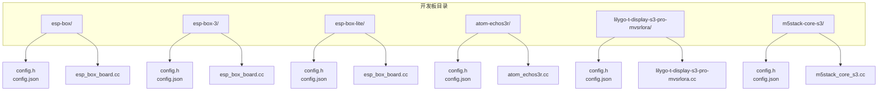
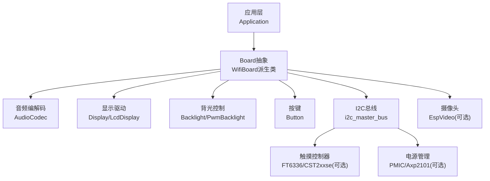
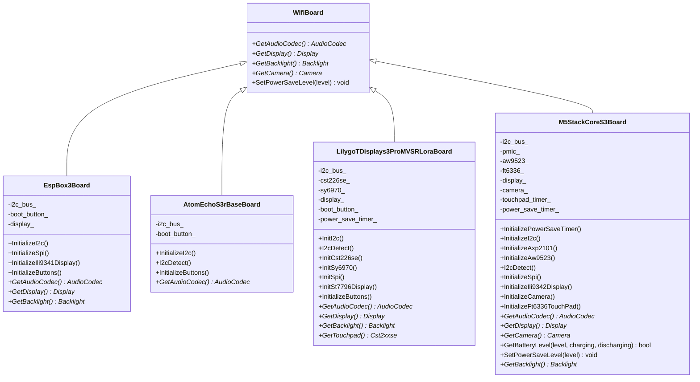
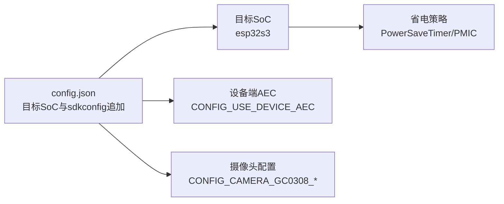

# 开发板系列

<cite>
**本文引用的文件**
- [main/boards/esp-box/config.h](file://main/boards/esp-box/config.h)
- [main/boards/esp-box/config.json](file://main/boards/esp-box/config.json)
- [main/boards/esp-box/esp_box_board.cc](file://main/boards/esp-box/esp_box_board.cc)
- [main/boards/esp-box-3/config.h](file://main/boards/esp-box-3/config.h)
- [main/boards/esp-box-3/config.json](file://main/boards/esp-box-3/config.json)
- [main/boards/esp-box-lite/config.h](file://main/boards/esp-box-lite/config.h)
- [main/boards/esp-box-lite/config.json](file://main/boards/esp-box-lite/config.json)
- [main/boards/atom-echos3r/config.h](file://main/boards/atom-echos3r/config.h)
- [main/boards/atom-echos3r/config.json](file://main/boards/atom-echos3r/config.json)
- [main/boards/atom-echos3r/atom_echos3r.cc](file://main/boards/atom-echos3r/atom_echos3r.cc)
- [main/boards/lilygo-t-display-s3-pro-mvsrlora/config.h](file://main/boards/lilygo-t-display-s3-pro-mvsrlora/config.h)
- [main/boards/lilygo-t-display-s3-pro-mvsrlora/config.json](file://main/boards/lilygo-t-display-s3-pro-mvsrlora/config.json)
- [main/boards/lilygo-t-display-s3-pro-mvsrlora/lilygo-t-display-s3-pro-mvsrlora.cc](file://main/boards/lilygo-t-display-s3-pro-mvsrlora/lilygo-t-display-s3-pro-mvsrlora.cc)
- [main/boards/m5stack-core-s3/config.h](file://main/boards/m5stack-core-s3/config.h)
- [main/boards/m5stack-core-s3/config.json](file://main/boards/m5stack-core-s3/config.json)
- [main/boards/m5stack-core-s3/m5stack_core_s3.cc](file://main/boards/m5stack-core-s3/m5stack_core_s3.cc)
</cite>

## 目录
1. [简介](#简介)
2. [项目结构](#项目结构)
3. [核心组件](#核心组件)
4. [架构总览](#架构总览)
5. [详细组件分析](#详细组件分析)
6. [依赖关系分析](#依赖关系分析)
7. [性能考量](#性能考量)
8. [故障排查指南](#故障排查指南)
9. [结论](#结论)
10. [附录](#附录)

## 简介
本章节面向ESP32-AI项目的开发板使用者与二次开发者，系统梳理主流开发板系列（ESP Box系列、Atom Echo系列、Lilygo T-Display系列、M5Stack系列）的硬件规格、引脚布局、外设接口与显示能力，并提供可操作的硬件连接指南与选型建议。通过阅读本章节，您将能够基于项目需求快速选择合适的开发板并完成麦克风、扬声器、屏幕、按键等外设的正确连接。

## 项目结构
本项目采用“按板级独立目录”的组织方式，每个开发板在main/boards下拥有独立子目录，包含该板的配置头文件、构建配置、以及具体实现源文件。以ESP Box系列为例，其目录包含config.h、config.json与esp_box_board.cc；Atom Echo S3 R包含config.h、config.json与atom_echos3r.cc；Lilygo T-Display S3 Pro MVSRLora包含config.h、config.json与lilygo-t-display-s3-pro-mvsrlora.cc；M5Stack CoreS3包含config.h、config.json与m5stack_core_s3.cc。

图表来源
- [main/boards/esp-box/config.h:1-42](file://main/boards/esp-box/config.h#L1-L42)
- [main/boards/esp-box/config.json:1-9](file://main/boards/esp-box/config.json#L1-L9)
- [main/boards/esp-box/esp_box_board.cc:1-175](file://main/boards/esp-box/esp_box_board.cc#L1-L175)
- [main/boards/esp-box-3/config.h:1-42](file://main/boards/esp-box-3/config.h#L1-L42)
- [main/boards/esp-box-3/config.json:1-11](file://main/boards/esp-box-3/config.json#L1-L11)
- [main/boards/esp-box-lite/config.h:1-40](file://main/boards/esp-box-lite/config.h#L1-L40)
- [main/boards/esp-box-lite/config.json:1-11](file://main/boards/esp-box-lite/config.json#L1-L11)
- [main/boards/atom-echos3r/config.h:1-30](file://main/boards/atom-echos3r/config.h#L1-L30)
- [main/boards/atom-echos3r/config.json:1-13](file://main/boards/atom-echos3r/config.json#L1-L13)
- [main/boards/atom-echos3r/atom_echos3r.cc:1-92](file://main/boards/atom-echos3r/atom_echos3r.cc#L1-L92)
- [main/boards/lilygo-t-display-s3-pro-mvsrlora/config.h:1-48](file://main/boards/lilygo-t-display-s3-pro-mvsrlora/config.h#L1-L48)
- [main/boards/lilygo-t-display-s3-pro-mvsrlora/config.json:1-9](file://main/boards/lilygo-t-display-s3-pro-mvsrlora/config.json#L1-L9)
- [main/boards/lilygo-t-display-s3-pro-mvsrlora/lilygo-t-display-s3-pro-mvsrlora.cc:1-284](file://main/boards/lilygo-t-display-s3-pro-mvsrlora/lilygo-t-display-s3-pro-mvsrlora.cc#L1-L284)
- [main/boards/m5stack-core-s3/config.h:1-67](file://main/boards/m5stack-core-s3/config.h#L1-L67)
- [main/boards/m5stack-core-s3/config.json:1-14](file://main/boards/m5stack-core-s3/config.json#L1-L14)
- [main/boards/m5stack-core-s3/m5stack_core_s3.cc:1-397](file://main/boards/m5stack-core-s3/m5stack_core_s3.cc#L1-L397)

章节来源
- [main/boards/esp-box/config.h:1-42](file://main/boards/esp-box/config.h#L1-L42)
- [main/boards/esp-box/config.json:1-9](file://main/boards/esp-box/config.json#L1-L9)
- [main/boards/esp-box/esp_box_board.cc:1-175](file://main/boards/esp-box/esp_box_board.cc#L1-L175)
- [main/boards/esp-box-3/config.h:1-42](file://main/boards/esp-box-3/config.h#L1-L42)
- [main/boards/esp-box-3/config.json:1-11](file://main/boards/esp-box-3/config.json#L1-L11)
- [main/boards/esp-box-lite/config.h:1-40](file://main/boards/esp-box-lite/config.h#L1-L40)
- [main/boards/esp-box-lite/config.json:1-11](file://main/boards/esp-box-lite/config.json#L1-L11)
- [main/boards/atom-echos3r/config.h:1-30](file://main/boards/atom-echos3r/config.h#L1-L30)
- [main/boards/atom-echos3r/config.json:1-13](file://main/boards/atom-echos3r/config.json#L1-L13)
- [main/boards/atom-echos3r/atom_echos3r.cc:1-92](file://main/boards/atom-echos3r/atom_echos3r.cc#L1-L92)
- [main/boards/lilygo-t-display-s3-pro-mvsrlora/config.h:1-48](file://main/boards/lilygo-t-display-s3-pro-mvsrlora/config.h#L1-L48)
- [main/boards/lilygo-t-display-s3-pro-mvsrlora/config.json:1-9](file://main/boards/lilygo-t-display-s3-pro-mvsrlora/config.json#L1-L9)
- [main/boards/lilygo-t-display-s3-pro-mvsrlora/lilygo-t-display-s3-pro-mvsrlora.cc:1-284](file://main/boards/lilygo-t-display-s3-pro-mvsrlora/lilygo-t-display-s3-pro-mvsrlora.cc#L1-L284)
- [main/boards/m5stack-core-s3/config.h:1-67](file://main/boards/m5stack-core-s3/config.h#L1-L67)
- [main/boards/m5stack-core-s3/config.json:1-14](file://main/boards/m5stack-core-s3/config.json#L1-L14)
- [main/boards/m5stack-core-s3/m5stack_core_s3.cc:1-397](file://main/boards/m5stack-core-s3/m5stack_core_s3.cc#L1-L397)

## 核心组件
- 音频编解码与I2S：各板均定义了音频采样率、I2S引脚映射、编解码器地址与功放引脚，用于麦克风采集与扬声器播放。
- 显示系统：多数板使用SPI接口驱动LCD面板，部分板包含背光PWM控制与旋转/镜像参数。
- 按键与引导：Boot按钮用于进入配网模式或切换聊天状态，部分板支持双击切换AEC模式。
- I2C设备检测：多块板在初始化阶段进行I2C地址扫描，便于确认外设连接状态。
- 电源与节能：部分板集成PMIC与PowerSaveTimer，支持低功耗与自动休眠策略。

章节来源
- [main/boards/esp-box/config.h:6-21](file://main/boards/esp-box/config.h#L6-L21)
- [main/boards/esp-box/esp_box_board.cc:44-59](file://main/boards/esp-box/esp_box_board.cc#L44-L59)
- [main/boards/esp-box/esp_box_board.cc:92-136](file://main/boards/esp-box/esp_box_board.cc#L92-L136)
- [main/boards/esp-box/esp_box_board.cc:139-171](file://main/boards/esp-box/esp_box_board.cc#L139-L171)
- [main/boards/atom-echos3r/config.h:8-21](file://main/boards/atom-echos3r/config.h#L8-L21)
- [main/boards/atom-echos3r/atom_echos3r.cc:18-33](file://main/boards/atom-echos3r/atom_echos3r.cc#L18-L33)
- [main/boards/atom-echos3r/atom_echos3r.cc:56-71](file://main/boards/atom-echos3r/atom_echos3r.cc#L56-L71)
- [main/boards/lilygo-t-display-s3-pro-mvsrlora/config.h:7-27](file://main/boards/lilygo-t-display-s3-pro-mvsrlora/config.h#L7-L27)
- [main/boards/lilygo-t-display-s3-pro-mvsrlora/lilygo-t-display-s3-pro-mvsrlora.cc:92-107](file://main/boards/lilygo-t-display-s3-pro-mvsrlora/lilygo-t-display-s3-pro-mvsrlora.cc#L92-L107)
- [main/boards/lilygo-t-display-s3-pro-mvsrlora/lilygo-t-display-s3-pro-mvsrlora.cc:153-162](file://main/boards/lilygo-t-display-s3-pro-mvsrlora/lilygo-t-display-s3-pro-mvsrlora.cc#L153-L162)
- [main/boards/m5stack-core-s3/config.h:8-26](file://main/boards/m5stack-core-s3/config.h#L8-L26)
- [main/boards/m5stack-core-s3/m5stack_core_s3.cc:146-161](file://main/boards/m5stack-core-s3/m5stack_core_s3.cc#L146-L161)
- [main/boards/m5stack-core-s3/m5stack_core_s3.cc:184-187](file://main/boards/m5stack-core-s3/m5stack_core_s3.cc#L184-L187)
- [main/boards/m5stack-core-s3/m5stack_core_s3.cc:225-243](file://main/boards/m5stack-core-s3/m5stack_core_s3.cc#L225-L243)

## 架构总览
下图展示了典型开发板的软硬件交互关系：应用层通过Board抽象调用音频编解码、显示与背光模块；音频路径经由I2S与编解码器；显示路径经由SPI与面板驱动；I2C用于触摸、PMIC等扩展设备；按键与电源管理贯穿整机。

图表来源
- [main/boards/esp-box/esp_box_board.cc:139-171](file://main/boards/esp-box/esp_box_board.cc#L139-L171)
- [main/boards/atom-echos3r/atom_echos3r.cc:73-88](file://main/boards/atom-echos3r/atom_echos3r.cc#L73-L88)
- [main/boards/lilygo-t-display-s3-pro-mvsrlora/lilygo-t-display-s3-pro-mvsrlora.cc:248-276](file://main/boards/lilygo-t-display-s3-pro-mvsrlora/lilygo-t-display-s3-pro-mvsrlora.cc#L248-L276)
- [main/boards/m5stack-core-s3/m5stack_core_s3.cc:347-393](file://main/boards/m5stack-core-s3/m5stack_core_s3.cc#L347-L393)

## 详细组件分析

### ESP Box系列（含ESP Box、ESP Box-3、ESP Box Lite）
- 硬件规格与接口
  - 音频：定义I2S引脚（MCLK、WS、BCLK、DIN、DOUT）、编解码器I2C引脚与地址、功放引脚；采样率统一为24kHz（除Lite为16kHz）。
  - 显示：LCD尺寸320×240，SPI驱动，背光引脚与输出极性配置；镜像与偏移参数可调。
  - 按键：Boot按钮用于启动配网或切换聊天状态；部分版本支持双击切换设备端AEC模式。
- 实现要点
  - I2C初始化与I2C地址扫描，确保编解码器与周边器件通信正常。
  - SPI初始化与ILI9341面板安装，设置颜色反转、XY交换、镜像与显示开启。
  - 背光PWM恢复默认亮度。
- 应用场景
  - AI语音助手、本地唤醒、对话式应用；对音质与显示有基础要求的嵌入式终端。

章节来源
- [main/boards/esp-box/config.h:6-21](file://main/boards/esp-box/config.h#L6-L21)
- [main/boards/esp-box/config.h:28-38](file://main/boards/esp-box/config.h#L28-L38)
- [main/boards/esp-box/esp_box_board.cc:44-59](file://main/boards/esp-box/esp_box_board.cc#L44-L59)
- [main/boards/esp-box/esp_box_board.cc:92-136](file://main/boards/esp-box/esp_box_board.cc#L92-L136)
- [main/boards/esp-box/esp_box_board.cc:139-171](file://main/boards/esp-box/esp_box_board.cc#L139-L171)
- [main/boards/esp-box-3/config.h:6-21](file://main/boards/esp-box-3/config.h#L6-L21)
- [main/boards/esp-box-3/config.h:28-38](file://main/boards/esp-box-3/config.h#L28-L38)
- [main/boards/esp-box-3/config.json:6-9](file://main/boards/esp-box-3/config.json#L6-L9)
- [main/boards/esp-box-lite/config.h:6-20](file://main/boards/esp-box-lite/config.h#L6-L20)
- [main/boards/esp-box-lite/config.h:26-36](file://main/boards/esp-box-lite/config.h#L26-L36)
- [main/boards/esp-box-lite/config.json:6-9](file://main/boards/esp-box-lite/config.json#L6-L9)

### Atom Echo系列（Atom EchoS3R）
- 硬件规格与接口
  - 音频：I2S引脚映射、编解码器I2C引脚与地址、功放GPIO；采样率24kHz。
  - 按键：用户按键GPIO，用于启动配网或切换聊天状态。
- 实现要点
  - I2C初始化与I2C地址扫描，便于调试外设连接。
  - 音频编解码器初始化，配置采样率与I2S引脚。
- 应用场景
  - 小体积AI语音开发板，适合原型验证与教学演示。

章节来源
- [main/boards/atom-echos3r/config.h:8-21](file://main/boards/atom-echos3r/config.h#L8-L21)
- [main/boards/atom-echos3r/config.json:6-10](file://main/boards/atom-echos3r/config.json#L6-L10)
- [main/boards/atom-echos3r/atom_echos3r.cc:18-33](file://main/boards/atom-echos3r/atom_echos3r.cc#L18-L33)
- [main/boards/atom-echos3r/atom_echos3r.cc:56-71](file://main/boards/atom-echos3r/atom_echos3r.cc#L56-L71)
- [main/boards/atom-echos3r/atom_echos3r.cc:73-88](file://main/boards/atom-echos3r/atom_echos3r.cc#L73-L88)

### Lilygo T-Display系列（T-Display S3 Pro MVSRLora）
- 硬件规格与接口
  - 音频：麦克风与扬声器分别使用独立I2S引脚与使能引脚，采样率24kHz。
  - 显示：ST7796驱动，SPI引脚与背光引脚；镜像与偏移参数配置。
  - 触摸：CST226SE电容触摸，SY6970电源管理与ADC测量。
  - 按键：Boot按钮用于唤醒与切换聊天状态；集成PowerSaveTimer。
- 实现要点
  - I2C初始化与I2C地址扫描。
  - 触摸任务循环读取触点并触发应用事件。
  - ST7796面板初始化、颜色反转、镜像与显示开启。
  - 背光PWM控制与低功耗策略联动。
- 应用场景
  - 便携式AI交互设备、可穿戴与教育产品。

章节来源
- [main/boards/lilygo-t-display-s3-pro-mvsrlora/config.h:7-27](file://main/boards/lilygo-t-display-s3-pro-mvsrlora/config.h#L7-L27)
- [main/boards/lilygo-t-display-s3-pro-mvsrlora/config.h:29-45](file://main/boards/lilygo-t-display-s3-pro-mvsrlora/config.h#L29-L45)
- [main/boards/lilygo-t-display-s3-pro-mvsrlora/config.json:5-7](file://main/boards/lilygo-t-display-s3-pro-mvsrlora/config.json#L5-L7)
- [main/boards/lilygo-t-display-s3-pro-mvsrlora/lilygo-t-display-s3-pro-mvsrlora.cc:92-107](file://main/boards/lilygo-t-display-s3-pro-mvsrlora/lilygo-t-display-s3-pro-mvsrlora.cc#L92-L107)
- [main/boards/lilygo-t-display-s3-pro-mvsrlora/lilygo-t-display-s3-pro-mvsrlora.cc:130-151](file://main/boards/lilygo-t-display-s3-pro-mvsrlora/lilygo-t-display-s3-pro-mvsrlora.cc#L130-L151)
- [main/boards/lilygo-t-display-s3-pro-mvsrlora/lilygo-t-display-s3-pro-mvsrlora.cc:175-221](file://main/boards/lilygo-t-display-s3-pro-mvsrlora/lilygo-t-display-s3-pro-mvsrlora.cc#L175-L221)
- [main/boards/lilygo-t-display-s3-pro-mvsrlora/lilygo-t-display-s3-pro-mvsrlora.cc:248-276](file://main/boards/lilygo-t-display-s3-pro-mvsrlora/lilygo-t-display-s3-pro-mvsrlora.cc#L248-L276)

### M5Stack系列（M5Stack CoreS3）
- 硬件规格与接口
  - 音频：AW88298与ES7210编解码器，I2S引脚映射；采样率24kHz。
  - 显示：ILI9341驱动，SPI引脚与背光控制；镜像与偏移参数配置。
  - 电源：AXP2101 PMIC，自定义Backlight类通过PMIC调节亮度。
  - 触摸：FT6336电容触摸，定时轮询更新触点。
  - 摄像头：GC0308 DVP接口，XCLK固定20MHz。
  - 按键：Boot按钮用于配网或切换聊天状态；集成PowerSaveTimer。
- 实现要点
  - I2C初始化与PMIC/AW9523扩展IO初始化。
  - ST7796/ILI9341面板初始化与显示参数设置。
  - 定时器轮询触摸事件，区分短触与长按。
  - EspVideo初始化并配置DVP引脚与SCCB。
  - 电池电量与充电状态查询，动态启用/禁用低功耗。
- 应用场景
  - 多模态AI终端、机器人控制、工业物联与教学实验。

章节来源
- [main/boards/m5stack-core-s3/config.h:8-26](file://main/boards/m5stack-core-s3/config.h#L8-L26)
- [main/boards/m5stack-core-s3/config.h:28-40](file://main/boards/m5stack-core-s3/config.h#L28-L40)
- [main/boards/m5stack-core-s3/config.h:44-62](file://main/boards/m5stack-core-s3/config.h#L44-L62)
- [main/boards/m5stack-core-s3/config.json:6-11](file://main/boards/m5stack-core-s3/config.json#L6-L11)
- [main/boards/m5stack-core-s3/m5stack_core_s3.cc:20-53](file://main/boards/m5stack-core-s3/m5stack_core_s3.cc#L20-L53)
- [main/boards/m5stack-core-s3/m5stack_core_s3.cc:119-144](file://main/boards/m5stack-core-s3/m5stack_core_s3.cc#L119-L144)
- [main/boards/m5stack-core-s3/m5stack_core_s3.cc:146-161](file://main/boards/m5stack-core-s3/m5stack_core_s3.cc#L146-L161)
- [main/boards/m5stack-core-s3/m5stack_core_s3.cc:184-187](file://main/boards/m5stack-core-s3/m5stack_core_s3.cc#L184-L187)
- [main/boards/m5stack-core-s3/m5stack_core_s3.cc:225-243](file://main/boards/m5stack-core-s3/m5stack_core_s3.cc#L225-L243)
- [main/boards/m5stack-core-s3/m5stack_core_s3.cc:292-331](file://main/boards/m5stack-core-s3/m5stack_core_s3.cc#L292-L331)
- [main/boards/m5stack-core-s3/m5stack_core_s3.cc:347-393](file://main/boards/m5stack-core-s3/m5stack_core_s3.cc#L347-L393)

### 组件类关系（代码级）

图表来源
- [main/boards/esp-box/esp_box_board.cc:38-171](file://main/boards/esp-box/esp_box_board.cc#L38-L171)
- [main/boards/atom-echos3r/atom_echos3r.cc:14-88](file://main/boards/atom-echos3r/atom_echos3r.cc#L14-L88)
- [main/boards/lilygo-t-display-s3-pro-mvsrlora/lilygo-t-display-s3-pro-mvsrlora.cc:70-281](file://main/boards/lilygo-t-display-s3-pro-mvsrlora/lilygo-t-display-s3-pro-mvsrlora.cc#L70-L281)
- [main/boards/m5stack-core-s3/m5stack_core_s3.cc:119-393](file://main/boards/m5stack-core-s3/m5stack_core_s3.cc#L119-L393)

## 依赖关系分析
- 板级配置与构建
  - 各板的config.json定义目标SoC与sdkconfig追加项，如ESP Box-3启用设备端AEC，M5Stack CoreS3启用SPIRAM与特定摄像头配置。
- 外设依赖
  - ESP Box系列依赖ILI9341与I2C编解码器；Atom Echo系列依赖ES8311编解码器；Lilygo T-Display系列依赖ST7796、CST226SE与SY6970；M5Stack CoreS3依赖ILI9341、FT6336、AW88298/ES7210与GC0308摄像头。
- 电源与节能
  - M5Stack CoreS3通过AXP2101与PowerSaveTimer实现智能省电；Lilygo T-Display系列通过PowerSaveTimer与背光联动降低功耗。

图表来源
- [main/boards/esp-box-3/config.json:6-9](file://main/boards/esp-box-3/config.json#L6-L9)
- [main/boards/m5stack-core-s3/config.json:6-11](file://main/boards/m5stack-core-s3/config.json#L6-L11)
- [main/boards/m5stack-core-s3/m5stack_core_s3.cc:130-144](file://main/boards/m5stack-core-s3/m5stack_core_s3.cc#L130-L144)
- [main/boards/lilygo-t-display-s3-pro-mvsrlora/lilygo-t-display-s3-pro-mvsrlora.cc:79-90](file://main/boards/lilygo-t-display-s3-pro-mvsrlora/lilygo-t-display-s3-pro-mvsrlora.cc#L79-L90)

章节来源
- [main/boards/esp-box-3/config.json:1-11](file://main/boards/esp-box-3/config.json#L1-L11)
- [main/boards/m5stack-core-s3/config.json:1-14](file://main/boards/m5stack-core-s3/config.json#L1-L14)
- [main/boards/m5stack-core-s3/m5stack_core_s3.cc:130-144](file://main/boards/m5stack-core-s3/m5stack_core_s3.cc#L130-L144)
- [main/boards/lilygo-t-display-s3-pro-mvsrlora/lilygo-t-display-s3-pro-mvsrlora.cc:79-90](file://main/boards/lilygo-t-display-s3-pro-mvsrlora/lilygo-t-display-s3-pro-mvsrlora.cc#L79-L90)

## 性能考量
- 音频采样率
  - 多数板采用24kHz采样率，兼顾音质与处理开销；ESP Box Lite为16kHz，适合资源受限场景。
- 显示刷新与SPI频率
  - 显示初始化中设置PCLK与像素格式，合理配置可提升渲染效率。
- 低功耗策略
  - 通过PowerSaveTimer在空闲时降低背光亮度或进入睡眠，结合PMIC状态动态调整。
- 摄像头帧率
  - M5Stack CoreS3使用20MHz外部晶振驱动GC0308，按配置达到320×240@20fps，需注意I2S与DMA带宽限制。

章节来源
- [main/boards/esp-box/config.h:6-10](file://main/boards/esp-box/config.h#L6-L10)
- [main/boards/esp-box-lite/config.h:6-10](file://main/boards/esp-box-lite/config.h#L6-L10)
- [main/boards/m5stack-core-s3/config.h:62-62](file://main/boards/m5stack-core-s3/config.h#L62-L62)
- [main/boards/m5stack-core-s3/m5stack_core_s3.cc:292-331](file://main/boards/m5stack-core-s3/m5stack_core_s3.cc#L292-L331)

## 故障排查指南
- I2C地址扫描
  - 在初始化阶段打印I2C地址表，确认编解码器、触摸、PMIC等设备是否被识别。
- 音频无声或杂音
  - 检查I2S引脚映射与编解码器地址；确认功放引脚与电源供电。
- 显示异常
  - 检查SPI引脚、CS/DC/RST配置与面板初始化序列；确认颜色反转、镜像与偏移参数。
- 按键无响应
  - 确认Boot按钮连接与中断/轮询逻辑；检查应用状态切换流程。
- 低电量导致休眠
  - M5Stack CoreS3会根据充电/放电状态动态启用省电计时器，必要时手动唤醒。

章节来源
- [main/boards/atom-echos3r/atom_echos3r.cc:35-54](file://main/boards/atom-echos3r/atom_echos3r.cc#L35-L54)
- [main/boards/lilygo-t-display-s3-pro-mvsrlora/lilygo-t-display-s3-pro-mvsrlora.cc:109-128](file://main/boards/lilygo-t-display-s3-pro-mvsrlora/lilygo-t-display-s3-pro-mvsrlora.cc#L109-L128)
- [main/boards/m5stack-core-s3/m5stack_core_s3.cc:163-182](file://main/boards/m5stack-core-s3/m5stack_core_s3.cc#L163-L182)
- [main/boards/m5stack-core-s3/m5stack_core_s3.cc:370-381](file://main/boards/m5stack-core-s3/m5stack_core_s3.cc#L370-L381)

## 结论
本节系统梳理了ESP32-AI项目中的主流开发板系列，明确了各板的硬件规格、引脚布局与外设接口，并提供了可落地的连接指南与排障建议。ESP Box系列适合基础AI语音与显示应用；Atom Echo系列适合小体积原型；Lilygo T-Display系列强调便携与触控；M5Stack CoreS3则覆盖多模态与工业级能力。读者可根据项目对音质、显示、功耗与扩展性的需求进行选型。

## 附录

### 硬件连接指南（基于配置与实现）
- 麦克风与扬声器
  - ESP Box系列：通过I2S引脚与编解码器I2C连接，功放引脚驱动外置功放。
  - Atom Echo系列：使用ES8311编解码器，I2S引脚映射明确。
  - Lilygo T-Display系列：麦克风与扬声器分别使用独立I2S引脚与使能引脚。
  - M5Stack CoreS3：AW88298+ES7210组合，I2S引脚与编解码器地址已配置。
- 屏幕
  - ESP Box系列：ILI9341，SPI驱动，背光PWM。
  - Lilygo T-Display系列：ST7796，SPI驱动，背光引脚。
  - M5Stack CoreS3：ILI9341，SPI驱动，PMIC背光控制。
- 按键
  - Boot按钮用于进入配网或切换聊天状态；部分板支持双击切换AEC。
- 摄像头（仅M5Stack CoreS3）
  - GC0308 DVP接口，XCLK固定20MHz，配置SCCB与DVP引脚。

章节来源
- [main/boards/esp-box/config.h:11-21](file://main/boards/esp-box/config.h#L11-L21)
- [main/boards/atom-echos3r/config.h:12-21](file://main/boards/atom-echos3r/config.h#L12-L21)
- [main/boards/lilygo-t-display-s3-pro-mvsrlora/config.h:11-19](file://main/boards/lilygo-t-display-s3-pro-mvsrlora/config.h#L11-L19)
- [main/boards/m5stack-core-s3/config.h:44-62](file://main/boards/m5stack-core-s3/config.h#L44-L62)