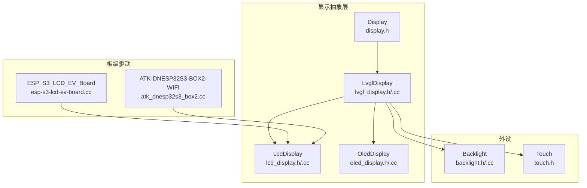
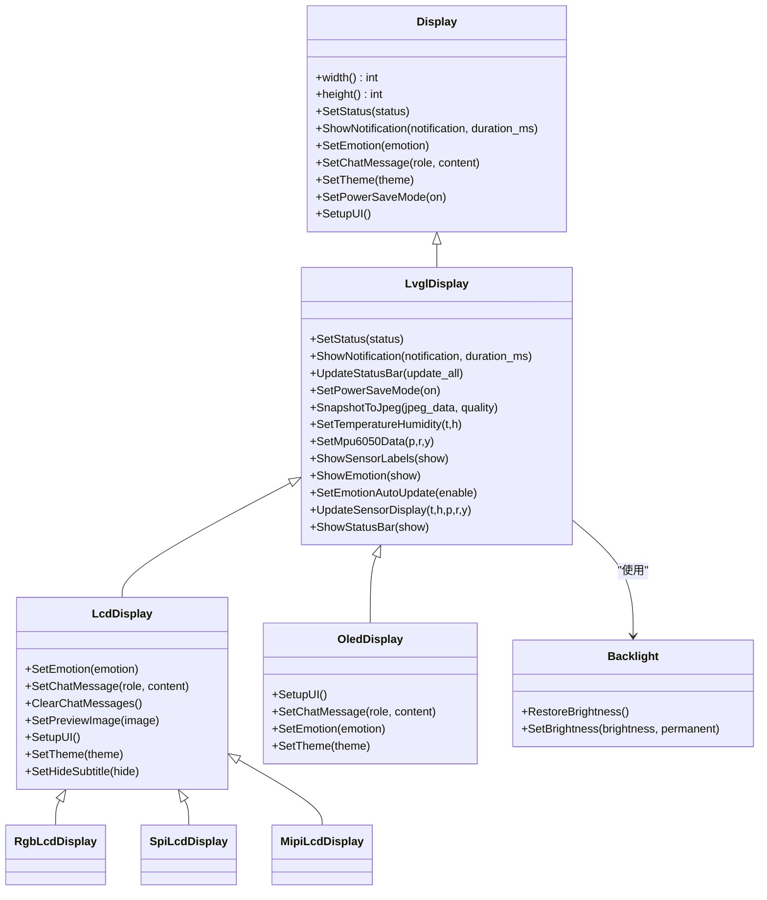
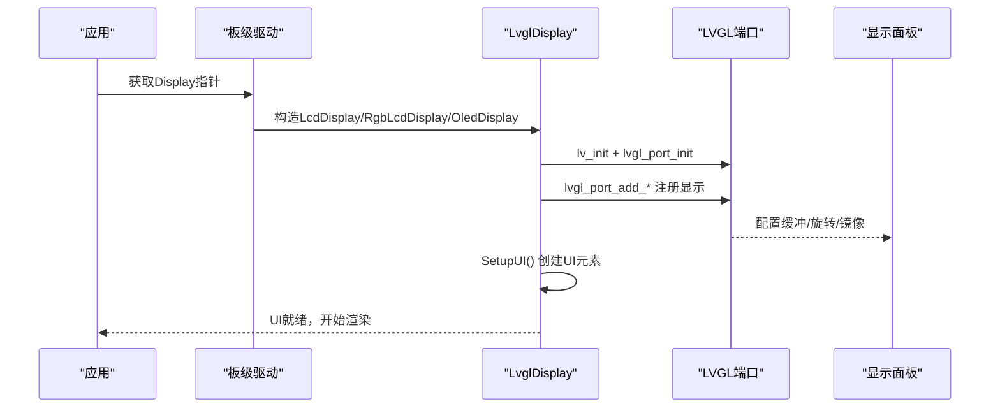
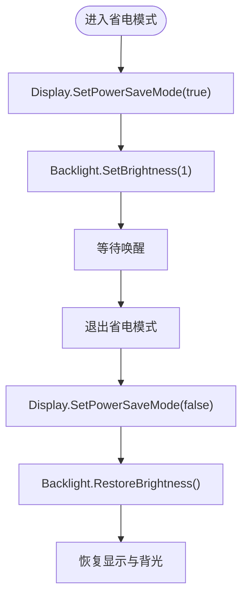
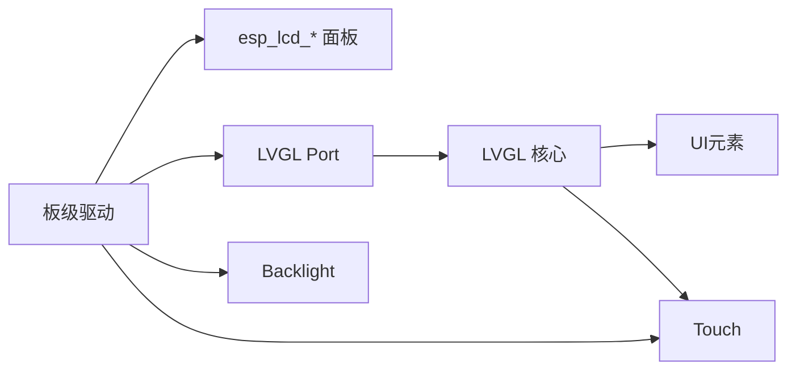

# 显示器板

<cite>
**本文档引用的文件**
- [display.h](file://main/display/display.h)
- [lvgl_display.h](file://main/display/lvgl_display/lvgl_display.h)
- [lvgl_display.cc](file://main/display/lvgl_display/lvgl_display.cc)
- [lcd_display.h](file://main/display/lcd_display.h)
- [lcd_display.cc](file://main/display/lcd_display.cc)
- [oled_display.h](file://main/display/oled_display.h)
- [oled_display.cc](file://main/display/oled_display.cc)
- [backlight.h](file://main/boards/common/backlight.h)
- [backlight.cc](file://main/boards/common/backlight.cc)
- [esp-s3-lcd-ev-board.cc](file://main/boards/esp-s3-lcd-ev-board/esp-s3-lcd-ev-board.cc)
- [atk_dnesp32s3_box2.cc](file://main/boards/atk-dnesp32s3-box2-wifi/atk_dnesp32s3_box2.cc)
- [touch.h](file://main/boards/echoear/touch.h)
- [mcp_server.cc](file://main/mcp_server.cc)
</cite>

## 目录
1. [简介](#简介)
2. [项目结构](#项目结构)
3. [核心组件](#核心组件)
4. [架构总览](#架构总览)
5. [详细组件分析](#详细组件分析)
6. [依赖关系分析](#依赖关系分析)
7. [性能考虑](#性能考虑)
8. [故障排除指南](#故障排除指南)
9. [结论](#结论)
10. [附录](#附录)

## 简介
本章节面向ESP32-AI项目的显示器板专题，系统性介绍各类显示设备与技术：LCD触摸屏、OLED屏幕、彩色显示屏等。围绕分辨率、触控功能、功耗特性展开，并深入讲解LVGL图形界面的集成与使用，包括UI设计、动画效果、主题定制等。同时提供显示驱动配置、触摸校准、亮度调节等实用技术指南，帮助开发者快速完成从硬件到软件的完整落地。

## 项目结构
显示器相关代码主要集中在以下模块：
- 显示抽象层与LVGL封装：display.h、lvgl_display.h/.cc
- LCD显示实现：lcd_display.h/.cc，支持SPI/LVGL、RGB/LVGL、MIPI/LVGL三种接口类型
- OLED显示实现：oled_display.h/.cc，支持128x64与128x32两种尺寸布局
- 背光控制：backlight.h/.cc，PWM背光渐变与持久化
- 板级驱动示例：esp-s3-lcd-ev-board.cc、atk_dnesp32s3_box2.cc等
- 触摸屏接口：touch.h（基于esp_lcd_touch）
- 屏幕快照与信息查询：mcp_server.cc中的工具函数

图表来源
- [display.h:28-63](file://main/display/display.h#L28-L63)
- [lvgl_display.h:15-64](file://main/display/lvgl_display/lvgl_display.h#L15-L64)
- [lcd_display.h:18-86](file://main/display/lcd_display.h#L18-L86)
- [oled_display.h:10-39](file://main/display/oled_display.h#L10-L39)
- [esp-s3-lcd-ev-board.cc:124-127](file://main/boards/esp-s3-lcd-ev-board/esp-s3-lcd-ev-board.cc#L124-L127)
- [atk_dnesp32s3_box2.cc:294-383](file://main/boards/atk-dnesp32s3-box2-wifi/atk_dnesp32s3_box2.cc#L294-L383)
- [backlight.h:10-36](file://main/boards/common/backlight.h#L10-L36)
- [touch.h:24-47](file://main/boards/echoear/touch.h#L24-L47)

章节来源
- [display.h:1-90](file://main/display/display.h#L1-L90)
- [lvgl_display.h:1-68](file://main/display/lvgl_display/lvgl_display.h#L1-L68)
- [lcd_display.h:1-89](file://main/display/lcd_display.h#L1-L89)
- [oled_display.h:1-42](file://main/display/oled_display.h#L1-L42)
- [backlight.h:1-37](file://main/boards/common/backlight.h#L1-L37)
- [touch.h:1-51](file://main/boards/echoear/touch.h#L1-L51)

## 核心组件
- Display抽象基类：定义统一的显示接口，如状态显示、通知、情感、聊天消息、主题切换、电源省电模式等；并提供DisplayLockGuard用于线程安全更新。
- LvglDisplay：LVGL封装，负责状态栏、电池/网络图标、低电量弹窗、温度湿度/MPU6050数据显示、通知与状态切换、截图等功能。
- LcdDisplay：LCD特化实现，包含多主题（浅色/深色）、聊天气泡布局、预览图、机器人表情、传感器标签显示等。
- OledDisplay：OLED特化实现，针对128x64与128x32两种布局，提供简洁的顶部状态条与侧边滚动文本。
- Backlight：背光控制，支持PWM渐变、持久化亮度、定时器过渡。
- 触摸屏：touch.h提供基础触摸初始化接口，便于直接使用esp_lcd_touch。
- 板级驱动：以ESP_S3_LCD_EV_Board与ATK-DNESP32S3-BOX2-WIFI为例，演示RGB LCD初始化、I80/LVGL集成、背光控制等。

章节来源
- [display.h:28-63](file://main/display/display.h#L28-L63)
- [lvgl_display.cc:19-78](file://main/display/lvgl_display/lvgl_display.cc#L19-L78)
- [lcd_display.cc:65-90](file://main/display/lcd_display.cc#L65-L90)
- [oled_display.cc:20-81](file://main/display/oled_display.cc#L20-L81)
- [backlight.cc:46-82](file://main/boards/common/backlight.cc#L46-L82)
- [touch.h:24-47](file://main/boards/echoear/touch.h#L24-L47)

## 架构总览
LVGL图形栈采用“抽象层-具体实现-板级驱动”的分层设计：
- 抽象层：Display/LvglDisplay定义通用API
- 具体实现：LcdDisplay/OledDisplay分别适配不同面板类型
- 集成层：板级驱动通过esp_lcd_*与LVGL Port对接，完成面板初始化与显示注册
- 外设层：Backlight提供背光控制，Touch提供触摸接口

图表来源
- [display.h:28-63](file://main/display/display.h#L28-L63)
- [lvgl_display.h:15-64](file://main/display/lvgl_display/lvgl_display.h#L15-L64)
- [lcd_display.h:18-86](file://main/display/lcd_display.h#L18-L86)
- [oled_display.h:10-39](file://main/display/oled_display.h#L10-L39)
- [backlight.h:10-36](file://main/boards/common/backlight.h#L10-L36)

## 详细组件分析

### LVGL图形界面集成与使用
- 初始化流程：在具体显示实现中调用lv_init、lvgl_port_init与lvgl_port_add_*，完成LVGL端口与显示注册。
- 主题系统：LcdDisplay注册浅色/深色主题，包含文本/图标字体、颜色与间距；OledDisplay注册深色主题。
- UI元素：状态栏（顶部图标区）、状态文本、温度湿度/MPU6050标签、聊天消息气泡、表情、低电量弹窗等。
- 动画与滚动：聊天消息与通知文本支持循环滚动；表情区域可配置自动更新。
- 截图功能：启用CONFIG_LV_USE_SNAPSHOT时，支持将当前屏幕导出为JPEG流。

图表来源
- [lvgl_display.cc:19-43](file://main/display/lvgl_display/lvgl_display.cc#L19-L43)
- [lcd_display.cc:113-172](file://main/display/lcd_display.cc#L113-L172)
- [oled_display.cc:39-81](file://main/display/oled_display.cc#L39-L81)

章节来源
- [lvgl_display.cc:19-78](file://main/display/lvgl_display/lvgl_display.cc#L19-L78)
- [lvgl_display.cc:121-227](file://main/display/lvgl_display/lvgl_display.cc#L121-L227)
- [lvgl_display.cc:311-351](file://main/display/lvgl_display/lvgl_display.cc#L311-L351)
- [lcd_display.cc:25-63](file://main/display/lcd_display.cc#L25-L63)
- [oled_display.cc:20-38](file://main/display/oled_display.cc#L20-L38)

### LCD触摸屏与OLED屏幕对比
- LCD触摸屏（以ST7789/I80为例）：
  - 接口：I80 8-bit并行，支持背光控制与RD引脚配置
  - 分辨率：典型1280x720（示例中DISPLAY_WIDTH/HEIGHT）
  - 特点：色彩丰富、适合图文与视频；需较大内存与带宽
- OLED屏幕（以128x64/128x32为例）：
  - 接口：单色显示，LVGL monochrome模式
  - 分辨率：128x64或128x32
  - 特点：低功耗、高对比度、响应快；适合简洁UI与文本滚动
- 彩色LCD（以GC9503 RGB为例）：
  - 接口：RGB并行，支持PSRAM帧缓存
  - 分辨率：480x480@60Hz（示例配置）
  - 特点：高刷新、色彩好；对DMA与PSRAM要求较高

章节来源
- [atk_dnesp32s3_box2.cc:294-383](file://main/boards/atk-dnesp32s3-box2-wifi/atk_dnesp32s3_box2.cc#L294-L383)
- [atk_dnesp32s3_box2.cc:384-403](file://main/boards/atk-dnesp32s3-box2-wifi/atk_dnesp32s3_box2.cc#L384-L403)
- [esp-s3-lcd-ev-board.cc:65-127](file://main/boards/esp-s3-lcd-ev-board/esp-s3-lcd-ev-board.cc#L65-L127)

### 触摸校准与交互
- 触摸接口：touch.h提供bsp_touch_new，返回esp_lcd_touch句柄，便于直接使用esp_lcd_touch API进行读取与校准。
- 校准流程：通常在首次使用前执行，通过esp_lcd_touch_read_data获取坐标，结合屏幕分辨率与旋转参数计算映射矩阵。
- 注意事项：确保触摸I2C/SPI引脚与面板一致，避免与显示数据冲突；在LVGL中可通过LVGL Port事件处理触摸事件。

章节来源
- [touch.h:24-47](file://main/boards/echoear/touch.h#L24-L47)

### 主题定制与动画效果
- 主题管理：LcdDisplay注册浅色/深色主题，包含文本/图标字体、背景色、气泡色、边框色、低电量色等；OledDisplay注册深色主题。
- 字体与图标：内置字体与FontAwesome图标，支持大号表情图标与文本滚动。
- 动画：聊天消息与通知文本采用LVGL动画，支持循环滚动与速度自适应。

章节来源
- [lcd_display.cc:25-63](file://main/display/lcd_display.cc#L25-L63)
- [oled_display.cc:20-38](file://main/display/oled_display.cc#L20-L38)
- [lvgl_display.cc:288-309](file://main/display/lvgl_display/lvgl_display.cc#L288-L309)

### 亮度调节与省电策略
- 背光控制：Backlight基类+PwmBacklight实现，支持渐变过渡、持久化亮度、默认值保护。
- 省电模式：通过PowerSaveTimer在进入睡眠/休眠时降低背光并切换到省电状态；退出时恢复亮度与UI。
- 屏幕快照：通过mcp_server.cc的工具函数查询屏幕信息与截图上传，便于远程诊断与监控。

图表来源
- [atk_dnesp32s3_box2.cc:95-117](file://main/boards/atk-dnesp32s3-box2-wifi/atk_dnesp32s3_box2.cc#L95-L117)
- [lvgl_display.cc:301-309](file://main/display/lvgl_display/lvgl_display.cc#L301-L309)
- [backlight.cc:32-44](file://main/boards/common/backlight.cc#L32-L44)

章节来源
- [backlight.h:10-36](file://main/boards/common/backlight.h#L10-L36)
- [backlight.cc:46-82](file://main/boards/common/backlight.cc#L46-L82)
- [mcp_server.cc:177-203](file://main/mcp_server.cc#L177-L203)

## 依赖关系分析
- 组件耦合：
  - LvglDisplay依赖LVGL端口与显示面板句柄；LcdDisplay/OledDisplay继承LvglDisplay，扩展各自UI。
  - 板级驱动通过esp_lcd_*与LVGL Port对接，决定面板类型与初始化参数。
- 外部依赖：
  - LVGL Port：负责显示缓冲、旋转、镜像、双缓冲等
  - esp_lcd_*：面板驱动与I2C/SPI/I80接口
  - esp_lcd_touch：触摸面板驱动
  - LEDC/PWM：背光控制
- 可能的循环依赖：无直接循环，DisplayLockGuard仅在Display/LvglDisplay内部使用。

图表来源
- [esp-s3-lcd-ev-board.cc:33-127](file://main/boards/esp-s3-lcd-ev-board/esp-s3-lcd-ev-board.cc#L33-L127)
- [atk_dnesp32s3_box2.cc:294-383](file://main/boards/atk-dnesp32s3-box2-wifi/atk_dnesp32s3_box2.cc#L294-L383)
- [lvgl_display.cc:113-172](file://main/display/lvgl_display/lvgl_display.cc#L113-L172)
- [backlight.cc:84-120](file://main/boards/common/backlight.cc#L84-L120)
- [touch.h:18-47](file://main/boards/echoear/touch.h#L18-L47)

章节来源
- [esp-s3-lcd-ev-board.cc:1-241](file://main/boards/esp-s3-lcd-ev-board/esp-s3-lcd-ev-board.cc#L1-L241)
- [atk_dnesp32s3_box2.cc:1-403](file://main/boards/atk-dnesp32s3-box2-wifi/atk_dnesp32s3_box2.cc#L1-L403)
- [lvgl_display.cc:113-172](file://main/display/lvgl_display/lvgl_display.cc#L113-L172)
- [backlight.cc:84-120](file://main/boards/common/backlight.cc#L84-L120)
- [touch.h:18-47](file://main/boards/echoear/touch.h#L18-L47)

## 性能考虑
- 内存与带宽：
  - LCD RGB模式建议启用PSRAM帧缓冲，减少CPU占用与撕裂风险
  - SPI/LVGL模式根据分辨率选择合适buffer_size与double_buffer策略
- 刷新与动画：
  - 合理设置LVGL任务优先级与亲和性，避免与音频/网络抢占
  - 对长文本与滚动动画，控制动画速度与重复次数，降低CPU负载
- 功耗优化：
  - 低电量场景降低背光亮度，必要时进入省电模式
  - 关闭不使用的UI元素与传感器标签，减少绘制开销

## 故障排除指南
- 显示初始化失败：
  - 检查面板驱动初始化顺序与参数（分辨率、像素格式、旋转、镜像）
  - 确认LVGL Port配置与缓冲大小匹配面板规格
- 图像显示异常：
  - 核对颜色格式（RGB565/RGB888/monochrome）与swap_bytes标志
  - 检查PSRAM可用性与图像缓存大小
- 触摸无响应：
  - 确认触摸I2C/SPI引脚连接与中断配置
  - 执行触摸校准，检查坐标映射与旋转参数
- 背光不工作：
  - 检查PWM通道配置与GPIO方向
  - 确认背光控制引脚极性与上拉下拉设置
- 截图失败：
  - 确认CONFIG_LV_USE_SNAPSHOT已启用
  - 检查内存分配与回调式编码流程

章节来源
- [lvgl_display.cc:311-351](file://main/display/lvgl_display/lvgl_display.cc#L311-L351)
- [lcd_display.cc:113-172](file://main/display/lcd_display.cc#L113-L172)
- [oled_display.cc:39-81](file://main/display/oled_display.cc#L39-L81)
- [backlight.cc:84-120](file://main/boards/common/backlight.cc#L84-L120)
- [touch.h:24-47](file://main/boards/echoear/touch.h#L24-L47)

## 结论
本专题系统梳理了ESP32-AI项目中显示器板的硬件与软件实现，覆盖LCD/OLED两类主流显示技术，以及LVGL图形栈的集成要点。通过抽象层与具体实现分离的设计，开发者可在不同面板间灵活切换；借助主题系统与动画机制，可快速构建美观易用的用户界面。配合背光控制与省电策略，可在保证体验的同时降低功耗。触摸校准与截图工具进一步完善了调试与运维能力。

## 附录
- 快速参考
  - 初始化RGB LCD：参考ESP_S3_LCD_EV_Board::InitializeRGB_GC9503V_Display
  - 初始化I80 LCD：参考ATK-DNESP32S3-BOX2-WIFI的ST7789初始化流程
  - 创建LvglDisplay：根据面板类型选择LcdDisplay/RgbLcdDisplay/OledDisplay
  - 设置主题：LcdDisplay注册浅/深色主题；OledDisplay注册深色主题
  - 背光控制：Backlight::SetBrightness/SetBrightnessImpl
  - 触摸接口：touch.h::bsp_touch_new
  - 屏幕信息与截图：mcp_server.cc中的self.screen.*工具