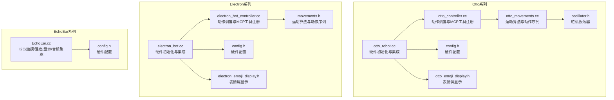
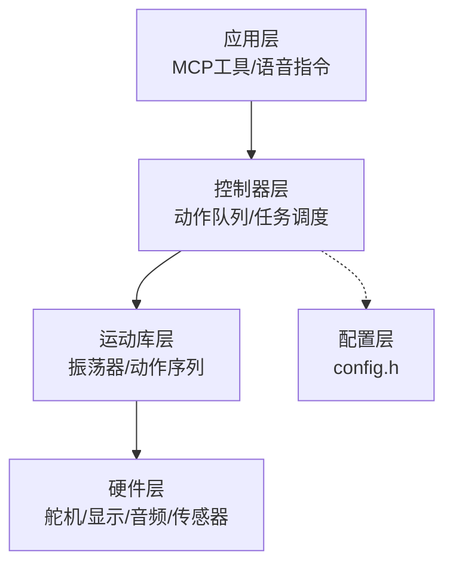
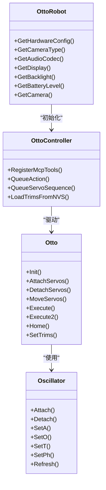
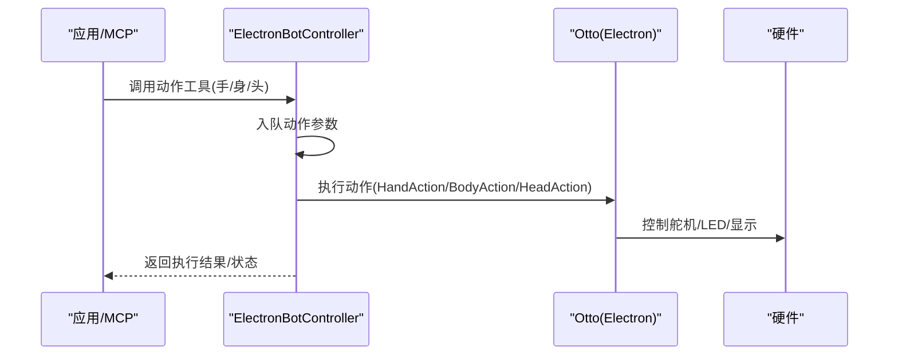
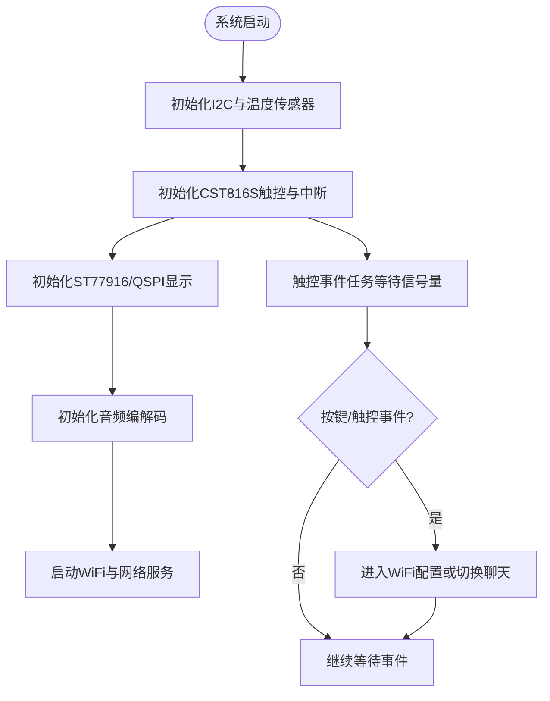
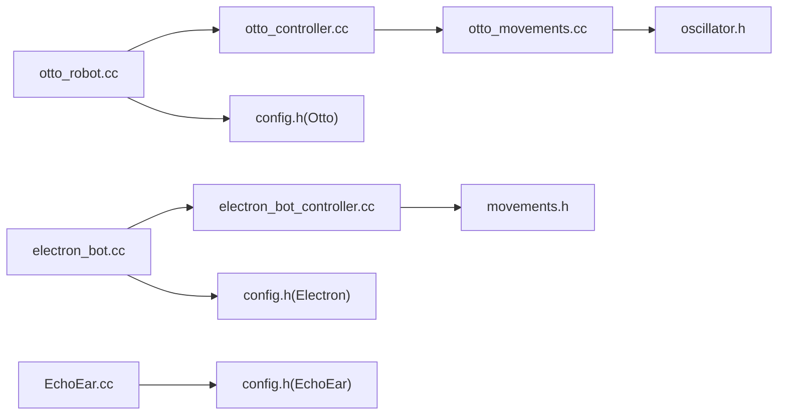

# 机器人平台

<cite>
**本文引用的文件**
- [otto_robot.cc](file://main/boards/otto-robot/otto_robot.cc)
- [otto_controller.cc](file://main/boards/otto-robot/otto_controller.cc)
- [otto_movements.cc](file://main/boards/otto-robot/otto_movements.cc)
- [oscillator.h](file://main/boards/otto-robot/oscillator.h)
- [config.h](file://main/boards/otto-robot/config.h)
- [otto_emoji_display.h](file://main/boards/otto-robot/otto_emoji_display.h)
- [electron_bot.cc](file://main/boards/electron-bot/electron_bot.cc)
- [electron_bot_controller.cc](file://main/boards/electron-bot/electron_bot_controller.cc)
- [movements.h](file://main/boards/electron-bot/movements.h)
- [config.h](file://main/boards/electron-bot/config.h)
- [electron_emoji_display.h](file://main/boards/electron-bot/electron_emoji_display.h)
- [EchoEar.cc](file://main/boards/echoear/EchoEar.cc)
- [config.h](file://main/boards/echoear/config.h)
</cite>

## 目录
1. [简介](#简介)
2. [项目结构](#项目结构)
3. [核心组件](#核心组件)
4. [架构总览](#架构总览)
5. [详细组件分析](#详细组件分析)
6. [依赖关系分析](#依赖关系分析)
7. [性能考量](#性能考量)
8. [故障排查指南](#故障排查指南)
9. [结论](#结论)
10. [附录](#附录)

## 简介
本文件面向ESP32-AI项目中的机器人平台，聚焦于支持机器人控制的硬件平台与软件架构，涵盖以下机器人形态：
- Otto Robot：四足/六足关节式机器人，支持行走、转身、跳跃、摆臂等动作，具备摄像头与屏幕显示能力。
- Electron Bot：三轴+二自由度组合型机器人，强调手部动作与头部/身体协调，适合教学演示与互动。
- EchoEar：集成了触摸屏、温度传感器、音频编解码与可选USB摄像头的智能终端机器人，强调人机交互与语音能力。

文档将从硬件平台、电机控制、传感器集成、运动算法、语音交互与机器人控制结合等方面进行系统化阐述，并提供编程指南、运动控制示例与传感器数据处理方法。

## 项目结构
机器人平台相关代码主要位于 main/boards 下，按“平台-型号”组织，每个型号包含独立的 Board 实现、控制器、运动库与配置文件。Otto/Electron/EchoEar分别对应三种典型机器人形态，均继承自通用的 WifiBoard 基类，统一接入网络、显示、音频与电源管理模块。

图示来源
- [otto_robot.cc:1-418](file://main/boards/otto-robot/otto_robot.cc#L1-L418)
- [otto_controller.cc:1-800](file://main/boards/otto-robot/otto_controller.cc#L1-L800)
- [otto_movements.cc:1-965](file://main/boards/otto-robot/otto_movements.cc#L1-L965)
- [oscillator.h:1-91](file://main/boards/otto-robot/oscillator.h#L1-L91)
- [config.h:1-177](file://main/boards/otto-robot/config.h#L1-L177)
- [otto_emoji_display.h:1-24](file://main/boards/otto-robot/otto_emoji_display.h#L1-L24)
- [electron_bot.cc:1-124](file://main/boards/electron-bot/electron_bot.cc#L1-L124)
- [electron_bot_controller.cc:1-377](file://main/boards/electron-bot/electron_bot_controller.cc#L1-L377)
- [movements.h:1-89](file://main/boards/electron-bot/movements.h#L1-L89)
- [config.h:1-52](file://main/boards/electron-bot/config.h#L1-L52)
- [electron_emoji_display.h:1-23](file://main/boards/electron-bot/electron_emoji_display.h#L1-L23)
- [EchoEar.cc:1-697](file://main/boards/echoear/EchoEar.cc#L1-L697)
- [config.h:1-89](file://main/boards/echoear/config.h#L1-L89)

章节来源
- [otto_robot.cc:1-418](file://main/boards/otto-robot/otto_robot.cc#L1-L418)
- [electron_bot.cc:1-124](file://main/boards/electron-bot/electron_bot.cc#L1-L124)
- [EchoEar.cc:1-697](file://main/boards/echoear/EchoEar.cc#L1-L697)

## 核心组件
- 机器人控制器（Otto/Electron）：负责动作队列、动作执行、MCP工具注册与状态反馈。
- 运动算法库（Otto/Electron）：提供振荡器、轨迹生成、预设动作序列与Home复位逻辑。
- 硬件抽象层（Board）：统一管理显示、音频、按键、电源、摄像头等外设。
- 配置文件（config.h）：定义引脚映射、采样率、显示参数与摄像头参数。
- 显示与表情（Otto/Electron）：基于LVGL的GIF表情与UI界面扩展。

章节来源
- [otto_controller.cc:1-800](file://main/boards/otto-robot/otto_controller.cc#L1-L800)
- [electron_bot_controller.cc:1-377](file://main/boards/electron-bot/electron_bot_controller.cc#L1-L377)
- [otto_movements.cc:1-965](file://main/boards/otto-robot/otto_movements.cc#L1-L965)
- [movements.h:1-89](file://main/boards/electron-bot/movements.h#L1-L89)
- [oscillator.h:1-91](file://main/boards/otto-robot/oscillator.h#L1-L91)
- [config.h:1-177](file://main/boards/otto-robot/config.h#L1-L177)
- [config.h:1-52](file://main/boards/electron-bot/config.h#L1-L52)
- [config.h:1-89](file://main/boards/echoear/config.h#L1-L89)

## 架构总览
机器人平台采用“Board + 控制器 + 运动库”的分层设计：
- Board层：负责硬件初始化与外设集成（显示、音频、按键、电源、摄像头等）。
- 控制器层：接收上层指令（如MCP工具调用），将动作入队并通过任务循环执行。
- 运动库层：提供振荡器与动作序列，实现平滑轨迹与协调运动。

图示来源
- [otto_controller.cc:1-800](file://main/boards/otto-robot/otto_controller.cc#L1-L800)
- [electron_bot_controller.cc:1-377](file://main/boards/electron-bot/electron_bot_controller.cc#L1-L377)
- [otto_movements.cc:1-965](file://main/boards/otto-robot/otto_movements.cc#L1-L965)
- [movements.h:1-89](file://main/boards/electron-bot/movements.h#L1-L89)
- [oscillator.h:1-91](file://main/boards/otto-robot/oscillator.h#L1-L91)
- [config.h:1-177](file://main/boards/otto-robot/config.h#L1-L177)
- [config.h:1-52](file://main/boards/electron-bot/config.h#L1-L52)
- [config.h:1-89](file://main/boards/echoear/config.h#L1-L89)

## 详细组件分析

### Otto Robot 平台
- 硬件集成：自动检测摄像头类型（OV2640/OV3660），初始化SPI/LCD、I2C、按钮、电源管理与音频编解码。
- 控制器：通过MCP工具统一暴露动作接口，支持行走、转身、跳跃、摆臂、振荡器模式等。
- 运动算法：基于振荡器生成平滑轨迹，支持Execute/Execute2两种模式，Home复位与微调（Trims）保存至NVS。
- 显示：基于ST7789的240×240 LCD，支持GIF表情与UI。

图示来源
- [otto_robot.cc:1-418](file://main/boards/otto-robot/otto_robot.cc#L1-L418)
- [otto_controller.cc:1-800](file://main/boards/otto-robot/otto_controller.cc#L1-L800)
- [otto_movements.cc:1-965](file://main/boards/otto-robot/otto_movements.cc#L1-L965)
- [oscillator.h:1-91](file://main/boards/otto-robot/oscillator.h#L1-L91)

章节来源
- [otto_robot.cc:1-418](file://main/boards/otto-robot/otto_robot.cc#L1-L418)
- [otto_controller.cc:1-800](file://main/boards/otto-robot/otto_controller.cc#L1-L800)
- [otto_movements.cc:1-965](file://main/boards/otto-robot/otto_movements.cc#L1-L965)
- [oscillator.h:1-91](file://main/boards/otto-robot/oscillator.h#L1-L91)
- [config.h:1-177](file://main/boards/otto-robot/config.h#L1-L177)
- [otto_emoji_display.h:1-24](file://main/boards/otto-robot/otto_emoji_display.h#L1-L24)

### Electron Bot 平台
- 硬件集成：GC9A01 LCD、按钮、电源管理与音频编解码；控制器初始化。
- 控制器：统一动作接口，支持手部动作（举/放/挥/拍）、身体转向与头部运动。
- 运动算法：基于振荡器与预设动作序列，支持Home复位与Trims保存。

图示来源
- [electron_bot_controller.cc:1-377](file://main/boards/electron-bot/electron_bot_controller.cc#L1-L377)
- [movements.h:1-89](file://main/boards/electron-bot/movements.h#L1-L89)
- [electron_bot.cc:1-124](file://main/boards/electron-bot/electron_bot.cc#L1-L124)

章节来源
- [electron_bot.cc:1-124](file://main/boards/electron-bot/electron_bot.cc#L1-L124)
- [electron_bot_controller.cc:1-377](file://main/boards/electron-bot/electron_bot_controller.cc#L1-L377)
- [movements.h:1-89](file://main/boards/electron-bot/movements.h#L1-L89)
- [config.h:1-52](file://main/boards/electron-bot/config.h#L1-L52)
- [electron_emoji_display.h:1-23](file://main/boards/electron-bot/electron_emoji_display.h#L1-L23)

### EchoEar 平台
- 硬件集成：ST77916 QSPI LCD、CST816S电容触控、温度传感器、I2C设备、音频编解码与可选USB摄像头。
- 交互：触摸事件通过ISR与任务协作处理，支持WiFi配置与聊天切换。
- 传感器：I2C设备轮询与温度传感器采集，定时任务输出状态。

图示来源
- [EchoEar.cc:1-697](file://main/boards/echoear/EchoEar.cc#L1-L697)
- [config.h:1-89](file://main/boards/echoear/config.h#L1-L89)

章节来源
- [EchoEar.cc:1-697](file://main/boards/echoear/EchoEar.cc#L1-L697)
- [config.h:1-89](file://main/boards/echoear/config.h#L1-L89)

## 依赖关系分析
- Otto平台
  - otto_robot.cc 依赖硬件配置、显示、音频、按钮、电源与摄像头模块。
  - otto_controller.cc 依赖 otto_movements 与 oscillator，通过MCP工具对外提供动作接口。
- Electron平台
  - electron_bot.cc 依赖硬件配置、显示、音频、按钮与电源模块。
  - electron_bot_controller.cc 依赖 movements 与 oscillator，通过MCP工具对外提供动作接口。
- EchoEar平台
  - EchoEar.cc 依赖I2C设备、温度传感器、ST77916显示、CST816S触控与音频编解码。

图示来源
- [otto_controller.cc:1-800](file://main/boards/otto-robot/otto_controller.cc#L1-L800)
- [otto_movements.cc:1-965](file://main/boards/otto-robot/otto_movements.cc#L1-L965)
- [oscillator.h:1-91](file://main/boards/otto-robot/oscillator.h#L1-L91)
- [otto_robot.cc:1-418](file://main/boards/otto-robot/otto_robot.cc#L1-L418)
- [config.h:1-177](file://main/boards/otto-robot/config.h#L1-L177)
- [electron_bot_controller.cc:1-377](file://main/boards/electron-bot/electron_bot_controller.cc#L1-L377)
- [movements.h:1-89](file://main/boards/electron-bot/movements.h#L1-L89)
- [electron_bot.cc:1-124](file://main/boards/electron-bot/electron_bot.cc#L1-L124)
- [config.h:1-52](file://main/boards/electron-bot/config.h#L1-L52)
- [EchoEar.cc:1-697](file://main/boards/echoear/EchoEar.cc#L1-L697)
- [config.h:1-89](file://main/boards/echoear/config.h#L1-L89)

章节来源
- [otto_controller.cc:1-800](file://main/boards/otto-robot/otto_controller.cc#L1-L800)
- [electron_bot_controller.cc:1-377](file://main/boards/electron-bot/electron_bot_controller.cc#L1-L377)
- [EchoEar.cc:1-697](file://main/boards/echoear/EchoEar.cc#L1-L697)

## 性能考量
- 任务优先级与栈空间：动作执行任务优先级较高，确保实时性；队列容量与消息等待时间需平衡吞吐与延迟。
- PWM/LEDC频率与相位：振荡器周期与相位差直接影响运动平滑度与能耗，应根据负载合理设置。
- 显示刷新与背光：高分辨率LCD与背光控制需考虑功耗与刷新率，避免阻塞主任务。
- 音频采样率与I2S：不同板型采用单工/双工模式，采样率与引脚配置需与硬件匹配。
- 摄像头帧率与翻转：不同摄像头类型需设置合适的翻转参数，避免图像畸变影响识别。

## 故障排查指南
- 无法检测摄像头/识别PID
  - 现象：摄像头初始化失败或未知类型。
  - 排查：确认I2C引脚配置、XCLK时钟与地址扫描流程；检查硬件版本宏设置。
  - 参考
    - [otto_robot.cc:41-159](file://main/boards/otto-robot/otto_robot.cc#L41-L159)
    - [config.h:15-25](file://main/boards/otto-robot/config.h#L15-L25)
- 触控无响应/误触发
  - 现象：触摸中断未触发或事件计数异常。
  - 排查：确认INT引脚配置、ISR安装与信号量机制；检查CST816S寄存器读取与状态机。
  - 参考
    - [EchoEar.cc:454-489](file://main/boards/echoear/EchoEar.cc#L454-L489)
    - [EchoEar.cc:261-381](file://main/boards/echoear/EchoEar.cc#L261-L381)
- 动作卡顿/抖动
  - 现象：动作执行过程中抖动或不连贯。
  - 排查：检查振荡器周期、相位差与限幅设置；确认MoveServos的增量步进与延时。
  - 参考
    - [oscillator.h:30-91](file://main/boards/otto-robot/oscillator.h#L30-L91)
    - [otto_movements.cc:90-142](file://main/boards/otto-robot/otto_movements.cc#L90-L142)
- 电量显示异常
  - 现象：充电/放电状态与实际不符。
  - 排查：确认ADC通道与引脚配置，检查PowerManager读数逻辑。
  - 参考
    - [config.h:65-141](file://main/boards/otto-robot/config.h#L65-L141)
    - [electron_bot.cc:115-120](file://main/boards/electron-bot/electron_bot.cc#L115-L120)

章节来源
- [otto_robot.cc:41-159](file://main/boards/otto-robot/otto_robot.cc#L41-L159)
- [config.h:15-25](file://main/boards/otto-robot/config.h#L15-L25)
- [EchoEar.cc:454-489](file://main/boards/echoear/EchoEar.cc#L454-L489)
- [EchoEar.cc:261-381](file://main/boards/echoear/EchoEar.cc#L261-L381)
- [oscillator.h:30-91](file://main/boards/otto-robot/oscillator.h#L30-L91)
- [otto_movements.cc:90-142](file://main/boards/otto-robot/otto_movements.cc#L90-L142)
- [config.h:65-141](file://main/boards/otto-robot/config.h#L65-L141)
- [electron_bot.cc:115-120](file://main/boards/electron-bot/electron_bot.cc#L115-L120)

## 结论
本项目为ESP32-AI提供了完整的机器人平台方案：Otto/Electron/EchoEar三大平台覆盖了从四足/六足运动、三轴+二自由度人形演示到智能终端交互的多种形态。通过统一的Board层与控制器层，实现了硬件抽象、动作调度与MCP工具的标准化，便于二次开发与语音交互集成。建议在实际部署中重点关注摄像头/触控/显示/音频的引脚与参数匹配，并结合振荡器与运动算法优化动作平滑度与能耗表现。

## 附录

### 编程指南与示例路径
- 注册MCP动作工具（Otto）
  - 示例路径：[注册动作工具:522-701](file://main/boards/otto-robot/otto_controller.cc#L522-L701)
  - 示例路径：[注册舵机序列工具:662-701](file://main/boards/otto-robot/otto_controller.cc#L662-L701)
- 执行动作（Electron）
  - 示例路径：[动作队列入队与执行:66-111](file://main/boards/electron-bot/electron_bot_controller.cc#L66-L111)
  - 示例路径：[手部动作封装:60-62](file://main/boards/electron-bot/movements.h#L60-L62)
- 振荡器与轨迹（Otto）
  - 示例路径：[Execute/Execute2:184-233](file://main/boards/otto-robot/otto_movements.cc#L184-L233)
  - 示例路径：[振荡器参数设置:37-49](file://main/boards/otto-robot/oscillator.h#L37-L49)
- 语音交互与机器人控制结合
  - 说明：通过MCP工具将语音指令转化为动作参数，控制器层统一调度执行。
  - 示例路径：[Otto动作工具注册:522-701](file://main/boards/otto-robot/otto_controller.cc#L522-L701)
  - 示例路径：[Electron动作工具注册:146-258](file://main/boards/electron-bot/electron_bot_controller.cc#L146-L258)
- 传感器数据处理（EchoEar）
  - 示例路径：[I2C设备轮询与温度采集:248-255](file://main/boards/echoear/EchoEar.cc#L248-L255)
  - 示例路径：[触控事件处理与状态机:313-336](file://main/boards/echoear/EchoEar.cc#L313-L336)

章节来源
- [otto_controller.cc:522-701](file://main/boards/otto-robot/otto_controller.cc#L522-L701)
- [electron_bot_controller.cc:66-111](file://main/boards/electron-bot/electron_bot_controller.cc#L66-L111)
- [movements.h:60-62](file://main/boards/electron-bot/movements.h#L60-L62)
- [otto_movements.cc:184-233](file://main/boards/otto-robot/otto_movements.cc#L184-L233)
- [oscillator.h:37-49](file://main/boards/otto-robot/oscillator.h#L37-L49)
- [EchoEar.cc:248-255](file://main/boards/echoear/EchoEar.cc#L248-L255)
- [EchoEar.cc:313-336](file://main/boards/echoear/EchoEar.cc#L313-L336)