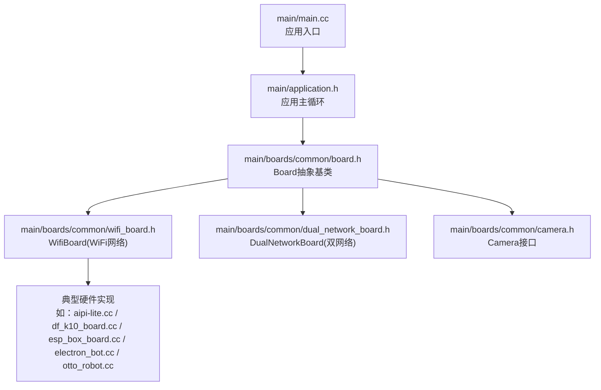
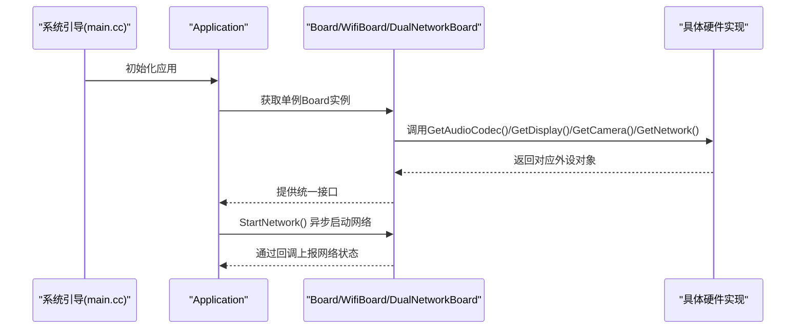
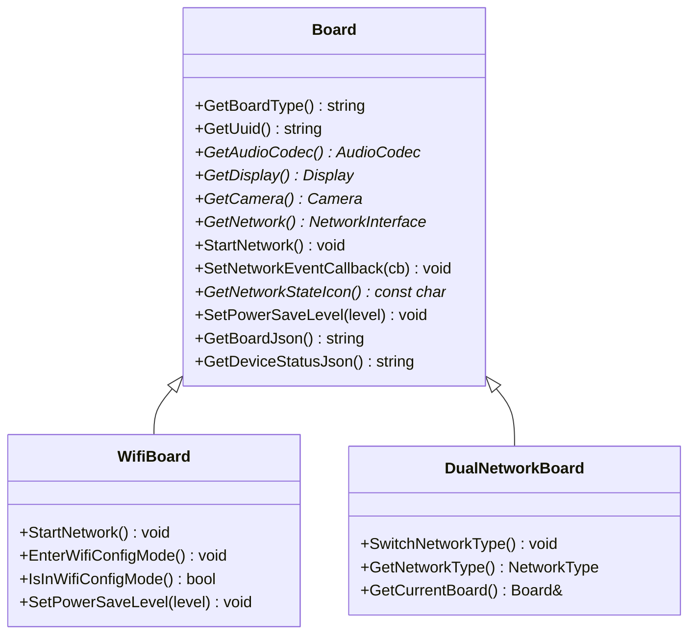
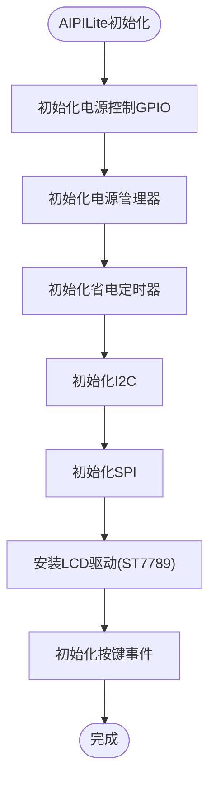
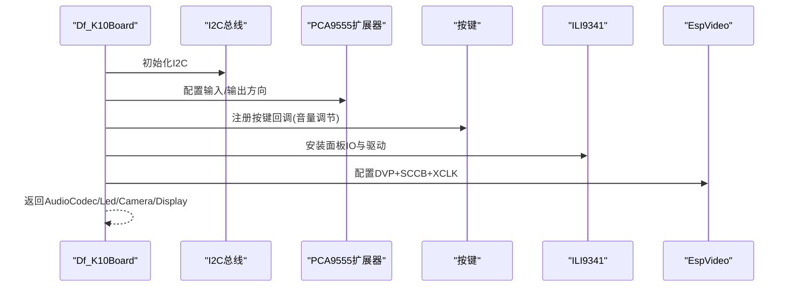
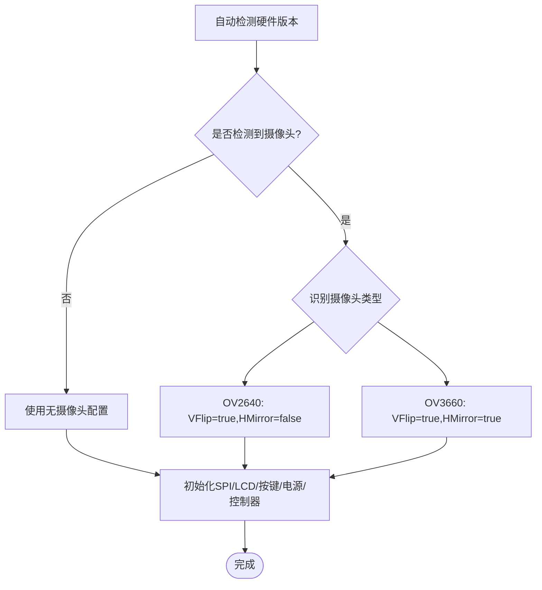
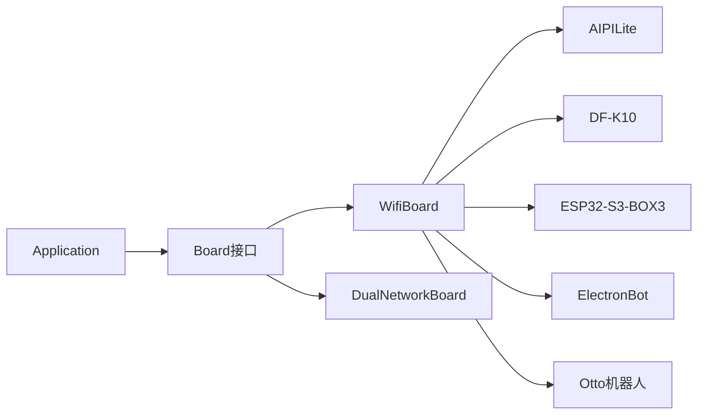

# 硬件平台支持

<cite>
**本文档引用的文件**
- [main.cc](file://main/main.cc)
- [application.h](file://main/application.h)
- [board.h](file://main/boards/common/board.h)
- [board.cc](file://main/boards/common/board.cc)
- [wifi_board.h](file://main/boards/common/wifi_board.h)
- [dual_network_board.h](file://main/boards/common/dual_network_board.h)
- [camera.h](file://main/boards/common/camera.h)
- [aipi-lite.cc](file://main/boards/aipi-lite/aipi-lite.cc)
- [aipi-lite/config.json](file://main/boards/aipi-lite/config.json)
- [df_k10_board.cc](file://main/boards/df-k10/df_k10_board.cc)
- [esp_box_board.cc](file://main/boards/esp-box/esp_box_board.cc)
- [electron_bot.cc](file://main/boards/electron-bot/electron_bot.cc)
- [otto_robot.cc](file://main/boards/otto-robot/otto_robot.cc)
- [README.md](file://README.md)
</cite>

## 目录
1. [简介](#简介)
2. [项目结构](#项目结构)
3. [核心组件](#核心组件)
4. [架构总览](#架构总览)
5. [详细组件分析](#详细组件分析)
6. [依赖关系分析](#依赖关系分析)
7. [性能考虑](#性能考虑)
8. [故障排除指南](#故障排除指南)
9. [结论](#结论)
10. [附录](#附录)

## 简介
本文件面向ESP32-AI项目的硬件平台支持，系统化阐述项目如何通过统一的硬件抽象层（HAL）适配70+种开源硬件平台，覆盖开发板、AI摄像头、机器人、显示器等多类设备。文档重点包括：
- 硬件抽象层设计理念与接口规范
- 典型硬件平台的配置示例与连接方式
- 硬件选型指南与兼容性矩阵
- 性能对比与使用注意事项

## 项目结构
项目采用“应用层 + 硬件抽象层 + 多硬件平台实现”的分层架构。顶层入口负责初始化并运行应用；硬件抽象层定义统一接口；各硬件平台通过具体实现类对接这些接口。

**图表来源**
- [main.cc:14-29](file://main/main.cc#L14-L29)
- [application.h:50-72](file://main/application.h#L50-L72)
- [board.h:49-86](file://main/boards/common/board.h#L49-L86)
- [wifi_board.h:9-67](file://main/boards/common/wifi_board.h#L9-L67)
- [dual_network_board.h:16-58](file://main/boards/common/dual_network_board.h#L16-L58)

**章节来源**
- [main.cc:14-29](file://main/main.cc#L14-L29)
- [application.h:50-72](file://main/application.h#L50-L72)
- [board.h:49-86](file://main/boards/common/board.h#L49-L86)

## 核心组件
- Board抽象基类：定义统一的硬件能力接口，包括音频编解码器、显示、相机、网络、背光、LED、电源管理等，并提供设备信息JSON生成。
- WifiBoard：在Board基础上扩展WiFi网络能力，提供异步连接、配网模式、网络事件回调等。
- DualNetworkBoard：在Board基础上支持WiFi与ML307双网络切换，便于不同部署场景灵活选择。
- Camera接口：抽象摄像头能力，支持拍照、镜像/翻转、解释请求等。

**章节来源**
- [board.h:49-86](file://main/boards/common/board.h#L49-L86)
- [board.cc:70-178](file://main/boards/common/board.cc#L70-L178)
- [wifi_board.h:9-67](file://main/boards/common/wifi_board.h#L9-L67)
- [dual_network_board.h:16-58](file://main/boards/common/dual_network_board.h#L16-L58)
- [camera.h:6-14](file://main/boards/common/camera.h#L6-L14)

## 架构总览
下图展示了应用启动到硬件平台初始化的关键流程，以及典型硬件平台如何通过Board接口接入系统。

**图表来源**
- [main.cc:25-28](file://main/main.cc#L25-L28)
- [application.h:65-72](file://main/application.h#L65-L72)
- [board.h:62-86](file://main/boards/common/board.h#L62-L86)
- [wifi_board.h:49-67](file://main/boards/common/wifi_board.h#L49-L67)

## 详细组件分析

### 硬件抽象层设计与接口规范
- 设计理念
  - 统一接口：所有硬件平台通过Board及其派生类暴露一致的API，屏蔽底层差异。
  - 松耦合：应用层仅依赖抽象接口，不关心具体硬件实现。
  - 可扩展：新增硬件平台只需实现Board接口，无需修改应用代码。
- 关键接口
  - 设备信息：GetBoardType()、GetBoardJson()、GetSystemInfoJson()、GetDeviceStatusJson()
  - 外设访问：GetAudioCodec()、GetDisplay()、GetCamera()、GetNetwork()
  - 网络控制：StartNetwork()、SetNetworkEventCallback()、GetNetworkStateIcon()、EnterWifiConfigMode()
  - 功耗策略：SetPowerSaveLevel()

**图表来源**
- [board.h:49-86](file://main/boards/common/board.h#L49-L86)
- [wifi_board.h:9-67](file://main/boards/common/wifi_board.h#L9-L67)
- [dual_network_board.h:16-58](file://main/boards/common/dual_network_board.h#L16-L58)

**章节来源**
- [board.h:49-86](file://main/boards/common/board.h#L49-L86)
- [board.cc:70-178](file://main/boards/common/board.cc#L70-L178)
- [wifi_board.h:9-67](file://main/boards/common/wifi_board.h#L9-L67)
- [dual_network_board.h:16-58](file://main/boards/common/dual_network_board.h#L16-L58)

### 典型硬件平台实现与配置示例

#### AIPILite（带LCD与电源管理）
- 外设集成
  - 显示：SPI驱动的ST7789 LCD，支持背光PWM控制与省电定时器联动。
  - 音频：ES8311音频编解码器，通过I2C配置。
  - 按键：启动键与电源键，支持短按/长按事件，联动配网模式与关机深睡。
  - 电源：PowerManager + PowerSaveTimer，充电状态影响省电策略。
- 配置要点
  - I2C与SPI初始化参数、显示面板配置、按键GPIO映射。
  - 电源控制引脚与深睡唤醒逻辑。
- 示例路径
  - [aipi-lite.cc:26-244](file://main/boards/aipi-lite/aipi-lite.cc#L26-L244)
  - [aipi-lite/config.json:1-12](file://main/boards/aipi-lite/config.json#L1-L12)

**图表来源**
- [aipi-lite.cc:36-198](file://main/boards/aipi-lite/aipi-lite.cc#L36-L198)

**章节来源**
- [aipi-lite.cc:26-244](file://main/boards/aipi-lite/aipi-lite.cc#L26-L244)
- [aipi-lite/config.json:1-12](file://main/boards/aipi-lite/config.json#L1-L12)

#### DF-K10（带LED灯带、IO扩展与摄像头）
- 外设集成
  - 显示：ILI9341 LCD，SPI驱动。
  - 音频：K10AudioCodec，支持双声道麦克风与扬声器。
  - 按键：通过PCA9555 IO扩展器读取按键状态，支持音量调节。
  - 摄像头：EspVideo + SCCB配置，支持OV2640/OV3660等常见摄像头。
  - LED：环形LED灯带，配合MCP服务实现设备控制。
- 配置要点
  - PCA9555 IO扩展器方向与电平控制。
  - 摄像头DVP引脚映射与XCLK频率。
- 示例路径
  - [df_k10_board.cc:23-299](file://main/boards/df-k10/df_k10_board.cc#L23-L299)

**图表来源**
- [df_k10_board.cc:39-264](file://main/boards/df-k10/df_k10_board.cc#L39-L264)

**章节来源**
- [df_k10_board.cc:23-299](file://main/boards/df-k10/df_k10_board.cc#L23-L299)

#### ESP32-S3-BOX3（Espressif官方盒子）
- 外设集成
  - 显示：ILI9341 LCD，支持表情消息样式或标准SPI LCD。
  - 音频：BoxAudioCodec，ES8311+ES7210组合。
  - 背光：PWM背光控制。
- 配置要点
  - 厂商特定初始化序列（vendor-specific init cmds）。
  - 双击按键切换AEC模式（可选）。
- 示例路径
  - [esp_box_board.cc:38-174](file://main/boards/esp-box/esp_box_board.cc#L38-L174)

**章节来源**
- [esp_box_board.cc:38-174](file://main/boards/esp-box/esp_box_board.cc#L38-L174)

#### 电子狗（ElectronBot）机器人
- 外设集成
  - 显示：GC9A01 LCD，表情显示专用驱动。
  - 音频：单工音频编解码（简化版），适合仅播放场景。
  - 电源：PowerManager + ADC检测。
  - 控制：机器人运动与表情控制服务。
- 配置要点
  - SPI总线与GC9A01面板初始化。
  - 按键事件与配网模式联动。
- 示例路径
  - [electron_bot.cc:26-124](file://main/boards/electron-bot/electron_bot.cc#L26-L124)

**章节来源**
- [electron_bot.cc:26-124](file://main/boards/electron-bot/electron_bot.cc#L26-L124)

#### Otto机器人（可选摄像头版本）
- 外设集成
  - 显示：ST7789 LCD，表情显示。
  - 音频：单工/全双工编解码器可选。
  - 摄像头：自动检测OV2640/OV3660，动态配置翻转参数。
  - 控制：WebSocket控制服务器，机器人动作与表情。
  - 电源：PowerManager + ADC。
- 配置要点
  - 硬件版本自动检测与分支配置。
  - 不同摄像头的VFlip/HMirror设置。
- 示例路径
  - [otto_robot.cc:28-418](file://main/boards/otto-robot/otto_robot.cc#L28-L418)

**图表来源**
- [otto_robot.cc:41-159](file://main/boards/otto-robot/otto_robot.cc#L41-L159)

**章节来源**
- [otto_robot.cc:28-418](file://main/boards/otto-robot/otto_robot.cc#L28-L418)

### 硬件选型指南
- 按功能需求选择
  - 需要LCD与背光：优先选择具备SPI LCD与PWM背光的平台（如AIPILite、DF-K10、ESP32-S3-BOX3）。
  - 需要AI摄像头：选择已验证摄像头支持的平台（如DF-K10、Otto机器人）。
  - 需要机器人形态：选择带电机/舵机与控制服务的平台（如ElectronBot、Otto机器人）。
- 按芯片平台选择
  - ESP32-S3：广泛支持，生态丰富（如ESP32-S3-BOX3、AIPILite）。
  - ESP32-C3/C5/P4：部分平台支持，需确认SDK与分区表配置。
- 按网络能力选择
  - 仅WiFi：WifiBoard即可满足。
  - 需要蜂窝：使用DualNetworkBoard并在硬件上接入ML307模块。
- 按功耗与续航选择
  - 需要省电：选择带PowerSaveTimer与ADC电量检测的平台，结合SetPowerSaveLevel策略。

**章节来源**
- [wifi_board.h:9-67](file://main/boards/common/wifi_board.h#L9-L67)
- [dual_network_board.h:16-58](file://main/boards/common/dual_network_board.h#L16-L58)
- [board.h:35-40](file://main/boards/common/board.h#L35-L40)

### 硬件兼容性矩阵（示例）
以下为部分平台的功能兼容概览（基于源码实现）：

- AIPILite
  - 显示：SPI LCD（ST7789）
  - 音频：ES8311
  - 摄像头：无
  - 机器人：否
  - 背光：PWM
  - 省电：省电定时器
- DF-K10
  - 显示：SPI LCD（ILI9341）
  - 音频：K10AudioCodec
  - 摄像头：支持OV2640/OV3660
  - 机器人：否
  - 背光：未显式配置
  - 省电：未显式配置
- ESP32-S3-BOX3
  - 显示：SPI LCD（ILI9341）
  - 音频：BoxAudioCodec
  - 摄像头：无
  - 机器人：否
  - 背光：PWM
  - 省电：未显式配置
- ElectronBot
  - 显示：SPI LCD（GC9A01）
  - 音频：单工音频
  - 摄像头：无
  - 机器人：是
  - 背光：PWM
  - 省电：未显式配置
- Otto机器人
  - 显示：SPI LCD（ST7789）
  - 音频：单工/全双工可选
  - 摄像头：自动检测OV2640/OV3660
  - 机器人：是
  - 背光：PWM
  - 省电：未显式配置

说明：该矩阵来源于源码中各平台的外设初始化与接口实现，实际功能以具体硬件为准。

### 性能对比与使用注意事项
- 性能对比维度
  - 显示帧率：受SPI频率、面板驱动与刷新策略影响（如AIPILite的40MHz像素时钟配置）。
  - 音频延迟：I2S采样率与DMA队列深度（如DF-K10的I2C与SPI DMA配置）。
  - 摄像头吞吐：DVP总线宽度与XCLK频率（如Otto机器人的XCLK与DVP配置）。
  - 省电策略：省电定时器与深睡唤醒（如AIPILite的电源管理）。
- 使用注意事项
  - 分区表与SDK版本：v2分区表与ESP-IDF 5.4+要求，避免OTA升级中断。
  - NVS初始化：首次运行需正确擦除/初始化NVS，避免配网失败。
  - I2C/IO扩展器：确保上拉电阻与地址配置正确，避免按键/传感器读取异常。
  - 摄像头供电：注意摄像头与主控电源匹配，避免复位/初始化失败。
  - 深睡唤醒：正确配置RTC GPIO与保持引脚，防止误唤醒或无法唤醒。

**章节来源**
- [board.cc:70-178](file://main/boards/common/board.cc#L70-L178)
- [aipi-lite.cc:67-96](file://main/boards/aipi-lite/aipi-lite.cc#L67-L96)
- [df_k10_board.cc:39-65](file://main/boards/df-k10/df_k10_board.cc#L39-L65)
- [otto_robot.cc:243-307](file://main/boards/otto-robot/otto_robot.cc#L243-L307)
- [README.md:15-37](file://README.md#L15-L37)

## 依赖关系分析
- 应用层依赖硬件抽象层接口，不直接依赖具体硬件实现。
- WifiBoard/DualNetworkBoard在Board之上扩展网络能力，降低重复代码。
- 各硬件平台通过“工厂函数”注册自身实现，由Board::GetInstance统一获取。

**图表来源**
- [application.h:50-72](file://main/application.h#L50-L72)
- [board.h:49-86](file://main/boards/common/board.h#L49-L86)
- [wifi_board.h:9-67](file://main/boards/common/wifi_board.h#L9-L67)
- [dual_network_board.h:16-58](file://main/boards/common/dual_network_board.h#L16-L58)
- [aipi-lite.cc:26-244](file://main/boards/aipi-lite/aipi-lite.cc#L26-L244)
- [df_k10_board.cc:23-299](file://main/boards/df-k10/df_k10_board.cc#L23-L299)
- [esp_box_board.cc:38-174](file://main/boards/esp-box/esp_box_board.cc#L38-L174)
- [electron_bot.cc:26-124](file://main/boards/electron-bot/electron_bot.cc#L26-L124)
- [otto_robot.cc:28-418](file://main/boards/otto-robot/otto_robot.cc#L28-L418)

**章节来源**
- [application.h:50-72](file://main/application.h#L50-L72)
- [board.h:49-86](file://main/boards/common/board.h#L49-L86)
- [wifi_board.h:9-67](file://main/boards/common/wifi_board.h#L9-L67)
- [dual_network_board.h:16-58](file://main/boards/common/dual_network_board.h#L16-L58)

## 性能考虑
- 显示性能
  - 选择高像素时钟与合适SPI DMA通道，减少画面撕裂与掉帧。
  - 对于表情/动画较多的场景，建议启用背光PWM调光与省电模式以平衡功耗。
- 音频性能
  - I2S采样率与缓冲队列深度直接影响延迟与稳定性，需结合CPU主频与任务调度优化。
  - 双声道麦克风与扬声器需注意时序与增益控制。
- 摄像头性能
  - DVP总线宽度与XCLK频率决定图像帧率，需与显示/处理链路匹配。
  - 摄像头翻转与镜像参数应根据机械安装方向调整。
- 网络性能
  - WiFi连接超时与配网模式切换需合理设置定时器与回调，避免阻塞主任务。
  - 双网络切换时需保证资源释放与重新初始化顺序。

## 故障排除指南
- NVS初始化失败
  - 现象：首次启动配网失败或参数丢失。
  - 排查：检查nvs_flash_init/erase流程，确认分区表与SDK版本匹配。
  - 参考路径：[main.cc:17-23](file://main/main.cc#L17-L23)
- I2C/IO扩展器读取异常
  - 现象：按键无响应、传感器读取失败。
  - 排查：确认上拉电阻、地址与方向配置，检查扩展器状态打印。
  - 参考路径：[df_k10_board.cc:78-107](file://main/boards/df-k10/df_k10_board.cc#L78-L107)
- 摄像头初始化失败
  - 现象：黑屏或无法捕获图像。
  - 排查：检查DVP引脚映射、XCLK频率、SCCB地址与复位/PWDN引脚。
  - 参考路径：[df_k10_board.cc:175-213](file://main/boards/df-k10/df_k10_board.cc#L175-L213)，[otto_robot.cc:243-307](file://main/boards/otto-robot/otto_robot.cc#L243-L307)
- 深睡唤醒问题
  - 现象：无法从深睡眠唤醒或误唤醒。
  - 排查：确认RTC GPIO配置、保持引脚与唤醒源设置。
  - 参考路径：[aipi-lite.cc:47-65](file://main/boards/aipi-lite/aipi-lite.cc#L47-L65)

**章节来源**
- [main.cc:17-23](file://main/main.cc#L17-L23)
- [df_k10_board.cc:78-107](file://main/boards/df-k10/df_k10_board.cc#L78-L107)
- [df_k10_board.cc:175-213](file://main/boards/df-k10/df_k10_board.cc#L175-L213)
- [otto_robot.cc:243-307](file://main/boards/otto-robot/otto_robot.cc#L243-L307)
- [aipi-lite.cc:47-65](file://main/boards/aipi-lite/aipi-lite.cc#L47-L65)

## 结论
ESP32-AI通过统一的硬件抽象层实现了对70+开源硬件平台的高效适配。开发者只需遵循Board接口规范，即可快速移植到新硬件平台。推荐在选型时综合考虑显示/音频/摄像头/网络/功耗等因素，并参考本文档提供的配置示例与排障指南，以获得稳定可靠的硬件体验。

## 附录
- 更多平台示例可在main/boards目录下查阅，涵盖开发板、AI摄像头、机器人、显示器等多种类型。
- 官方文档与社区教程可参考项目根目录README中的链接与说明。

**章节来源**
- [README.md:51-103](file://README.md#L51-L103)