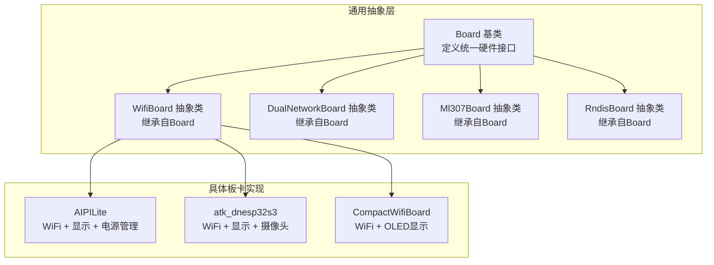
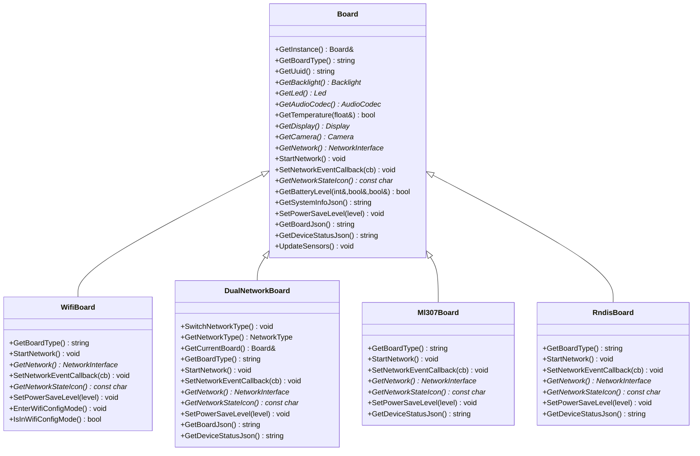
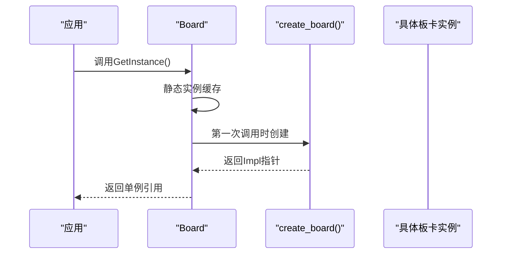
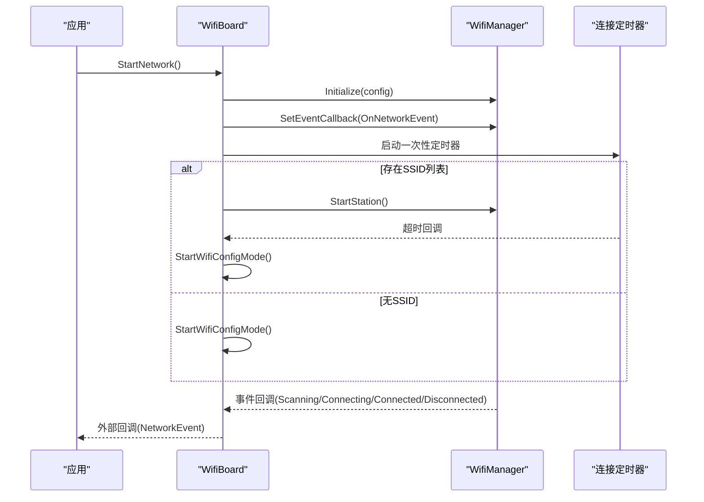
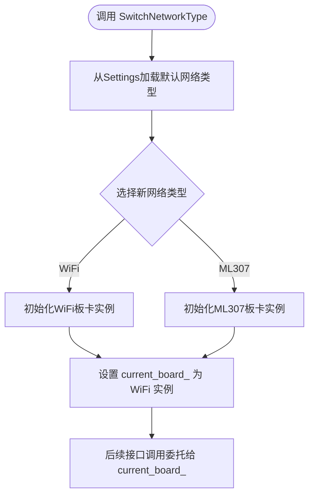
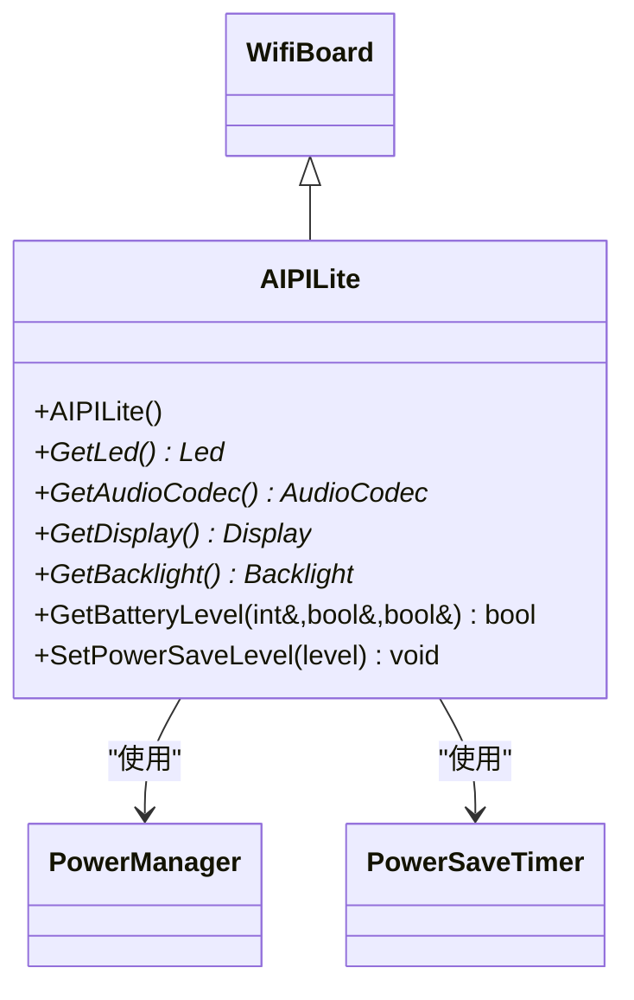
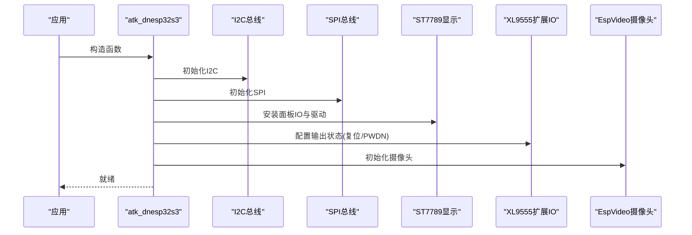
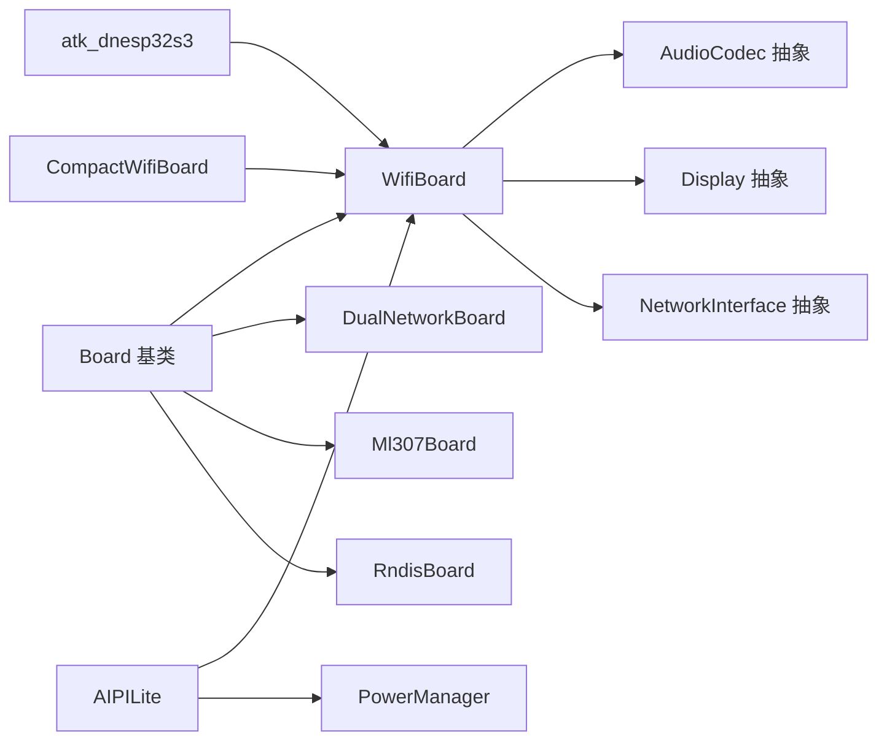

# 硬件抽象层设计

<cite>
**本文档引用的文件**
- [board.h](file://main/boards/common/board.h)
- [board.cc](file://main/boards/common/board.cc)
- [wifi_board.h](file://main/boards/common/wifi_board.h)
- [wifi_board.cc](file://main/boards/common/wifi_board.cc)
- [dual_network_board.h](file://main/boards/common/dual_network_board.h)
- [ml307_board.h](file://main/boards/common/ml307_board.h)
- [rndis_board.h](file://main/boards/common/rndis_board.h)
- [audio_codec.h](file://main/audio/audio_codec.h)
- [display.h](file://main/display/display.h)
- [aipi-lite.cc](file://main/boards/aipi-lite/aipi-lite.cc)
- [atk_dnesp32s3.cc](file://main/boards/atk-dnesp32s3/atk_dnesp32s3.cc)
- [esp32_bread_board.cc](file://main/boards/bread-compact-esp32/esp32_bread_board.cc)
- [power_manager.h](file://main/boards/aipi-lite/power_manager.h)
</cite>

## 目录
1. [简介](#简介)
2. [项目结构](#项目结构)
3. [核心组件](#核心组件)
4. [架构总览](#架构总览)
5. [详细组件分析](#详细组件分析)
6. [依赖关系分析](#依赖关系分析)
7. [性能考虑](#性能考虑)
8. [故障排查指南](#故障排查指南)
9. [结论](#结论)
10. [附录](#附录)

## 简介
本文件系统化阐述ESP32-AI项目的硬件抽象层（HAL）设计与实现，重点围绕Board基类及其派生类，解释如何通过统一接口屏蔽不同硬件平台差异，实现跨板卡的一致编程体验。文档涵盖以下主题：
- Board基类的设计理念与架构模式
- 核心虚函数职责与实现要求（如GetAudioCodec、GetDisplay、GetNetwork等）
- 硬件工厂模式与create_board()工作机制
- 扩展指南：如何新增硬件支持
- 关键子系统：电源管理、网络接口、传感器集成等

## 项目结构
硬件抽象层位于main/boards/common目录，采用“通用基类 + 具体板卡实现”的分层组织方式；各具体板卡在各自目录中实现Board派生类，并通过宏DECLARE_BOARD对外暴露工厂函数。

图表来源
- [board.h:49-86](file://main/boards/common/board.h#L49-L86)
- [wifi_board.h:9-67](file://main/boards/common/wifi_board.h#L9-L67)
- [dual_network_board.h:16-58](file://main/boards/common/dual_network_board.h#L16-L58)
- [ml307_board.h:9-36](file://main/boards/common/ml307_board.h#L9-L36)
- [rndis_board.h:17-71](file://main/boards/common/rndis_board.h#L17-L71)
- [aipi-lite.cc:26-246](file://main/boards/aipi-lite/aipi-lite.cc#L26-L246)
- [atk_dnesp32s3.cc:46-225](file://main/boards/atk-dnesp32s3/atk_dnesp32s3.cc#L46-L225)
- [esp32_bread_board.cc:19-162](file://main/boards/bread-compact-esp32/esp32_bread_board.cc#L19-L162)

章节来源
- [board.h:1-94](file://main/boards/common/board.h#L1-L94)
- [board.cc:1-179](file://main/boards/common/board.cc#L1-L179)
- [wifi_board.h:1-70](file://main/boards/common/wifi_board.h#L1-L70)
- [wifi_board.cc:1-358](file://main/boards/common/wifi_board.cc#L1-L358)
- [dual_network_board.h:1-60](file://main/boards/common/dual_network_board.h#L1-L60)
- [ml307_board.h:1-39](file://main/boards/common/ml307_board.h#L1-L39)
- [rndis_board.h:1-75](file://main/boards/common/rndis_board.h#L1-L75)

## 核心组件
- Board基类：定义统一的硬件接口契约，包括获取音频编解码器、显示、网络、电源管理、系统信息等能力；提供静态工厂入口GetInstance()。
- WifiBoard：在Board基础上封装WiFi连接流程、配网模式、网络事件回调等。
- DualNetworkBoard：在Board基础上实现WiFi与ML307双网络切换。
- 具体板卡：如AIPILite、atk_dnesp32s3、CompactWifiBoard等，覆盖显示、音频、按键、电源管理等外设。
- 音频编解码器：AudioCodec抽象类，统一输入/输出、采样率、增益/音量等接口。
- 显示：Display抽象类，统一UI绘制、主题、省电模式等接口。

章节来源
- [board.h:49-86](file://main/boards/common/board.h#L49-L86)
- [board.cc:15-178](file://main/boards/common/board.cc#L15-L178)
- [wifi_board.h:9-67](file://main/boards/common/wifi_board.h#L9-L67)
- [audio_codec.h:17-59](file://main/audio/audio_codec.h#L17-L59)
- [display.h:28-90](file://main/display/display.h#L28-L90)

## 架构总览
硬件抽象层采用“基类+派生类+工厂宏”的组合模式：
- 基类Board定义统一接口，派生类实现具体硬件细节
- 工厂宏DECLARE_BOARD在每个具体板卡源文件末尾生成create_board()，用于Board::GetInstance()获取实例
- WifiBoard/Ml307Board/RndisBoard分别封装不同网络栈的连接与事件处理

图表来源
- [board.h:49-86](file://main/boards/common/board.h#L49-L86)
- [wifi_board.h:9-67](file://main/boards/common/wifi_board.h#L9-L67)
- [dual_network_board.h:16-58](file://main/boards/common/dual_network_board.h#L16-L58)
- [ml307_board.h:9-36](file://main/boards/common/ml307_board.h#L9-L36)
- [rndis_board.h:17-71](file://main/boards/common/rndis_board.h#L17-L71)

## 详细组件分析

### Board基类与工厂模式
- 设计要点
  - 单例式工厂：GetInstance()内部调用create_board()生成具体板卡实例，避免全局状态分散
  - 纯虚接口：GetAudioCodec、GetNetwork、StartNetwork、SetPowerSaveLevel等必须由派生类实现
  - 可选实现：GetDisplay、GetLed、GetBatteryLevel等提供默认行为（如NoDisplay、NoLed）
  - 系统信息：GetSystemInfoJson聚合芯片、分区表、OTA等信息
- 工厂宏
  - 在具体板卡源文件末尾使用DECLARE_BOARD(ClassName)展开create_board()，返回对应实例

图表来源
- [board.h:62-65](file://main/boards/common/board.h#L62-L65)
- [board.h:88-91](file://main/boards/common/board.h#L88-L91)
- [board.cc:15-23](file://main/boards/common/board.cc#L15-L23)

章节来源
- [board.h:49-86](file://main/boards/common/board.h#L49-L86)
- [board.h:88-91](file://main/boards/common/board.h#L88-L91)
- [board.cc:15-23](file://main/boards/common/board.cc#L15-L23)

### WifiBoard：WiFi网络抽象
- 职责
  - 统一WiFi连接流程：扫描、连接、超时处理、配网模式
  - 事件桥接：将底层WiFi事件映射为统一NetworkEvent并回调上层
  - 状态图标：根据RSSI返回不同信号强度图标
  - 功耗策略：将PowerSaveLevel映射为WiFi功耗等级
- 关键流程
  - StartNetwork：初始化WifiManager，设置事件回调，尝试连接或进入配网
  - EnterWifiConfigMode：线程安全地进入配网模式，支持热点/Blufi/声波配网
  - OnNetworkEvent：更新内部状态并转发给外部回调

图表来源
- [wifi_board.cc:52-104](file://main/boards/common/wifi_board.cc#L52-L104)
- [wifi_board.cc:106-145](file://main/boards/common/wifi_board.cc#L106-L145)
- [wifi_board.cc:159-197](file://main/boards/common/wifi_board.cc#L159-L197)
- [wifi_board.cc:284-299](file://main/boards/common/wifi_board.cc#L284-L299)

章节来源
- [wifi_board.h:9-67](file://main/boards/common/wifi_board.h#L9-L67)
- [wifi_board.cc:52-104](file://main/boards/common/wifi_board.cc#L52-L104)
- [wifi_board.cc:106-145](file://main/boards/common/wifi_board.cc#L106-L145)
- [wifi_board.cc:159-197](file://main/boards/common/wifi_board.cc#L159-L197)
- [wifi_board.cc:284-299](file://main/boards/common/wifi_board.cc#L284-L299)

### DualNetworkBoard：双网络切换
- 设计思想
  - 通过组合当前活动的Board实例，动态在WiFi与ML307之间切换
  - 从Settings加载默认网络类型，支持运行时切换
- 接口一致性
  - 重写GetBoardType、StartNetwork、SetNetworkEventCallback、GetNetwork、GetNetworkStateIcon、SetPowerSaveLevel、GetBoardJson、GetDeviceStatusJson等，委托给当前Board

图表来源
- [dual_network_board.h:16-58](file://main/boards/common/dual_network_board.h#L16-L58)

章节来源
- [dual_network_board.h:16-58](file://main/boards/common/dual_network_board.h#L16-L58)

### 具体板卡实现示例

#### AIPILite：WiFi + 显示 + 电源管理
- 外设集成
  - I2C/SPI初始化、LCD显示、背光PWM、按键、电源管理（PowerManager）、省电定时器
- 适配接口
  - GetAudioCodec：返回Es8311音频编解码器
  - GetDisplay：返回SpiLcdDisplay
  - GetBacklight：返回PWM背光
  - GetBatteryLevel：委托PowerManager并联动省电定时器
  - SetPowerSaveLevel：在非低功耗时唤醒省电定时器

图表来源
- [aipi-lite.cc:26-246](file://main/boards/aipi-lite/aipi-lite.cc#L26-L246)
- [power_manager.h:9-187](file://main/boards/aipi-lite/power_manager.h#L9-L187)
- [wifi_board.h:9-67](file://main/boards/common/wifi_board.h#L9-L67)

章节来源
- [aipi-lite.cc:26-246](file://main/boards/aipi-lite/aipi-lite.cc#L26-L246)
- [power_manager.h:9-187](file://main/boards/aipi-lite/power_manager.h#L9-L187)

#### atk_dnesp32s3：WiFi + 显示 + 摄像头
- 外设集成
  - I2C初始化、SPI + ST7789显示、XL9555扩展IO控制OV2640复位/PWDN、EspVideo摄像头
- 适配接口
  - GetAudioCodec：返回Es8388音频编解码器
  - GetDisplay：返回SpiLcdDisplay
  - GetCamera：返回EspVideo

图表来源
- [atk_dnesp32s3.cc:46-192](file://main/boards/atk-dnesp32s3/atk_dnesp32s3.cc#L46-L192)

章节来源
- [atk_dnesp32s3.cc:46-192](file://main/boards/atk-dnesp32s3/atk_dnesp32s3.cc#L46-L192)

#### CompactWifiBoard：WiFi + OLED显示
- 外设集成
  - I2C + SSD1306/OLED显示、GPIO按键、LED指示、LampController工具
- 适配接口
  - GetAudioCodec：返回NoAudioCodec（无音频）
  - GetDisplay：返回OledDisplay

章节来源
- [esp32_bread_board.cc:19-162](file://main/boards/bread-compact-esp32/esp32_bread_board.cc#L19-L162)

### 核心方法详解与实现要求

#### GetAudioCodec()
- 职责：返回音频编解码器实例，负责I2S输入/输出、采样率、增益/音量等
- 实现要求
  - 必须在派生类中返回具体编解码器对象（如Es8311、Es8388、NoAudioCodec等）
  - 若无音频硬件，返回空或占位实现（如NoAudioCodec）

章节来源
- [board.h:72-72](file://main/boards/common/board.h#L72-L72)
- [aipi-lite.cc:205-212](file://main/boards/aipi-lite/aipi-lite.cc#L205-L212)
- [atk_dnesp32s3.cc:199-214](file://main/boards/atk-dnesp32s3/atk_dnesp32s3.cc#L199-L214)
- [esp32_bread_board.cc:144-154](file://main/boards/bread-compact-esp32/esp32_bread_board.cc#L144-L154)

#### GetDisplay()
- 职责：返回显示设备实例，提供UI绘制、主题、省电模式等
- 默认行为：若未实现，默认返回NoDisplay
- 实现要求：返回具体显示类（如OledDisplay、SpiLcdDisplay等）

章节来源
- [board.h:74-74](file://main/boards/common/board.h#L74-L74)
- [board.cc:56-59](file://main/boards/common/board.cc#L56-L59)
- [esp32_bread_board.cc:156-158](file://main/boards/bread-compact-esp32/esp32_bread_board.cc#L156-L158)
- [aipi-lite.cc:214-214](file://main/boards/aipi-lite/aipi-lite.cc#L214-L214)

#### GetNetwork()
- 职责：返回网络接口实例（WiFi/Ethernet/Modem）
- 实现要求：WiFi板卡返回EspNetwork；ML307板卡返回AT调制器封装的网络；Rndis板卡返回USB RNDIS网络

章节来源
- [board.h:76-76](file://main/boards/common/board.h#L76-L76)
- [wifi_board.cc:244-247](file://main/boards/common/wifi_board.cc#L244-L247)
- [ml307_board.h:31-31](file://main/boards/common/ml307_board.h#L31-L31)
- [rndis_board.h:64-64](file://main/boards/common/rndis_board.h#L64-L64)

#### StartNetwork()
- 职责：异步启动网络连接，事件通过回调通知
- 实现要求：WiFi板卡需处理扫描、连接、超时、配网模式；ML307/Rndis板卡需启动相应网络任务

章节来源
- [board.h:77-77](file://main/boards/common/board.h#L77-L77)
- [wifi_board.cc:52-87](file://main/boards/common/wifi_board.cc#L52-L87)
- [ml307_board.h:29-29](file://main/boards/common/ml307_board.h#L29-L29)
- [rndis_board.h:62-62](file://main/boards/common/rndis_board.h#L62-L62)

#### SetNetworkEventCallback()
- 职责：注册统一网络事件回调（扫描、连接、断开、配网模式进入/退出等）
- 实现要求：WiFi板卡需转发底层事件；ML307/Rndis板卡需桥接自身事件

章节来源
- [board.h:78-78](file://main/boards/common/board.h#L78-L78)
- [wifi_board.cc:147-149](file://main/boards/common/wifi_board.cc#L147-L149)
- [ml307_board.h:30-30](file://main/boards/common/ml307_board.h#L30-L30)
- [rndis_board.h:65-65](file://main/boards/common/rndis_board.h#L65-L65)

#### GetNetworkStateIcon()
- 职责：根据当前网络状态返回图标（如WiFi强度图标）
- 实现要求：WiFi板卡依据RSSI返回不同图标；ML307/Rndis板卡返回对应状态图标

章节来源
- [board.h:79-79](file://main/boards/common/board.h#L79-L79)
- [wifi_board.cc:249-266](file://main/boards/common/wifi_board.cc#L249-L266)

#### SetPowerSaveLevel()
- 职责：设置系统功耗策略（低功耗/平衡/性能）
- 实现要求：WiFi板卡映射为WiFi功耗等级；其他板卡按需实现

章节来源
- [board.h:82-82](file://main/boards/common/board.h#L82-L82)
- [wifi_board.cc:284-299](file://main/boards/common/wifi_board.cc#L284-L299)

#### GetBatteryLevel()
- 职责：查询电池电量、是否充电/放电
- 实现要求：若硬件具备电池检测，应返回真实值；否则返回false

章节来源
- [board.h:80-80](file://main/boards/common/board.h#L80-L80)
- [aipi-lite.cc:225-236](file://main/boards/aipi-lite/aipi-lite.cc#L225-L236)
- [power_manager.h:165-178](file://main/boards/aipi-lite/power_manager.h#L165-L178)

#### GetSystemInfoJson()
- 职责：生成系统信息JSON（版本、闪存、PSRAM、最小空闲堆、MAC、UUID、芯片型号、分区表、OTA、应用信息、板卡信息）
- 实现要求：调用Board::GetSystemInfoJson()并追加Display信息

章节来源
- [board.cc:70-178](file://main/boards/common/board.cc#L70-L178)

### 扩展指南：新增硬件支持
- 步骤
  - 在main/boards/<your_board>/目录创建板卡实现文件（如your_board.cc），继承WifiBoard或Board
  - 在实现文件中重写必需接口（GetAudioCodec、GetDisplay、GetNetwork、StartNetwork、SetPowerSaveLevel等）
  - 在实现文件末尾添加DECLARE_BOARD(YourBoardClass)宏
  - 在该板卡的config.h中定义引脚、参数等常量
- 最佳实践
  - 优先继承WifiBoard以获得统一的WiFi连接与配网能力
  - 对可选外设（如显示、音频、按键、电源管理）提供默认实现（如NoDisplay、NoAudioCodec）
  - 通过Settings持久化UUID等配置项，确保设备唯一性

章节来源
- [board.h:88-91](file://main/boards/common/board.h#L88-L91)
- [aipi-lite.cc:246-246](file://main/boards/aipi-lite/aipi-lite.cc#L246-L246)
- [atk_dnesp32s3.cc:225-225](file://main/boards/atk-dnesp32s3/atk_dnesp32s3.cc#L225-L225)
- [esp32_bread_board.cc:162-162](file://main/boards/bread-compact-esp32/esp32_bread_board.cc#L162-L162)

## 依赖关系分析

图表来源
- [board.h:49-86](file://main/boards/common/board.h#L49-L86)
- [wifi_board.h:9-67](file://main/boards/common/wifi_board.h#L9-L67)
- [audio_codec.h:17-59](file://main/audio/audio_codec.h#L17-L59)
- [display.h:28-90](file://main/display/display.h#L28-L90)
- [aipi-lite.cc:26-246](file://main/boards/aipi-lite/aipi-lite.cc#L26-L246)
- [power_manager.h:9-187](file://main/boards/aipi-lite/power_manager.h#L9-L187)

章节来源
- [board.h:49-86](file://main/boards/common/board.h#L49-L86)
- [wifi_board.h:9-67](file://main/boards/common/wifi_board.h#L9-L67)
- [audio_codec.h:17-59](file://main/audio/audio_codec.h#L17-L59)
- [display.h:28-90](file://main/display/display.h#L28-L90)
- [aipi-lite.cc:26-246](file://main/boards/aipi-lite/aipi-lite.cc#L26-L246)
- [power_manager.h:9-187](file://main/boards/aipi-lite/power_manager.h#L9-L187)

## 性能考虑
- 功耗管理
  - 通过SetPowerSaveLevel将系统功耗策略传递至WiFi等子系统
  - 在无放电场景下禁用省电定时器，避免不必要的唤醒/休眠
- 显示与背光
  - 在深度睡眠前关闭显示与背光，减少功耗
- 网络连接
  - WiFi连接超时后自动进入配网模式，避免长时间无效等待
- 事件回调
  - 统一NetworkEvent回调，降低上层耦合度，便于优化UI刷新与日志输出

## 故障排查指南
- 无法连接WiFi
  - 检查StartNetwork是否正确初始化WifiManager与事件回调
  - 观察OnNetworkEvent日志，确认是否进入配网模式或超时
- 电池电量不更新
  - 确认PowerManager定时器与ADC配置正确
  - 检查充电引脚电平与低电量阈值
- 显示异常
  - 确认I2C/SPI初始化顺序与引脚配置
  - 若使用NoDisplay，需在具体板卡中替换为实际显示驱动
- 双网络切换问题
  - 检查Settings中的默认网络类型与SwitchNetworkType逻辑

章节来源
- [wifi_board.cc:52-104](file://main/boards/common/wifi_board.cc#L52-L104)
- [wifi_board.cc:106-145](file://main/boards/common/wifi_board.cc#L106-L145)
- [power_manager.h:115-153](file://main/boards/aipi-lite/power_manager.h#L115-L153)
- [aipi-lite.cc:36-65](file://main/boards/aipi-lite/aipi-lite.cc#L36-L65)

## 结论
ESP32-AI的硬件抽象层通过Board基类与工厂模式，实现了跨硬件平台的统一接口与一致行为；WifiBoard进一步封装了WiFi连接与配网流程，使具体板卡实现更加聚焦于外设细节。借助AudioCodec与Display抽象，系统可在不同硬件上复用相同的音频与显示逻辑。通过DualNetworkBoard、Ml307Board、RndisBoard等扩展，系统具备灵活的网络适配能力。遵循本文扩展指南，开发者可快速为新硬件添加支持。

## 附录
- 关键接口速查
  - GetAudioCodec：音频编解码器
  - GetDisplay：显示设备
  - GetNetwork：网络接口
  - StartNetwork：启动网络
  - SetNetworkEventCallback：网络事件回调
  - GetNetworkStateIcon：网络状态图标
  - SetPowerSaveLevel：功耗策略
  - GetBatteryLevel：电池信息
  - GetSystemInfoJson：系统信息JSON
- 常见实现位置
  - Board基类与工厂：main/boards/common/board.{h,cc}
  - WiFi抽象：main/boards/common/wifi_board.{h,cc}
  - 双网络切换：main/boards/common/dual_network_board.h
  - ML307网络：main/boards/common/ml307_board.h
  - RNDIS网络：main/boards/common/rndis_board.h
  - 音频抽象：main/audio/audio_codec.h
  - 显示抽象：main/display/display.h
  - 示例板卡：main/boards/*/（如aipi-lite、atk-dnesp32s3、bread-compact-esp32等）