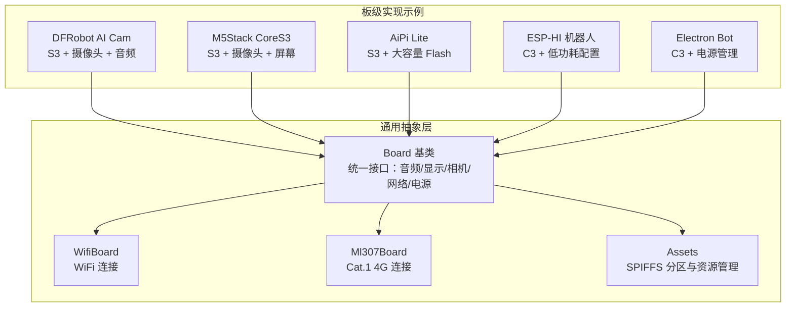
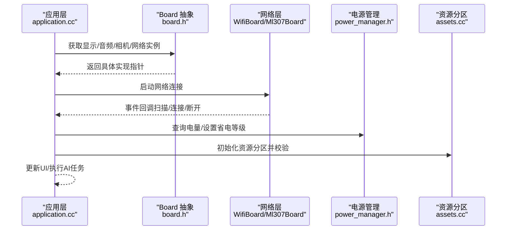
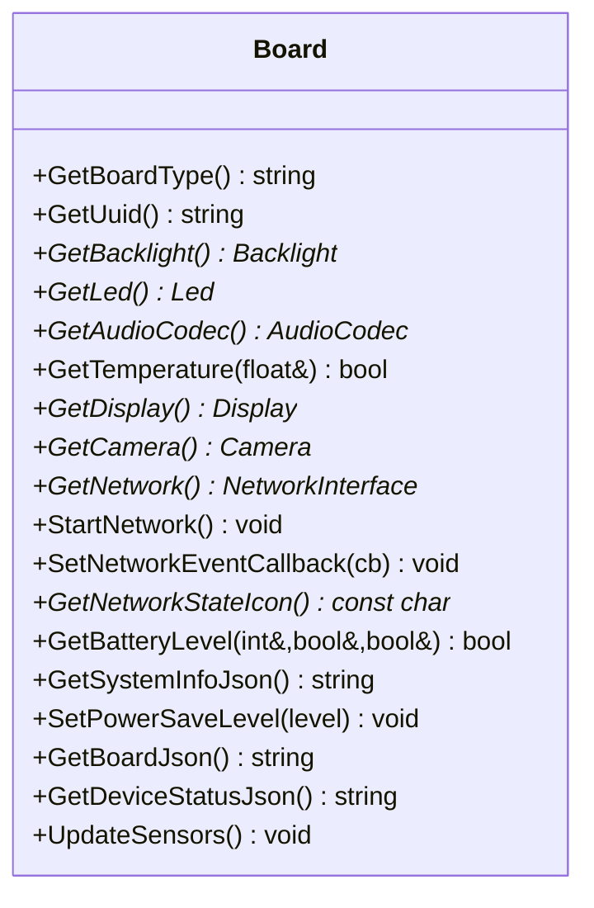
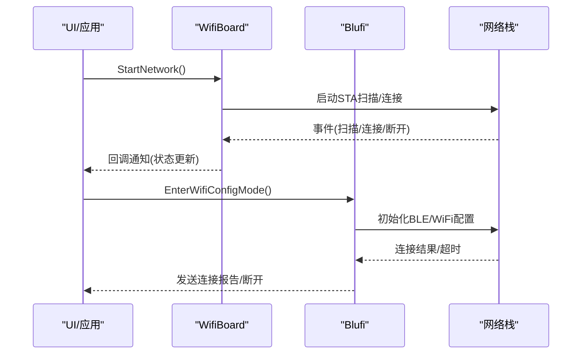
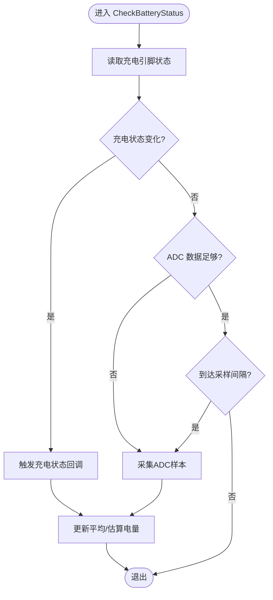
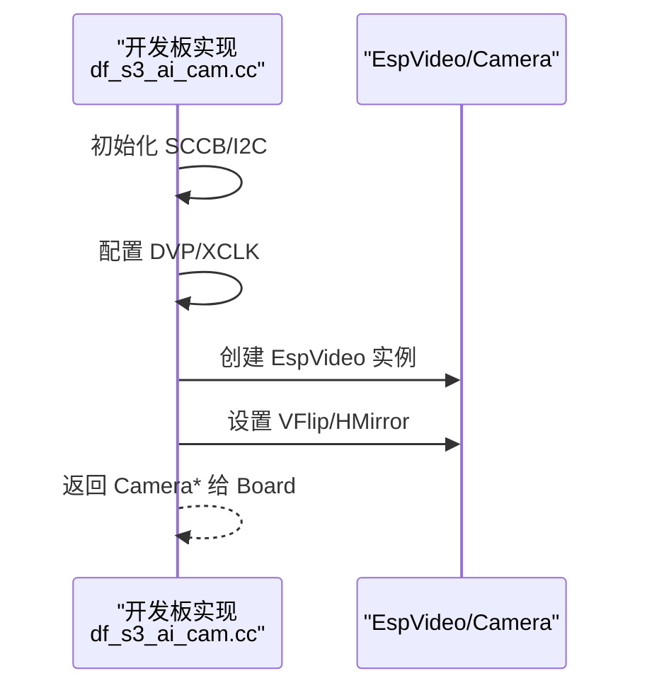
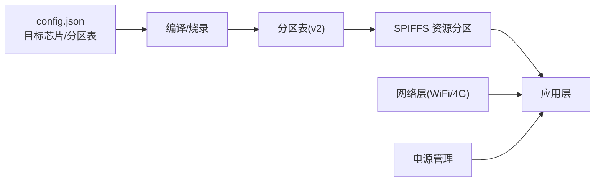

# 硬件选型指南

<cite>
**本文引用的文件**   
- [README.md](file://README.md)
- [README_zh.md](file://README_zh.md)
- [custom-board.md](file://docs/custom-board.md)
- [board.h](file://main/boards/common/board.h)
- [wifi_board.h](file://main/boards/common/wifi_board.h)
- [ml307_board.h](file://main/boards/common/ml307_board.h)
- [blufi.cpp](file://main/boards/common/blufi.cpp)
- [application.cc](file://main/application.cc)
- [assets.cc](file://main/assets.cc)
- [power_manager.h](file://main/boards/electron-bot/power_manager.h)
- [power_manager.h](file://main/boards/atk-dnesp32s3-box2-4g/power_manager.h)
- [power_manager.h](file://main/boards/atk-dnesp32s3-box2-wifi/power_manager.h)
- [power_manager.h](file://main/boards/du-chatx/power_manager.h)
- [power_manager.h](file://main/boards/genjutech-s3-1.54tft/power_manager.h)
- [power_manager.h](file://main/boards/esp32-cgc-144/power_manager.h)
- [df_s3_ai_cam.cc](file://main/boards/df-s3-ai-cam/df_s3_ai_cam.cc)
- [config.json](file://main/boards/aipi-lite/config.json)
- [config.json](file://main/boards/m5stack-core-s3/config.json)
- [config.json](file://main/boards/df-s3-ai-cam/config.json)
- [config.json](file://main/boards/esp-hi/config.json)
- [config.json](file://main/boards/atom-echos3r/config.json)
- [config.json](file://main/boards/atoms3-echo-base/config.json)
- [config.json](file://main/boards/atk-dnesp32s3/config.json)
- [config.json](file://main/boards/esp-sparkbot/config.json)
</cite>

## 目录
1. [简介](#简介)
2. [项目结构](#项目结构)
3. [核心组件](#核心组件)
4. [架构总览](#架构总览)
5. [详细组件分析](#详细组件分析)
6. [依赖分析](#依赖分析)
7. [性能考量](#性能考量)
8. [故障排查指南](#故障排查指南)
9. [结论](#结论)
10. [附录](#附录)

## 简介
本指南面向希望基于 ESP32-AI 项目构建智能硬件产品的工程师与爱好者，提供系统化的硬件选型建议。项目支持语音交互、离线唤醒、AI 视觉、机器人控制、长续航与多协议通信等多种场景，覆盖 ESP32-C3、ESP32-S3、ESP32-P4 等芯片平台。本文将结合仓库中的硬件抽象层、网络与电源管理实现，给出面向不同应用场景的硬件要求、性能对比、成本与可获得性评估、兼容性检查清单以及常见问题解决方案。

## 项目结构
项目采用“硬件抽象 + 板级适配”的组织方式：统一的 Board 抽象接口向下对接音频、显示、相机、网络、电源等外设；各开发板在独立目录中实现具体硬件初始化与配置，并通过 config.json 指定目标芯片与分区表。整体结构如下：

图表来源
- [board.h:49-86](file://main/boards/common/board.h#L49-L86)
- [wifi_board.h:9-67](file://main/boards/common/wifi_board.h#L9-L67)
- [ml307_board.h:9-36](file://main/boards/common/ml307_board.h#L9-L36)
- [assets.cc:130-196](file://main/assets.cc#L130-L196)

章节来源
- [README.md: 39-65:39-65](file://README.md#L39-L65)
- [board.h: 49-86:49-86](file://main/boards/common/board.h#L49-L86)

## 核心组件
- 硬件抽象接口：Board 提供统一的 GetAudioCodec、GetDisplay、GetCamera、GetNetwork、GetBatteryLevel、SetPowerSaveLevel 等接口，屏蔽不同开发板差异。
- 网络层：WifiBoard 支持 WiFi 连接与配置模式；Ml307Board 支持 Cat.1 4G 模块；Blufi 提供 BLE/WiFi 双模配置能力。
- 电源与续航：各板级实现包含独立的电源管理模块，负责电池电量估算、充电状态检测与低电量回调。
- 资源分区：Assets 通过 SPIFFS 分区存放本地资源，支持校验与映射加载。

章节来源
- [board.h: 49-86:49-86](file://main/boards/common/board.h#L49-L86)
- [wifi_board.h: 9-67:9-67](file://main/boards/common/wifi_board.h#L9-L67)
- [ml307_board.h: 9-36:9-36](file://main/boards/common/ml307_board.h#L9-L36)
- [blufi.cpp: 105-139:105-139](file://main/boards/common/blufi.cpp#L105-L139)
- [assets.cc: 130-196:130-196](file://main/assets.cc#L130-L196)

## 架构总览
下图展示了从应用层到硬件层的关键交互路径，体现多协议通信、AI 视觉与电源管理的协同关系：

图表来源
- [application.cc: 127-156:127-156](file://main/application.cc#L127-L156)
- [board.h: 68-86:68-86](file://main/boards/common/board.h#L68-L86)
- [wifi_board.h: 49-67:49-67](file://main/boards/common/wifi_board.h#L49-L67)
- [ml307_board.h: 29-36:29-36](file://main/boards/common/ml307_board.h#L29-L36)
- [assets.cc: 130-196:130-196](file://main/assets.cc#L130-L196)

## 详细组件分析

### 硬件抽象与接口契约
Board 抽象定义了统一的硬件接口族，便于在不同开发板间复用业务逻辑。其关键职责包括：
- 设备标识与状态：UUID 生成、系统信息 JSON、设备状态 JSON。
- 外设访问：音频编解码、显示、相机、网络、背光、LED、温度、电池。
- 功耗策略：支持低功耗、平衡、高性能三种省电等级。

图表来源
- [board.h: 49-86:49-86](file://main/boards/common/board.h#L49-L86)

章节来源
- [board.h: 49-86:49-86](file://main/boards/common/board.h#L49-L86)

### 网络连接与配置
- WiFiBoard：提供 WiFi 连接、扫描、配置模式与超时处理；通过回调向 UI 展示网络状态。
- Ml307Board：封装 Cat.1 4G 模组，提供网络初始化任务与事件上报。
- Blufi：支持 BLE/WiFi 双模配置，避免同时启用热点与 Blufi 的冲突。

图表来源
- [wifi_board.h: 22-67:22-67](file://main/boards/common/wifi_board.h#L22-L67)
- [blufi.cpp: 105-139:105-139](file://main/boards/common/blufi.cpp#L105-L139)
- [application.cc: 127-156:127-156](file://main/application.cc#L127-L156)

章节来源
- [wifi_board.h: 9-67:9-67](file://main/boards/common/wifi_board.h#L9-L67)
- [ml307_board.h: 9-36:9-36](file://main/boards/common/ml307_board.h#L9-L36)
- [blufi.cpp: 740-793:740-793](file://main/boards/common/blufi.cpp#L740-L793)
- [application.cc: 127-156:127-156](file://main/application.cc#L127-L156)

### 电源管理与续航
各开发板均实现独立的电源管理模块，典型职责包括：
- 充电状态检测与电池电量估算
- 低电量回调与定时采样
- 放电/充电状态查询

图表来源
- [power_manager.h:31-44](file://main/boards/electron-bot/power_manager.h#L31-L44)
- [power_manager.h:171-195](file://main/boards/atk-dnesp32s3-box2-4g/power_manager.h#L171-L195)
- [power_manager.h:171-195](file://main/boards/atk-dnesp32s3-box2-wifi/power_manager.h#L171-L195)
- [power_manager.h:162-186](file://main/boards/du-chatx/power_manager.h#L162-L186)
- [power_manager.h:162-186](file://main/boards/genjutech-s3-1.54tft/power_manager.h#L162-L186)
- [power_manager.h:162-186](file://main/boards/esp32-cgc-144/power_manager.h#L162-L186)

章节来源
- [power_manager.h:9-44](file://main/boards/electron-bot/power_manager.h#L9-L44)
- [power_manager.h:147-195](file://main/boards/atk-dnesp32s3-box2-4g/power_manager.h#L147-L195)
- [power_manager.h:147-195](file://main/boards/atk-dnesp32s3-box2-wifi/power_manager.h#L147-L195)
- [power_manager.h:138-186](file://main/boards/du-chatx/power_manager.h#L138-L186)
- [power_manager.h:138-186](file://main/boards/genjutech-s3-1.54tft/power_manager.h#L138-L186)
- [power_manager.h:138-186](file://main/boards/esp32-cgc-144/power_manager.h#L138-L186)

### AI 视觉与相机集成
部分开发板内置摄像头与图像处理初始化，典型流程如下：
- SCCB/I2C 初始化
- DVP 接口与 XCLK 配置
- 传感器型号与翻转镜像设置
- EspVideo 封装对象创建与属性调整

图表来源
- [df_s3_ai_cam.cc: 53-112:53-112](file://main/boards/df-s3-ai-cam/df_s3_ai_cam.cc#L53-L112)

章节来源
- [df_s3_ai_cam.cc: 53-112:53-112](file://main/boards/df-s3-ai-cam/df_s3_ai_cam.cc#L53-L112)

## 依赖分析
- 板级配置与分区表：各开发板通过 config.json 指定目标芯片与分区表文件，确保资源分区大小与 Flash 容量匹配。
- 资源分区策略：Assets 在启动时查找并映射资源分区，进行校验后建立资源索引，保障本地资源可用性。
- 网络与电源耦合：网络连接状态直接影响 UI 与系统行为；电源管理模块提供电量与充电状态，影响运行策略与省电等级。

图表来源
- [config.json:1-12](file://main/boards/aipi-lite/config.json#L1-L12)
- [config.json:1-14](file://main/boards/m5stack-core-s3/config.json#L1-L14)
- [config.json:1-19](file://main/boards/df-s3-ai-cam/config.json#L1-L19)
- [config.json:1-33](file://main/boards/esp-hi/config.json#L1-L33)
- [assets.cc:130-196](file://main/assets.cc#L130-L196)

章节来源
- [config.json:1-12](file://main/boards/aipi-lite/config.json#L1-L12)
- [config.json:1-14](file://main/boards/m5stack-core-s3/config.json#L1-L14)
- [config.json:1-19](file://main/boards/df-s3-ai-cam/config.json#L1-L19)
- [config.json:1-33](file://main/boards/esp-hi/config.json#L1-L33)
- [assets.cc: 130-196:130-196](file://main/assets.cc#L130-L196)

## 性能考量
- 处理能力与内存
  - ESP32-S3：双核 AHB，支持 PSRAM/OCT，适合高分辨率显示与 AI 视觉。
  - ESP32-C3：单核，体积小、功耗低，适合机器人与低功耗设备。
  - ESP32-P4：更高主频与更强算力，适合复杂 AI 推理与多任务并发。
- 存储与分区
  - v2 分区表支持 4MB/8MB/16MB 等容量，需与 config.json 中 Flash 大小一致。
  - 资源分区需要足够的空闲页与校验，避免映射失败。
- 网络与通信
  - WiFi：支持扫描、连接与配置模式；可通过省电等级降低功耗。
  - 4G(Cat.1)：通过 Ml307Board 驱动，适合无 Wi-Fi 场景。
- 电源续航
  - 通过电源管理模块定期采样与低电量回调，结合省电等级实现动态节能。

章节来源
- [README.md: 23-37:23-37](file://README.md#L23-L37)
- [board.h: 35-40:35-40](file://main/boards/common/board.h#L35-L40)
- [assets.cc: 138-142:138-142](file://main/assets.cc#L138-L142)
- [config.json:6-9](file://main/boards/aipi-lite/config.json#L6-L9)
- [config.json:6-11](file://main/boards/m5stack-core-s3/config.json#L6-L11)
- [config.json:6-16](file://main/boards/df-s3-ai-cam/config.json#L6-L16)

## 故障排查指南
- 无法连接网络
  - 确认 WiFi 凭据与热点可用；检查 WiFi 扫描与连接超时逻辑。
  - 若使用 4G 模块，确认 AT 指令链路与注册状态。
- 无法进入配置模式
  - Blufi 与热点配置不可同时启用；确保未同时开启热点与 Blufi。
- 电量显示异常
  - 检查充电引脚电平与 ADC 通道配置；确认采样频率与低电量阈值。
- 资源分区加载失败
  - 校验分区大小与空闲页数量；确认校验和与映射过程无错误。
- 相机初始化失败
  - 检查 SCCB/I2C 引脚、DVP/XCLK 配置与传感器型号；确认翻转镜像设置。

章节来源
- [blufi.cpp: 117-121:117-121](file://main/boards/common/blufi.cpp#L117-L121)
- [application.cc: 127-156:127-156](file://main/application.cc#L127-L156)
- [power_manager.h:31-44](file://main/boards/electron-bot/power_manager.h#L31-L44)
- [assets.cc: 142-145:142-145](file://main/assets.cc#L142-L145)
- [df_s3_ai_cam.cc: 53-84:53-84](file://main/boards/df-s3-ai-cam/df_s3_ai_cam.cc#L53-L84)

## 结论
ESP32-AI 项目提供了完善的硬件抽象与多场景适配方案。选型时应优先考虑：
- 应用场景：语音交互优先选择带音频编解码与显示的开发板；AI 视觉优先选择 S3/P4 平台并配备合适相机；机器人控制优先选择 C3 并优化电源管理。
- 性能与成本：S3/P4 算力更强但成本更高；C3 更经济且功耗低。
- 可获得性与生态：优先选择社区成熟、文档齐全的开发板。
- 兼容性：严格遵循 config.json 与分区表配置，确保资源分区与 Flash 容量匹配。

## 附录

### 硬件选型对照表（按场景）
- 语音交互（含唤醒/ASR/LLM/TTS）
  - 推荐：ESP32-S3（M5Stack CoreS3、AiPi Lite）、ESP32-C3（ESP-HI 机器人）
  - 关键点：音频编解码、显示、网络（WiFi/4G）、省电等级
- AI 视觉（摄像头+图像处理）
  - 推荐：ESP32-S3（DFRobot AI Cam、M5Stack CoreS3）
  - 关键点：DVP/I2C、XCLK、传感器型号、翻转镜像
- 机器人控制（移动/姿态/显示）
  - 推荐：ESP32-C3（ESP-HI、Electron Bot）
  - 关键点：电源管理、省电等级、运动控制
- 长续航（低功耗待机/间歇工作）
  - 推荐：ESP32-C3（ESP-HI、Du-ChatX、Genjutech 等）
  - 关键点：ADC 采样、低电量回调、省电等级

章节来源
- [README.md: 51-65:51-65](file://README.md#L51-L65)
- [df_s3_ai_cam.cc: 53-112:53-112](file://main/boards/df-s3-ai-cam/df_s3_ai_cam.cc#L53-L112)
- [config.json:1-33](file://main/boards/esp-hi/config.json#L1-L33)
- [power_manager.h:31-44](file://main/boards/electron-bot/power_manager.h#L31-L44)

### 硬件兼容性检查清单
- 芯片与分区表
  - 目标芯片与 config.json 一致
  - Flash 容量与分区表匹配
- 外设接口
  - 音频编解码、显示、相机、按键、LED、I2C/SPI 引脚正确
- 电源与续航
  - 充电状态检测、ADC 通道、低电量阈值、省电等级
- 网络与通信
  - WiFi/4G 模块驱动、配置模式、超时与重试
- 资源分区
  - 分区存在、空闲页足够、校验和有效

章节来源
- [board.h: 68-86:68-86](file://main/boards/common/board.h#L68-L86)
- [assets.cc: 138-172:138-172](file://main/assets.cc#L138-L172)
- [config.json:6-9](file://main/boards/aipi-lite/config.json#L6-L9)
- [config.json:6-11](file://main/boards/m5stack-core-s3/config.json#L6-L11)