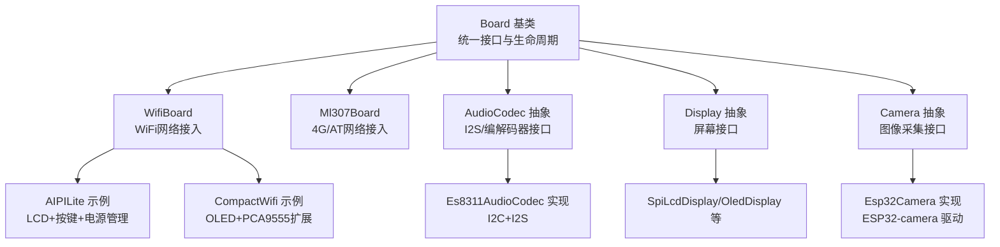
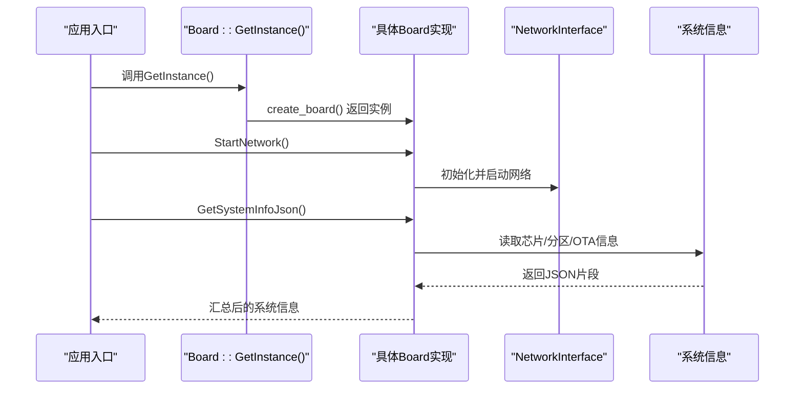
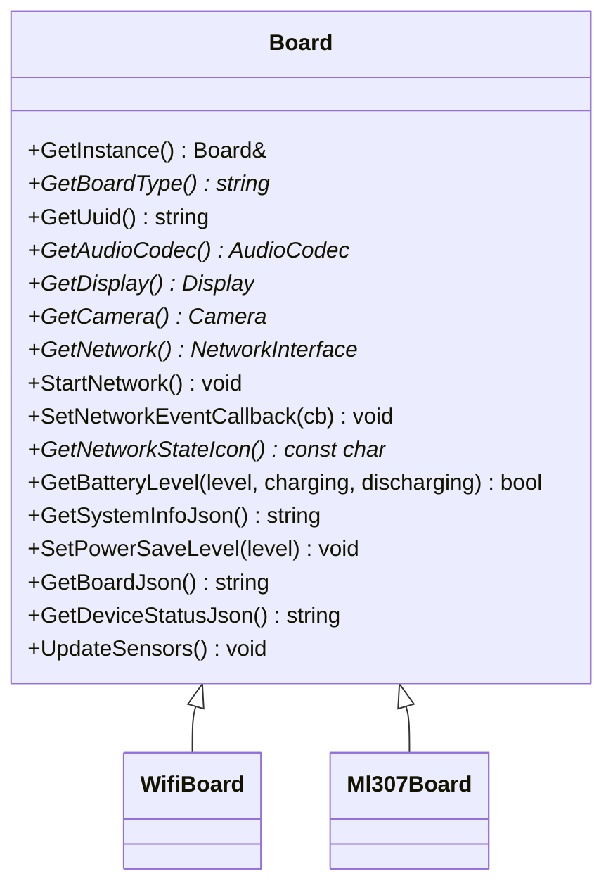
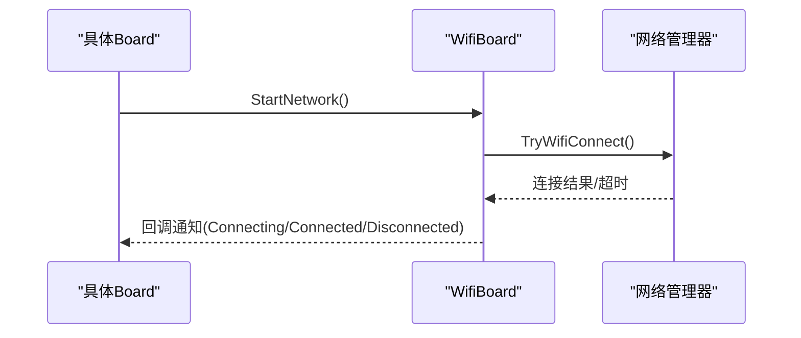
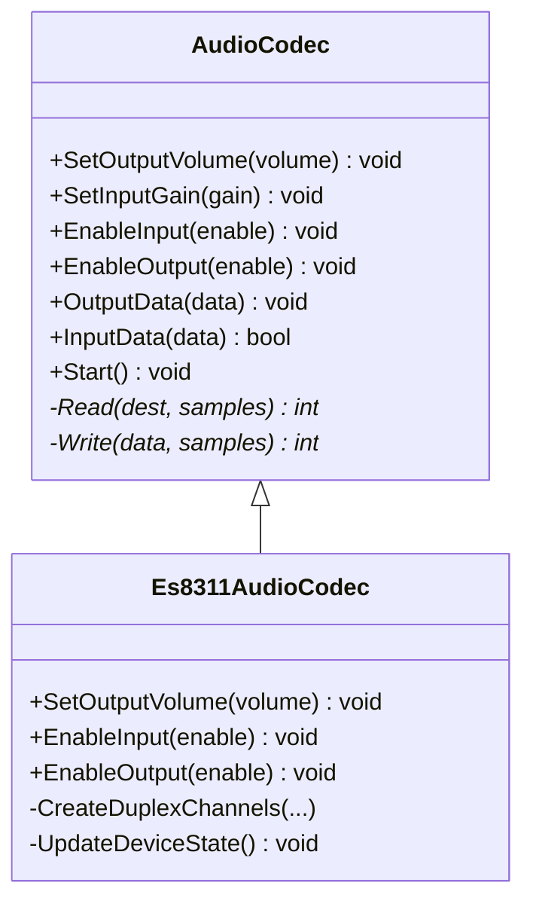
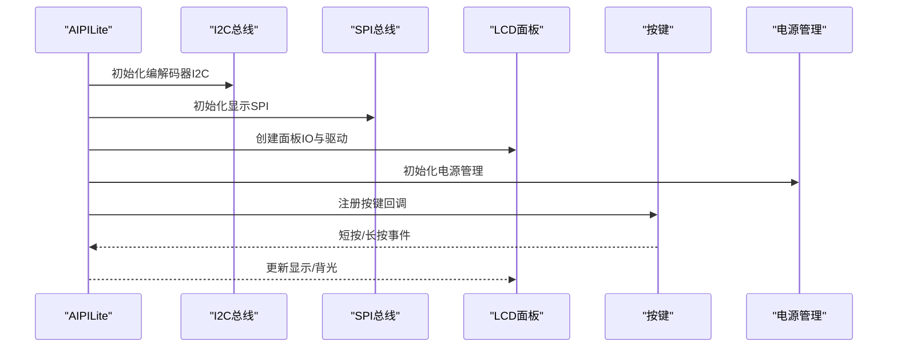
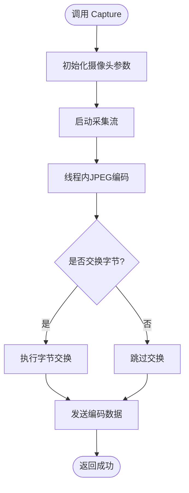
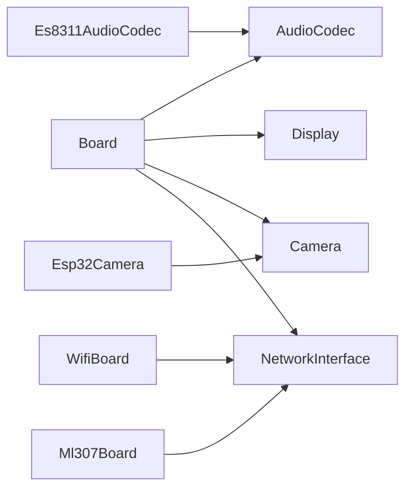

# 自定义硬件集成

<cite>
**本文引用的文件**
- [main/boards/common/board.h](file://main/boards/common/board.h)
- [main/boards/common/board.cc](file://main/boards/common/board.cc)
- [main/boards/common/wifi_board.h](file://main/boards/common/wifi_board.h)
- [main/boards/common/ml307_board.h](file://main/boards/common/ml307_board.h)
- [main/boards/aipi-lite/aipi-lite.cc](file://main/boards/aipi-lite/aipi-lite.cc)
- [main/boards/bread-compact-wifi/compact_wifi_board.cc](file://main/boards/bread-compact-wifi/compact_wifi_board.cc)
- [main/audio/audio_codec.h](file://main/audio/audio_codec.h)
- [main/audio/codecs/es8311_audio_codec.h](file://main/audio/codecs/es8311_audio_codec.h)
- [main/boards/common/camera.h](file://main/boards/common/camera.h)
- [main/boards/common/esp32_camera.h](file://main/boards/common/esp32_camera.h)
- [docs/custom-board.md](file://docs/custom-board.md)
</cite>

## 目录
1. [简介](#简介)
2. [项目结构](#项目结构)
3. [核心组件](#核心组件)
4. [架构总览](#架构总览)
5. [详细组件分析](#详细组件分析)
6. [依赖分析](#依赖分析)
7. [性能考虑](#性能考虑)
8. [故障排查指南](#故障排查指南)
9. [结论](#结论)
10. [附录](#附录)

## 简介
本指南面向希望为ESP32-AI项目新增自定义硬件平台的开发者，提供从零开始的完整硬件适配流程与最佳实践。内容涵盖：
- 硬件抽象层（HAL）扩展方法：Board基类继承、虚函数实现、硬件特定功能封装
- 典型集成案例：GPIO控制、音频编解码、网络通信、显示控制、摄像头
- 硬件配置文件编写：引脚定义、时钟配置、外设初始化
- 调试技巧、常见问题排查与性能优化建议

## 项目结构
ESP32-AI采用“Board抽象 + 组件化外设”的分层设计。顶层Board类统一对外暴露能力；具体开发板通过继承不同父类（如WifiBoard、Ml307Board）实现网络与硬件能力；音频、显示、摄像头等作为可插拔组件注入。

图表来源
- [main/boards/common/board.h:49-86](file://main/boards/common/board.h#L49-L86)
- [main/boards/common/wifi_board.h:9-67](file://main/boards/common/wifi_board.h#L9-L67)
- [main/boards/common/ml307_board.h:9-36](file://main/boards/common/ml307_board.h#L9-L36)
- [main/audio/audio_codec.h:17-59](file://main/audio/audio_codec.h#L17-L59)
- [main/audio/codecs/es8311_audio_codec.h:13-40](file://main/audio/codecs/es8311_audio_codec.h#L13-L40)
- [main/boards/common/esp32_camera.h:22-44](file://main/boards/common/esp32_camera.h#L22-L44)

章节来源
- [main/boards/common/board.h:1-94](file://main/boards/common/board.h#L1-L94)
- [main/boards/common/board.cc:1-179](file://main/boards/common/board.cc#L1-L179)
- [docs/custom-board.md:1-453](file://docs/custom-board.md#L1-L453)

## 核心组件
- Board基类：定义统一的硬件抽象接口，包括获取编解码器、显示、网络、电源策略、系统信息等；提供静态工厂GetInstance与UUID生成机制。
- WifiBoard/Ml307Board：分别面向WiFi与4G网络场景，封装连接状态、配网模式、事件回调与功耗策略。
- AudioCodec体系：抽象音频输入输出、音量增益、I2S通道；Es8311AudioCodec为典型I2C+I2S实现。
- Display/Camera体系：抽象屏幕与摄像头接口，便于替换不同驱动与硬件平台。

章节来源
- [main/boards/common/board.h:49-86](file://main/boards/common/board.h#L49-L86)
- [main/boards/common/wifi_board.h:9-67](file://main/boards/common/wifi_board.h#L9-L67)
- [main/boards/common/ml307_board.h:9-36](file://main/boards/common/ml307_board.h#L9-L36)
- [main/audio/audio_codec.h:17-59](file://main/audio/audio_codec.h#L17-L59)
- [main/audio/codecs/es8311_audio_codec.h:13-40](file://main/audio/codecs/es8311_audio_codec.h#L13-L40)
- [main/boards/common/camera.h:6-14](file://main/boards/common/camera.h#L6-L14)
- [main/boards/common/esp32_camera.h:22-44](file://main/boards/common/esp32_camera.h#L22-L44)

## 架构总览
下图展示了Board实例的创建、网络启动与系统信息生成的关键路径，以及典型外设注入点。

图表来源
- [main/boards/common/board.cc:60-86](file://main/boards/common/board.cc#L60-L86)
- [main/boards/common/board.cc:110-178](file://main/boards/common/board.cc#L110-L178)
- [main/boards/common/wifi_board.h:49-56](file://main/boards/common/wifi_board.h#L49-L56)

章节来源
- [main/boards/common/board.cc:15-23](file://main/boards/common/board.cc#L15-L23)
- [main/boards/common/board.cc:70-178](file://main/boards/common/board.cc#L70-L178)

## 详细组件分析

### Board基类与工厂模式
- 设计要点
  - 单例工厂：通过全局create_board钩子返回具体Board实例，避免上层硬编码。
  - 虚函数接口：GetAudioCodec、GetDisplay、GetNetwork、StartNetwork、SetPowerSaveLevel等，供子类按需实现。
  - 默认行为：未实现的功能返回空指针或false，保证调用安全。
  - UUID持久化：首次运行生成UUID并保存至Settings，确保设备唯一标识。
- 扩展建议
  - 新建类时使用DECLARE_BOARD宏注册，确保工厂能创建实例。
  - 若无某外设，返回空指针或占位实现，避免破坏整体流程。

图表来源
- [main/boards/common/board.h:49-86](file://main/boards/common/board.h#L49-L86)
- [main/boards/common/wifi_board.h:9-67](file://main/boards/common/wifi_board.h#L9-L67)
- [main/boards/common/ml307_board.h:9-36](file://main/boards/common/ml307_board.h#L9-L36)

章节来源
- [main/boards/common/board.h:49-86](file://main/boards/common/board.h#L49-L86)
- [main/boards/common/board.cc:15-23](file://main/boards/common/board.cc#L15-L23)
- [main/boards/common/board.cc:25-46](file://main/boards/common/board.cc#L25-L46)

### 网络接入层（WifiBoard/Ml307Board）
- WifiBoard
  - 提供异步StartNetwork、配网模式EnterWifiConfigMode、网络事件回调SetNetworkEventCallback。
  - 通过内部定时器与事件组管理连接状态，适合Wi-Fi直连或热点场景。
- Ml307Board
  - 基于AT指令的4G模块，提供独立的网络任务与事件回调，适合蜂窝网络。
- 典型用法
  - 在Board实现中复用上述父类能力，减少重复网络逻辑。

图表来源
- [main/boards/common/wifi_board.h:27-61](file://main/boards/common/wifi_board.h#L27-L61)

章节来源
- [main/boards/common/wifi_board.h:9-67](file://main/boards/common/wifi_board.h#L9-L67)
- [main/boards/common/ml307_board.h:9-36](file://main/boards/common/ml307_board.h#L9-L36)

### 音频编解码器（AudioCodec与Es8311）
- AudioCodec
  - 抽象I2S输入输出、音量/增益控制、双工模式开关；子类负责I2C/I2S具体实现。
- Es8311AudioCodec
  - 基于esp_codec_dev，通过I2C配置编解码器，I2S连接麦克风/扬声器；支持PA使能与反相控制。
- 集成要点
  - 在Board::GetAudioCodec中返回静态实例，并传入I2C总线、I2S引脚与采样率等参数。
  - 注意PA引脚与是否反相，避免无声或失真。

图表来源
- [main/audio/audio_codec.h:17-59](file://main/audio/audio_codec.h#L17-L59)
- [main/audio/codecs/es8311_audio_codec.h:13-40](file://main/audio/codecs/es8311_audio_codec.h#L13-L40)

章节来源
- [main/audio/audio_codec.h:17-59](file://main/audio/audio_codec.h#L17-L59)
- [main/audio/codecs/es8311_audio_codec.h:13-40](file://main/audio/codecs/es8311_audio_codec.h#L13-L40)

### 显示与按键（以AIPILite与CompactWifi为例）
- AIPILite
  - 使用SPI+I2C驱动LCD与音频编解码器；集成电源管理与休眠定时器；提供背光PWM控制。
  - 按键事件：短按触发聊天状态切换，长按进入配网模式；电源键长按触发关机深睡。
- CompactWifi
  - 使用I2C驱动OLED；集成PCA9555 IO扩展器进行测试；提供音量调节与触摸按键。
- 集成要点
  - 在Board实现中分别初始化I2C/SPI、面板与IO；在GetDisplay/GetBacklight中返回对应对象。
  - 注意面板初始化顺序（IO->Panel->Reset->Init）、镜像/翻转/颜色反转等参数。

图表来源
- [main/boards/aipi-lite/aipi-lite.cc:67-132](file://main/boards/aipi-lite/aipi-lite.cc#L67-L132)
- [main/boards/aipi-lite/aipi-lite.cc:134-172](file://main/boards/aipi-lite/aipi-lite.cc#L134-L172)
- [main/boards/bread-compact-wifi/compact_wifi_board.cc:86-152](file://main/boards/bread-compact-wifi/compact_wifi_board.cc#L86-L152)

章节来源
- [main/boards/aipi-lite/aipi-lite.cc:26-247](file://main/boards/aipi-lite/aipi-lite.cc#L26-L247)
- [main/boards/bread-compact-wifi/compact_wifi_board.cc:30-241](file://main/boards/bread-compact-wifi/compact_wifi_board.cc#L30-L241)

### 摄像头（Camera抽象与Esp32Camera实现）
- Camera抽象
  - 提供拍照、镜像/翻转、解释接口（Explain）等统一能力。
- Esp32Camera
  - 基于ESP32-camera驱动，支持JPEG编码与线程化处理；可配置像素字节交换。
- 集成要点
  - 在Board::GetCamera中返回实现；注意内存与队列配置，避免编码阻塞UI。

图表来源
- [main/boards/common/esp32_camera.h:22-44](file://main/boards/common/esp32_camera.h#L22-L44)

章节来源
- [main/boards/common/camera.h:6-14](file://main/boards/common/camera.h#L6-L14)
- [main/boards/common/esp32_camera.h:22-44](file://main/boards/common/esp32_camera.h#L22-L44)

### 自定义开发板全流程（从零到一）
- 目录与文件
  - 在main/boards/下创建新目录，包含xxx_board.cc、config.h、config.json、README.md。
- 配置文件
  - config.h：定义I2C/I2S/显示/按键等引脚与参数。
  - config.json：target芯片、sdkconfig_append分区与语言等。
- 代码实现
  - 继承WifiBoard或Ml307Board，实现初始化、虚函数重写与外设注入。
  - 使用DECLARE_BOARD注册。
- 构建系统
  - 在Kconfig.projbuild与CMakeLists.txt中添加新开发板选项。
- 编译与验证
  - 使用idf.py或scripts/release.py编译打包，烧录后观察日志与功能。

章节来源
- [docs/custom-board.md:11-134](file://docs/custom-board.md#L11-L134)
- [docs/custom-board.md:135-289](file://docs/custom-board.md#L135-L289)
- [docs/custom-board.md:291-342](file://docs/custom-board.md#L291-L342)
- [docs/custom-board.md:343-389](file://docs/custom-board.md#L343-L389)

## 依赖分析
- 组件耦合
  - Board对AudioCodec/Display/Camera为组合关系，通过虚函数注入，降低耦合度。
  - WifiBoard/Ml307Board对NetworkInterface依赖，但通过Board统一暴露，便于替换。
- 外部依赖
  - ESP-IDF驱动（I2C/I2S/SPI/LCD等）与LVGL显示框架。
  - esp_codec_dev用于音频编解码器配置。
- 循环依赖
  - 通过头文件前向声明与动态返回指针避免循环包含。

图表来源
- [main/boards/common/board.h:47-86](file://main/boards/common/board.h#L47-L86)
- [main/boards/common/wifi_board.h:49-56](file://main/boards/common/wifi_board.h#L49-L56)
- [main/boards/common/ml307_board.h:29-35](file://main/boards/common/ml307_board.h#L29-L35)
- [main/audio/audio_codec.h:17-59](file://main/audio/audio_codec.h#L17-L59)
- [main/audio/codecs/es8311_audio_codec.h:13-40](file://main/audio/codecs/es8311_audio_codec.h#L13-L40)
- [main/boards/common/esp32_camera.h:22-44](file://main/boards/common/esp32_camera.h#L22-L44)

章节来源
- [main/boards/common/board.h:47-86](file://main/boards/common/board.h#L47-L86)
- [main/boards/common/wifi_board.h:49-56](file://main/boards/common/wifi_board.h#L49-L56)
- [main/boards/common/ml307_board.h:29-35](file://main/boards/common/ml307_board.h#L29-L35)

## 性能考虑
- 功耗管理
  - 使用PowerSaveLevel枚举与电源管理组件（如AIPILite中的PowerSaveTimer），在非充电状态下启用省电策略。
- 音频缓冲
  - AudioCodec使用DMA描述符与帧数配置，合理设置采样率与通道数，避免中断抖动。
- 显示刷新
  - 屏幕初始化参数（如SPI频率、面板像素格式）影响渲染性能；根据分辨率选择合适字体与表情集。
- 摄像头编码
  - JPEG编码在独立线程中进行，注意内存分配与队列深度，避免阻塞主任务。

## 故障排查指南
- 显示异常
  - 检查SPI/I2C引脚、面板驱动初始化顺序、颜色反转/镜像/XY交换参数。
- 音频无声/失真
  - 核对I2S引脚、采样率、编解码器地址与PA引脚配置；确认EnableOutput已开启。
- 网络无法连接
  - 查看WiFi事件回调与配网模式流程；确认ssid/password与超时配置。
- 电源管理
  - 观察充电/放电状态变化与定时器唤醒/休眠逻辑；确保深睡引脚与RTC配置正确。
- PCA9555扩展
  - 确认I2C地址、SDA/SCL连接与方向设置；通过测试任务验证引脚电平翻转。

章节来源
- [main/boards/aipi-lite/aipi-lite.cc:36-65](file://main/boards/aipi-lite/aipi-lite.cc#L36-L65)
- [main/boards/aipi-lite/aipi-lite.cc:174-179](file://main/boards/aipi-lite/aipi-lite.cc#L174-L179)
- [main/boards/bread-compact-wifi/compact_wifi_board.cc:42-84](file://main/boards/bread-compact-wifi/compact_wifi_board.cc#L42-L84)

## 结论
通过Board基类与组件化外设的设计，ESP32-AI实现了对多款开发板的统一支持。开发者只需遵循HAL接口、完善配置文件与Board实现，即可快速完成新硬件平台的集成。建议优先从显示与按键入手，逐步叠加音频、网络与摄像头功能，并结合电源管理与性能优化，确保产品体验与稳定性。

## 附录
- 快速清单
  - 创建目录与文件：xxx_board.cc、config.h、config.json、README.md
  - 在Kconfig.projbuild与CMakeLists.txt中添加开发板选项
  - 实现Board::GetAudioCodec/GetDisplay/GetNetwork等虚函数
  - 使用DECLARE_BOARD注册
  - 使用release.py或idf.py完成编译与烧录