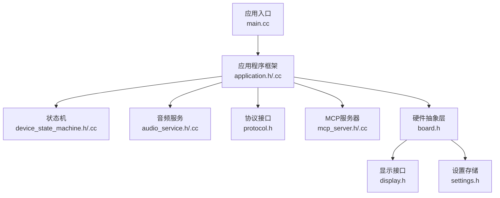
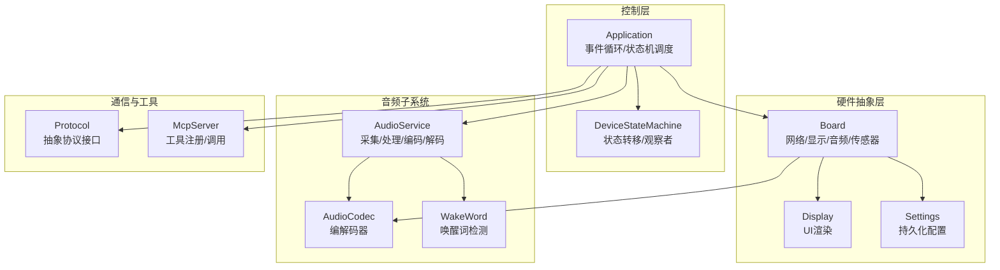
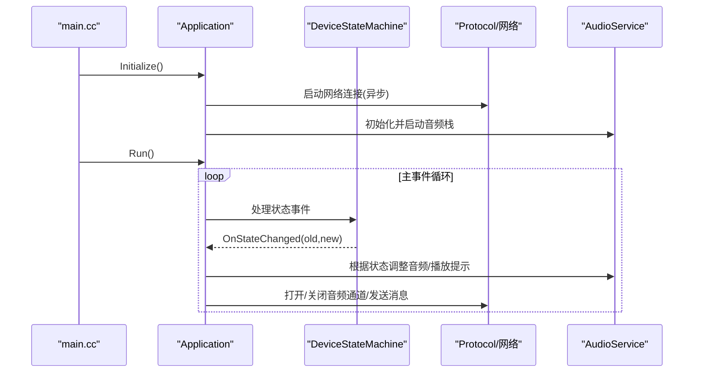
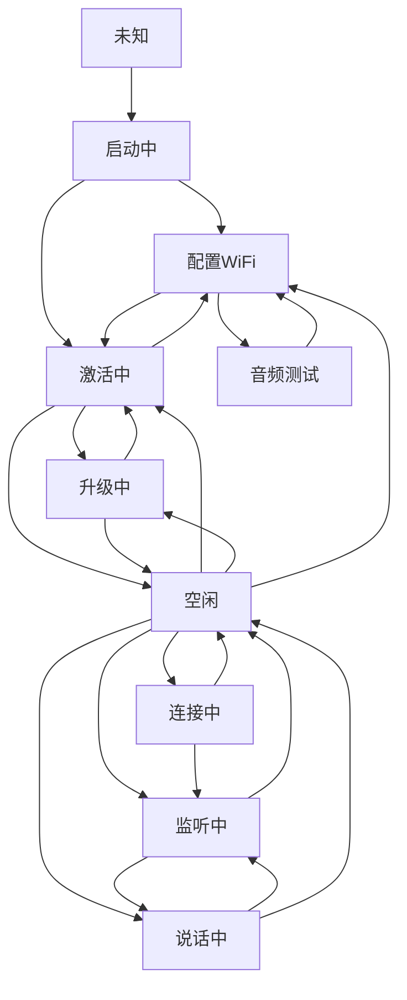
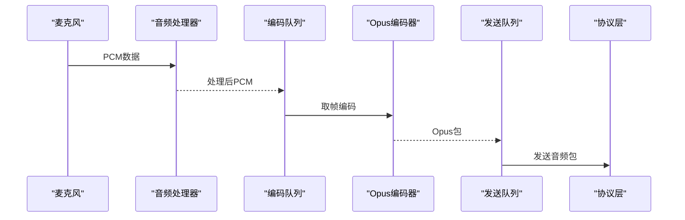
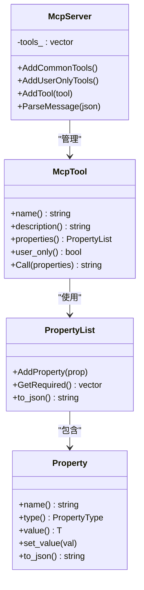
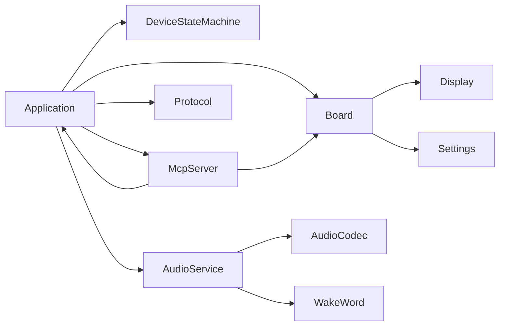

# 软件架构概览

<cite>
**本文引用的文件**   
- [main.cc](file://main/main.cc)
- [application.h](file://main/application.h)
- [application.cc](file://main/application.cc)
- [device_state.h](file://main/device_state.h)
- [device_state_machine.h](file://main/device_state_machine.h)
- [device_state_machine.cc](file://main/device_state_machine.cc)
- [mcp_server.h](file://main/mcp_server.h)
- [mcp_server.cc](file://main/mcp_server.cc)
- [audio_service.h](file://main/audio/audio_service.h)
- [audio_service.cc](file://main/audio/audio_service.cc)
- [protocol.h](file://main/protocols/protocol.h)
- [board.h](file://main/boards/common/board.h)
- [display.h](file://main/display/display.h)
- [settings.h](file://main/settings.h)
</cite>

## 目录
1. [引言](#引言)
2. [项目结构](#项目结构)
3. [核心组件](#核心组件)
4. [架构总览](#架构总览)
5. [详细组件分析](#详细组件分析)
6. [依赖分析](#依赖分析)
7. [性能考虑](#性能考虑)
8. [故障排查指南](#故障排查指南)
9. [结论](#结论)

## 引言
本文件面向ESP32-AI项目，基于ESP-IDF框架，系统性阐述软件架构设计与实现要点。项目采用分层架构与模块化设计，结合事件驱动与状态机模型，围绕“应用程序框架—硬件抽象层—音频系统—通信协议—MCP服务器”五大主线展开，辅以观察者模式（事件回调）、工厂模式（板级适配）等设计模式，确保可扩展性、可维护性与实时性。

## 项目结构
项目代码按功能域划分，顶层入口位于main目录，核心模块包括：
- 应用程序框架：负责初始化、主事件循环、状态管理与跨模块调度
- 硬件抽象层：统一设备能力接口（网络、显示、音频编解码器、传感器等）
- 音频系统：采集、处理、编码、解码、播放与AEC配合
- 通信协议：抽象协议接口，支持WebSocket/MQTT等具体实现
- MCP服务器：本地工具注册与调用，提供设备自描述与控制能力

图表来源
- [main.cc:14-29](file://main/main.cc#L14-L29)
- [application.h:50-194](file://main/application.h#L50-L194)
- [device_state_machine.h:17-81](file://main/device_state_machine.h#L17-L81)
- [audio_service.h:106-194](file://main/audio/audio_service.h#L106-L194)
- [protocol.h:44-95](file://main/protocols/protocol.h#L44-L95)
- [mcp_server.h:314-342](file://main/mcp_server.h#L314-L342)
- [board.h:49-86](file://main/boards/common/board.h#L49-L86)
- [display.h:28-63](file://main/display/display.h#L28-L63)
- [settings.h:7-26](file://main/settings.h#L7-L26)

章节来源
- [main.cc:14-29](file://main/main.cc#L14-L29)
- [application.h:50-194](file://main/application.h#L50-L194)

## 核心组件
- 应用程序框架（Application）
  - 单例模式，提供Initialize/Run主循环，封装事件位、定时器、任务队列与资源复位
  - 对外暴露状态切换、音频控制、OTA升级、MCP消息发送等接口
- 设备状态机（DeviceStateMachine）
  - 基于严格状态转移规则的状态机，支持观察者回调，保证状态一致性
- 音频服务（AudioService）
  - 分离输入/输出/编解码三类任务，多队列缓冲，支持VAD、唤醒词检测、AEC配合
- 通信协议（Protocol）
  - 抽象音频/文本通道、会话管理与错误处理，便于扩展不同传输协议
- MCP服务器（McpServer）
  - 工具注册与调用，支持用户可见/不可见两类工具，返回文本或图像内容

章节来源
- [application.h:50-194](file://main/application.h#L50-L194)
- [device_state_machine.h:17-81](file://main/device_state_machine.h#L17-L81)
- [audio_service.h:106-194](file://main/audio/audio_service.h#L106-L194)
- [protocol.h:44-95](file://main/protocols/protocol.h#L44-L95)
- [mcp_server.h:314-342](file://main/mcp_server.h#L314-L342)

## 架构总览
系统采用“事件驱动+状态机”的控制流，Application作为中枢协调各子系统；硬件抽象层屏蔽差异；音频链路独立异步执行；通信协议通过接口解耦；MCP提供本地能力扩展。

图表来源
- [application.h:50-194](file://main/application.h#L50-L194)
- [device_state_machine.h:17-81](file://main/device_state_machine.h#L17-L81)
- [board.h:49-86](file://main/boards/common/board.h#L49-L86)
- [display.h:28-63](file://main/display/display.h#L28-L63)
- [settings.h:7-26](file://main/settings.h#L7-L26)
- [audio_service.h:106-194](file://main/audio/audio_service.h#L106-L194)
- [protocol.h:44-95](file://main/protocols/protocol.h#L44-L95)
- [mcp_server.h:314-342](file://main/mcp_server.h#L314-L342)

## 详细组件分析

### 应用程序框架（Application）
- 角色定位
  - 初始化阶段：挂载显示、音频、网络回调，异步启动网络连接
  - 运行阶段：主事件循环，统一处理网络、状态变更、用户交互等事件
  - 资源管理：提供线程安全的任务调度、协议资源重置、OTA升级入口
- 关键机制
  - 事件位与定时器：MAIN_EVENT_*枚举定义事件类别，clock定时器周期触发
  - 状态机集成：通过DeviceStateMachine进行状态迁移，并在回调中联动UI与音频
  - 音频服务桥接：对外暴露Start/Stop Listening、播放提示音、AEC模式切换等
- 设计模式
  - 单例：全局唯一实例，避免重复初始化
  - 观察者：状态变化回调，供UI与音频模块订阅
  - 任务调度：跨任务安全地将回调投递到主任务执行

图表来源
- [main.cc:14-29](file://main/main.cc#L14-L29)
- [application.h:50-194](file://main/application.h#L50-L194)
- [device_state_machine.h:17-81](file://main/device_state_machine.h#L17-L81)
- [audio_service.h:106-194](file://main/audio/audio_service.h#L106-L194)
- [protocol.h:44-95](file://main/protocols/protocol.h#L44-L95)

章节来源
- [application.h:50-194](file://main/application.h#L50-L194)
- [application.cc:1169-1206](file://main/application.cc#L1169-L1206)

### 设备状态机（DeviceStateMachine）
- 角色定位
  - 维护设备状态集合与合法转移矩阵，提供观察者回调，确保组件间状态一致
- 关键机制
  - 严格校验：仅允许预定义的转移路径，非法转移记录日志并拒绝
  - 观察者：回调在TransitionTo调用上下文内触发，便于快速联动
- 设计模式
  - 观察者：监听状态变化，实现松耦合通知

图表来源
- [device_state_machine.cc:34-101](file://main/device_state_machine.cc#L34-L101)
- [device_state.h:4-17](file://main/device_state.h#L4-L17)

章节来源
- [device_state_machine.h:17-81](file://main/device_state_machine.h#L17-L81)
- [device_state_machine.cc:108-131](file://main/device_state_machine.cc#L108-L131)

### 音频系统（AudioService）
- 角色定位
  - 负责麦克风/扬声器数据通路，音频处理与编解码，以及与协议层的对接
- 关键机制
  - 三类任务分离：输入/输出/编解码，降低时延与提高吞吐
  - 多队列缓冲：发送/解码/播放/测试队列，配合事件组与条件变量
  - VAD/AEC：支持语音活动检测与设备侧/服务端AEC配合
- 数据流
  - 录入：麦克风PCM → 音频处理器 → 编码队列 → Opus编码 → 发送队列 → 协议发送
  - 回放：协议接收 → 解码队列 → Opus解码 → 播放队列 → 扬声器

图表来源
- [audio_service.h:28-37](file://main/audio/audio_service.h#L28-L37)
- [audio_service.h:106-194](file://main/audio/audio_service.h#L106-L194)

章节来源
- [audio_service.h:106-194](file://main/audio/audio_service.h#L106-L194)
- [audio_service.cc:63-124](file://main/audio/audio_service.cc#L63-L124)

### 通信协议（Protocol）
- 角色定位
  - 抽象音频/文本通道、会话管理与错误处理，屏蔽底层传输细节
- 关键机制
  - 回调注册：音频/文本/连接/断开/错误等回调，便于上层组件订阅
  - 通道控制：打开/关闭音频通道、发送开始/停止监听、中止说话等
- 设计模式
  - 接口隔离：通过纯虚函数定义契约，具体实现由WebSocket/MQTT等填充

章节来源
- [protocol.h:44-95](file://main/protocols/protocol.h#L44-L95)

### MCP服务器（McpServer）
- 角色定位
  - 提供设备自描述与本地控制能力，支持用户可见/不可见两类工具
- 关键机制
  - 工具注册：工具名称、描述、参数Schema与回调；支持用户专用工具
  - 结果返回：统一返回文本或图像内容，便于UI展示
  - 常用工具优先：常用工具前置以利用提示缓存，提升响应速度
- 设计模式
  - 工厂：工具对象的创建与注册，集中管理工具生命周期

图表来源
- [mcp_server.h:208-342](file://main/mcp_server.h#L208-L342)

章节来源
- [mcp_server.h:314-342](file://main/mcp_server.h#L314-L342)
- [mcp_server.cc:35-132](file://main/mcp_server.cc#L35-L132)

### 硬件抽象层（Board）
- 角色定位
  - 统一设备能力接口：音频编解码器、显示、相机、网络、电源管理等
- 关键机制
  - 板级适配：通过create_board工厂函数创建具体板卡实例
  - 事件回调：网络事件统一回调，便于UI与业务逻辑联动
  - 能耗策略：支持低功耗/平衡/高性能三种电源保存等级

章节来源
- [board.h:49-86](file://main/boards/common/board.h#L49-L86)

### 显示与设置
- 显示（Display）
  - 提供状态、通知、表情、聊天消息等UI更新接口，支持主题与锁机制
- 设置（Settings）
  - 基于NVS的键值存储，支持字符串/整型/布尔读写与擦除

章节来源
- [display.h:28-63](file://main/display/display.h#L28-L63)
- [settings.h:7-26](file://main/settings.h#L7-L26)

## 依赖分析
- 组件耦合
  - Application强依赖DeviceStateMachine、AudioService、Protocol、McpServer与Board
  - AudioService依赖AudioCodec与WakeWord，受Board提供的编解码器实例驱动
  - McpServer依赖Board能力（设备状态、屏幕、摄像头、系统信息），并通过Application调度重启/升级
- 外部依赖
  - ESP-IDF组件（FreeRTOS、ESP-AT、LVGL等）与第三方库（cJSON、mbedtls等）

图表来源
- [application.h:50-194](file://main/application.h#L50-L194)
- [audio_service.h:106-194](file://main/audio/audio_service.h#L106-L194)
- [mcp_server.h:314-342](file://main/mcp_server.h#L314-L342)
- [board.h:49-86](file://main/boards/common/board.h#L49-L86)

章节来源
- [application.h:50-194](file://main/application.h#L50-L194)
- [audio_service.h:106-194](file://main/audio/audio_service.h#L106-L194)
- [mcp_server.h:314-342](file://main/mcp_server.h#L314-L342)
- [board.h:49-86](file://main/boards/common/board.h#L49-L86)

## 性能考虑
- 任务分离与队列容量
  - 输入/输出/编解码三任务分离，避免阻塞；队列长度根据帧时长与带宽折算，兼顾延迟与抗突发
- 采样率与帧时长
  - 编码采样率固定为16kHz，帧时长60ms，结合VBR与DTX降低无效占用
- 功耗与时钟
  - 音频空闲定时器与电源检查，减少不必要的I/O与编解码开销
- UI与音频并发
  - Display加锁保护，避免UI刷新与音频中断相互影响

## 故障排查指南
- 状态异常
  - 若状态机拒绝转移，检查当前状态与目标状态是否在合法路径表中；查看状态回调日志
- 音频无声/破音
  - 检查编解码器初始化与采样率匹配；确认音频队列未溢出；核对VAD与AEC开关
- 网络断连
  - 查看协议层回调与错误码；确认会话ID与超时判断；验证通道开启/关闭流程
- MCP工具失败
  - 检查工具Schema与必填项；确认回调返回格式；核对用户可见性标注

章节来源
- [device_state_machine.cc:116-121](file://main/device_state_machine.cc#L116-L121)
- [audio_service.cc:63-85](file://main/audio/audio_service.cc#L63-L85)
- [protocol.h:92-95](file://main/protocols/protocol.h#L92-L95)
- [mcp_server.cc:26-31](file://main/mcp_server.cc#L26-L31)

## 结论
本项目以Application为中心，通过DeviceStateMachine保障状态一致性，借助AudioService实现高实时性的音频通路，以Protocol抽象实现协议无关的通信能力，以McpServer提供本地能力扩展。硬件抽象层使多款开发板共享统一接口，配合事件驱动与观察者模式，形成清晰、稳定且易于扩展的嵌入式AI系统架构。