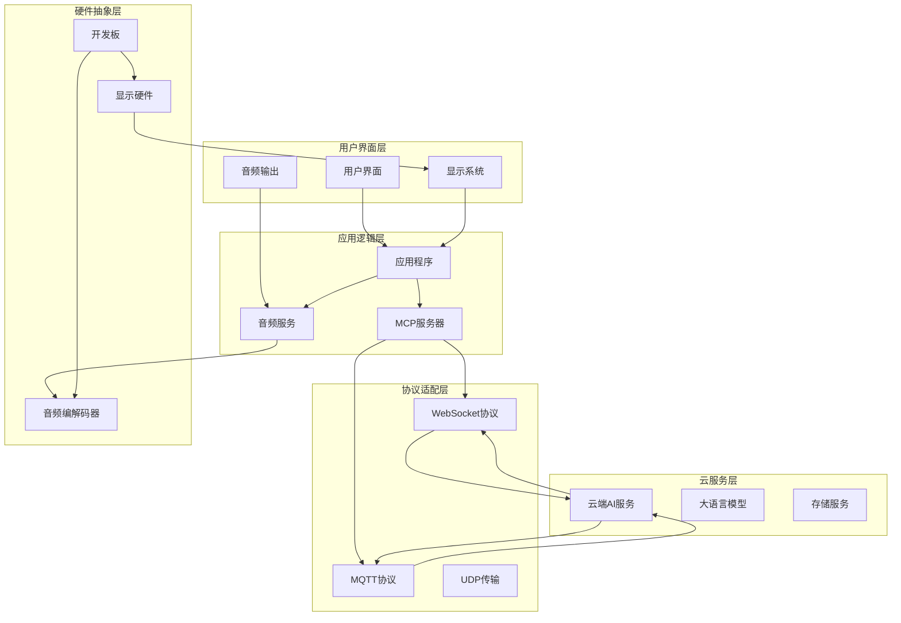
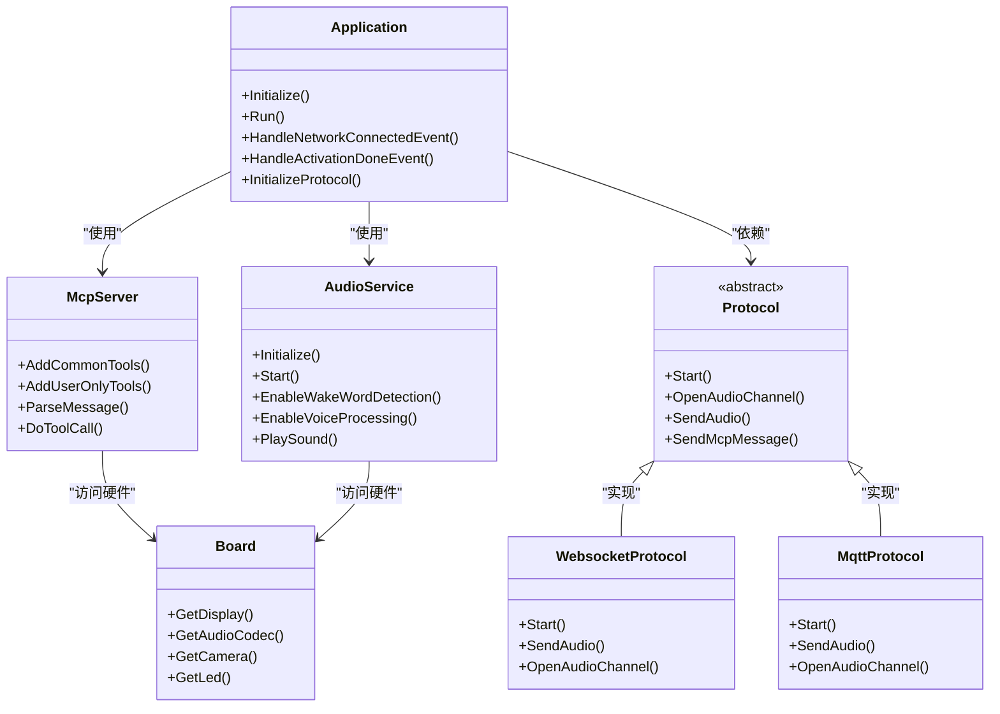
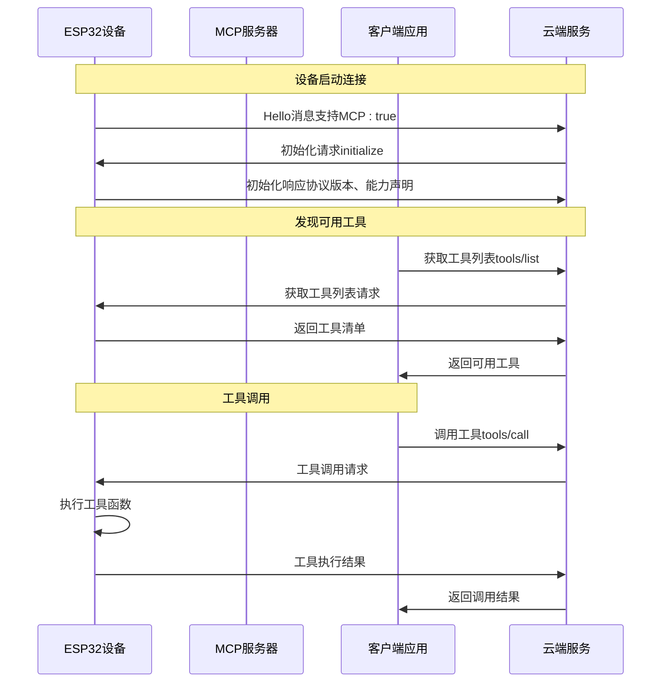
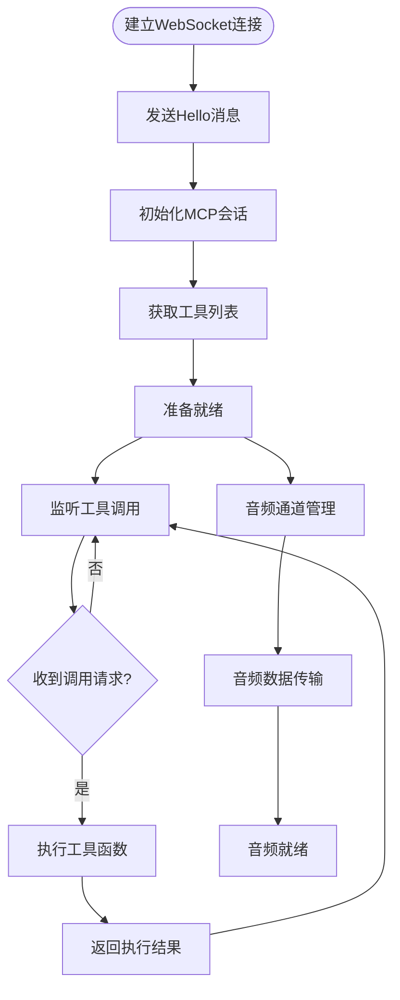
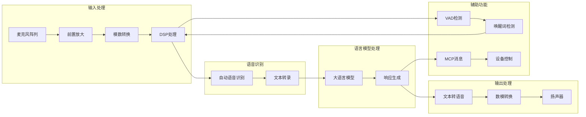

# 项目介绍与背景

<cite>
**本文档引用的文件**
- [README.md](file://README.md)
- [README_zh.md](file://README_zh.md)
- [application.cc](file://main/application.cc)
- [main.cc](file://main/main.cc)
- [mcp-protocol.md](file://docs/mcp-protocol.md)
- [mcp_server.cc](file://main/mcp_server.cc)
- [audio_service.cc](file://main/audio/audio_service.cc)
- [protocol.h](file://main/protocols/protocol.h)
- [websocket_protocol.h](file://main/protocols/websocket_protocol.h)
- [mqtt_protocol.h](file://main/protocols/mqtt_protocol.h)
- [board.cc](file://main/boards/common/board.cc)
</cite>

## 目录
1. [项目简介](#项目简介)
2. [发展历程](#发展历程)
3. [核心理念](#核心理念)
4. [技术背景](#技术背景)
5. [项目架构](#项目架构)
6. [关键特性详解](#关键特性详解)
7. [开源生态](#开源生态)
8. [社区建设](#社区建设)
9. [技术定位与价值](#技术定位与价值)
10. [应用场景](#应用场景)
11. [总结](#总结)

## 项目简介

ESP32-AI项目是一个基于MCP（Model Context Protocol）协议的智能聊天机器人系统，专为ESP32系列微控制器设计。该项目通过集成大语言模型（LLM）技术，实现了多终端控制的AI助手解决方案，支持语音交互、设备控制、多协议通信等多种先进功能。

该项目的核心目标是将前沿的大语言模型技术与实际的硬件设备相结合，为开发者和用户提供一个完整的AI硬件开发平台。通过MCP协议，系统能够实现设备端与云端的无缝连接，扩展设备的功能边界。

## 发展历程

### 版本演进

项目目前处于v2版本阶段，与v1版本相比具有重要的架构升级：

- **v1版本**：稳定版本1.9.2，支持基础的AI聊天功能
- **v2版本**：引入了新的架构设计，支持更复杂的设备控制和多协议通信
- **兼容性**：v2版本与v1分区表不兼容，需要手动刷写升级

### 技术里程碑

项目在发展过程中实现了多个关键技术突破：
- 支持Wi-Fi和ML307 Cat.1 4G网络连接
- 集成离线语音唤醒功能
- 实现OPUS音频编解码优化
- 开发基于流式ASR+LLM+TTS的语音交互架构

## 核心理念

### 开源精神

ESP32-AI项目秉承完全开源的理念，采用MIT许可证，允许任何人免费使用、修改和商业化应用。这种开放的态度促进了技术的快速传播和社区的繁荣发展。

### 技术创新

项目致力于将最新的AI技术与硬件开发相结合，通过以下方式体现技术创新：
- 基于MCP协议的设备控制架构
- 多模态交互体验（语音、视觉、触觉）
- 自适应学习和个性化服务
- 跨平台兼容性和扩展性

### 用户友好

项目注重用户体验，提供了：
- 简单易用的开发环境
- 丰富的硬件支持（70+种开源硬件）
- 完善的文档和教程
- 活跃的社区支持

## 技术背景

### 硬件平台支持

项目支持多种ESP32系列芯片平台：
- ESP32-C3：低功耗应用的理想选择
- ESP32-S3：高性能计算能力
- ESP32-P4：专业级处理性能
- ESP32-C5/ESP32-C6/ESP32-P4：最新一代处理器

### 网络连接能力

系统提供了灵活的网络连接方案：
- Wi-Fi连接：适用于家庭和办公环境
- ML307 Cat.1 4G模块：支持移动场景和远程应用
- 双网络模式：自动切换和负载均衡

### 音频处理架构

采用了先进的音频处理技术栈：
- OPUS编解码器：高质量音频压缩
- ESP-SR语音识别：离线唤醒和语音处理
- 多级音频处理：降噪、回声消除、音质增强

## 项目架构

### 整体架构设计

**图表来源**
- [application.cc:85-199](file://main/application.cc#L85-L199)
- [mcp_server.cc:35-132](file://main/mcp_server.cc#L35-L132)
- [audio_service.cc:63-124](file://main/audio/audio_service.cc#L63-L124)

### 核心组件关系

项目采用模块化设计，各组件之间通过清晰的接口进行通信：

**图表来源**
- [application.cc:34-79](file://main/application.cc#L34-L79)
- [mcp_server.cc:23-31](file://main/mcp_server.cc#L23-L31)
- [audio_service.cc:41-49](file://main/audio/audio_service.cc#L41-L49)
- [protocol.h:44-95](file://main/protocols/protocol.h#L44-L95)

## 关键特性详解

### 基于MCP协议的设备控制

MCP（Model Context Protocol）是项目的核心创新之一，它提供了一种标准化的方式来控制和管理各种智能设备。

#### 协议架构

**图表来源**
- [mcp-protocol.md:219-267](file://docs/mcp-protocol.md#L219-L267)
- [mcp_server.cc:393-442](file://main/mcp_server.cc#L393-L442)

#### 工具系统

MCP服务器内置了丰富的工具集，涵盖了设备控制的各个方面：

| 工具类别 | 具体功能 | 应用场景 |
|---------|---------|---------|
| 设备状态 | 获取实时状态信息 | 系统监控、故障诊断 |
| 音频控制 | 设置音量、播放音频 | 媒体播放、语音反馈 |
| 屏幕控制 | 调整亮度、切换主题 | 用户界面定制 |
| 相机功能 | 拍照、图像解释 | 视觉识别、安全监控 |
| 系统管理 | 重启、固件升级 | 系统维护、功能更新 |

### 多协议通信支持

项目支持多种通信协议，以适应不同的应用场景和需求。

#### WebSocket协议

WebSocket协议提供了全双工通信能力，适合实时交互场景：

**图表来源**
- [websocket_protocol.h:13-32](file://main/protocols/websocket_protocol.h#L13-L32)
- [application.cc:518-655](file://main/application.cc#L518-L655)

#### MQTT+UDP混合协议

MQTT协议结合UDP传输提供了高效的数据传输机制：

| 协议特性 | WebSocket | MQTT+UDP |
|---------|-----------|----------|
| 连接稳定性 | 高 | 中等 |
| 延迟性能 | 低 | 很低 |
| 带宽效率 | 中等 | 高 |
| 实时性 | 强 | 强 |
| 能耗表现 | 中等 | 低 |
| 适用场景 | 一般交互 | 实时音频、大量数据 |

### 语音交互架构

项目采用了先进的语音交互架构，基于流式ASR+LLM+TTS的处理链路。

#### 音频处理流水线

**图表来源**
- [audio_service.cc:231-290](file://main/audio/audio_service.cc#L231-L290)
- [application.cc:256-262](file://main/application.cc#L256-L262)

#### 音频编解码优化

系统采用了OPUS编解码器，提供了高质量的音频压缩和解压缩能力：

| 参数 | 数值 | 说明 |
|------|------|------|
| 采样率 | 16kHz/24kHz | 支持多种采样频率 |
| 帧长度 | 10ms/20ms/60ms | 灵活的帧结构 |
| 压缩比 | 1:10-1:20 | 高效压缩比 |
| 延迟 | <50ms | 低延迟响应 |
| 质量 | CD级 | 高保真音质 |

## 开源生态

### MIT许可证政策

项目采用MIT许可证，这一选择体现了项目的开源精神和对社区的开放态度：

#### 许可证优势

- **自由使用**：任何人都可以自由使用、复制、修改和分发代码
- **商业友好**：允许将代码用于商业产品和服务
- **专利保护**：提供明确的专利授权条款
- **免责声明**：明确的法律保护和责任限制

#### 社区贡献

项目鼓励社区参与和贡献，建立了完善的贡献流程：
- 代码贡献：通过GitHub Pull Request提交
- 文档改进：完善技术文档和使用指南
- 硬件支持：添加新的开发板和硬件配置
- 功能扩展：开发新的工具和插件

### 相关开源项目

项目与其他开源生态系统形成了良好的互补关系：

#### 服务器端项目

| 项目 | 语言 | 功能 | GitHub链接 |
|------|------|------|------------|
| xiaozhi-esp32-server | Python | 服务器端实现 | [GitHub](https://github.com/xinnan-tech/xiaozhi-esp32-server) |
| xiaozhi-esp32-server-java | Java | Java版本服务器 | [GitHub](https://github.com/joey-zhou/xiaozhi-esp32-server-java) |
| xiaozhi-server-go | Go | Golang服务器实现 | [GitHub](https://github.com/AnimeAIChat/xiaozhi-server-go) |

#### 客户端项目

| 项目 | 平台 | 功能 | GitHub链接 |
|------|------|------|------------|
| py-xiaozhi | Python | Python客户端 | [GitHub](https://github.com/huangjunsen0406/py-xiaozhi) |
| xiaozhi-android-client | Android | 移动端客户端 | [GitHub](https://github.com/TOM88812/xiaozhi-android-client) |
| xiaozhi-linux | Linux | 桌面端客户端 | [GitHub](http://github.com/100askTeam/xiaozhi-linux) |

## 社区建设

### 社区支持渠道

项目建立了多元化的社区支持体系：

#### 在线交流平台

- **Discord服务器**：实时技术讨论和问题解答
- **QQ群**：中文用户社区支持
- **GitHub Issues**：技术问题报告和功能请求
- **论坛讨论**：深度技术讨论和经验分享

#### 教育资源

项目提供了丰富的教育资源：
- 完整的开发教程和指南
- 硬件制作教程和视频
- API文档和示例代码
- 最佳实践和开发技巧

### 开发者支持

项目为开发者提供了全面的支持：
- 详细的API文档和使用说明
- 示例代码和模板项目
- 开发工具和调试支持
- 性能优化指导和建议

## 技术定位与价值

### 在AI硬件开发领域的地位

ESP32-AI项目在AI硬件开发领域具有重要地位：

#### 技术领先性

- **架构创新**：基于MCP协议的设备控制架构
- **性能优化**：针对嵌入式系统的深度优化
- **生态完整**：从硬件到软件的完整解决方案
- **开源共享**：推动整个行业的发展

#### 应用价值

项目为不同领域的应用提供了强大的技术支持：
- **智能家居**：语音控制和自动化管理
- **工业控制**：远程监控和设备管理
- **教育科研**：教学演示和实验平台
- **创意开发**：原型制作和概念验证

### 技术意义

#### 标准化进程

项目在推动AI设备控制标准化方面发挥了重要作用：
- MCP协议的推广和应用
- 设备控制接口的规范化
- 跨平台兼容性的实现
- 生态系统的构建和完善

#### 技术创新

项目在多个技术领域实现了创新突破：
- 嵌入式AI推理优化
- 多模态交互技术
- 边缘计算架构
- 低功耗设计策略

## 应用场景

### 智能家居应用

ESP32-AI系统为智能家居提供了完整的解决方案：

#### 设备控制

- 灯光控制和调光
- 温度和湿度调节
- 安防监控和报警
- 家电设备控制

#### 场景联动

- 语音场景模式
- 时间触发自动化
- 传感器联动控制
- 用户行为学习

### 工业应用

#### 设备监控

- 传感器数据采集
- 设备状态监测
- 预测性维护
- 远程诊断支持

#### 自动化控制

- 生产线自动化
- 质量检测系统
- 仓储管理系统
- 物流跟踪系统

### 教育科研

#### 教学演示

- AI技术原理展示
- 嵌入式系统开发
- 语音交互技术
- 机器学习应用

#### 科研平台

- 算法测试平台
- 数据收集系统
- 实验环境搭建
- 结果分析工具

## 总结

ESP32-AI项目代表了AI硬件开发的最新发展方向，通过将前沿的人工智能技术与实际的硬件设备相结合，为用户提供了强大而灵活的智能控制解决方案。

### 项目特色

- **技术创新**：基于MCP协议的设备控制架构
- **开源共享**：MIT许可证促进技术传播
- **生态完整**：从硬件到软件的完整解决方案
- **应用广泛**：适用于多个行业和场景

### 发展前景

项目在未来将继续保持技术领先，推动AI硬件技术的发展：
- 更先进的AI算法集成
- 更丰富的硬件支持
- 更完善的生态系统
- 更广泛的应用推广

通过持续的创新和发展，ESP32-AI项目必将成为AI硬件开发领域的重要标杆，为构建更加智能化的世界贡献力量。