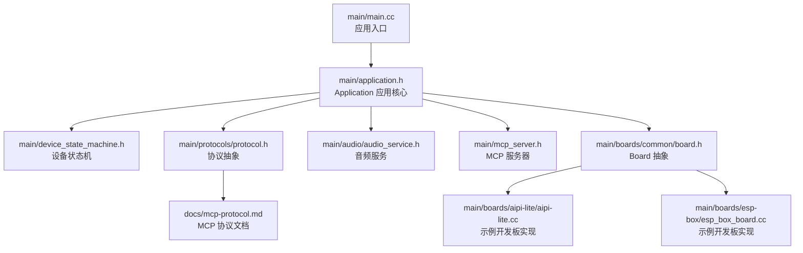
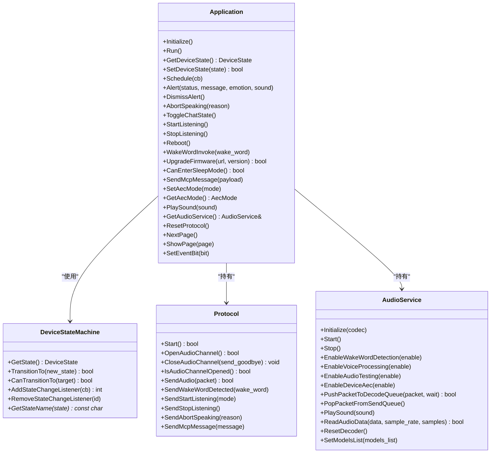
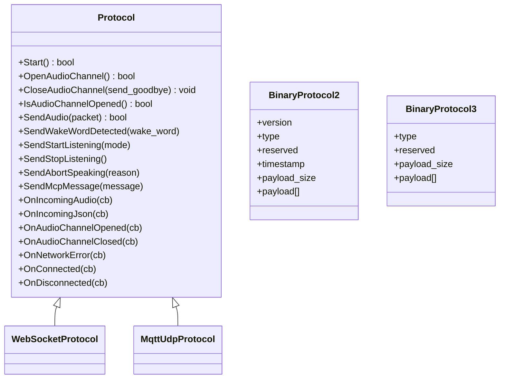
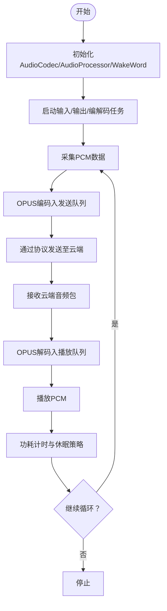
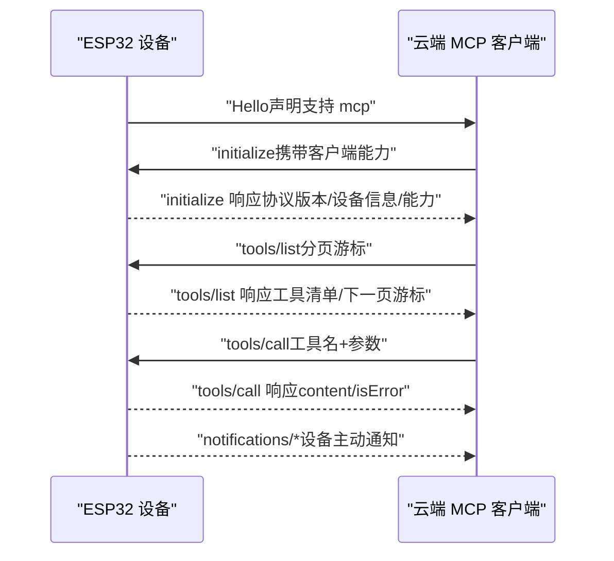
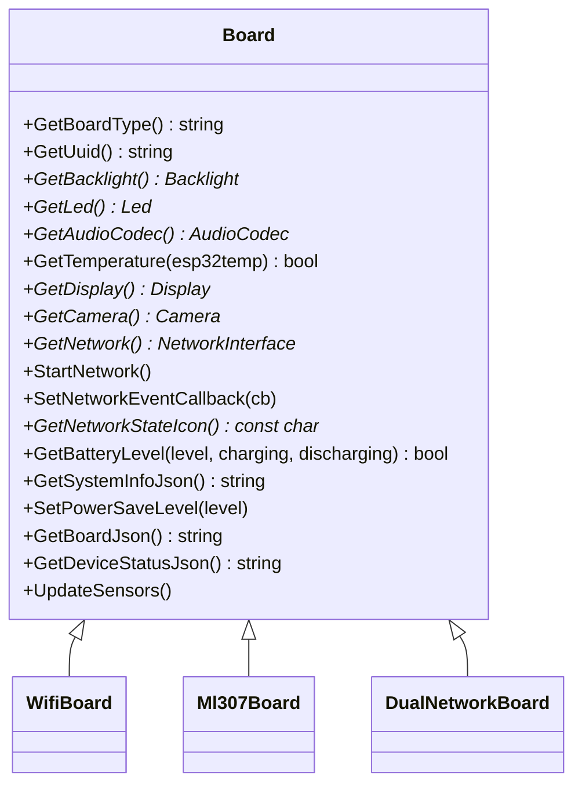
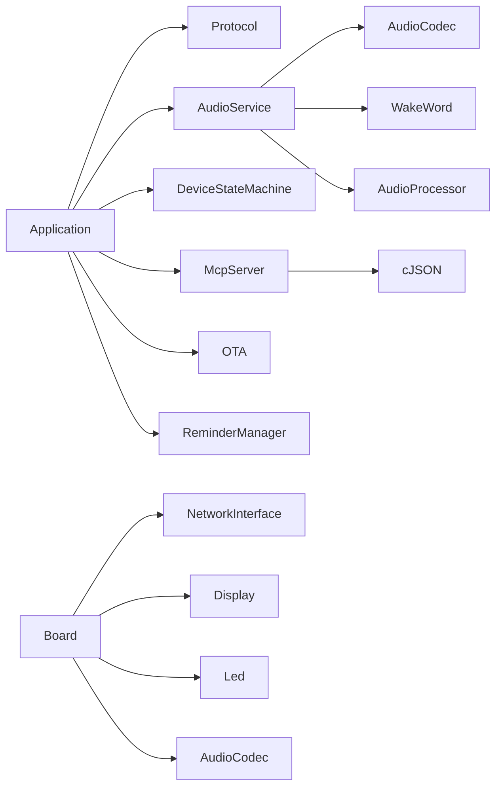

# 项目概述

<cite>
**本文引用的文件**
- [README.md](file://README.md)
- [README_zh.md](file://README_zh.md)
- [main.cc](file://main/main.cc)
- [application.h](file://main/application.h)
- [application.cc](file://main/application.cc)
- [mcp_server.h](file://main/mcp_server.h)
- [mcp-protocol.md](file://docs/mcp-protocol.md)
- [protocol.h](file://main/protocols/protocol.h)
- [audio_service.h](file://main/audio/audio_service.h)
- [board.h](file://main/boards/common/board.h)
- [aipi-lite.cc](file://main/boards/aipi-lite/aipi-lite.cc)
- [esp_box_board.cc](file://main/boards/esp-box/esp_box_board.cc)
- [custom-board.md](file://docs/custom-board.md)
</cite>

## 目录
1. [简介](#简介)
2. [项目结构](#项目结构)
3. [核心组件](#核心组件)
4. [架构总览](#架构总览)
5. [详细组件分析](#详细组件分析)
6. [依赖关系分析](#依赖关系分析)
7. [性能考量](#性能考量)
8. [故障排查指南](#故障排查指南)
9. [结论](#结论)
10. [附录](#附录)

## 简介
本项目是一个基于 MCP（Model Context Protocol）的 AI 聊天机器人系统，以 ESP32 系列芯片为核心，结合大语言模型（如 Qwen、DeepSeek）实现“多终端控制”的语音交互体验。项目通过 MCP 协议在设备端与云端服务之间建立标准化工具发现与调用机制，从而实现对设备硬件（如音频、显示、传感器、GPIO、LED、扬声器等）的统一控制；同时支持 Websocket 与 MQTT+UDP 两类通信协议，满足不同网络场景需求。

项目具备以下关键特性：
- 语音交互：离线唤醒（ESP-SR）、流式 ASR+LLM+TTS 架构、OPUS 音频编解码
- 多协议通信：WebSocket 与 MQTT+UDP
- 设备侧 MCP：面向设备的工具集（如音量、LED、GPIO 等）
- 云侧 MCP：扩展大模型能力（智能家居控制、PC 桌面操作、知识检索、邮件等）
- 多语言与本地化资源
- 支持 70+ 开源硬件平台，覆盖 ESP32-C3、ESP32-S3、ESP32-P4 等芯片族
- 自定义开发板与资产生成工具链

项目背景与生态：
- 项目开源，MIT 许可，鼓励个人与商业使用
- 提供社区生态与相关服务端/客户端开源项目链接
- 提供视频演示与新手入门教程，便于快速上手

**章节来源**
- [README.md:11](file://README.md#L11)
- [README_zh.md:11](file://README_zh.md#L11)
- [README.md:23-37](file://README.md#L23-L37)
- [README_zh.md:23-37](file://README_zh.md#L23-L37)

## 项目结构
项目采用“功能域+层次化”的组织方式：
- main：主应用入口、应用生命周期、状态机、协议抽象、音频服务、MCP 服务器、设备状态与提醒管理、OTA 等
- main/boards：70+ 开源硬件平台的适配层，每块板独立实现 Board 抽象
- main/protocols：协议抽象与实现（WebSocket/MQTT/UDP 等）
- main/audio：音频编解码、唤醒词检测、音频处理流水线
- docs：MCP 协议、WebSocket、MQTT+UDP、自定义开发板等文档
- partitions：分区表（v1/v2）
- scripts：构建、打包、资源转换、发布等工具



**图表来源**
- [main.cc:14-29](file://main/main.cc#L14-L29)
- [application.h:50-194](file://main/application.h#L50-L194)
- [protocol.h:44-95](file://main/protocols/protocol.h#L44-L95)
- [audio_service.h:106-194](file://main/audio/audio_service.h#L106-L194)
- [mcp_server.h:314-342](file://main/mcp_server.h#L314-L342)
- [board.h:49-86](file://main/boards/common/board.h#L49-L86)
- [aipi-lite.cc:26-246](file://main/boards/aipi-lite/aipi-lite.cc#L26-L246)
- [esp_box_board.cc:38-174](file://main/boards/esp-box/esp_box_board.cc#L38-L174)
- [mcp-protocol.md:1-270](file://docs/mcp-protocol.md#L1-L270)

**章节来源**
- [main.cc:14-29](file://main/main.cc#L14-L29)
- [application.h:50-194](file://main/application.h#L50-L194)
- [board.h:49-86](file://main/boards/common/board.h#L49-L86)

## 核心组件
- 应用核心（Application）：负责初始化、事件循环、状态管理、协议与音频服务协调、OTA、提醒管理、页面管理等
- 设备状态机（DeviceStateMachine）：严格的状态迁移规则与观察者回调
- 协议抽象（Protocol）：统一音频通道、文本消息、错误处理、超时检测等接口
- 音频服务（AudioService）：音频采集/播放、OPUS 编解码、唤醒词检测、音频处理器、测试队列与统计
- MCP 服务器（McpServer）：工具注册、输入 Schema 校验、工具调用、结果返回、通知与受众标注
- 板级抽象（Board）：统一硬件初始化接口（音频编解码、显示、按键、网络、电源等）

**章节来源**
- [application.h:50-194](file://main/application.h#L50-L194)
- [device_state_machine.h:17-81](file://main/device_state_machine.h#L17-L81)
- [protocol.h:44-95](file://main/protocols/protocol.h#L44-L95)
- [audio_service.h:106-194](file://main/audio/audio_service.h#L106-L194)
- [mcp_server.h:314-342](file://main/mcp_server.h#L314-L342)
- [board.h:49-86](file://main/boards/common/board.h#L49-L86)

## 架构总览
系统采用“应用核心 + 协议抽象 + 音频服务 + MCP 服务器 + 板级适配”的分层架构。应用核心通过协议抽象与云端建立连接，音频服务负责语音数据的采集、编码、传输与播放，MCP 服务器提供设备侧工具集，Board 抽象屏蔽不同硬件差异。

```mermaid
graph TB
subgraph "应用层"
APP["Application<br/>事件循环/状态机/协议/音频/OTA/提醒"]
end
subgraph "协议层"
PROT["Protocol 抽象<br/>WebSocket/MQTT/UDP"]
end
subgraph "音频层"
AUD["AudioService<br/>采集/编码/解码/播放/唤醒词"]
end
subgraph "工具层"
MCP["McpServer<br/>工具注册/调用/Schema校验/结果返回"]
end
subgraph "硬件层"
BD["Board 抽象<br/>音频/显示/按键/网络/电源"]
end
subgraph "云端"
CLOUD["云端服务<br/>MCP 客户端/LLM/ASR/TTS"]
end
APP --> PROT
APP --> AUD
APP --> MCP
APP --> BD
PROT <- --> CLOUD
MCP <- --> CLOUD
AUD --> PROT
```

**图表来源**
- [application.h:50-194](file://main/application.h#L50-L194)
- [protocol.h:44-95](file://main/protocols/protocol.h#L44-L95)
- [audio_service.h:106-194](file://main/audio/audio_service.h#L106-L194)
- [mcp_server.h:314-342](file://main/mcp_server.h#L314-L342)
- [board.h:49-86](file://main/boards/common/board.h#L49-L86)

## 详细组件分析

### 应用核心（Application）
- 职责：初始化显示、音频、网络回调；运行主事件循环；调度任务；状态切换；事件分发；协议与音频资源复位；页面管理；OTA 升级；告警与弹窗；唤醒词触发；音效播放
- 关键点：事件位掩码、状态机、音频服务、协议对象、OTA 对象、提醒管理器；线程安全的任务调度队列



**图表来源**
- [application.h:50-194](file://main/application.h#L50-L194)
- [device_state_machine.h:17-81](file://main/device_state_machine.h#L17-L81)
- [protocol.h:44-95](file://main/protocols/protocol.h#L44-L95)
- [audio_service.h:106-194](file://main/audio/audio_service.h#L106-L194)

**章节来源**
- [application.h:50-194](file://main/application.h#L50-L194)
- [application.cc:182-194](file://main/application.cc#L182-L194)

### 协议抽象（Protocol）
- 职责：统一音频/文本消息回调、音频通道打开/关闭、网络错误处理、连接/断开回调、会话 ID 管理、超时检测
- 关键点：BinaryProtocol2/3 结构体定义、监听模式（自动停止/手动停止/实时 AEC）、中止语音原因枚举



**图表来源**
- [protocol.h:44-95](file://main/protocols/protocol.h#L44-L95)

**章节来源**
- [protocol.h:17-31](file://main/protocols/protocol.h#L17-L31)
- [protocol.h:38-42](file://main/protocols/protocol.h#L38-L42)

### 音频服务（AudioService）
- 职责：音频采集/播放任务、OPUS 编解码、唤醒词检测、音频处理器、测试队列、统计与功耗计时
- 关键点：编码帧时长、发送/解码/测试队列容量、音频功率超时、事件组与互斥锁、回调接口



**图表来源**
- [audio_service.h:106-194](file://main/audio/audio_service.h#L106-L194)

**章节来源**
- [audio_service.h:106-194](file://main/audio/audio_service.h#L106-L194)

### MCP 服务器（McpServer）
- 职责：工具注册（含用户可见/仅用户可见）、输入参数 Schema 校验、工具调用、结果返回（文本/图像）、通知与受众标注
- 关键点：工具属性（布尔/整数/字符串，带默认值与范围）、工具列表分页、JSON-RPC 2.0 负载封装



**图表来源**
- [mcp-protocol.md:219-267](file://docs/mcp-protocol.md#L219-L267)
- [mcp_server.h:314-342](file://main/mcp_server.h#L314-L342)

**章节来源**
- [mcp-protocol.md:1-270](file://docs/mcp-protocol.md#L1-L270)
- [mcp_server.h:208-342](file://main/mcp_server.h#L208-L342)

### 板级抽象（Board）
- 职责：统一硬件初始化接口（音频编解码、显示、按键、网络、电源等），生成设备 UUID，提供系统信息与设备状态 JSON
- 关键点：Board 单例工厂、网络事件回调、电源保存等级、GetBoardJson/GetDeviceStatusJson



**图表来源**
- [board.h:49-86](file://main/boards/common/board.h#L49-L86)

**章节来源**
- [board.h:49-86](file://main/boards/common/board.h#L49-L86)

### 示例开发板（AIPILite 与 ESP32-S3 BOX）
- AIPILite：I2C、SPI、LCD 显示、电源管理与休眠定时器、按键事件、背光控制、电池电量读取、开机/关机控制
- ESP32-S3 BOX：I2C、SPI、ILI9341 显示、表情显示支持、双击切换 AEC 模式、背光控制

**章节来源**
- [aipi-lite.cc:26-246](file://main/boards/aipi-lite/aipi-lite.cc#L26-L246)
- [esp_box_board.cc:38-174](file://main/boards/esp-box/esp_box_board.cc#L38-L174)

## 依赖关系分析
- 应用核心依赖协议抽象、音频服务、设备状态机、MCP 服务器、OTA、提醒管理器
- 协议抽象为 WebSocket/MQTT/UDP 等具体实现提供统一接口
- 音频服务依赖音频编解码器、唤醒词、音频处理器与 OPUS 编解码库
- MCP 服务器依赖 cJSON 与工具回调
- 板级抽象为各硬件平台提供统一接口，开发板实现继承自相应网络基类



**图表来源**
- [application.h:148-156](file://main/application.h#L148-L156)
- [audio_service.h:139-149](file://main/audio/audio_service.h#L139-L149)
- [mcp_server.h:14](file://main/mcp_server.h#L14)
- [board.h:76-85](file://main/boards/common/board.h#L76-L85)

**章节来源**
- [application.h:148-156](file://main/application.h#L148-L156)
- [audio_service.h:139-149](file://main/audio/audio_service.h#L139-L149)
- [mcp_server.h:14](file://main/mcp_server.h#L14)
- [board.h:76-85](file://main/boards/common/board.h#L76-L85)

## 性能考量
- 音频队列容量与帧时长：通过 OPUS 帧时长与队列上限平衡延迟与稳定性
- 功耗与休眠：音频输入/输出空闲计时与电源保存定时器联动，降低待机功耗
- 编解码参数：自动比特率、可变码率、丢包隐藏与 DTX，兼顾音质与带宽
- 状态机与事件驱动：减少阻塞，提高并发与响应速度
- 网络协议选择：WebSocket 适合低延迟交互，MQTT+UDP 适合弱网与高吞吐场景

[本节为通用性能讨论，无需特定文件引用]

## 故障排查指南
- 网络连接异常：检查网络事件回调与错误回调，确认 Wi-Fi 凭据、4G 模块状态
- 音频无声/卡顿：检查音频编解码器初始化、I2S/I2C 引脚配置、OPUS 编解码任务是否运行
- 唤醒词无效：确认唤醒词模型加载、唤醒词检测开关、音频采样率与帧时长
- MCP 工具调用失败：核对工具名、参数 Schema、受众标注（仅用户可见工具不可被 AI 调用）
- OTA 升级失败：确认分区表版本兼容性（v1/v2 不兼容），必要时手动烧录

**章节来源**
- [protocol.h:62-95](file://main/protocols/protocol.h#L62-L95)
- [audio_service.h:188-194](file://main/audio/audio_service.h#L188-L194)
- [mcp_server.h:226-270](file://main/mcp_server.h#L226-L270)
- [README.md:17-21](file://README.md#L17-L21)

## 结论
本项目以 MCP 协议为核心，打通设备端与云端服务的工具调用通路，结合语音交互与多协议通信，实现对多类硬件平台的统一控制。其分层清晰、模块内聚、接口抽象良好，既便于开发者快速集成，也为社区贡献与二次开发提供了坚实基础。通过丰富的硬件适配与工具生态，项目在教育、创客、智能家居等领域具有广泛的应用前景。

[本节为总结性内容，无需特定文件引用]

## 附录

### 硬件兼容性与开发板定制
- 支持 70+ 开源硬件平台，覆盖 ESP32-C3、ESP32-S3、ESP32-P4 等芯片族
- 自定义开发板流程：创建目录、编写 config.h/config.json、实现板级初始化类、注册 Board、配置构建系统、使用 release.py 脚本打包

**章节来源**
- [README.md:51-103](file://README.md#L51-L103)
- [README_zh.md:51-103](file://README_zh.md#L51-L103)
- [custom-board.md:1-453](file://docs/custom-board.md#L1-L453)

### 使用案例与视频演示
- 官方视频演示与新手教程链接，涵盖语音交互、设备控制、多终端联动等场景

**章节来源**
- [README.md:7-10](file://README.md#L7-L10)
- [README_zh.md:7-10](file://README_zh.md#L7-L10)